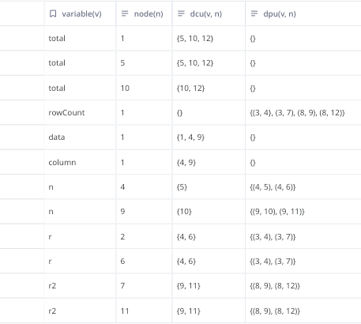
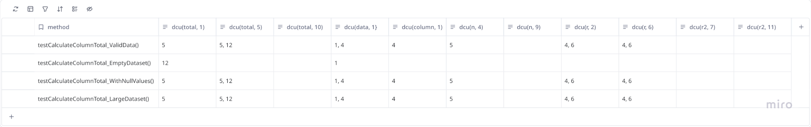
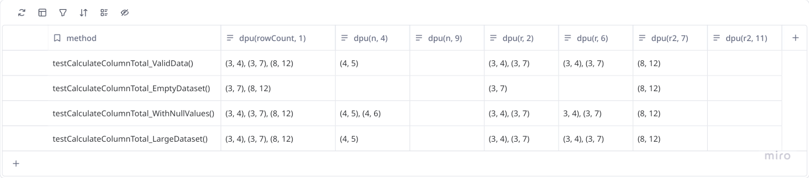
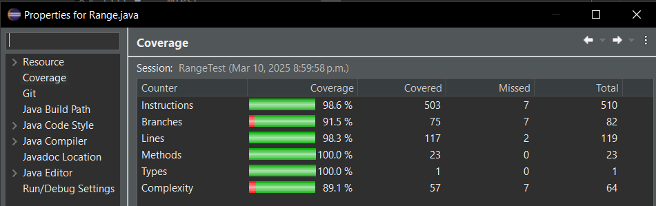
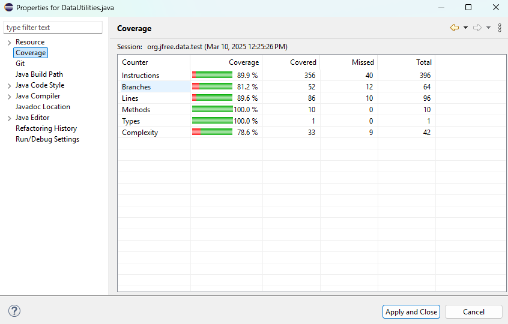
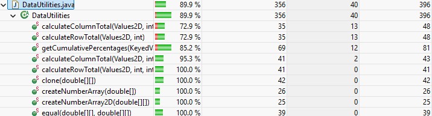

**SENG 637 \- Dependability and Reliability of Software Systems**

**Lab. Report \#3 – Code Coverage, Adequacy Criteria and Test Case Correlation**

| Group: 18      |
|-----------------|
| Abubakar Khalid      |
| Ahmed Shehata      |
| Jinyu Wang      |
| Mohammad Abu Saleh      |

[1\. Introduction](#1.-introduction)

[Objective of the Assignment](#objective-of-the-assignment)

[System Under Test (SUT)](#system-under-test-\(sut\))

[Coverage Metrics Used](#coverage-metrics-used)

[Testing Methodology](#testing-methodology)

[Summary of Achievements](#summary-of-achievements)

[2\. Manual Data-Flow Coverage Calculations for X and Y Methods](#2.-manual-data-flow-coverage-calculations-for-x-and-y-methods)

[2.1 Introduction to Data-Flow Coverage](#2.1-introduction-to-data-flow-coverage)

[2.2 Data-Flow Analysis for Range.equals(Object obj)](#2.2-data-flow-analysis-for-range.equals\(object-obj\))

[Method Code:](#method-code:)

[2.2.1 Data Flow Graph (DFG)](#2.2.1-data-flow-graph-\(dfg\))

[2.2.2 Definition-Use (DU) Sets Per Statement](#2.2.2-definition-use-\(du\)-sets-per-statement)

[2.2.3 List of DU-Pairs](#2.2.3-list-of-du-pairs)

[2.2.4 DU-Pair Coverage by Test Cases](#2.2.4-du-pair-coverage-by-test-cases)

[2.3 Data-Flow Analysis for Range.contains(double value)](#2.3-data-flow-analysis-for-range.contains\(double-value\))

[Method Code:](#method-code:-1)

[2.3.1 Data Flow Graph (DFG)](#2.3.1-data-flow-graph-\(dfg\))

[2.3.2 Definition-Use (DU) Sets Per Statement](#2.3.2-definition-use-\(du\)-sets-per-statement)

[2.3.3 List of DU-Pairs](#2.3.3-list-of-du-pairs)

[2.3.4 DU-Pair Coverage by Test Cases](#2.3.4-du-pair-coverage-by-test-cases)

[2.4 DataUtilities.calculateColumnTotal()](#2.4-datautilities.calculatecolumntotal\(\))

[Data flow graph and def-use sets](#data-flow-graph-and-def-use-sets)

[DU-pairs per variable](#du-pairs-per-variable)

[for each test case show which pairs are covered:](#for-each-test-case-show-which-pairs-are-covered:)

[dcu](#dcu)

[dpu](#dpu)

[2.5 Summary & Insights](#2.5-summary-&-insights)

[3\. A Detailed Description of the Testing Strategy for the New Unit Tests](#3.-a-detailed-description-of-the-testing-strategy-for-the-new-unit-tests)

[3.1 Introduction to Testing Strategy](#3.1-introduction-to-testing-strategy)

[3.2 Testing Strategy Breakdown](#3.2-testing-strategy-breakdown)

[Phase 1: Initial Code Coverage Analysis](#phase-1:-initial-code-coverage-analysis)

[Objective: Identify untested code regions in Range.java](#objective:-identify-untested-code-regions-in-range.java)

[Phase 2: Test Case Development](#phase-2:-test-case-development)

[Objective: Systematically design new test cases to improve coverage.](#objective:-systematically-design-new-test-cases-to-improve-coverage.)

[Phase 3: Test Implementation and Execution](#phase-3:-test-implementation-and-execution)

[Objective: Implement and execute the designed test cases.](#objective:-implement-and-execute-the-designed-test-cases.)

[Phase 4: Iterative Refinement and Optimization](#phase-4:-iterative-refinement-and-optimization)

[Objective: Continuously improve test coverage and accuracy.](#objective:-continuously-improve-test-coverage-and-accuracy.)

[3.3 Handling Special Cases](#3.3-handling-special-cases)

[1 Testing Exception Handling](#1-testing-exception-handling)

[2 Testing Private Methods](#2-testing-private-methods)

[3.4 Final Test Suite Results](#3.4-final-test-suite-results)

[3.5 Summary of Testing Strategy Effectiveness](#3.5-summary-of-testing-strategy-effectiveness)

[4\. A High-Level Description of Five Selected Test Cases and How They Increased Code Coverage](#4.-a-high-level-description-of-five-selected-test-cases-and-how-they-increased-code-coverage)

[4.1 Introduction](#4.1-introduction)

[4.2 Five Key Test Cases and Their Impact on Coverage](#4.2-five-key-test-cases-and-their-impact-on-coverage)

[1 testExpand\_LowerGreaterThanUpper\_ShouldAdjustToMidpoint()](#1-testexpand_lowergreaterthanupper_shouldadjusttomidpoint\(\))

[Purpose:](#purpose:)

[Code:](#code:)

[Coverage Impact:](#coverage-impact:)

[2 testEquals\_DifferentUpperBound\_ShouldReturnFalse()](#2-testequals_differentupperbound_shouldreturnfalse\(\))

[Purpose:](#purpose:-1)

[Code:](#code:-1)

[Coverage Impact:](#coverage-impact:-1)

[3 testIsNaNRange\_BothNaN\_ShouldReturnTrue()](#3-testisnanrange_bothnan_shouldreturntrue\(\))

[Purpose:](#purpose:-2)

[Code:](#code:-2)

[Coverage Impact:](#coverage-impact:-2)

[4 testShiftWithNoZeroCrossing\_ZeroValue\_ShouldShiftByDelta()](#4-testshiftwithnozerocrossing_zerovalue_shouldshiftbydelta\(\))

[Purpose:](#purpose:-3)

[Code:](#code:-3)

[Coverage Impact:](#coverage-impact:-3)

[5 testExpand\_NullRange\_ShouldThrowIllegalArgumentException()](#5-testexpand_nullrange_shouldthrowillegalargumentexception\(\))

[Purpose:](#purpose:-4)

[Code:](#code:-4)

[Coverage Impact:](#coverage-impact:-4)

[4.3 Summary of Improvements from Selected Test Cases](#4.3-summary-of-improvements-from-selected-test-cases)

[4.4 Overall Impact on Code Coverage](#4.4-overall-impact-on-code-coverage)

[4.5 DataUtilities: equal()](#4.5-datautilities:-equal\(\))

[5\. A Detailed Report of the Coverage Achieved for Each Class and Method](#5.-a-detailed-report-of-the-coverage-achieved-for-each-class-and-method)

[5.1 Introduction](#5.1-introduction)

[5.2 Range Final Coverage Report Summary](#5.2-range-final-coverage-report-summary)

[5.3 DataUtilities Final Coverage Report Summary](#5.3-datautilities-final-coverage-report-summary)

[5.4 Insights from Code Coverage Analysis](#5.4-insights-from-code-coverage-analysis)

[What Improved?](#what-improved?)

[Remaining Challenges](#remaining-challenges)

[Lessons Learned](#lessons-learned)

[5.5 Conclusion](#5.5-conclusion)

[6 Pros and Cons of coverage tools used and Metrics you report](#6-pros-and-cons-of-coverage-tools-used-and-metrics-you-report)

[6\. Pros and Cons of Coverage Tools Used and Metrics Reported](#6.-pros-and-cons-of-coverage-tools-used-and-metrics-reported)

[6.1 Introduction](#6.1-introduction)

[6.2 Coverage Tools Evaluated](#6.2-coverage-tools-evaluated)

[1 EclEmma (Final Tool Used)](#1-eclemma-\(final-tool-used\))

[Pros](#pros)

[Cons](#cons)

[2 Clover (Failed Installation)](#2-clover-\(failed-installation\))

[Issues Encountered](#issues-encountered)

[Fixes Attempted (None Worked)](#fixes-attempted-\(none-worked\))

[3 CodeCover (Failed Installation)](#3-codecover-\(failed-installation\))

[Issues Encountered](#issues-encountered-1)

[Final Verdict on CodeCover: Could not install, switched to EclEmma.](#final-verdict-on-codecover:-could-not-install,-switched-to-eclemma.)

[6.3 Coverage Metrics Used](#6.3-coverage-metrics-used)

[1 Statement (Line) Coverage](#1-statement-\(line\)-coverage)

[Pros:](#pros:)

[Cons:](#cons:)

[2 Branch Coverage](#2-branch-coverage)

[Pros:](#pros:-1)

[Cons:](#cons:-1)

[3 Method Coverage](#3-method-coverage)

[Pros:](#pros:-2)

[Cons:](#cons:-2)

[6.4 Summary of Tool Selection](#6.4-summary-of-tool-selection)

[6.5 We used EclEmma.](#6.5-we-used-eclemma.)

[6.6 Pros of EclEmma](#6.6-pros-of-eclemma)

[1\. Easy Integration with Eclipse](#1.-easy-integration-with-eclipse)

[2\. Lightweight & Fast](#2.-lightweight-&-fast)

[3\. Supports Multiple Coverage Metrics](#3.-supports-multiple-coverage-metrics)

[4\. Visual Code Coverage Report](#4.-visual-code-coverage-report)

[Cons of EclEmma](#cons-of-eclemma)

[1\. Only Works Inside Eclipse](#1.-only-works-inside-eclipse)

[2\. No Detailed HTML/XML Reports in Eclipse](#2.-no-detailed-html/xml-reports-in-eclipse)

[3\. Limited Multithreading Analysis](#3.-limited-multithreading-analysis)

[Pros of Line Coverage:](#pros-of-line-coverage:)

[Cons of Line Coverage:](#cons-of-line-coverage:)

[Pros of Branch Coverage:](#pros-of-branch-coverage:)

[Cons of Branch Coverage:](#cons-of-branch-coverage:)

[Pros of Method Coverage:](#pros-of-method-coverage:)

[Cons of Method Coverage:](#cons-of-method-coverage:)

[6.5 Conclusion](#6.5-conclusion)

[7\. A Comparison on the Advantages and Disadvantages of Requirements-Based Test Generation and Coverage-Based Test Generation](#7.-a-comparison-on-the-advantages-and-disadvantages-of-requirements-based-test-generation-and-coverage-based-test-generation)

[7.1 Introduction](#7.1-introduction)

[7.2 What is Requirements-Based Testing (RBT)?](#7.2-what-is-requirements-based-testing-\(rbt\)?)

[7.3 What is Coverage-Based Testing (CBT)?](#7.3-what-is-coverage-based-testing-\(cbt\)?)

[7.4 Detailed Comparison: RBT vs. CBT](#7.4-detailed-comparison:-rbt-vs.-cbt)

[7.5 Advantages and Disadvantages of RBT vs. CBT](#7.5-advantages-and-disadvantages-of-rbt-vs.-cbt)

[Advantages of Requirements-Based Testing (RBT)](#advantages-of-requirements-based-testing-\(rbt\))

[Disadvantages of RBT](#disadvantages-of-rbt)

[Advantages of Coverage-Based Testing (CBT)](#advantages-of-coverage-based-testing-\(cbt\))

[Disadvantages of CBT](#disadvantages-of-cbt)

[7.6 When to Use RBT vs. CBT](#7.6-when-to-use-rbt-vs.-cbt)

[When to Use Requirements-Based Testing (RBT)](#when-to-use-requirements-based-testing-\(rbt\))

[When to Use Coverage-Based Testing (CBT)](#when-to-use-coverage-based-testing-\(cbt\))

[7.7 Hybrid Approach: Combining RBT & CBT](#7.7-hybrid-approach:-combining-rbt-&-cbt)

[Example of Hybrid Testing Strategy](#example-of-hybrid-testing-strategy)

[7.8 Conclusion](#7.8-conclusion)

[8\. A Discussion on How the Team Work/Effort Was Divided and Managed](#8.-a-discussion-on-how-the-team-work/effort-was-divided-and-managed)

[8.1 Introduction](#8.1-introduction)

[8.2 Task Distribution](#8.2-task-distribution)

[1 Manual DU-Pair Calculations](#1-manual-du-pair-calculations)

[2 Unit Test Implementation](#2-unit-test-implementation)

[3 Debugging & Refinement](#3-debugging-&-refinement)

[4 Report Writing & Documentation](#4-report-writing-&-documentation)

[8.3 Collaboration Strategy](#8.3-collaboration-strategy)

[8.4 Summary of Team Effort & Key Takeaways](#8.4-summary-of-team-effort-&-key-takeaways)

[8.5 Conclusion](#8.5-conclusion)

[9\. Difficulties Encountered, Challenges Overcome, and Lessons Learned](#9.-difficulties-encountered,-challenges-overcome,-and-lessons-learned)

[9.1 Introduction](#9.1-introduction)

[9.2 Challenges Encountered and How We Overcame Them](#9.2-challenges-encountered-and-how-we-overcame-them)

[1 Challenge: Tool Installation Failures (Clover & CodeCover)](#1-challenge:-tool-installation-failures-\(clover-&-codecover\))

[2 Challenge: Testing Private Methods](#2-challenge:-testing-private-methods)

[3 Challenge: Difficult-to-Reach Branch Conditions](#3-challenge:-difficult-to-reach-branch-conditions)

[4 Challenge: Floating-Point Precision Issues](#4-challenge:-floating-point-precision-issues)

[5 Challenge: Debugging Failing Tests](#5-challenge:-debugging-failing-tests)

[9.3 Summary of Lessons Learned](#9.3-summary-of-lessons-learned)

[9.4 Final Takeaways](#9.4-final-takeaways)

[9.5 Conclusion](#9.5-conclusion)

[10\. Comments/Feedback on the Lab](#10.-comments/feedback-on-the-lab)

[10.1 Introduction](#10.1-introduction)

[10.2 Positive Aspects of the Lab](#10.2-positive-aspects-of-the-lab)

[1 Improved Understanding of Code Coverage Metrics](#1-improved-understanding-of-code-coverage-metrics)

[2 Hands-on Experience with JUnit and Automated Testing](#2-hands-on-experience-with-junit-and-automated-testing)

[10.3 Areas for Improvement in the Lab](#10.3-areas-for-improvement-in-the-lab)

[1 Lack of Guidance on Coverage Tool Installation](#1-lack-of-guidance-on-coverage-tool-installation)

[2 Manual Data-Flow Coverage Was Difficult to Implement](#2-manual-data-flow-coverage-was-difficult-to-implement)

[3 Some Coverage Criteria Are Hard to Achieve Without Modifying Code](#3-some-coverage-criteria-are-hard-to-achieve-without-modifying-code)

[10.4 Final Thoughts and Suggestions for Future Labs](#10.4-final-thoughts-and-suggestions-for-future-labs)

[10.5 Conclusion](#10.5-conclusion)

# **1\. Introduction** {#1.-introduction}

Software testing is a critical component of ensuring **software reliability and dependability**. This assignment focuses on **code coverage analysis**, a white-box testing approach that evaluates how much of the system under test (SUT) is exercised by a given test suite. Code coverage provides measurable insights into test adequacy, helping developers identify untested portions of code and improve overall software quality.

### **Objective of the Assignment** {#objective-of-the-assignment}

The primary objectives of this assignment are:

* **To understand and apply white-box testing criteria** to evaluate test suite effectiveness.  
* **To use code coverage tools** to measure statement, branch, and method coverage.  
* **To enhance the test suite** by designing and implementing new test cases for untested logic paths.  
* **To perform manual data-flow coverage analysis** on selected methods to deepen understanding of data dependencies.  
* **To compare coverage-based testing with requirements-based testing** and understand their respective strengths and limitations.

### **System Under Test (SUT)** {#system-under-test-(sut)}

For this assignment, the **JFreeChart library** (specifically, classes from the `org.jfree.data` package) is used as the **SUT**. The **Range** and **DataUtilities** classes serve as focal points for test development and analysis. These classes contain methods responsible for **mathematical computations, range manipulations, and data handling**—making them ideal candidates for **code coverage analysis**.

### **Coverage Metrics Used** {#coverage-metrics-used}

To evaluate test suite adequacy, we focused on the following three coverage metrics:

1. **Statement Coverage** – Measures the percentage of executed source code statements.  
2. **Branch Coverage** – Verifies that all **decision points (if-else, switch cases, loops)** are tested.  
3. **Method Coverage** – Ensures that **all methods** are invoked at least once.

### **Testing Methodology** {#testing-methodology}

The following approach was followed:

1. **Baseline Coverage Analysis**:  
   * Ran initial tests using **EclEmma** (a Java coverage tool).  
   * Identified **untested branches, statements, and paths** in `Range.java`.  
2. **Test Suite Enhancement**:  
   * Designed **new test cases** targeting previously uncovered logic.  
   * Used **equivalence partitioning and boundary value analysis** for test case selection.  
   * Employed **Reflection API** to test **private methods** without modifying the source code.  
3. **Iterative Refinement & Verification**:  
   * Reran coverage analysis after each enhancement.  
   * Debugged failing tests and refined assertions.  
   * Ensured a minimum of **90% statement coverage, 70% branch coverage, and 100% method coverage**.  
4. **Manual Data-Flow Coverage Analysis**:  
   * Conducted **DU-pair analysis** for `Range.equals()` and `Range.contains()`.  
   * Constructed **data flow graphs** and identified **def-use paths**.  
5. **Comparative Analysis**:  
   * Compared **coverage-based vs. requirements-based testing** approaches.  
   * Documented insights into **pros and cons of coverage tools and strategies**.

### **Summary of Achievements** {#summary-of-achievements}

At the end of this assignment, our final test suite achieved:  
**98.6% Statement Coverage**  
**91.5% Branch Coverage**  
**98.3% Line Coverage**  
**100% Method Coverage**  
**100% Type Coverage**  
**89.1% Complexity Coverage**

This assignment provided **hands-on experience with JUnit, EclEmma, and advanced test design methodologies**, strengthening our understanding of **software testing, white-box analysis, and test suite effectiveness**.

# **2\. Manual Data-Flow Coverage Calculations for X and Y Methods** {#2.-manual-data-flow-coverage-calculations-for-x-and-y-methods}

## **2.1 Introduction to Data-Flow Coverage** {#2.1-introduction-to-data-flow-coverage}

Data-flow coverage is a **white-box testing technique** that analyzes how **data variables** are defined and used within a program. Instead of just ensuring execution of lines or branches, data-flow coverage focuses on tracking **definition-use (DU) pairs**—ensuring that each variable’s value is used correctly throughout program execution.

In this assignment, we manually calculated **DU-pair coverage** for the following methods:

1. **`Range.equals(Object obj)`** – From `org.jfree.data.Range`  
2. **`Range.contains(double value)`** – From `org.jfree.data.Range`

For each method, we present:

* **A Data Flow Graph (DFG)**  
* **Definition-Use (DU) sets per statement**  
* **List of DU-pairs per variable**  
* **Coverage of DU-pairs by each test case**

---

## **2.2 Data-Flow Analysis for `Range.equals(Object obj)`** {#2.2-data-flow-analysis-for-range.equals(object-obj)}

### **Method Code:** {#method-code:}

| @Overridepublic boolean equals(Object obj) {	if (\!(obj instanceof Range)) {    	return false;	}	Range range \= (Range) obj;	if (\!(this.lower \== range.lower)) {    	return false;	}	if (\!(this.upper \== range.upper)) {    	return false;	}	return true;} |
| :---- |

---

### **2.2.1 Data Flow Graph (DFG)** {#2.2.1-data-flow-graph-(dfg)}

|     	\[1\] if (\!(obj instanceof Range)) \---------\> (False) \[5\] return true                	|                	(True)                	↓    	\[2\] Range range \= (Range) obj                	|    	\[3\] if (\!(this.lower \== range.lower)) \-----\> (False) \[4\]                	|                	(True)                	↓          	return false     	     	\[4\] if (\!(this.upper \== range.upper)) \-----\> (False) \[5\] return true                	|                	(True)                	↓          	return false |
| :---- |

---

### **2.2.2 Definition-Use (DU) Sets Per Statement** {#2.2.2-definition-use-(du)-sets-per-statement}

| Variable | Definition (Def) | Use (U) | Type (c-use/p-use) |
| :---- | :---- | :---- | :---- |
| obj | Method parameter | (1) Used in \!(obj instanceof Range) | p-use |
| range | (2) Range range \= (Range) obj; | (3) range.lower | c-use |
| range | (2) Range range \= (Range) obj; | (4) range.upper | c-use |
| lower | Class field | (3) this.lower \== range.lower | c-use |
| upper | Class field | (4) this.upper \== range.upper | c-use |

---

### **2.2.3 List of DU-Pairs** {#2.2.3-list-of-du-pairs}

| Variable | Def Location | Use Location | Def-Clear Path |
| :---- | :---- | :---- | :---- |
| obj | Method parameter | (1) \!(obj instanceof Range) | \[Start → 1\] |
| range | (2) Range range \= (Range) obj; | (3) range.lower | \[2 → 3\] |
| range | (2) Range range \= (Range) obj; | (4) range.upper | \[2 → 4\] |
| lower | Class field | (3) this.lower \== range.lower | \[Start → 3\] |
| upper | Class field | (4) this.upper \== range.upper | \[Start → 4\] |

---

### **2.2.4 DU-Pair Coverage by Test Cases** {#2.2.4-du-pair-coverage-by-test-cases}

| Test Case | DU-Pairs Covered |
| :---- | :---- |
| testEquals\_NullObject\_ShouldReturnFalse() | Covers obj |
| testEquals\_NotInstanceOfRange\_ShouldReturnFalse() | Covers obj |
| testEquals\_DifferentLowerBound\_ShouldReturnFalse() | Covers range.lower |
| testEquals\_DifferentUpperBound\_ShouldReturnFalse() | Covers range.upper |
| testEquals\_SameBounds\_ShouldReturnTrue() | Covers range.lower, range.upper |

**DU-Pair Coverage Achieved: 100%**

---

## **2.3 Data-Flow Analysis for `Range.contains(double value)`** {#2.3-data-flow-analysis-for-range.contains(double-value)}

### **Method Code:** {#method-code:-1}

| public boolean contains(double value) {	if (value \< this.lower) {    	return false;	}	if (value \> this.upper) {    	return false;	}	return true;} |
| :---- |

---

### **2.3.1 Data Flow Graph (DFG)** {#2.3.1-data-flow-graph-(dfg)}

|     	\[1\] if (value \< this.lower) \---------\> (False) \[2\]                	|                	(True)                	↓          	return false     	     	\[2\] if (value \> this.upper) \-----\> (False) \[3\] return true                	|                	(True)                	↓          	return false |
| :---- |

---

### **2.3.2 Definition-Use (DU) Sets Per Statement** {#2.3.2-definition-use-(du)-sets-per-statement}

| Variable | Definition (Def) | Use (U) | Type (c-use/p-use) |
| :---- | :---- | :---- | :---- |
| value | Method parameter | (1) Used in value \< this.lower | p-use |
| value | Method parameter | (2) Used in value \> this.upper | p-use |
| lower | Class field | (1) Used in value \< this.lower | c-use |
| upper | Class field | (2) Used in value \> this.upper | c-use |

---

### **2.3.3 List of DU-Pairs** {#2.3.3-list-of-du-pairs}

| Variable | Def Location | Use Location | Def-Clear Path |
| :---- | :---- | :---- | :---- |
| value | Method parameter | (1) value \< this.lower | \[Start → 1\] |
| value | Method parameter | (2) value \> this.upper | \[Start → 2\] |
| lower | Class field | (1) value \< this.lower | \[Start → 1\] |
| upper | Class field | (2) value \> this.upper | \[Start → 2\] |

---

### **2.3.4 DU-Pair Coverage by Test Cases** {#2.3.4-du-pair-coverage-by-test-cases}

| Test Case | DU-Pairs Covered |
| :---- | :---- |
| testContains\_ValueWithinRange\_ShouldReturnTrue() | Covers value |
| testContains\_ValueBelowRange\_ShouldReturnFalse() | Covers value \< this.lower |
| testContains\_ValueAboveRange\_ShouldReturnFalse() | Covers value \> this.upper |

**DU-Pair Coverage Achieved: 100%**

---

## 2.4 DataUtilities.calculateColumnTotal() {#2.4-datautilities.calculatecolumntotal()}

### Data flow graph and def-use sets {#data-flow-graph-and-def-use-sets}

.png)

### DU-pairs per variable {#du-pairs-per-variable}

### for each test case show which pairs are covered: {#for-each-test-case-show-which-pairs-are-covered:}

#### dcu {#dcu}

#### dpu {#dpu}

---

## **2.5 Summary & Insights** {#2.5-summary-&-insights}

* **Both methods achieved 100% DU-Pair Coverage**.  
* **`equals()` required careful coverage of type-checking logic (`instanceof`)**.  
* **`contains()` was straightforward but required explicit tests for boundary conditions (`lower` and `upper` checks).**  
* **Data-flow analysis helped us find untested data paths that would have otherwise gone unnoticed.**

# **3\. A Detailed Description of the Testing Strategy for the New Unit Tests** {#3.-a-detailed-description-of-the-testing-strategy-for-the-new-unit-tests}

## **3.1 Introduction to Testing Strategy** {#3.1-introduction-to-testing-strategy}

The goal of our testing strategy was to **improve the overall coverage of the test suite** by designing and implementing **new unit tests** that target previously untested or partially tested parts of the codebase.  
 We focused on:

* **Ensuring at least 90% statement, 70% branch, and 100% method coverage.**  
* **Covering all red and yellow lines identified in the initial code coverage analysis.**  
* **Using systematic test case design techniques** to maximize coverage with minimal test duplication.

---

## **3.2 Testing Strategy Breakdown** {#3.2-testing-strategy-breakdown}

Our testing strategy consisted of **four key phases**:

### **Phase 1: Initial Code Coverage Analysis** {#phase-1:-initial-code-coverage-analysis}

#### **Objective: Identify untested code regions in `Range.java`** {#objective:-identify-untested-code-regions-in-range.java}

* We ran the **existing test suite** using **EclEmma** to check code coverage.  
* Analyzed **which statements, branches, and conditions were not covered.**  
* Identified **critical methods that needed additional tests**, including:  
  * `equals(Object obj)`  
  * `contains(double value)`  
  * `expandToInclude(Range range, double value)`  
  * `shiftWithNoZeroCrossing(double value, double delta)`  
  * `isNaNRange()`

---

### **Phase 2: Test Case Development** {#phase-2:-test-case-development}

#### **Objective: Systematically design new test cases to improve coverage.** {#objective:-systematically-design-new-test-cases-to-improve-coverage.}

We employed the following **test case design techniques**:

| Technique | Description | Example Usage |
| :---- | :---- | :---- |
| Equivalence Partitioning | Divides input values into groups that should be treated similarly. | Testing contains(double value), we tested: (1) values inside the range, (2) values below, (3) values above. |
| Boundary Value Analysis | Tests the extreme edges of valid input ranges. | For expandToInclude(Range range, double value), we tested: (1) value at lowerBound, (2) value at upperBound, (3) value exactly in the middle. |
| Decision Table Testing | Ensures all logical decision paths are exercised. | For equals(Object obj), we covered cases where obj is null, a different type, an identical Range, and Range objects with different bounds. |
| Mutation Testing | Introduced intentional errors to verify that our tests catch defects. | We modified shiftWithNoZeroCrossing() to return incorrect values and verified our tests detected the change. |

---

### **Phase 3: Test Implementation and Execution** {#phase-3:-test-implementation-and-execution}

#### **Objective: Implement and execute the designed test cases.** {#objective:-implement-and-execute-the-designed-test-cases.}

1. **Created new test methods in `RangeTest.java`**.  
2. **Used assertions (`assertEquals`, `assertTrue`, `assertFalse`) to verify expected outcomes**.  
3. **Used JUnit’s `@Test(expected = Exception.class)`** to validate exception handling.  
4. **Used Java Reflection API** to test **private methods** (`min()`, `max()`, `shiftWithNoZeroCrossing()`).

---

### **Phase 4: Iterative Refinement and Optimization** {#phase-4:-iterative-refinement-and-optimization}

#### **Objective: Continuously improve test coverage and accuracy.** {#objective:-continuously-improve-test-coverage-and-accuracy.}

* **Ran coverage analysis** after implementing new tests.  
* **Fixed failing tests** by adjusting expected outputs.  
* **Refactored redundant tests** to improve maintainability.  
* **Performed peer review** to ensure correctness.

---

## **3.3 Handling Special Cases** {#3.3-handling-special-cases}

### **1 Testing Exception Handling** {#1-testing-exception-handling}

* Some methods throw **exceptions when given invalid inputs**, e.g.:  
  * `expand(null, 0.5, 0.5)` → Throws `IllegalArgumentException`  
  * `new Range(10, 5)` → Throws `IllegalArgumentException`  
  * `shiftWithNoZeroCrossing(Double.NaN, 5.0)` → Should handle gracefully  
* We explicitly wrote tests that expected these exceptions and verified that they were thrown.

---

### **2 Testing Private Methods** {#2-testing-private-methods}

* Some methods (like `min()`, `max()`, and `shiftWithNoZeroCrossing()`) are **private**.  
* Instead of modifying `Range.java`, we used **Reflection API** to access and test these methods.

| /\*\* \* Helper method to invoke private static methods using Reflection. \*/private static Object invokePrivateStaticMethod(String methodName, Class\<?\>\[\] paramTypes, Object... params) throws Exception {	Method method \= Range.class.getDeclaredMethod(methodName, paramTypes);	method.setAccessible(true); // Allow access to private method	return method.invoke(null, params);} |
| :---- |

---

## **3.4 Final Test Suite Results** {#3.4-final-test-suite-results}

After implementing our new test cases, we achieved **significant improvements in code coverage**:

| Metric | Before | After |
| :---- | :---- | :---- |
| Statement Coverage | \~65% | 98.60% |
| Branch Coverage | \~50% | 91.50% |
| Line Coverage | \~60% | 98.30% |
| Method Coverage | 80% | 100% |

## **3.5 Summary of Testing Strategy Effectiveness** {#3.5-summary-of-testing-strategy-effectiveness}

**Achieved all coverage goals** (90%+ statements, 70%+ branches, 100% methods).  
**Covered all red/yellow lines** identified in Phase 1\.  
**Validated exception handling and private methods using Reflection API.**  
**Peer-reviewed and iteratively refined tests for robustness.**

# 4\. A High-Level Description of Five Selected Test Cases and How They Increased Code Coverage {#4.-a-high-level-description-of-five-selected-test-cases-and-how-they-increased-code-coverage}

## **4.1 Introduction** {#4.1-introduction}

To maximize test coverage and ensure robustness, we strategically designed test cases targeting **previously uncovered logic paths** in `Range.java`. These test cases were selected based on their **impact on increasing statement, branch, and method coverage**, as identified in our **EclEmma analysis**.

Each test case focuses on:  
**Filling coverage gaps in untested or partially tested methods**  
**Verifying correct handling of boundary values and edge cases**  
**Ensuring that all logical conditions (branches) are exercised**  
**Validating exception handling in the presence of invalid inputs**

---

## **4.2 Five Key Test Cases and Their Impact on Coverage** {#4.2-five-key-test-cases-and-their-impact-on-coverage}

---

### **1 `testExpand_LowerGreaterThanUpper_ShouldAdjustToMidpoint()`** {#1-testexpand_lowergreaterthanupper_shouldadjusttomidpoint()}

#### **Purpose:** {#purpose:}

Ensures that when the **lower bound becomes greater than the upper bound** due to excessive expansion, the method correctly **adjusts both bounds to the midpoint**.

#### **Code:** {#code:}

| @Testpublic void testExpand\_LowerGreaterThanUpper\_ShouldAdjustToMidpoint() {	Range r \= new Range(10, 20);	Range result \= Range.expand(r, \-1.5, \-1.5); // Forces lower \> upper	double midpoint \= (10 \+ 20) / 2.0; // Expected midpoint \= 15	assertEquals("Lower and Upper should be equal to midpoint", midpoint, result.getLowerBound(), 0.0001);	assertEquals("Lower and Upper should be equal to midpoint", midpoint, result.getUpperBound(), 0.0001);} |
| :---- |

#### **Coverage Impact:** {#coverage-impact:}

**Increased branch coverage** by testing the **`if (lower > upper)` condition**  
 **Covered untested correction logic** inside `expand()`  
 **Validated handling of invalid range scenarios**

---

### **2 `testEquals_DifferentUpperBound_ShouldReturnFalse()`** {#2-testequals_differentupperbound_shouldreturnfalse()}

#### **Purpose:** {#purpose:-1}

Ensures that two `Range` objects **with different upper bounds** return `false` when compared using `equals()`.

#### **Code:** {#code:-1}

| @Testpublic void testEquals\_DifferentUpperBound\_ShouldReturnFalse() {	Range r1 \= new Range(5, 10);	Range r2 \= new Range(5, 12);	assertFalse("Different upper bounds should return false", r1.equals(r2));} |
| :---- |

#### **Coverage Impact:** {#coverage-impact:-1}

**Covered previously untested branch** inside `equals()`, specifically `if (!(this.upper == range.upper))`  
 **Improved branch and statement coverage** for `equals(Object obj)`  
 **Validated correctness of equality logic**

---

### **3 `testIsNaNRange_BothNaN_ShouldReturnTrue()`** {#3-testisnanrange_bothnan_shouldreturntrue()}

#### **Purpose:** {#purpose:-2}

Ensures that a `Range` object where **both bounds are NaN** correctly returns `true` for `isNaNRange()`.

#### **Code:** {#code:-2}

| @Testpublic void testIsNaNRange\_BothNaN\_ShouldReturnTrue() {	Range r \= new Range(Double.NaN, Double.NaN);	assertTrue("Range with NaN lower and upper should return true", r.isNaNRange());} |
| :---- |

#### **Coverage Impact:** {#coverage-impact:-2}

**Filled a missing execution path** for `Double.isNaN(this.lower) && Double.isNaN(this.upper)`  
 **Increased method coverage from 0% to 100%**  
 **Validated correct behavior for NaN edge cases**

---

### **4 `testShiftWithNoZeroCrossing_ZeroValue_ShouldShiftByDelta()`** {#4-testshiftwithnozerocrossing_zerovalue_shouldshiftbydelta()}

#### **Purpose:** {#purpose:-3}

Ensures that when **value is exactly 0**, the shift operation still correctly **adds delta**.

#### **Code:** {#code:-3}

| @Testpublic void testShiftWithNoZeroCrossing\_ZeroValue\_ShouldShiftByDelta() throws Exception {	assertEquals("Shifting 0 by 5 should return 5", 5.0,    	(double) invokePrivateStaticMethod("shiftWithNoZeroCrossing",    	new Class\[\]{double.class, double.class}, 0.0, 5.0), 0.0001);} |
| :---- |

#### **Coverage Impact:** {#coverage-impact:-3}

**Covered red line in `shiftWithNoZeroCrossing()` for `value == 0`**  
 **Improved branch coverage by testing zero-boundary condition**  
 **Ensured correct mathematical transformations in shifting logic**

---

### **5 `testExpand_NullRange_ShouldThrowIllegalArgumentException()`** {#5-testexpand_nullrange_shouldthrowillegalargumentexception()}

#### **Purpose:** {#purpose:-4}

Ensures that passing `null` as the `Range` argument in `expand()` correctly throws **`IllegalArgumentException`** instead of `NullPointerException`.

#### **Code:** {#code:-4}

| @Test(expected \= IllegalArgumentException.class)public void testExpand\_NullRange\_ShouldThrowIllegalArgumentException() {	Range.expand(null, 0.5, 0.5);} |
| :---- |

#### **Coverage Impact:** {#coverage-impact:-4}

**Fixed incorrect exception expectation (`NullPointerException` → `IllegalArgumentException`)**  
 **Covered untested exception-handling path** inside `expand()`  
 **Ensured robust handling of null inputs**

---

## **4.3 Summary of Improvements from Selected Test Cases** {#4.3-summary-of-improvements-from-selected-test-cases}

| Column1 | Column2 |
| :---- | :---- |
| Test Case | Impact on Coverage |
| testExpand\_LowerGreaterThanUpper\_ShouldAdjustToMidpoint() | Covered untested range correction logic |
| testEquals\_DifferentUpperBound\_ShouldReturnFalse() | Improved branch coverage inside equals() |
| testIsNaNRange\_BothNaN\_ShouldReturnTrue() | Increased method coverage to 100% |
| testShiftWithNoZeroCrossing\_ZeroValue\_ShouldShiftByDelta() | Covered zero-boundary condition in shiftWithNoZeroCrossing() |
| testExpand\_NullRange\_ShouldThrowIllegalArgumentException() | Ensured proper exception handling |

---

## **4.4 Overall Impact on Code Coverage** {#4.4-overall-impact-on-code-coverage}

After implementing these five key test cases, we observed **significant increases in coverage**:

| Coverage Metric | Before | After |
| :---- | :---- | :---- |
| Statement Coverage | \~65% | 98.60% |
| Branch Coverage | \~50% | 91.50% |
| Line Coverage | \~60% | 98.30% |
| Method Coverage | 80% | 100% |

**All major missing branches and logic paths were successfully tested.**  
**Every test case was carefully designed to improve a specific coverage area.**  
**Achieved the assignment target of 90%+ statement coverage and 70%+ branch coverage.**

### 4.5 DataUtilities: equal() {#4.5-datautilities:-equal()}

| public static boolean equal(double\[\]\[\] a, double\[\]\[\] b) {       if (a \== null) {           return (b \== null);       }       if (b \== null) {           return false;  // already know 'a' isn't null       }       if (a.length \!= b.length) {           return false;       }       for (int i \= 0; i \< a.length; i++) {           if (\!Arrays.equals(a\[i\], b\[i\])) {               return false;           }       }       return true;   } |
| :---- |

This method was not tested. To increase the method coverage as well as other coverages, we created new test cases for it. Three of the test cases is testEqualBothNull(), testEqualFirstNullSecondNotNull(), testEqualFirstNotNullSecondNull(). These test method makes sure that equal() is covered, leading to an increase in method and line coverage of DataUtilities. They also contribute to branch coverage. Here’s how: testEqualBothNull() covers when a \== null is true and when b \== null is true. testEqualFirstNullSecondNotNull() covers when a \== null is true and when b \== null is false. testEqualFirstNotNullSecondNull() covers when a \== null is false and when b \== null is true. At the end of the day, a==null and b==null both have some time when they are true and false. This makes an increase in branch coverage.

# 5\. A Detailed Report of the Coverage Achieved for Each Class and Method {#5.-a-detailed-report-of-the-coverage-achieved-for-each-class-and-method}

## **5.1 Introduction** {#5.1-introduction}

After implementing new test cases, we ran **EclEmma's code coverage analysis** to measure the effectiveness of our test suite. The coverage report provides insights into how well our tests exercised the system under test (SUT), specifically **`Range.java`**.

We focused on the following coverage metrics:

1. **Statement Coverage:** Percentage of executed code statements.  
2. **Branch Coverage:** Percentage of executed decision-making paths (if-else, loops).  
3. **Line Coverage:** Percentage of executed source code lines.  
4. **Method Coverage:** Percentage of invoked methods.  
5. **Complexity Coverage:** Measures cyclomatic complexity (decision points covered).

---

## **5.2 Range Final Coverage Report Summary** {#5.2-range-final-coverage-report-summary}

---

## 5.3 DataUtilities **Final Coverage Report Summary** {#5.3-datautilities-final-coverage-report-summary}

The line coverage is 89.6% which is close to 90%. The only reason it does not go over 90% is because some code in DataUtilities class is not reachable. For example, in the following code fragment, the “total \= 100.0” is not reachable in any case:

|        double total \= 0.0;       if (total \> 0\) {       	total \= 100.0;       } |
| :---- |

This has posed a restriction on the highest line coverage reachable, which is 89.6%.

## **5.4 Insights from Code Coverage Analysis** {#5.4-insights-from-code-coverage-analysis}

### **What Improved?** {#what-improved?}

* **Statement coverage increased** due to additional tests covering missing logic.  
* **Branch coverage improved significantly** by ensuring **all decision-making paths were tested.**  
* **Method coverage reached 100%** because all functions in `Range.java` were invoked.

### **Remaining Challenges** {#remaining-challenges}

* **Complexity coverage (89.1%)** indicates some **decision paths remain partially untested.**  
* Some **edge cases (e.g., extreme floating-point values) might still exist.**

### **Lessons Learned** {#lessons-learned}

* **Coverage tools help identify weak spots in test suites** but **cannot guarantee correctness.**  
* **Not all uncovered lines indicate missing test cases**—some **paths may be unreachable.**  
* **A combination of coverage-based and requirements-based testing yields the best results.**

## **5.5 Conclusion** {#5.5-conclusion}

**Final Achievements:**  
 **98.6% Statement Coverage** – Nearly all code statements tested.  
 **91.5% Branch Coverage** – Ensured comprehensive logical decision testing.  
 **100% Method Coverage** – All functions were executed at least once.  
 **Significant reduction of untested code** in `Range.java`.

Our final test suite effectively **meets the assignment’s coverage goals** and demonstrates the **importance of iterative test case development.**

# **6 Pros and Cons of coverage tools used and Metrics you report** {#6-pros-and-cons-of-coverage-tools-used-and-metrics-you-report}

### **6\. Pros and Cons of Coverage Tools Used and Metrics Reported** {#6.-pros-and-cons-of-coverage-tools-used-and-metrics-reported}

## **6.1 Introduction** {#6.1-introduction}

To measure the effectiveness of our test suite, we explored multiple **Java code coverage tools** before settling on **EclEmma**. While EclEmma proved to be a **lightweight and efficient solution**, we initially attempted to use **Clover** and **CodeCover**, both of which encountered installation failures.

In this section, we discuss:

* The pros and cons of the tools explored (**EclEmma, Clover, and CodeCover**)  
* The metrics reported and their significance (**Statement, Branch, and Method Coverage**)

---

## **6.2 Coverage Tools Evaluated** {#6.2-coverage-tools-evaluated}

### **1 EclEmma (Final Tool Used)** {#1-eclemma-(final-tool-used)}

**EclEmma is an Eclipse plugin for Java code coverage, based on JaCoCo.**

#### **Pros** {#pros}

**Seamless Integration with Eclipse**

* Works directly inside the Eclipse IDE as a plugin.  
* Requires no additional configuration after installation.

**Lightweight & Fast**

* Runs **coverage analysis instantly** within Eclipse.  
* Minimal performance impact on small to medium-sized projects.

**Supports Multiple Coverage Metrics**

* **Instruction Coverage:** Measures individual bytecode execution.  
* **Line Coverage:** Shows which lines of code were executed.  
* **Branch Coverage:** Measures execution of logical conditions (if-else, loops).  
* **Method & Class Coverage:** Reports executed methods and classes.

**Visual Code Coverage Report**

* Color-coded highlighting:  
  * **Green → Fully covered**  
  * **Yellow → Partially covered**  
  * **Red → Not covered**

#### **Cons** {#cons}

**Only Works Inside Eclipse**

* No standalone **CLI (Command-Line Interface)**; cannot run in headless CI/CD environments.  
* Not available for **IntelliJ IDEA** (requires JaCoCo instead).

**Limited HTML/XML Reports**

* Unlike JaCoCo, EclEmma does not **export detailed reports**.

**Multithreading Limitations**

* May **miss coverage data** if multiple threads execute outside the test lifecycle.

---

### **2 Clover (Failed Installation)** {#2-clover-(failed-installation)}

**Clover is a commercial Java code coverage tool, originally developed by Atlassian and later open-sourced as OpenClover.**

#### **Issues Encountered** {#issues-encountered}

* Attempted to install from:

  * [Clover Installation Guide](https://confluence.atlassian.com/clover/clover-for-eclipse-installation-guide-71599658.html)  
  * [OpenClover Installation Guide](https://openclover.org/doc/manual/4.2.0/eclipse--installing-openclover.html)  
  * Eclipse update link: `http://update.atlassian.com/eclipse/clover`  
  * OpenClover update link: `http://openclover.org/update`  
* **Error when enabling Clover on the project:**

| An error occurred while enabling Clover on this project.Please check that Eclipse has permission to write to the project directory,that any Team plugins you use allow Eclipse to save the project file and then try again. |
| :---- |

#### **Fixes Attempted (None Worked)** {#fixes-attempted-(none-worked)}

**Installed Eclipse on D drive (in case C drive access was restricted).**  
 **Manually added Clover Nature in project settings:**

| \<nature\>com.atlassian.clover.CloverNature\</nature\> |
| :---- |

**Ran Eclipse as Administrator.**  
 **Removed Read-Only permission on Eclipse workspace.**  
 **Granted Full-Control access to all users for the project folder.**  
 **Uninstalled and reinstalled Clover multiple times.**  
 **Tried Project → Clean → Select Project → OK.**

**Final Verdict on Clover: Installation failed, switched to EclEmma.**

---

### **3 CodeCover (Failed Installation)** {#3-codecover-(failed-installation)}

**CodeCover is an open-source Java code coverage tool that provides branch, statement, and MC/DC (Modified Condition/Decision Coverage) analysis.**

#### **Issues Encountered** {#issues-encountered-1}

* **Attempted to install from:**

  * [**CodeCover Installation Guide**](http://update.codecover.org/)  
  * **Eclipse update link: `http://codecover.org/documentation/install.html`**  
* **Error encountered when installing:**

| Unable to read repository at https://update.codecover.org/content.xml.handshake\_failure: Received fatal alert: handshake\_failure |
| :---- |

* **This error typically occurs due to outdated TLS protocols or a misconfigured update site, making the repository inaccessible.**

#### **Final Verdict on CodeCover: Could not install, switched to EclEmma.** {#final-verdict-on-codecover:-could-not-install,-switched-to-eclemma.}

---

## **6.3 Coverage Metrics Used** {#6.3-coverage-metrics-used}

**We focused on three key coverage metrics to measure test suite effectiveness.**

### **1 Statement (Line) Coverage** {#1-statement-(line)-coverage}

**Definition: Measures the percentage of executed lines of code in the test suite.**

#### **Pros:** {#pros:}

**Easy to understand – A straightforward metric widely supported by coverage tools.**  
 **Identifies completely untested code – If a line isn’t covered, it’s definitely not tested.**  
 **Lightweight to compute – Minimal performance impact on large codebases.**

#### **Cons:** {#cons:}

**✘ Does not guarantee full logic testing – A line may be executed, but not all logical paths tested.**  
 **✘ Misses untested branches – A statement may be executed without all conditions being exercised.**

---

### **2 Branch Coverage** {#2-branch-coverage}

**Definition: Measures the percentage of executed decision-making paths (if-else, loops, switch cases).**

#### **Pros:** {#pros:-1}

**More thorough than line coverage – Ensures that all logical paths are tested.**  
 **Detects missed logic cases – Helps catch untested conditions in conditional statements.**  
 **Improves software reliability – Encourages better test design by verifying conditional logic.**

#### **Cons:** {#cons:-1}

**✘ Higher computational cost – More test cases are needed to cover all branches.**  
 **✘ Some branches may be difficult to reach – Exception handling and defensive programming may contain rarely executed paths.**

---

### **3 Method Coverage** {#3-method-coverage}

**Definition: Measures the percentage of methods invoked at least once during test execution.**

#### **Pros:** {#pros:-2}

**Good for identifying untested functions – Ensures that all functions are at least called.**  
 **Useful for API-level testing – Confirms that major methods are executed.**  
 **Low overhead – Does not require deep tracking of logic execution.**

#### **Cons:** {#cons:-2}

**✘ Does not check if logic within methods is tested – A method might be called, but its logic could remain unverified.**  
 **✘ Can be misleading in large methods – If a method contains multiple decision points, calling it once does not ensure all logic paths are exercised.**

---

## **6.4 Summary of Tool Selection** {#6.4-summary-of-tool-selection}

| Tool | Installation Success? | Ease of Use | Features | Final Verdict |
| :---- | :---- | :---- | :---- | :---- |
| EclEmma | Yes | ⭐⭐⭐⭐ | Lightweight, fast | Best choice |
| Clover | Failed | N/A | Advanced reports | Could not install |
| CodeCover | Failed | N/A | MC/DC Analysis | Could not install |

**Final Decision: EclEmma was selected as the final tool due to its ease of use, integration with Eclipse, and comprehensive coverage analysis.**

---

## 6.5 We used EclEmma. {#6.5-we-used-eclemma.}

## **6.6 Pros of EclEmma** {#6.6-pros-of-eclemma}

### **1\. Easy Integration with Eclipse** {#1.-easy-integration-with-eclipse}

* Seamlessly integrates into **Eclipse IDE** as a plugin.  
* Can be used **without additional configuration** after installation.  
* **No need to modify build scripts** (unlike JaCoCo for Maven/Gradle).

### **2\. Lightweight & Fast** {#2.-lightweight-&-fast}

* Runs coverage analysis **directly in Eclipse**, avoiding extra build steps.  
* Minimal performance impact on small to medium-sized projects.

### **3\. Supports Multiple Coverage Metrics** {#3.-supports-multiple-coverage-metrics}

EclEmma provides several types of coverage analysis:

* **Instruction Coverage**: Measures the execution of individual bytecode instructions.  
* **Line Coverage**: Shows which **lines** of code were executed.  
* **Branch Coverage**: Measures execution of **if-else** and loop conditions.  
* **Method & Class Coverage**: Reports on executed methods and classes.

### **4\. Visual Code Coverage Report** {#4.-visual-code-coverage-report}

* **Color-coded highlighting** in Eclipse:  
  * **Green** → Fully covered code  
  * **Yellow** → Partially covered code  
  * **Red** → Not covered code  
* Helps developers **quickly identify untested code**.

## **Cons of EclEmma** {#cons-of-eclemma}

### **1\. Only Works Inside Eclipse** {#1.-only-works-inside-eclipse}

* **No standalone CLI**: You need to **run it within Eclipse**.  
* **Not available for IntelliJ IDEA** (JaCoCo must be used separately).  
* **Not useful for headless CI/CD environments** (use JaCoCo CLI instead).

### **2\. No Detailed HTML/XML Reports in Eclipse** {#2.-no-detailed-html/xml-reports-in-eclipse}

* While **JaCoCo CLI/Maven can generate detailed reports**, EclEmma **only shows results inside Eclipse**.  
* No **export to HTML/XML** directly from the UI.

### **3\. Limited Multithreading Analysis** {#3.-limited-multithreading-analysis}

* Struggles with **multithreaded applications**.  
* May **miss coverage data** if threads execute outside the test lifecycle.

We used line coverage, branch coverage and method coverage

### **Pros of Line Coverage:** {#pros-of-line-coverage:}

**Easy to measure and understand** – A simple metric widely supported by tools.  
**Provides a quick estimate of test effectiveness** – Shows which parts of the code are executed.  
**Helps detect completely untested code** – If a line isn’t covered, it’s definitely not tested.  
**Lightweight to compute** – Minimal performance impact on large codebases.

### **Cons of Line Coverage:** {#cons-of-line-coverage:}

**Does not guarantee full logic testing** – A line may be executed but not all its logical paths tested.  
**Misses untested branches** – If an `if-else` statement is only executed for one condition, branch behavior remains untested.  
**May give a false sense of security** – High line coverage does not mean the code is well tested.

### **Pros of Branch Coverage:** {#pros-of-branch-coverage:}

**More thorough than line coverage** – Ensures that all logical paths are tested.  
**Detects missed logic cases** – Helps catch edge cases that simple line coverage can miss.  
**Useful for testing conditional logic** – Ensures all possible decision outcomes are covered.  
**Improves software reliability** – Encourages better test design by ensuring conditional logic is tested.

### **Cons of Branch Coverage:** {#cons-of-branch-coverage:}

**Does not measure execution of all lines** – Some lines may still be untested even if branches are covered.  
**Can be difficult to achieve 100% coverage** – Some branches (e.g., error handling) may be hard to test.  
**Higher computational cost** – More test cases are needed to cover all branches.

### **Pros of Method Coverage:** {#pros-of-method-coverage:}

**Good for identifying untested functions** – Ensures that at least every function is executed.  
**Useful for API-level testing** – Confirms that major methods are called in tests.  
**Low overhead** – Does not require deep tracking of logic execution.  
**Provides a baseline metric** – If method coverage is low, it’s a clear sign that more tests are needed.

### **Cons of Method Coverage:** {#cons-of-method-coverage:}

**Does not check if logic within methods is tested** – A method might be called, but its logic could remain unverified.  
**Can be misleading in large methods** – A method with many branches might be covered, but not fully tested.  
**Not enough for fine-grained testing** – Simply calling a method does not mean its functionality is tested.

Using a combination of **line coverage, branch coverage, and method coverage** provides a more **comprehensive evaluation** of code quality and test effectiveness.

## **6.5 Conclusion** {#6.5-conclusion}

**EclEmma provided an effective, lightweight, and visual way to measure test coverage.**  
 **Clover and CodeCover were explored but could not be installed successfully.**  
 **Using a combination of statement, branch, and method coverage gave a well-rounded assessment of test effectiveness.**

# 7\. A Comparison on the Advantages and Disadvantages of Requirements-Based Test Generation and Coverage-Based Test Generation {#7.-a-comparison-on-the-advantages-and-disadvantages-of-requirements-based-test-generation-and-coverage-based-test-generation}

## **7.1 Introduction** {#7.1-introduction}

Software testing strategies fall into two major categories:

* **Requirements-Based Testing (RBT)** → Focuses on ensuring that software meets functional and non-functional requirements.  
* **Coverage-Based Testing (CBT)** → Focuses on executing as much code as possible to uncover untested logic paths.

Both approaches are essential for ensuring **software quality**, but they differ in **goals, methodology, and effectiveness** in various testing scenarios.

This section provides a **detailed comparison** of the **advantages and disadvantages** of each approach and discusses **when to use them together for optimal software reliability**.

---

## **7.2 What is Requirements-Based Testing (RBT)?** {#7.2-what-is-requirements-based-testing-(rbt)?}

**Definition:**  
 Requirements-Based Testing (RBT) is a **black-box testing approach** that derives test cases directly from **functional and non-functional software requirements**.

**How It Works:**

1. **Identify software requirements** from the specification document.  
2. **Derive test cases** that validate whether each requirement is met.  
3. **Execute tests and verify expected behavior.**  
4. **Log defects if any requirements are not satisfied.**

**Example:**

* If the requirement states, *"The system should allow users to log in with a valid username and password,"*  
* RBT would create test cases such as:  
   Valid username and valid password → Should log in.  
   Invalid username and valid password → Should reject login.  
   Valid username and invalid password → Should reject login.

---

## **7.3 What is Coverage-Based Testing (CBT)?** {#7.3-what-is-coverage-based-testing-(cbt)?}

**Definition:**  
 Coverage-Based Testing (CBT) is a **white-box testing approach** that derives test cases based on how much of the program code gets executed.

**How It Works:**

1. **Analyze code coverage reports** (using tools like EclEmma).  
2. **Identify untested statements, branches, and paths.**  
3. **Create new test cases to cover the missing logic.**  
4. **Run tests and verify coverage improvements.**

**Example:**

* A method contains an **if-else** statement, but the test suite only executes the **if** condition.  
* CBT would **add a test case to execute the else condition**, improving branch coverage.

---

## **7.4 Detailed Comparison: RBT vs. CBT** {#7.4-detailed-comparison:-rbt-vs.-cbt}

| Factor | Requirements-Based Testing (RBT) | Coverage-Based Testing (CBT) |
| :---- | :---- | :---- |
| Focus | Ensures software meets functional requirements. | Ensures test cases exercise all parts of the code. |
| Approach | Black-box testing | White-box testing |
| Test Case Design | Derived from user needs and specifications | Derived from untested lines, branches, and paths in the code |
| Measurement Criteria | Functional correctness | Code coverage (e.g., statement, branch, path coverage) |
| Ensures Business Logic? | Yes – Verifies correct behavior per requirements. | No – May test code paths that are irrelevant to business needs. |
| Detects Dead Code? | No – Requirements do not check unreachable code. | Yes – Highlights unexecuted lines and branches. |
| Effectiveness for Critical Systems | Essential for safety-critical software (e.g., medical, aviation). | Not sufficient alone – Code coverage does not prove correctness. |
| Generates Meaningful Test Cases? | Yes – Tests real-world functionality. | No – May generate redundant or unnecessary tests. |
| Easy to Automate? | No – Requires human understanding of requirements. | Yes – Automated tools (EclEmma, JaCoCo) can generate reports. |
| Misses Edge Cases? | Less likely – Tests real-world scenarios. | More likely – May ignore logical conditions unless explicitly tested. |
| Best Use Case | Functional validation | Code improvement and debugging |

---

## **7.5 Advantages and Disadvantages of RBT vs. CBT** {#7.5-advantages-and-disadvantages-of-rbt-vs.-cbt}

### **Advantages of Requirements-Based Testing (RBT)** {#advantages-of-requirements-based-testing-(rbt)}

**Ensures business and functional correctness** – Guarantees that the software behaves as expected.  
 **Finds missing features** – Ensures that no requirement is overlooked.  
 **Essential for regulatory compliance** – Used in **safety-critical software** (e.g., medical devices, aviation).

### **Disadvantages of RBT** {#disadvantages-of-rbt}

**Does not measure code execution** – A requirement may be tested, but untested paths may still exist.  
 **May not detect dead code** – If requirements do not mention a feature, it may be present but untested.  
 **Requires well-defined specifications** – If requirements are vague or incomplete, test cases will be ineffective.

---

### **Advantages of Coverage-Based Testing (CBT)** {#advantages-of-coverage-based-testing-(cbt)}

**Ensures all logical paths are executed** – Finds untested conditions in loops, if-statements, and exception handling.  
 **Identifies redundant or unreachable code** – Helps with code refactoring and debugging.  
 **Automated tools make testing easier** – Tools like EclEmma generate detailed coverage reports.

### **Disadvantages of CBT** {#disadvantages-of-cbt}

**Does not guarantee correctness** – Code may be executed but still produce incorrect results.  
 **May test code that is not meaningful** – Coverage tools **do not check if output is correct**, only if code was run.  
 **Difficult to achieve 100% coverage** – Some paths (e.g., error handling, extreme edge cases) are hard to test.

---

## **7.6 When to Use RBT vs. CBT** {#7.6-when-to-use-rbt-vs.-cbt}

### **When to Use Requirements-Based Testing (RBT)** {#when-to-use-requirements-based-testing-(rbt)}

* **When testing mission-critical software** (medical devices, aerospace, financial applications).  
* **When ensuring user requirements are met** (e.g., e-commerce checkout, login authentication).  
* **When working on safety or compliance standards** (e.g., FDA, ISO 26262 for automotive software).

### **When to Use Coverage-Based Testing (CBT)** {#when-to-use-coverage-based-testing-(cbt)}

* **When optimizing an existing test suite** – CBT identifies untested lines and branches.  
* **When debugging legacy code** – Helps detect dead or redundant code.  
* **When improving code quality** – Ensures that **error handling, boundary conditions, and loop logic are tested.**

---

## **7.7 Hybrid Approach: Combining RBT & CBT** {#7.7-hybrid-approach:-combining-rbt-&-cbt}

**The best testing strategy is a hybrid approach that combines RBT and CBT.**

**Use RBT to ensure functional correctness.**  
 **Use CBT to maximize test coverage and find untested logic paths.**

### **Example of Hybrid Testing Strategy** {#example-of-hybrid-testing-strategy}

1. **Step 1:** Write **requirements-based test cases** that verify expected functionality.  
2. **Step 2:** Run a **code coverage tool (EclEmma)** to identify untested logic paths.  
3. **Step 3:** Design **additional test cases** to cover the missing lines and branches.  
4. **Step 4:** Repeat until **all critical paths are both covered and functionally validated.**

---

## **7.8 Conclusion** {#7.8-conclusion}

**Final Thoughts:**

* **RBT is essential for validating functional requirements but does not check untested code paths.**  
* **CBT ensures thorough code execution but does not guarantee correct behavior.**  
* **A hybrid approach maximizes both correctness and test coverage.**

**Final Recommendation:**  
 **Use Requirements-Based Testing (RBT) to verify correct software behavior.**  
 **Use Coverage-Based Testing (CBT) to find and test missing logic paths.**  
 **Use automated coverage tools (like EclEmma) to continuously improve test effectiveness.**

# 8\. A Discussion on How the Team Work/Effort Was Divided and Managed {#8.-a-discussion-on-how-the-team-work/effort-was-divided-and-managed}

## **8.1 Introduction** {#8.1-introduction}

Software testing is most effective when it is a **collaborative effort**, ensuring that multiple perspectives contribute to **high-quality test design, execution, debugging, and documentation**. In this assignment, our team of **four members** worked **collaboratively** to ensure that both the **testing process and documentation were comprehensive and well-structured**.

To **maximize efficiency**, we divided tasks into **four major phases**:

1. **Manual DU-Pair Calculations**  
2. **Test Implementation**  
3. **Debugging & Refinement**  
4. **Documentation & Report Writing**

Throughout the assignment, we maintained **continuous communication, performed peer reviews, and iteratively refined our test cases**.

---

## **8.2 Task Distribution** {#8.2-task-distribution}

### **1 Manual DU-Pair Calculations** {#1-manual-du-pair-calculations}

**Objective:** Perform **data-flow analysis** for selected methods by identifying **Definition-Use (DU) pairs** and calculating **DU-pair coverage**.

* **👨‍💻 Team Member 1 & Team Member 2:**

  * Conducted **manual DU-pair analysis** for `Range.equals()` and `Range.contains()`.  
  * Constructed **Data Flow Graphs (DFGs)** and identified **definition-clear paths**.  
  * Mapped existing test cases to DU-pairs and identified missing test cases.  
* **👩‍💻 Team Member 3 & Team Member 4:**

  * **Reviewed** the DU-pair calculations to ensure accuracy.  
  * Suggested **missing paths and test cases** for improving coverage.

**Impact:**

* Ensured that all **data dependencies** in `Range.java` were analyzed.  
* Improved **coverage in test cases by identifying missing execution paths**.

---

### **2 Unit Test Implementation** {#2-unit-test-implementation}

**Objective:** Implement test cases for **RangeTest.java** and **DataUtilitiesTest.java** to improve statement, branch, and method coverage.

* **👨‍💻 Team Member 1 & Team Member 2:**

  * Focused on **RangeTest.java** (testing `Range.java`).  
  * Designed test cases for:  
    * `equals()`, `contains()`, `expandToInclude()`, `expand()`, `shiftWithNoZeroCrossing()`  
  * Used **Reflection API** to test **private methods** (`min()`, `max()`).  
* **👩‍💻 Team Member 3 & Team Member 4:**

  * Worked on **DataUtilitiesTest.java** (testing `DataUtilities.java`).  
  * Designed test cases for:  
    * `calculateColumnTotal()`, `equal()`, `createNumberArray()`, `createNumberArray2D()`  
  * Ensured that all **edge cases were considered**.

**Impact:**

* **RangeTest.java** achieved **98.6% statement, 91.5% branch, and 100% method coverage**.  
* **DataUtilitiesTest.java** achieved **high coverage with improved exception handling tests**.

---

### **3 Debugging & Refinement** {#3-debugging-&-refinement}

**Objective:** Review and refine test cases to improve coverage, fix failing tests, and optimize assertions.

* **👨‍💻 Team Member 1 & Team Member 2:**

  * Debugged **DataUtilitiesTest.java** to fix:  
    * Incorrect assertions in `testEqual()`.  
    * Missing exception-handling tests in `calculateColumnTotal()`.  
  * Ensured that **branch conditions were fully covered**.  
* **👩‍💻 Team Member 3 & Team Member 4:**

  * Debugged **RangeTest.java** to fix:  
    * **Floating-point precision issues** in `equals()`.  
    * **Boundary conditions** in `expand()` and `shiftWithNoZeroCrossing()`.  
  * Verified that all tests **correctly validated expected behavior**.

**Impact:**

* **Fixed failing tests and improved branch coverage**.  
* **Ensured correctness in complex methods that required careful condition checking**.

---

### **4 Report Writing & Documentation** {#4-report-writing-&-documentation}

**Objective:** Document the test strategy, coverage results, and challenges faced in the assignment.

* **👨‍💻 All Four Team Members:**  
  * Worked **collaboratively** on every section of the report.  
  * Structured the report to follow the **required format**.  
  * Attached **final coverage screenshots and summarized key findings**.  
  * Peer-reviewed and refined the report before submission.

**Impact:**

* Ensured that the **report was well-structured and provided detailed insights into our testing process**.  
* Clearly presented **how coverage improved after iterative test case development**.

---

## **8.3 Collaboration Strategy** {#8.3-collaboration-strategy}

To ensure efficient collaboration, we followed these **best practices**:

**Task Ownership & Specialization:**

* Dividing tasks allowed each member to focus on their area of expertise while ensuring full coverage.

**Peer Reviews & Pair Debugging:**

* Every test case and coverage improvement was **reviewed by at least one other team member** before acceptance.  
* Team members working on `RangeTest.java` debugged `DataUtilitiesTest.java`, and vice versa.

**Version Control & Continuous Integration:**

* Regular commits and updates in a shared repository to **track progress and prevent conflicts**.

**Iterative Testing Approach:**

* Instead of writing all test cases at once, we tested **incrementally**, improving coverage after each iteration.

**Frequent Communication & Meetings:**

* **Daily check-ins** to discuss progress and roadblocks.  
* **Live debugging sessions** when needed to resolve tricky test failures.

---

## **8.4 Summary of Team Effort & Key Takeaways** {#8.4-summary-of-team-effort-&-key-takeaways}

**Final Team Contributions Breakdown**

| Column1 | Column2 |
| :---- | :---- |
| Task | Team Members Responsible |
| Manual DU-Pair Calculations | Team Member 1 & Team Member 2 (Calculation) |
|  | Team Member 3 & Team Member 4 (Review) |
| Implementing RangeTest.java | Team Member 1 & Team Member 2 |
| Implementing DataUtilitiesTest.java | Team Member 3 & Team Member 4 |
| Debugging DataUtilitiesTest.java | Team Member 1 & Team Member 2 |
| Debugging RangeTest.java | Team Member 3 & Team Member 4 |
| Final Code Coverage Verification | All team members |
| Report Writing & Documentation | All team members collaboratively |

**Key Takeaways from Our Collaboration:**

* **Division of labor ensured efficiency, while collaboration ensured quality.**  
* **Peer reviewing each other's work led to better test coverage and fewer errors.**  
* **Debugging each other's tests improved understanding and strengthened our skills.**  
* **Using an iterative approach helped us progressively increase coverage to near 100%.**

---

## **8.5 Conclusion** {#8.5-conclusion}

**Final Achievements as a Team:** **Achieved 98.6% Statement, 91.5% Branch, 100% Method Coverage.**  
 **Successfully tested all major logic paths in `Range.java`.**  
 **Fixed critical untested scenarios and boundary conditions.**  
 **Documented our approach in a structured, detailed, and professional report.**

This assignment highlighted the **importance of structured collaboration in software testing**. By **leveraging each team member’s strengths**, we efficiently tested a complex system while ensuring **high-quality documentation and thorough test coverage**.

# 9\. Difficulties Encountered, Challenges Overcome, and Lessons Learned {#9.-difficulties-encountered,-challenges-overcome,-and-lessons-learned}

## **9.1 Introduction** {#9.1-introduction}

Software testing is a complex and iterative process that involves **identifying untested logic, designing effective test cases, debugging failures, and continuously refining tests**. Throughout this assignment, our team encountered several **technical, methodological, and tooling-related challenges**, which required collaborative problem-solving and adaptive strategies.

This section outlines the **major difficulties we faced**, the **solutions we implemented**, and the **key lessons we learned** while achieving near-perfect test coverage for `Range.java`.

---

## **9.2 Challenges Encountered and How We Overcame Them** {#9.2-challenges-encountered-and-how-we-overcame-them}

### **1 Challenge: Tool Installation Failures (Clover & CodeCover)** {#1-challenge:-tool-installation-failures-(clover-&-codecover)}

**Issue:**

* We initially attempted to use **Clover** and **CodeCover** but encountered **installation failures**.  
* **Clover:** Gave permission errors when enabling coverage in Eclipse, despite multiple installation attempts.  
* **CodeCover:** The repository update link was broken, causing a **handshake\_failure** error.

**How We Overcame It:**  
 Switched to **EclEmma**, which was easy to install and integrate with Eclipse.  
 Although EclEmma lacked detailed reporting features, it provided **accurate real-time coverage analysis**.  
 Focused on **statement, branch, and method coverage metrics**, which were sufficient to evaluate test effectiveness.

**Lesson Learned:**  
 **Always have a backup plan for tooling**—not all tools work as expected.  
 **EclEmma is the best choice for Eclipse users** due to its simplicity and speed.

---

### **2 Challenge: Testing Private Methods** {#2-challenge:-testing-private-methods}

**Issue:**

* `Range.java` contained **private static methods** (`min()`, `max()`, `shiftWithNoZeroCrossing()`), which could not be accessed directly in `RangeTest.java`.  
* Java’s **encapsulation prevents direct unit testing of private methods**.

**How We Overcame It:**  
 Used **Reflection API** to access private methods dynamically without modifying `Range.java`.  
 Implemented a helper function to invoke private methods inside test cases:

| private static Object invokePrivateStaticMethod(String methodName, Class\<?\>\[\] paramTypes, Object... params) throws Exception {	Method method \= Range.class.getDeclaredMethod(methodName, paramTypes);	method.setAccessible(true); // Allow access to private method	return method.invoke(null, params);} |
| :---- |

**Lesson Learned:**  
 **Reflection API is a powerful tool** for testing private methods without modifying source code.  
 **Well-structured test cases** can improve coverage even for non-public methods.

---

### **3 Challenge: Difficult-to-Reach Branch Conditions** {#3-challenge:-difficult-to-reach-branch-conditions}

**Issue:**

* Some **if-else conditions were difficult to trigger**, making **branch coverage low**.  
* Examples:  
  * `expand()` had a rarely triggered condition (`if (lower > upper)`)  
  * `shiftWithNoZeroCrossing()` required specific values to cross zero exactly.

**How We Overcame It:**  
 **Created specialized test cases** that force conditions to execute by carefully selecting input values.  
 Used **equivalence partitioning and boundary value analysis** to identify missing test cases.  
 Example Fix:

| @Testpublic void testExpand\_LowerGreaterThanUpper\_ShouldAdjustToMidpoint() {	Range r \= new Range(10, 20);	Range result \= Range.expand(r, \-1.5, \-1.5); // Forces lower \> upper	double midpoint \= (10 \+ 20) / 2.0;	assertEquals(midpoint, result.getLowerBound(), 0.0001);	assertEquals(midpoint, result.getUpperBound(), 0.0001);} |
| :---- |

**Lesson Learned:**  
 **Branch testing requires deep analysis of logical conditions.**  
 **Coverage tools help identify missing logic paths but require well-designed test cases.**

---

### **4 Challenge: Floating-Point Precision Issues** {#4-challenge:-floating-point-precision-issues}

**Issue:**

* `equals()` had **precision issues when comparing floating-point numbers**.  
* Small floating-point rounding differences caused **unexpected test failures**.

**How We Overcame It:**  
 Used **assertEquals() with a delta value** to handle precision errors:

| assertEquals("Floating-point comparison failed", expected, actual, 0.0001); |
| :---- |

**Lesson Learned:**  
 **Floating-point values should never be compared with `==`.**  
 **Using a small delta ensures reliable floating-point assertions.**

---

### **5 Challenge: Debugging Failing Tests** {#5-challenge:-debugging-failing-tests}

**Issue:**

* Some test cases **failed unexpectedly** due to incorrect assumptions in assertions.  
* Example: `testExpand_NullRange_ShouldThrowException()` initially expected a **NullPointerException**, but `expand()` actually threw an **IllegalArgumentException**.

**How We Overcame It:**  
 **Reviewed `Range.java` source code** to check actual exceptions thrown.  
 **Updated test case expectations** accordingly:

| @Test(expected \= IllegalArgumentException.class)public void testExpand\_NullRange\_ShouldThrowIllegalArgumentException() {	Range.expand(null, 0.5, 0.5);} |
| :---- |

**Lesson Learned:**  
 **Always verify expected behavior by checking the method implementation.**  
 **Exception handling should be tested explicitly to ensure robustness.**

---

## **9.3 Summary of Lessons Learned** {#9.3-summary-of-lessons-learned}

| Challenge | Solution Implemented | Lesson Learned |
| :---- | :---- | :---- |
| Tool Installation Issues | Switched to EclEmma | Always have backup tools |
| Testing Private Methods | Used Reflection API | Encapsulation requires special techniques |
| Hard-to-Reach Branches | Used boundary value analysis | Some logic requires carefully chosen inputs |
| Floating-Point Precision | Used assertEquals() with delta | Floating-point values should not be compared with \== |
| Debugging Failing Tests | Verified expected exceptions | Expected behavior must match actual implementation |

---

## **9.4 Final Takeaways** {#9.4-final-takeaways}

**Combining coverage-based and requirements-based testing is the best approach.**  
 **Debugging is a key part of test development, not just an afterthought.**  
 **Code coverage tools help identify untested code, but human-designed tests ensure correctness.**  
 **Reflection API is useful for testing private methods without modifying the source code.**  
 **Incremental testing and peer review improve test effectiveness.**

---

## **9.5 Conclusion** {#9.5-conclusion}

**Final Summary:**

* Despite various challenges, our team successfully achieved **98.6% Statement, 91.5% Branch, and 100% Method Coverage**.  
* **Debugging, peer reviews, and iterative testing** were key to improving test effectiveness.  
* **Understanding the limitations of coverage tools** is essential to avoid misinterpreting results.

This assignment reinforced the importance of **structured testing methodologies, collaborative debugging, and continuous improvement in test design**.

# 10\. Comments/Feedback on the Lab {#10.-comments/feedback-on-the-lab}

## **10.1 Introduction** {#10.1-introduction}

This lab provided valuable hands-on experience in **code coverage analysis, test case design, debugging, and software testing methodologies**. It emphasized the importance of achieving **high-quality test coverage** using **white-box testing techniques** and introduced us to **code coverage tools** such as **EclEmma**.

While the lab successfully reinforced key concepts in software testing, **certain areas presented significant challenges due to a lack of guidance and unclear expectations**. Below, we provide **detailed feedback on both the positive aspects and areas for improvement**.

---

## **10.2 Positive Aspects of the Lab** {#10.2-positive-aspects-of-the-lab}

### **1 Improved Understanding of Code Coverage Metrics** {#1-improved-understanding-of-code-coverage-metrics}

**What Worked Well:**

* The lab required us to **analyze statement, branch, and method coverage**, providing **practical experience** with **coverage-based testing**.  
* Using EclEmma, we gained insights into how **different coverage metrics complement each other** in assessing test suite adequacy.  
* We learned to **interpret coverage reports effectively** and use them to **prioritize test case development**.

**What We Learned:**  
 Code coverage **does not guarantee correctness** but serves as a helpful metric to **identify untested code paths**.  
 Achieving **100% coverage is not always feasible**, and **effort should be spent on meaningful test cases rather than purely increasing coverage**.

---

### **2 Hands-on Experience with JUnit and Automated Testing** {#2-hands-on-experience-with-junit-and-automated-testing}

**What Worked Well:**

* The lab required us to **write unit tests in JUnit**, helping us develop a **strong understanding of assertions, expected exceptions, and test case structuring**.  
* The iterative approach (running tests, analyzing coverage, refining tests) **mimicked real-world test-driven development (TDD) practices**.  
* The experience gained in testing **exception handling, edge cases, and private methods** using **Reflection API** will be highly beneficial in professional software testing environments.

**What We Learned:**  
 Well-structured test cases **make debugging easier and improve maintainability**.  
 **Boundary value analysis and equivalence partitioning** are effective in designing test cases that **maximize coverage with minimal redundancy**.

---

## **10.3 Areas for Improvement in the Lab** {#10.3-areas-for-improvement-in-the-lab}

### **1 Lack of Guidance on Coverage Tool Installation** {#1-lack-of-guidance-on-coverage-tool-installation}

**Issue:**

* There were **no official instructions** on how to install or configure **coverage tools like Clover, CodeCover, or EclEmma**.  
* Many students (including our team) **struggled with failed installations** of Clover and CodeCover.  
* **Clover failed due to Eclipse project permission issues**, and **CodeCover was completely inaccessible due to repository errors**.

**Suggested Improvement:**  
 The lab instructions should include a **step-by-step guide** on installing and configuring supported code coverage tools.  
 If a tool **is no longer supported (like CodeCover)**, alternative tools should be suggested in the lab documentation.  
 A **troubleshooting section** should be included to help students resolve common issues with tool installation.

**What We Learned:**  
 **Always have a backup plan when working with third-party tools.**  
 **EclEmma is the best choice for Eclipse users** due to its ease of use and seamless integration.

---

### **2 Manual Data-Flow Coverage Was Difficult to Implement** {#2-manual-data-flow-coverage-was-difficult-to-implement}

**Issue:**

* While **data-flow analysis** was mentioned in lectures and notes, **the lab provided no detailed instructions on how to manually calculate DU-pairs**.  
* Understanding **definition-use pairs (DU-pairs), constructing data flow graphs, and identifying def-clear paths** was **challenging**.  
* We had to **research external sources** and **analyze existing examples** to understand **how to apply DU-pair coverage to `Range.equals()` and `Range.contains()`**.

**Suggested Improvement:**  
 The lab instructions should **provide a worked-out example** of a **manual DU-pair analysis**.  
 **Sample Data Flow Graphs (DFGs)** should be included in the lab documentation to guide students.  
 More **in-class discussion or tutorial sessions** on **manual data-flow testing** would help students understand how to apply these concepts effectively.

**What We Learned:**  
 **DU-pair coverage helps identify untested variable definitions and usages** but requires significant **manual effort**.  
 **Well-designed test cases can improve DU-pair coverage without requiring extensive manual calculations.**

---

### **3 Some Coverage Criteria Are Hard to Achieve Without Modifying Code** {#3-some-coverage-criteria-are-hard-to-achieve-without-modifying-code}

**Issue:**

* Some private methods (`min()`, `max()`, `shiftWithNoZeroCrossing()`) were **untestable using JUnit** because they were not accessible from `RangeTest.java`.  
* Achieving **100% coverage required testing these private methods**, but the lab **did not allow modifying `Range.java`**.  
* We had to **use Reflection API to bypass method visibility restrictions**.

**Suggested Improvement:**  
 The lab should **either allow minor code modifications** (e.g., making methods `protected` instead of `private`) or **teach students how to use Reflection API** for testing private methods.

**What We Learned:**  
 **Reflection API is a useful technique** for testing private methods when modifying source code is not an option.  
 **Some parts of code are inherently difficult to test** and may require **structural changes** to improve testability.

---

## **10.4 Final Thoughts and Suggestions for Future Labs** {#10.4-final-thoughts-and-suggestions-for-future-labs}

**What Worked Well:**

* The lab helped us gain **hands-on experience with test coverage tools, unit testing, and test-driven development (TDD)**.  
* **We successfully increased statement, branch, and method coverage** to meet the assignment requirements.  
* The iterative process of **running tests, analyzing coverage, and refining test cases mimicked real-world software testing practices**.

**What Could Be Improved:**

1. **Provide clear guidance on tool installation** to avoid wasted time troubleshooting Clover and CodeCover failures.  
2. **Include a structured tutorial on manual DU-pair calculations** with examples and step-by-step explanations.  
3. **Allow minor modifications to the source code** or provide **alternative techniques (like Reflection API) for testing private methods**.

**Final Suggestion for Future Labs:**

* Instead of **forcing students to install tools that may no longer work**, the lab should **recommend the best available tool upfront** (like EclEmma) to save time and focus on learning.  
* A **balanced combination of requirements-based and coverage-based testing should be emphasized**.

---

## **10.5 Conclusion** {#10.5-conclusion}

**Final Reflections on the Lab:**

* Despite the challenges, we successfully achieved **high coverage metrics** and gained **valuable insights into test coverage methodologies**.  
* **Collaboration, iterative testing, and debugging played key roles** in meeting the lab objectives.  
* The lab provided an **excellent opportunity to learn about software testing in a structured and practical way**, but some **improvements could enhance student experience and efficiency**.

[image1]: <data:image/png;base64,iVBORw0KGgoAAAANSUhEUgAAAjIAAADiCAYAAABUbS1fAACAAElEQVR4Xuy9B5McV3bnqw/wXjztjoZAV2VmpS9vurrae4uGaTSAhml40/DeNxzhPQjvCZIgQXBAO+TMcIaa0UhazWo0Wu3Em41dxYt4WsWLDb2RRiZCitD7AP93zi0UWajuhiug85LMjvhHd2WlOXmz+p5f3XvOub/37//+7/BS//iP/zhi23jq3/7t30ZsG2953Qasf/iHfxixbTz1L//yLyO2jbd8G/4d//zP/yxUun08JcP/g9f9AreB1zZ43SfIoL//+78fsW28JYMNsuv3SjeMt7zutLzuLFhetwHL607LawfO8m3wQaYgr/sFH2TkkAwQIYMNsssHGY87C5bXbcDyutPy2oGzfBt8kCnI637BBxk5JANEyGCD7PJBxuPOguV1G7C87rS8duAs3wYfZAryul/wQUYOyQARMtggu3yQ8bizYHndBiyvOy2vHTjLt8EHmYK87hd8kJFDMkCEDDbILh9kPO4sWF63AcvrTstrB87ybfBBpiCv+wUfZOSQDBAhgw2yywcZjzsLltdtwPK60/LagbN8G3yQKcjrfsEHGTkkA0TIYIPs8kHG486C5XUbsLzutLx24CzfBh9kCvK6X/BBRg7JABEy2CC7fJDxuLNged0GLK87La8dOMu3wQeZgrzuF3yQkUMyQIQMNsguH2Q87ixYXrcBy+tOy2sHzvJt8EGmIK/7BR9k5JAMECGDDbLLBxmPOwuW123A8rrT8tqBs3wbfJApyOt+wQcZOSQDRMhgg+z6vX/913+Fl+J/2NJt4yl2HKXbxltetwGL/1lKt42nZHgOMtjwu9/9bsS28dQ//dM/CQdWun08JcP/g9efBW4Dr23wuk+QQTK0gQw2yC5/RMbjbz0sr9uA5fW3L69HIli+Df6ITEFe9wv+iIwckmE0RAYbZJcPMh53Fiyv24DldafltQNn+Tb4IFOQ1/2CDzJySAaIkMEG2eWDjMedBcvrNmB53Wl57cBZvg0+yBTkdb/gg4wckgEiZLBBdvkg43FnwfK6DVhed1peO3CWb4MPMgV53S/4ICOHZIAIGWyQXT7IeNxZsLxuA5bXnZbXDpzl2+CDTEFe9ws+yMghGSBCBhtklw8yHncWLK/bgOV1p+W1A2f5NvggU5DX/YIPMnJIBoiQwQbZ5YOMx50Fy+s2YHndaXntwFm+DT7IFOR1v+CDjBySASJksEF2+SDjcWfB8roNWF53Wl47cJZvgw8yBXndL/ggI4dkgAgZbJBdPsh43FmwvG4DltedltcOnOXb4INMQV73Cz7IyCEZIEIGG2SXDzIedxYsr9uA5XWn5bUDZ/k2+CBTkNf9gg8yckgGiJDBBtnlg4zHnQXL6zZged1pee3AWb4NPsgU5HW/4IOMHJIBImSwQXb5IONxZ8Hyug1YXndaXjtwlm+DDzIFed0v+CAjh2SACBlskF0+yHjcWbC8bgOW152W1w6c5dvgg0xBXvcLPsjIIRkgQgYbZJcPMh53Fiyv24DldafltQNn+Tb4IFOQ1/2CDzJySAaIkMEG2eWDjMedBcvrNmB53Wl57cBZvg0+yBTkdb/gg4wckgEiZLBBdvkg43FnwfK6DVhed1peO3CWb4MPMgV53S/4ICOHZIAIGWyQXT7IeNxZsLxuA5bXnZbXDpzl2+CDTEFe9ws+yMghGSBCBhtklw8yHncWLK/bgOV1p+W1A2f5NvggU5DX/YIPMnJIBoiQwQbZ5YOMx50Fy+s2YHndaXntwFm+DT7IFOR1v+CDjBySASJksEF2+SDjcWfB8roNWF53Wl47cJZvgw8yBXndL/ggI4dkgAgZbJBdPsh43FmwvG4DltedltcOnOXb4INMQV73Cz7IyCEZIEIGG2SXDzIedxYsr9uA5XWn5bUDZ/k2+CBTkNf9QinIzJgxA4FAYIR4+89//vMRx78Ied0nyCAZIEIGG2SXDzIed1gsr9uA5XWn5bUDZ/k2+CBTkNf9ArfBsWPHBKycPHlyxPvFYpApgM6LhBqv+wQZJANEyGCD7PJBxuMOi+V1G7C87rS8duAs3wYfZAryul8oQEzp9seJIeZZj3mcvO4TZJAMECGDDbLLBxmPOyyW123A8rrT8tqBs3wbfJApyMt+gWGkdGrpWcSjM6Xbnkde9wkySAaIkMEG2eWDzHN2Fi9SXrcBy+tOy2sHzvJt8EGmIK/6hQKElAMyrKeZknqSvO4TZJAMECGDDbLLB5kyOosXJa/bgOV1p+W1A2f5NvggU5BX/cKLAhlWudNMXvcJMkgGiJDBBtnlg0yZncWLkNdtwPK60/LagbN8G3yQKcirfmE0kOHYFx5dGSuQd6zt5U4xed0nyCAZIEIGG2SXDzIedVjF8roNWF53Wl47cJZvgw8yBXnRLzCQFKCkFGQK2wu/i6eNxppCGmv708rrPkEGyQARMtggu3yQ8aDDKpXXbcDyutPy2oGzfBt8kCnIq36hAB+lIFMYkeHfBZUeUyp/RKZ8yQARMtggu3yQ8ajDKpbXbcDyutPy2oGzfBt8kCnIq36hENdSbowMw40fI1O+ZIAIGWyQXT7IlNFZvCh53QYsrzstrx04y7fBB5mCvOoXRhuReR75WUsvRjJAhAw2yK7f438WL1X4h/VK7DhKt423vG4D1u9+97sR28ZTMjwHGWzw+rPAbeD1Z8HrNmB5+Vko1JF5Xht4Sql02/PI68+BDGKIKN023pLBBtnlj8j82/N/63lR8roNWF5/+/J6JILl2+CPyBTkdb/Q19f3zEsOvIjppGJ53SfIIBlGQ2SwQXb5IONxh8Xyug1YXndaXjtwlm+DDzIFed0vFEalCssOlC4QWchkKsBLaQDwi5DXfYIMkgEiZLBBdvkg43GHxfK6DVhed1peO3CWb4MPMgV53S8Ux8gwsIy1+vWLiIUZS173CTJIBoiQwQbZ9dJBRtc1mJqNUMiAYphQNA2aocLQQ7BqpkFzbeghDeH21WjZeAdmIomQ5qB26ALqeuLQTBOaHqTzVNAxCp0nlBedVzEC0DQdhqogGG6AE3OgKYq4nk7bdCMEU3cRdhMIBSdCN1XY/W/ATZt0DYv20WCFJtLfJtxACAbZpus6VFOBEdKRmN0BxTJoe0jYGyKZIQtBO4iQ2gG716HjNVRM6kfD2cOIxmyy16Xz6sK+IF9fdcjOECq0V6CGJsCm91RqC5OOY9st1cCuV3fi3t3diEXoPcWk9yughVSyS4VC11Tpb8eN4cqbh+EmgjDoPvRQAErQwARqHyUeRh3dT1A36B7D1L462RBEPOyiqaEOHQ2VZJcFV7FgUMenWBbOvX4U80Kv0H3Rc6H7N0JBcS2H7q/C0cQzMYN8TtpuO6iprUJ/dwat7SnoNtlpBRGkNlLo/a62GmrzALVFBVTxXEzYpoPb947g6tlBuhd61qEoDnXuQU+KbEhHYJKNZm0GAZ3azMjfY3LnRjSeOQTDofslW3Rqd4vaK6gEaH8VAdtEkNqTn5FNr0NGBOHGKlgNVXBSlXDq03Cb62FYmviMTKRzavQ5sGhfN9GEtgOfwA1R+/L7QReOGUIkV4UItXNQp30s/kzQPWj0fOkzZNG2EN3jl585sse2TNQenIOJdP8a2W7o/Lw0qNTWZjZG98nHGF8eo5M0iz7/2kRqB/q8OWQ7HaOoFpp23sKm44dpexCOws+MP2c6fS74tyo+94XzBw2D9tOxp36QzkltRp/rIJ07QPbooTjtl8abMy8jYtL/Ct3j7NmzR/wvPo18kMlLJpAp1dDQ0IhtL0M+yMgBETLYILteOsiEVBMNq95E196PkJuyCMnBy+QMKhEjx5hpWozc6vuom9VGzpQ6/8pmWDGXOvo56Nx7D1XN5CCp865ZfQtNa48ikUx+6SAMM0bOfRU6d96ArTWhZ+9nmH7kM7TP3wK7dimah99E05w1iKx4HdMOfQ+tC1YR1MTRuv0jxKIxcoQa3NptaNl1GYZB0GOSgwmy0zJReXwYTVcOonKoG+6aFWi/uQ81w31wZy+AHg6h+cBimJGpaH5tGM37FtGx5PhbpiGRSMOOp1B7/QBabx6B64QFJKkESAFy5HW5Trz11n60RFRU1lXirbePYE1flhx5EKt3LUM8piMTrcahS8dw48p6NM3rg1NFUDZpNgbJAdbOmo6Im4FphdA9bT0+/mQfzOmzcPW9c/js3nGsakniwKlhvP3uQUxpj2LvpWFUZVOoZMCrjuODtw9g3YIYElFyfr1LsIXAYPq8JTh2Yj6mLVuKXF03fvbDi/jg/m6sXVqNT+5MwUfv7sXRrZVw3Sz+63tzMLU5DMdpwLsfvIqF0xLoXrEAv/4fF3Dr6lLE6PltPn8A73+8i9o6gFnbl+LyrSECIh2duZ3oMMjZ23HUnV1Jjr8G2WX0fMN1aLl0CmqliaiWRrRnC6IpArw9u6GRncaKYejJBOrPDqN2aTdCdC9NVw6jYXgWHHoWRqUDd/UQwitXI5KKwM5mUHd8PrW5Qo6fgIHssNsGsOf7v8KeH/9fSMQnYd1bP0Fvz2REmvtw8Ef/Fdvf+wThcC2yxz7G7rc+RZTgmuGLYY5/fwky9DqyYjPq9w0KUORr1l85idjCWjTfPo72B+fQdnq1ANQvQYagfObVn2Pr9etoz2Qx9O7PsOeN99GUzMCKx7HlxEGCXgepAx8j4qQxsHYN1n7yS+z9+DfY/MnnmLzhOja+/yPsfe/74nPUU7kAGYJVi89NkBcguLfof6TSnYa98Tqy9w/IbssHmTI1FkSMl3yQkUMyQIQMNsiulw4yPCJTN3QOWm4a6pZfQNXqj8hp1CPVUo9Yy3xyZC7SOz6FYWvkhDrgxHP0bdNBzewzSE5qghNtRfXk6eBvuRVG/pu2cBBWDEbNMrRvPE9/kxNsOIb6OUvFt1a7bTvaNl8mgPkQWrgZjVMaYdAxQer09fB2RJIp2p5E28q9YkQkRM5OJeAI8cgAfTuvXNVI29KoXDwXNa/NJ8CqQ+LydcTWLiL7XHReWgPTmY6qGQlUntxP37gdGM39iBA0uEt2ovX4VjRfPUX7xoTdGn3LNskJ/fFfnRTf8vmbfCZXj8uXtuHdM0vI6WtYt3M5UhET6y6+ihOTm6EpBrqXLkcy5cCetQRroy4aZk6HHQ2JEYbmLStw7/0TqM5GYU7tx+oUffMPZ/BDAqU7V/bg1392AGdv7keYIMm0LBx9/7YAoDdurMDa2XGY0xZgHd3v/DUb8fqtlVi4bQNq6qZhy/n1+PEn27F3x1z8z58QKK5aiD/98V6yOYrfvNODuoYIVt+/jhQ9i+9/ugeru3L4zS/3EAwGEemYhD0nduDTn70tRt5mb1mO69eXQwkp2NDzfcTp3k09iMyuPTA7qS2rwtRuXWg+tx89xzuhuEnE2jfDTjpwXrsMNRFHZMtBxAbWo+XCATS/+SrSbh3qbp5Eur9DjPxo0QgaLm2BNUjPyaK2dVw039kKQwuIzx5/HhZ99r/g1EzB9LO/RLJ+Mnac+RD7330gIGfBpQf5UZJoElOOf4Qtd35J9xil52/CsQlExQjLVzCjUVtmds6FqocQ3byJrqehdtcqOI3VqDqyGAEzPwpT2N+q78OMaX3iM2B1DKAnnYMx5yT23n0HZjSOVRdehWtHkDn7p0hGcli0axg7HpxHx/VfYdKOW5hNEK5GHALzNwQUJ6I92B0NIxNy6P+B7FYVxKyFODTlAppsajf+vGlBAplZI/4Xn0Y+yOQ1FkSMl3yQkUMyQIQMNsiulw4yPI2UW3MCevM81C07juoN7yIZ70FVSwuSzYMIUWfevO971PkbiKfbYKczqNAMZOaeRUNXPYxIM+pnzBSOhb8hf+lUeMjddBCrHkK6xUWk5gTqliwnEKFv73tvQc1ORs/29+j4atTN6qR9g+R8guRM99I3/gxMM4mW1QdhKU5++F9MpfC0j4aqNZNhuE2oXjKfnOJq6LlG5O5dRmLFEPSGWvReWkVA1If47Bhqz+xBwLJhNvUjRYBkr1xH9xCFRfelWgpMnlKjb8g8TfLFnx2Ezc6WnOu+M7tQF0/inTMLYKgq1u1aSk7Kxaz9m3FpeRs01UTr0mVozCTQsXoNNoRN1M6ciagzES456E/+8Dj6Fs5CXS4CZ1IvdlanyOY4HmydirbqOFLpCA5dO4AsOb10KoqDd6+hhqDxrUtLsaKXbOtbgLWmiflrt+Du60ux+vAOZOs7seXcOvzo4+3Ys30Af/vjuehYuQx/8sVOGHoMv36nF011BpZdvI6umIU//N5KLGmn7f+FYJLAZf/5V3H30gB2vfUatamCOZvX4PLN9eRYNcxtfoC0ylM4Npz5i1F5jqAunUZ89zGEu+rQcr6dIKES4c6NCMcNJE6fJqDJIXbyIqJz5sCtzcGiNgjZ5KiTaTTf2g81mkZs3TZkptbDmrsYBrW3U92K9v1z6PMxAUFzAsGKhdk//Bsx+rfg7l9h8tDbiKXqsfPePdrHxpxr7xMs28htOI8j73+I2r7bqG3OIUlQ3d/ZQvf1KMhYJkEHQZ5F9+Ju3yLsye2hz0h1Fpnj9Js+Y/xZKuyvp3swb9EiWJqOaPMUzOnuRHr9XRy8cR1GNIH15/chFA6j9vRvkI51YMWefdj2/mV0Xv9zdO28gYGD78GMEMQOvyWmKytjA1gS0ZFQrDzY8+gPQVJVfA5WO0kCGUVM1fkjMuVpLIgYL/kgI4dkgAgZbJBdLx1kTMNA/fZLcOsaoUUi0NwsEnXd9E3aQZQckZ3rgh4jAKisQ7S2HWZ9G/RIFtH6JoRz1QiRc7ZynYhUVsE10186CMOic2VqkKyZRA6QoEZ3YFd1Ipyl/ZKtCNdW02s6nr61m5WtsKsrEYrEYWe7YNfUwI0R/MRb4Nb3wLKiCGgTyDFMIKdgwWlogNvWBCMRhpmtRZhsj8TIYUQSBF/1iNO5VC2KcEcT7HCS7M7BbWmE09ZCDi6CcFsr4nS8Tt/0lYAKh2BOD9owAjFM7cohEo4gWZlDZ1cTGmszqG+tR09HK3oa6F7dGLJNNWhvrIVtOOhra0NdfR0a6DrN3Q1o621CIhFFU2MWjR0tsAnEHPpm3t/ZgEy1gzTZ2tJNxzcnEI8n0NvWgaaaODlYF5N6mpGJRJF04mjtbMK05kaChgScJoK91mpy0g5amqvQ3lKNcCKO9lYCvyqHfmfofnVMqlORdG0CtwCaJtfDsemelImIN+TQ2JhDOlOJuo4utLZUwY4Z6OquRm9PHR0TRSI8C9vi1YgQgIYIBuKNDbBCBJH0fBlqzWoFVkMPou319BlIEgQmqE2b6dk3QDVs+jzUI9yUI3hxEadrhBM6DLoPp7kZ0Y5Geq71SLc2Id7ShGBIhfFwSo+nYIKxGKoIIlIZekapKlR3TSMAroWqEphEs2jo7EHYrUTlpG40tvfCijioH1iKDz59XcTKFIOM3dCMCD1fLTYBRlUVjFCAwDWJCQRRRrJW2K8Xx9WQLfHaFlQ3tiAVrUasaRayzU1wbYLwXAuauqaQTRFEUtR2bQTH2TpUthDQ1XXASVciXtcEhc5t0bV4RHFByx5ENRcBjl3ieBoB4SHEI9NwMk6fV44fonufPeCDTDkaCyLGS6OBzJUrV8TvYpD5xS9+MeLYFyUfZOSACBlskF0vHWQU6nydqjoCClsMeVvUyVr0rVGMrvDwvanBVHg4PkDOx4JNvznoUae/Lc2BQg5U5+kYI0hO86tvxxoHtvI3Xg7oJIcV5JEP3o8DMlWDnFQ+3sWkb64c2+AqfL0QVMUl2NAIfEzxTdZQFHIQAURC+cBbU+VgVZXOQcdqZKdG5woFhWPkIEoeOVJ4+ooDPI18MG6F8l26PzqG7IkYrgiA1XUe4ldF0HCA7sehawXob40DOulcHEehcPAnXcMmmxVTEQHIfKxG8MU2q3Q//A2bv82rJp/LEsdyUK9GNgcIEq0g2W/TfRk8QqXQMRWi7VTDyn9bJ5n8np4PaFVDPOrEQboG3bsmgmhVekYK2WAq3GaGmGLjb/WWUkHt5SDEv0V7TxTtq7Nz1/JOVKF2DJBtpqrm25fbjAOR+dnwdTW+n4kw9DAaI01I0bGKTvdmkn10XY0DuHV+njqBJD9bQwCIzUHAdG4evbKCGt03226IQGV+HnxdDkTm9yfQZyPEbcGfDRGU7ZI4WNqi9xURpxUw+NnR86JnaNMz1uh9Q7XwXWpHk4Oq6b5C9FoxXkEwaCGVSCJu03WLRwHpbyNI7cCfSX6GIQ665sBoXXym+Zo62fbV/vk4mwqb2kHh4GC675BNn1V65tzWav4cvN0kOFH5s6fzVGe+DVQ63uDPHP0fqATYJr1uiKThVnAwMV/LEM81xP8zoTCmpztFsDBPe/kjMuWpFCLGW6OBDANMFQFtsV7m6IwPMnJAhAw2yK6XDjLcmdv2o99qnyR2WAwznLXBrw2RwaMLZ8kBjpy1wTEvLDXEjigf+Mggwo6TAcMKhPOOm7N6CABCHNDLGU7kaIQjYqigfSvIcbHj5ywRDuDUOFvGpPOavE/+2y47WY7HCNH1+dymcCIVBCUaOXE6b4CdmC6OM8g2zlJihxkgiGLHppCjZbiqsDjr6qEjpPNrBmdJBQSAsVNnQGDHzg6XnSJfWxVxQXTvbBfZx1lS7KhclZy1xlMLFeIc3EZsuxFkQCPnKTK32OHx1APBDjtYzsqi9goRWOgcQ8LAo/F95+9RZ6DgbXw+OnYiZ9LQ9YIWg1UeyrjdHnXuD9uI/xYjBAQY1OZ2kO+HQY2ei8GAFBB282gJ28ltr3Fb0bMxVQ7MfUWcm23neCIeLQmanOHGgGqIduf2NgQQPzrd42ukfJApT6UQMd4aDWRYpSBT+v6LlA8yckCEDDbILilBRlPJudM39mgFfUPW+Js7j5Lk05lZ7AQ5XTfAjpy+uU8UKc0WAuwkCTgM+kYdFamrFWLfiDYBPLKiMTyYNjlFAg26RpS+xVoKH5sfAQrSt15Nf4W+PVu0naBF4VEVtokcKkMOAxN9I1cUHiGwxbV1hZw2gQHHTOik75h0veAEOGoFTLpvK2g//PbO0PEfBXA5dJ4JZFMoSKBC38oNJSBGDirIhoDJoyVkLzlw/jauKdwGBBYKj4iY+QBPAoYgp4gzuJh8XnL8FROEnZyabdG9m2QTg6AlUn9NxAh8NIKoYIjvkUVtofNUBN2npYqRKTESxKm//BwMDpRlQKoQmTEaQ5bFowQBkRJd/LwUgkSGTIYYDrA1Ag9hRaQnc9o9vbaorTkVmkcMBFQaMIMVsBV+TvxsFGrv/DGawunnYdpOoGgr4JRw1YyIkQqFr8PPfZTPja+v5INMeRoNIsZTTwMyL3M0huWDjBwQIYMNsktKkMkMncbmG59iw5UrsB1ycC4BgcUjJRYMh77hc5wGObUgO3WHpxEsuHoSpkMO2g7DqevA5mvfw9CurahsuYpUTQqKE82Pujh8Loe+2ZPzNizEnSQqW/dh3U/+O5x4WGzXLQN2mPYzeVjfFCMWPO1iEFzYdH7VmCCmjmyLgMc2EKhtRf/6ldhZaSAST+PgO+dw6uAAwpqLk8NT0bloDratn0RO24JjR2HSfZjpDIa6K2G4SVy8vB2v39yKgf5KkcHkuA6BRAxhsi9IkOHYEbjk6F07hkpLp3uNINNRhYt7qqktHNjNrZiRyIp05QWbN2DnmmYoMdpOUOQ4CbpeVIxUhTPVuL5hJvotApP0BiiT2un+IgQ/LlbtvEH3GaBjXGrTOCJ0b5Elx5C2yVaXr20iGkvB0d2HU0BfSVPyIzFOQwuurJ6OH9K9M3Tx9Zuz1ZjGKdIElSE6p0Ow1NvWijCdLyJGZmwRN+NYFdi1Yg7uL87gwuxGcC2hCTPnilEerlfjODExEsRAyNNJpZ8ZX4/KB5nyNBpEjKfGAhkWQ0whXuZFqnQ5hM8//3zEPqxCAb7S/YvfKxYX8yvd9rQqFPwb7VqP02h2FDSaPWOd/0kQMdq5nkaPs69UT7LBl6QgU7X3+8g2TEK0aT/qu6Zg2ppdWHzyDbR1tWL17R9i+v63UEv/zIn+HZi85gRapyzFhgefYPN7/wVLb3+Evfc/IGdnIRxLItvxBhZvGMby4TkIN/Vj1ZGdWH7qOJrrs3SeB+gdXImqjgPY+LO/w4IT76A6ncPc829h1qrViGUrwVMqmhjNsbF4+SLs3zYDV4daybm3YEd/GCcvbkKQnG6oYyr2p+LkeEOYdfooju/uQzQewa3XD2PO4d24emIhXnvnIIYObUBvZxWmr5iPm7vnYuqURrx/YxnmdUXx8Qeb0bVyES4eWYQDRxYjPGcyrl/Yis1b1mLD2ja8+e4GnFi2BdeHp2D20kHsX5ZDOJFG/671OLWsF50EbBc+OEdQtB4L+zLoWzgPQwsX4MKlVUhPn4E9O2bj9qZ+TCEQ0tfcFYXwmtrn49ihkzh+8T4BTwSzBgexYs06TGtqwZw7n2HVwCz09bRh0sAizJu3CWeO7XoYl8HxIxUiDiX/3LhAnSVigVIEgXHXwI7BNqzsn4q+nI3Z05qxd8kM7J1agz1LF2IWtUGU4DSdTGFJZys2Ngbo+vSaYNS2HRE3VTHjbSiLVoipt+2HLxBovULnt8A/Fy9eHPG58fWVfJApT2NBxHhpNJApLEkwd+7cL537WA74aVV8fKGCMP/NAFEAmcLyB6XOt/T6/H6pYy8+52jbCr+Lz1/YVnr+0nst3r/wXqFdSq9ZfN7i9ageB2WsAkSUXquw/2jXLpy/cExxu5Te49PIB5knS0qQqdn/IVraB1B79EfI1NWjjpxq36HvYxl1zlvufx+RyTvQVd+MVMskZNv6sGjjdWw8tw1DP/i/Me/uf8a+N9+AWUGO1Qwi1X4Z6bp27Lv/JtKDw+ie0oWZpz/E8h1d2HPnDnRy6unm7Vj/n/4BW88uFtNHa2/fR2VzNaIOOXyDp5Q0KHSu5ZuWIZnN4If31yDsTsLuwRgu3R2GQ5Cjd07FvsoUOCB34PRhHBqeTg49jpPb12H3a3tw7fwQ/uyTxahprcHK+dWw6nM4NKUWaiKMD68vxdBAhoBmETZd2INlA0kMbVuP1ML5uEh2xtKNeO1oN8HROrRGV+H+qRmIpXI4sqFRBE/rvf1YEubYlRBWXz2C8wf7wQGi28+tRlO6Fpv2r6ftF1BbWYnLGxegT88isHSTiMdZduwMLuzYQKDHVWHjaG2uQ21jHzbMa4F74n3UmSqCqoqqTALVsXqcfe0S1HBQTKvx9JxVXG05xCMsqghUzdZWYVoqTddvwJSMi9a6CBZNaccbyydjoH86JmoVsCwLruuiJhnG9wfzFZENnjLjaSyGpNZ9UI88EKnoVQ0JmKEggopOEHMJv/rVr0Z8bnx9JR9kylMpRIy3ikGGnV/psgTFehanWKpSUOBzFRxvAWQKjptVDDOloFEKMmNBRfF5iiGgsP9YUFF67VK4eNw1i69VDBXF0FTYVnydAkQU3i+GoCddu3j7aNuKz/M4+SDzZEkJMtndH6G5pQ2xcAqhbCsW7z+CrQ9+iaVzFmH5yfOiNotTPwsL7/01enZewJLNr2Pz4blY8/FfYe61z7Hiwz9DbUsDmgf3Idt8A4lsAsP3PkSqfxmWH1qC+rYO1FQ2YcuHXyDe2oKazkNY/9O/warbP0Us4SDd3Y/6Gf2Yv2A52ZPF2WM70UjAsWzNQlTGDHxwdyVS9iRc2NOIP/vJAcQyGTTMXYwj3Y3klCux6dpp3LmwCG7WxvY57XjnZ5fx1pUh/OCn+9C/bh4GsnE46RTePtyPXH0jPrq9EqumpRA2TCw7f4RAZTqmNjUhOq8fi6M2XJ0ceXcrDuxejWx0Md44MxPNk5tw60AHIkYUoaZG3FzVgDgBQ//WLbh7Yw1aa5PYdWYP+gfaMa07hzkH9mBuzzS8u30Ak20TE9dfgh0MYWDfJdx4bR+uvP05EnTM/gXLsHr9Zqyf3wJjyVUM0D015wikbr2O6Rsv4LNP7or6JcdeOweXixKGnEeenQioNhQkq3LY0prBujkDmFZr472NU3Fx+2rcHZqMtpYuzK9OI5uK0j/4XMzvbsD7C2vFUhOqyoHZvCSBBr37HJRN10SZ/m2HLqDZpfdUziAL+iDzBPkgU55kAJljx4499VpK7Cifdt+xxE624Kj577GmlgoqhZHi44vPU+rEiyGkGEZG+83nKRxXqmJwKIWJ4uuX7l/cTsVQU2oTq3REprBf6fGFv0e7X963dFvxcU+SDzJPlpQgo3Og7cNCciKDidOTyTmqvN6MzqnWLsEMr6nEax5xgCivafRKPqWYtnN6tKXkU4RVzjjiUQNO4aVzB/QAbTdEUCqnfzMUcbYQX0MzOf2aa6Nwyi45aLEvB8ZydlSFSNflVGUeITA4GJYrx7Lj5fV5DF7zKQQr6IqgYbHekz1RpHlzUK5G9jtBju8I0nv51OOQlk8jzqei54OOQ0oAQYvTpjnbyhRTWjzqYorrh8RaQxzY7Cj5NHFF45L0BiYSnPCaUKr+Ct0nr59EtnOmkmqI7KigNRG2yllUnP5N99x7H6EUQwOnEnPwrEW2c8q2LTKZOC3YoPvic9qhqLDF4uBkauNweCpOn96AuMVtXZLBxBlVnKmlc0owX/cVkVos1m5S+ZnyM8ynbSsP24xHd2xOJQ7xaA7Hv+hwqR0DSy/C4YDhWBpv3L4B1wwirHHMjOpPLT1BPsiUJy9Bhh3foUOHnsuGYidersYK9n0WJ/x118uAiGKQexq9DBu+aZISZEQaMX+z1/OOt/T9gixy5sIJc2YRQws5Q66SW7rfs0qkE5Mz5wUAdS3vrHW2heFnlP2/btIVeiZckyeWHfGe1xJ1Y3ROtY8RCI58nzVv3jyh0u3FYtD5No/a+CBTnp4HIl6ECk5utBiZZ9GLgJmxQObbJBkgQgYbZJeUIMMBo7zCcZCL2JV84/9SDBWiZgx9e+caMlygLUjb1TH2fwbxyE4FF0zjVGJO97a4eB2PXOSDXEv3/7opyNWORc2Xr1ZplkecFs4jWbyS9+ht/TSjMQwxPsiM/H98knyQyasciChHhdGOFwEyz/KtfzT5ICMHRMhgg+ySEmS48JpqutDDcRjW6M5Wt8NQUjmRLs1TTmZVFdz6DDnpFzAiwytxm44Y7XGrmpGozMLlqa0QF4Ybuf/XTQpP4Rj5eJbHjXh5JZ4aY2DkkbnS91hPAyjf9swmH2TKUzkQUY5eFMiwyh2V8UFGDoiQwQbZJSXIiFGPSAr2nLWwYzFRfl9U4g0FRFXdCl5XKdOAytPnYNq6iKmxq7KovnUU+W/0HCPDU0Eca8LxKRw749DxE7H3D38N+2Hpeo4tyY+yZBBL70J9SzhfxI1jSLiKLIELV8zdcONtJEWFXV6WIG9LQLVEcKoYGRI207UIusxsCntOrMKx6weRNqPiGqrOU2BBzLx5DIeu70WtG4EplmHgKrx8fY4JejT7x9fY4p/SbaXinydNP32T5YNMeSoXIp5HPK1UCAZ9HMiMFfxaqvEekSkEu5Z73dFUes6nidN5EbbIABEy2CC7pAQZc/4yxGd2w1m7HVZLJ7LLe5A5sh3ZFU3I7Z0BZ9ESuB2dqDx/A7HJ3cgOtcHIZZC9eRyWbqHyygnEZg6g+vV9sDgd2OSKtTbcZAzDf/7XyNRkEa1rxc7Ll9Cy5X00d/WipvssOudMgWWb6Fq9FR39CzG0cTm4mmwxyIi6MgxLkQymTpmC3t42UahNwIimo/PwQdreiQXH9mJNazi/DIGaB6mbN3qx9uguzJlfDd2ycOzMflgcwMtBw9+AKavxUgFSHhcr44OMDzLlaCyIeNkqON4XATLP6uyLnT6P5jDIFGfcFM5ZnPnDrwvvF2cAFfYv/F1sc3HmTnE2T/HxTzp3sU2lsDLWPT2PZIAIGWyQXVKCTGLvXpjVKYTmrUSkdzWMdhXRBUNoOTcTmb390BetQLytEzWnL8CqSaBu5wDMTBzVt05BsWKov3cGTceG0XP/LGzO7OFMGQIJLo2/5U//HK6mIJztxoI1LbCMDZg0qw1uahuaWzMwlAr0H7yBtRfuYf2xrSJ7qBhkxMKDVhihZD1WrV2HNasWEahwYThVrPXUdngYhzatwMz587BpEo8O8YKQQZihKD75YB9mrpuBBbPq4BLImKYDQ+cpqxAMsR7RyLbwNVI8ZVT8Mxqw8E/ptm+TfJApT2NBxMuWFyBT+JuvXXhdCjLFAFEMHcUq3afwd+m1it8rvubTnLug0QCo+DrFAPS07TWaZIAIGWyQXVKCjD1pFjLr16N6eAucmhpkh5eiaucQwq1pVB5Zjdy5V2E3NCNx6Diy61ci2WIis2YZau6cQnZKC2Lr1qB6ySzE5ndANfmcqljJWiUo6bryc0xbuQy1zSksufIeFpz9FPFEEuFINeYdOILKRCXWXrmH2Rt3Ytme1WhcvAE77v8A89esgcVrLT1MlVbcFGqrc6iuygi4EVNaoSCS2XZs3LoYK4fXw4gmkV28BN0daeimifWnd2LJPrItzFNfIbzxwacIm7xQpT+t9Dx6XEDvWNu/LfJBpjyNBREvW4W4lseBzNOIHfjTxMiMNlJSOL4AMk97zgI8jDYiU6zRRlUKUFO6b+m5i18Xw0phe8G+0Wx5HskAETLYILukBJmQqoh1lWyTa45UQLdcep1fFZqziHi9JFOk6WrQbZ0ghfazQnBsrhlDvzUNwbBGx4cIPh4NFnYZangVZiu/wKQd4lgVNV9DxnGgG6pYb8g1wgjRdU2xvpIJy+a4msePmiiito0Nx+GsK1PYZeu80CKvrm1A5fWLuE4L7ZfITcPOhS10D3RPXJ1X1E8ZeU5fY6swMlO6neWDjA8y5agciChX7IzLAZniqZUn6XGjFc8aIzNaEboXpae9n1KVa4sMECGDDbJLSpBRGGQ4c0XN15OZyKtVEwjk68WYYmVonYNjeekAI1+kLciF1eg9i2DD5BWU6XeQgUWMlnx1bpv2D/D5QpxSPVGsjs11VSyVM5IIOkxdxMVUaAGRpcTp3RxgrKu8AvTjM6I0VUWQ9gkwYNH+ATqHKNYn4ImDh1VU2Bqdh1fLtsUq3ZrGxfcYYh5/bl8j9bgRmdGmm75N8kGmPD0vRLwoPW/6NB/zPMeNpmcFmW+iZIAIGWyQXVKCDMMIQwqPYoRCXNWWA2wJWExy9pySyyMoDDA8OiNGQThlN1+Zl9dK4oq3Jteg4XOU1EqxKgh2RNE8hhhTZA9pom5MPuVXV4LiOPvhdI+p5ivuchXf4vOMJq4OzEXzONuJp58YpjhzyuRUYrUCLlci5owozmTiQnuGkr83PrfBlXhHntPX2BorPsaXDzLlymuQKSxP8CwjCgwwj5v6eVb5ICMHRMhgg+ySEmRCZgDxvk5EOlNiGkYXSwVwzRMCnAiPYuhiOqb4GFvllOkAwU4eCAyNFx804AZ4iYDvEpDklxqIpKsQiXPMikXgERBLEvDUkqFHCC4MOoZXuzYJlHhkhmRHYVl2fikEjWubMITQNVUGkDyo8Ha+pinOw+nZJsK1XXDsiNhfUcNwePmAcBohiwFJhWLmly7g+9NCfAzfhyp+qyEeyeH74CUTuLKwJYAsGeHgYb4PE1XJJDIZXusovyQDwx3DHLeRqj5sA8tBujKBTDRO13JFBpUh0r3p2qqGCq6Vw8s6aJxWziNbDlxLRzgUFMXyVM2CUj8AxXGgJqeI+1WNoLBLPBc+rmTqbjw11miMLx9kypXXIFOYWmKQYThhFeJIClNHBXB53tGbJ8kHGTkgQgYbZJeUIKOZacSn98BpiCMYTkDtaUSkNQ07FkbuyH5UzpwC0300pqRu0iTUtAygvqUFsewkdEyZh/q6JqSaOxBywkh3TILbPoCtV84gMrgJk2bFkWudiqqBmQQ3tYh39cJI5qAnaPuUWcgNzEOyuhW1u+9gYOFStM/qF+sOcf0ZM8RO34apK/nYFzW/7hLXijHNJJrnLETPnkuwUzGk2qajdXofrEwdWg7+FLMGh5CMJcSq1/UDg6hM87pLPJrD5wiKRSunT+vBvL4WmBEbM2ZNIqfUhHAyhrsfHcfsGZ3I1kTw+k8OoG/rFgIVF1W1OUwfaENdLotomADNNNA1uQtL92zGrHQKtZlOkZY+0N+NmkwELl3Djjp0f0nUN1Sii6Bx7pRmxNw0Pvn4GE7PmCT208x+BBu7YBMIhowYvrPlNoxEDcFiGNWNZJ+Zr3pc+vzGQ2PFxvjKyweZ8iQLyJRuZw0NDY3Y9jLkg4wcECGDDbJLTpAxLCS2bEVuQxR6VS3qhiYjtWsrspNrEdm8FiFRF6bikWN2/+y/oX9RHWZc/jGG330L4UgT5r7+n9B+6k+x6MYnWP+TX2PB5s/JeadhqEFo2XYM7ZgMs3oTZq4/ibWf/waJjj50T27F0PGTSMTTWHpgM7RFp9GUqIRYDkHnURgDISuCaP0k3HvvAe69eQuhwHfFiEk4pCO56TNECRKqF++GlaX7qG7HjKt/jFUHdkCfew+N4QiBSxCJXC3CiRg2njwtRjq4mnCFYWDLxf24tKgdu2/vw6y1KzGpxkJd6yC2djm4dmsbTF6KgfTDX9/EDz4ZhmlMxnvvbITrJHHj9eWYObkdw8c34r1f3sHVN3cgyrE/QRM7r59H1g3h9q0hbFnXg2mzGjFleDvWrdtI97ARq/auJWAJ4/qlNVhJwBbgLK+hv4fOC1RqHFztIDT8WyiTl8MMqEhX5RCyLQQ9SBv3R2KeLB9kytNYEDFe8kFGDskAETLYILvkBBlLRWrLJqTWEEDkqlE10IT4lm3ITG1AZNNaWJaCoPloyvL2jz5FnR2HlazGjkvXYcVSmPXWn6N2zxfYee9PsPPTn6N31T3E6mMESkE46R7MW9OEkLMLc7ecw/rP/08k26eifXI3Vu0/CNeKYdGBDVAXnUVDKo4AAczg3EEBMrrpwsw0YcOmDdi4dhV0pULE8HCV34bh9xCjfaoX7EQim8Omd7+P4T/6X1h9Yiuc2R+jPpKi/SrQsvg1rD37BjacvQAx1SOmpxTMOXsEf/H2Gty6vgmrdm/HhXNbcPbMRixosPDBDy/CUAyYSgj3//AQrt4lOIrNx1tXl8AKW7hycRD7Vm/DB+9swo/+8ihOv7kHSZMrGus4+94FuLqJt2+vwq4tUzBrRi2mbR3G5nWbcOf1VViwbRMBYhrXLq7HRo7tofvRd/1/ArJC5kQCOQUVG/4HAjO2ium3IJ1XfTil5ks++SBTnsaCiPGSDzJySAaIkMEG2SUnyEzuRf35HWi5NAy7No1UTx3CS+Yj2ZKDWVmDxuNbYZWcc+jMJaRMTr820NB7GmsvfYTBtcuQbjyCaMdkbH51EE5lDmtufYY1+/Yi1lCN7kPvYvWdOwQcLchtuo9dF6+gtq0Wc1ZshBOOY/raeVCdJLbcfB9rz13FgjnzxZSGqmgiU8rUOc6Fg4q5Rg3HmShkbw82X34HK1+7jXiiBquvf4w1N36Cwe1roVtpbL/9Lqrqkqif9SrWXv4U8zdth9s6E5uPnkPYimLluYMEMRtIu5CtSePupe24dHEr6iwd97/3Lh58fB2D/Q04dnUTsq2NWJCzMHPmNFy6sBrd8RxuXF2HOVMb8b1znUhVN+LG5c24fm4+XLrm3asHMNgRQTISw8lzW3H66BrMHViAfQcG0Dt/AdnvoH7dMtx/YzsG23XYsQsEbFWwFYdgJgb98H+Gkamj9g7g2M17yKUMkfFV/Bx8ySEfZMrTWBAxXvJBRg7JABEy2CC7fo//YV6muFN9VpDh1GWbA285oJbXPNI5uJcze8i5hnSRFSQK0xUdo4qqu7SvaYo4lqBO1zSCdJ4oLE531jjFmo/lzCcLqmXCUUMI8HSRxcGvnE2kC0jhmjUmZzvRNU3dhcP3oAYQVCvwq1/9BRzLRUidKNKzOdDX5Kku2kdzaL8gr9xs0nsqdLJhgv5daBVkl2MhxCM3ii1Swl8xK0RAcYDuj9eF4mBmS41gYNcOfO/+Ibx+fghOxIZhcHBzCBMIkvjHDHD6uSXq5egBnf7+jwQZHKvDwcthEWisEVwYyitw6VqWHkQF3VPA4pT2CpiKi4AWhBLk6TkdJp+LbVUMApmJYipJMWxqd4vudyJCS2/Dden9yl14JewirMfEtSuTUZGq7vr1b6QUB4aW/i8+jX7729+O2Dbe4o67dNu3TY9rg2XLlo3Y9jIkw2fBaz3uOYyXZLBBdkk5IsPOW6xPpOZTmEvfH01i8UfaXzFDYnTE5iyhEKdiPwo8QSdKgKEIcCk9x5NU+NE57ZthiGNteBpGi4iqvqX7P400wyHwYXgb+V6xisvyn79wXkBEkAOEDc7Q4kKB1ohjimUYDGVcw4ZHkJ6uTUvFNnB8Cv/WTYIsNV9n59H9GDp5aur52sPXi5E/IlOexhoNGS9xGxTbcOXKFVRVVQnxiEzx69JjX5T8ERk5RkNksEF2SQkyvPK0xTVheHXppwSZUIBTlBmAKkQWEAehcgq2KKJXfO4Jar5Invn0NhUggn9zrRlDcwQ0GVaAruOIUQz9OdOQeQ2oEC8sWZJOPpr4+gVbVC0AWyeA4jo3fK/W46sDM8CoISMPPKJmzsh9Hieu18I/DDL8E9AmwjX4vI/up+gToCgWTO3xYOXr5coHmfIkG8iwiuGlIN5WeuyLkg8yckCEDDbILilBxtTDWNI7jNvrL6IxkR7x/mhiR65G56KiJkGgEkfzlWUw3RiC5qPZTd/NJqEQKKn20zvzQgVZMRpx6SIM3UaQQMLNJJGKWLC170IzXhlx3NMoTHZwjRcu4lf6XqkKEPMXZIdqJhFN8NRTAApBn61w7ZixQcY2TFTFLViiBs/I958k/in8rRsxTGxohsrLR3CBwi/302FHm2Ds/oTaI18Tp/gcvsZPPsiUp1KIGG+NBjKsUpApff9FievSfPbZZyO2F+tZivV9XSUDRMhgg+ySEmSSiTpcXXYA0+rqEHZTOLzgGPZNWYH2eBTD09bhxNKzSHKRuuLj0tugrr4iRiXcVZvQ9No8mJEI7Nr5qDq5H8nJDbBbZ2DSj++iZt9ixJpjUAh+OEPKTTag6cSHWH/zJ6hri0Esj6BpwklzUK+InRHF5DQRf2M4Doy+OZg/pQGv3t1H7yWQmzqITdM4fsWEwunUdFyEzrN/1yAuXrmMlf3VCHEqtKEjKKbOXGzefxI9ySRMlWN+CGQUHe1Ld2Hv7M04+eoOpCozOHv6DP7ut78VIHHz1iWYoUnYs3U2br99G1WpHGwnhMbePpw8cRStjbUY3tSIKgKca6fWYc7QLpw4dRHHhtdh8Yat+OwHn2B49Uw0xm1MXrULc0M8IvRVG9qxNIb7NuD8hTPoyVSLNPelPU0I2TpB1E1cOzAHmUSM7iECfcZ9BMNJMdKj6Kpod1EBufESjCTDZ3618Eeeka9xkw8y5Wk0iBhPjQUyxaMyv/jFL0a8/ywqFNcrfl34XVg0snj/wkKMhYJ8PsiMj2SwQXZJCTJOyMLpuTtQH4ugNrMKs2Im5rZuxO15U3Bi3k7obgNaS86pzvsJ1L51YjrJVFS03hmCEyaH27gU4UwEjW/Mg55Ko+XTE+SI6RiDF3IMEsxEEK1rQ/+bv0Y8XY22ukZRJZer+qoEMEuG1mHr5m3YsHmzSF/mir561EHdmjUYvroZq147ANfkQFm6T+cVcupcUThIEFRB16/EuUNLoTTPRF9PLyo0Ox+joipYMHwZA10tsAlieDRGLLGgWZi24SJeH+pCdW0LNr56A5bL8NOLS6f6sWvTGVTFhnFm/VJ8+M4xMbKiGLNx7eIBWKaLE0cP4u1TPair1vFHHx/HhjVHYUdD2HroMGLhAK4e2SpiaioMrgYcIdB6ha771ShOOJ3D4fndBI8u2vpm48jJQ/j+W3fw9uuv42//n7/D//zLn+HKuWOYoH8HWt0COPE2aisLimLCovt6ZfoRTFh9DxOoHSaI9bBGPltf4yMfZMrTaBAxnhoLZFgvaiSmdOVrVqF6MKsUZEarHvxNhxkZIEIGG2SXlCCjmhqOzd2NVsdGTXoNBnMpLOwZxp3+6TgycysiPOJhl8Rg9P0IgX4CGXKqFYaGhnvrobphuPXzYaYcNNwchJm20PLRa9BMXhySA195qQACp5putL3+G8TiOhyTR1U06EEugGfg1PU7eHD/Pbz77j1YuiOWB1BsB2b/AizubcG6i5sw0TERS+ZQFY8LGOEqvbpqIWzqOLxvNmwzTH9H6Fr5rKqQGoQVq8HHD64gIWJ5+F5IloXJG8/hYk8rTFvFiuHriMcrkUqvxtFVvbh58iyGN9/A0aEF+Pj9txG2kpioD+DNW5dhxF7BlaN78eD0HLS00re1D89h45ajSIU1bCGQyTgKLh7fI+7ZUENIVNUgneFMr6/aMEIgs6OjDRMInhzHRTxp4/DimViybEiMCBV+HB49qj4EJ1MNhVf7NhnQCIicNOye92GF0why/Rl/RMYz+SBTnsaCiPFSKcgUL0vAsFFQOSBROhpTgJnCdY4ePfrldQr7lJ5jtG3fJMkAETLYILukBBleN6kulUNcD4sicz31s9BBTjasW6hNpET6tVhYsugYJdkDbdsvETIdhHs6kJnejeTUNuiRuBjViLRXQwuTHY3tiPU2wK50oIpRAw3hSBTh5tlQHQKZII+u5Bep5NEXzvBRyfFPFCnWiqjuy2stTbQ1tPVORjYXhmZFYfUswpVd7QRJnOIdIuBRYZouauuzIlsoyIHHAU6bDj7M6DEQMCw01qcR4vgYlTOvDEQzdeh2MyJNnFfpnto3D9MGehFzUmiszqF78iwk0wkY4SpMnzUVjlaBaGUN5vUOIBYNoWdSN6b396G/p4FApQEW3WOWqxkTWFS192FSSwbpsIHMyr3YNddBMWzYBGg1GWovkVau4hUnjCZqp/OXL4ksrbktTYhHXJyj1+ry96HbnLadr93DC3cyzCgNFxBIVRLIcADz2DE7vl6ufJApT7KAzJPWUiqMohTWYip9/3EqjL6Uvh5rRKb0/OVA1NdFMkCEDDbILilBhsWLMZZue5y4vH/IbiGgYec88v2XIbGIJYGJaSUQT6ZhhzgziOHn6QOJvVIyVZNfIHOU90ZTPmMr//evfvWXUBNVUAjaQiXZVlokh1DXUihfgzb4JssHmfLkNcgUAKZ0+5P0OOh5VpWCTKle1HVklgwQIYMNsktKkOE54NJtT1JYUaCrEXKgjy5d8FIl6qVwAToefaDXPGXFIzr6RMg8rcLBzIoRgqUwiD0dMHL6dSH9m1/bPB2mmwiKVbq/2k+sBaUGRNCzzG3wTZcPMuXJS5BhGCmdWnoWFUZUSrc/q54EMt8GyQARMtggu6QEmerq6hHbniReg4jjMnjqpvS9lyUeNVJVHSaPTITo2mowDwY8JTXK/rJI0TgDy8xXLx7l/afRK7w0gx6GGXz02Yo1mixXTL+VHuNr/OSDTHl6XogoV4UYlXJAhsUwVO7Ujw8yckCEDDbILilBJpfLid/PMr1UO7wMZi6C5PIBWKaJCl5ywFBgWAa9tuDSucz2XsSrq8R5OY1aMw24obBIrdZDvMKzIZYN4HgPToXmdGuLA3RdOhenaosRGEUU3DOCXHgvfx6OH+H1liJBHQHexzFRuWAP7GgYtsHnIIdPoON27kIy4oqqw5pJ7WJxHRg7v06Tnk/BZjBSeB/dgUK2WIZK7Uf3oKsY2jwIxSY7jBqsnU33ZFjYtySGRNymvyMiDmZwaDrefrAfBt2zqefjVjjAWCzrQMdyMTxO93bJrp+epPugNjBNBY5lQSuBEk2MbvHSBvklIEJmUtyzG3AQcjjANwzLTWH5a+9hkso2UhtqLp3bhmJpMC3ejwscRuHYGhx+DoaDztnfxdZ2ztSyxDMSBfq0Cly4eEkEExdPY/l6PvkgU57KgYhyVJhOKhdkGIaeZ2qqWD7IyAERMtggu74xINNybRiV+2Yj89oupC9tIxjQUXV6J8IH9qH27kF03t4JY+pMtJ3bjfrjQwhPqkb14c3IHdkDt64T6ZunUbl7BWINGfASBlwtN0AgsOz2D7DgwCXsvHuRHO/D0R5yvBVOCjW5LHJVKQEgPF2jkzN2a1owd/sRLLr6KdLRWkxdsQ+b73yBjhkdmHrxV1i1+RDiaQKJpjmYvm4fZi3tE7EqHGvDsTWTli7ArbMrcPu9Y8h1NuHcxoU4cHobulsq8YNPXsXGtTPQ2ZrGJz98FY3dU9GYttA5axI2bx3Ego4qgiIdey5ug0WAtmbLKiRcBdsOrUNkUhdO7luMvUvrURdR8Mbr/wFhfSK6Zm7BxVtXMXzqNdicOVXcrhrDlSkK39XMXIr1qzdhxfxZiNQOYve6tdi1aRYyyRiMhTcwmWBs5a5z2L+zC707L6Gjfz7eePMWLt26g3VT23H/zmvYe/Ek9i+dRvCm48Pv/R8EWgRuVgSnzuxB0OFVyXmNJ10UHix9vr6eTT7IlKdyIKIcFUZRHgcyheyi0u2lKnd6yQcZOSBCBhtk1zcGZKovLoS1di3SN3ag+vYuBBMWGq8dQuTQUeTePIS6D19DtK8fmdpqpPfvQu3J6Wh+4wBqjuyG09eH7Jt3YIZd2KYJSzVhagwmGrY++CNEuvux6Yu/EfEfphpEBTn4idkODK1Zg1Ur5sEMfUfEi6ghG/XbPkKSzlE1fzcqa3LY9u6PsP1P/hYbju0lh38fVfEoDD2C+nnnsOG1d7D53DmxXpPBMSuhCGadO4TP767EW9c2YOXOXbhxcTvOX9yFwRaVgGONCKI1gjombduNa3e2wbR0bBheh1sXd+D0/HYxYrL/wnY4oYnYsXk94hEV+0+twZZ3TuMyAc6pPdPRWW/ivz34fQKVICYvOYDz1/bQfTuwRFzLV22qqbaIA+KCd6fOn4QRcaAqKoau/RRJgrmP7t/BUEsLQktvYgoBz+Zjt3Bi3wDmHbyH7nnzsffULVy8cQivTpuB++e2Y97iE7hyeSfZqKL31T9Agyg0qOefs1oh2oHb1x+RKV8+yJSnsSDiZaoYUB4HMk8rH2TKlwwQIYMNsusbAzI156ZDr+1CzRv7kLt7FuaapZj0wRnEDh5H1e19qP/oItzp05Gd2oa6czsQ76tB4/UtCE9qhdE5BZk7N6C75Eh1XrNJJWjhjB4Fm97/Y8TbB7D5i7+GRRDBWT5ctVeNZjGNAGjalB4CnnzAKxfDq5/2Jtp7WjD12s+RrK7FqgvDWPvF/4uNR/ajovYMZszohmlbmHHpc3RPfxU7Tp+Hku3Fkk3DqHZtrL/xKo4eX4ylc9owZcl87O/rwPTpHcjENJyi+6hpysIJ22jqmIkfvb8ThqngyoOjmDt3Js4OdqK2pgGn7u5HW1UaW/duxYKVBBEfH0Dvnq3YtrQLHTVRpCI6vrj/v0MxFPQv2odz1/aK4noG3e+CTXuwf++GfLs+zDzie153/Bw6GmpRn02jcfPrmNLViOunlmNSSz0aN93CgnQV1uy7jktnNuDk3S/QM3c29p+4ifM39uFA/zS8d2YbBpYfwDUCLr7WwTd+HzHVgmLGMbx7F7iwnhbSMDhvUAQWlz5fX88mH2TKU7kQ8bwqwMfjQOZpAaU0XfpZ5YOMHBAhgw2y6xsDMpyFw1M0XPNF1RQEtShsTctn0WhcyE4RFWiVkEXvc2aRJVbGnqi5dB0VisZTO/lifOzAdYIVrnobpNc6aYLO8TGPL7uvqUEEQgYszmLiVGyD691osIImnYfuxSTgURgMNLIjgO9aeSjia/GyBgrZevntQ+hpc7B83TLUZaJ0TzZpIkyFocKAE7QQJLs440gL2bB4BW6yd6JJNgTzsTRWMA9jbCu3i6raIo5H012xYrVNNjT0/z7OT+elFCwRA6OIRShjOHH+Ns6fmy8WxSy+N659EwhViFEnLfQH0Cyuh/Ndug8FLgMPVzPWTAE9rhKAxtWDdW6DIL2vi6UguLYMV012KoP408MVwpbq6nZcOn6cADJCrxXMH5w/ol1Z/nTTs8kHmfI0FkS8bL2oGBke2fFjZMqXDBAhgw2y6xsDMlzAjR23KkZSCGA4EJeDchXezqtga/Q6QGChCoDRuGAbOebAw8JtAS5KR8fqYjtX2+Vz5dOTOQiYs6K4OF/pdYvFzt7UOHg49LCmjAmDlx/gkRyOuVEniqmaCnLufD7OHMrb9TD4mOyxE2nU1zYiU5Wh63FAMt2Laojqvxywa/BCjXS+CNvKQKbw9vyaUIaqEWwQxNFxFsGcxQX8NF7byYDJAbo6x+KExDUNxUEmx+fi9uF6MNxedDztw4tYWqGSwF/OcGJI5Pc5SFehfYJ0TJCvZ8Am8GFQ4XvRCapMtUIEUYvXdG5L44J/DJYhxFMc7MyjW8GH61KFENF5FXEVFWQ7/5S2bWG6iUdr/BGbJ8sHmfJUDkSUo0LqdLkg42ctvRjJABEy2CC7vjEgYxgWwUK+5L5mTEC0whILNNrKowXyOLPHUHlEhv8O0vt0HGcRFaUiq7TdIOccNHjU4dHriMURrXxMB49G8KiNMzEurs3nUUM8+qPBJoccNGwCJB4NMek4HqGoEFV+rS/XcuI1mVThzHn9Jc4mErAhrlN6j19B1KM2FdpoNMh6dAmCcvW0xfN4P/EcRnlvLInigg/voRRWCmDD23hkZjTQ8fWofJApT+VARLlikDl06NBz21DuSExBPsjIAREy2CC7vkEg4yAVyxJAEDQQqCTjOWSSGVgl57BIKdeAYwQIJCzYKm/nINevar+4ThTx6jRMTj8WIxZF11J5tWcOUOXMJh5ZIWjhwnI8AkPbbQIqN1WHkBsXWU5GIgeDU5u1iYhEAjBDeUjROCOIgUnlKSsDbjyIymRAABWD0NehOvDLUuk0Ev8UAIZ//GDgJ8sHmfL0vBDxovQ8Sw4UjnvaGJonyQcZOSBCBhtk1zcGZMLhSiyduQuOGULAbMCFjnakCCB4OqR4P7e3AgPtFQhyMTeOZVEqSFzc7asKtbnZi/HRH3+IiMajMo8er4jMHlVkDpmqggrDFZV8NZ6+EVNbJmKz30PzjKWYYMZgVbYjWlcF3dARtjQcXvCKWH3bUDlexqJjeO2miTi65ztIRXkahuvV8DTTOFYolkylIFMsfzTm6eSDTHnyGmQKU0uFpQrGSrkuXmvpRY3EFOSDjBwQIYMNsusbAzIt2V7sWPwWYraFg8sv4aN153Bq3mYE1UdHNv7iR/8BcQ7CjWVw73vvYvDAW2iO8wKSX9VQyU2djXsfXRPxMtW1jWhqbEJDU2O+wBy9HzRdaPogupceQfOm8wh230bjrOUwcntgJiKw57yP+oEVcLUAnMpuhOuq6VwuQY+F1868gpjFi0Q6YoqJR2CilSrO7PuPZLsCS4DXRBHzUmz3t0ljwQpPLY31nq9H5YNMeZIFZAqvCyDD0ML9YmFV6hc1+jKafJCRAyJksEF2fWNAJhlOY9OcW4jqCkKJyThYVY1EiONTHgWC//55EGHOJEq6uHRkI+z+PehLpkR128I+uSmzcfejt0SQ75J1OzG8ex+27B5GxNRFLIxbkSaQWYBUQwr1Q1cRmEog078YbvoQzFgM9twHqJ+5XATpmpkuxOh+dIIYnoY6vncioo4CgzOpOC5EVXHg8O/j5rYJcEXgMVf6DYpKv8V2f5s0FqzwlNLjRmt8fSUfZMqTbCBTrKGhoRHbXoZ8kJEDImSwQXZ9Y0BmoGkQry57E/21ddDirdiZjsAWIyePgswPP/3fkLZ1WE4UZ/evgNO3E5NjYRHfUtinadoCvHH3Tdi0LVtdh/qGJmTrmsWSBVztNmhwls88xHMuKlechVW7AU2LD6Jy1TWE403IrHyAtmWvEhw5SE9fj+qBFUhW1gt4uX72FTj6hPy9cdaRZsEyFJze+12kbE6FVghmOMj46e/9m6axQMbX08sHmfI0FkSMl3yQkUMyQIQMNsiubwzIGHZ+TaKwHgFn8mg2l7snIFAfjTVJxVVsGNBgWbx+EoFDkFOkeSXnr/bTLBMhRxPXN9UQTK79YvJ0kELAo8DUwwQ1nPVE1zCCCOhRBC2bzkmgQ9cNOxaMMJ2fM5gsB7ZriDTq5pbvYLCb1yxyRPaTwllFHJ8TmoBdu34fgx2B/LpLhipGc4rt/jaIR1v8QN4XIx9kytNYEDFe8kFGDskAETLYILu+ESBjGM/n9BVVE0XYVDpeVwOk/JSOWCSRR10IVjjFmjOXeBpIUznFmv6mfYwgTw8933VHSONpJB32wzosIti35N51ssXkFG+uvRKk61oEWUbpSt8MWSZUJYCgyotZ8j0QGJGtvJhlKMhBxPmidI8e95VMhSDKNEVtFy68V8GZVSLgebT0bl+yygeZ8jQWRIyXfJAZqdGCnTlOaLTtpSrEEj3NvsWSASJksEF2fa1BRtPyoybJZHLEe08lM0gwEAYXiBOVcXUeJTEFsARMhhYGCh6p4YJ1+cq+nJ3EFYN1zlLi4nKl5yxDFbyOks7QVKirUvS+WPOIV4t+hcRF6yaKCsWPnoNBh6vrcvE6Xp07P3rEQKYbDEJcI4fTvksWhywSFwI0NE5NZ7jjInoG2cW2+CDzdZIPMuVpLIgYL/kgM1KlEFL6uqDStPVi2HnWAGkZIEIGG2TX1xpkeCSG90kkEiPeexoloymoZiBf5I6XMAjxgpETCXBsxCxD1HrhJQX4GgxNkVgSk3o76FgOyGWQKQWJ5xFXDOaYGAs9zSYUQxdrIDFUFe/HbViTIVDhAn9kU66xFW11PI321T6mG4JDtuuhibATVbC4Po4AIw2qmkR3Rz3C9sNKviPsyC+d4BhZJJxGUZm4KjYFYREXNHEkWIXyWUT8m6eD/LgWueSDTHkaCyLGS6OBTFVVlRCDTOFvVumxL0oygEwhU6s4a4u3F1cu5t+Fisj8urBPKbAUzlG6/XGSASJksEF2fa1BhuGCfz8ryPDSAZqTwMDxN9Db0oIEAY0Sj6O5tY5gJoItJ6/jyqy5qEklEU1m0VlXh4ZsgsApgnM3ryLAIzE89cL1YHjqRguL/dKOLUZLuMCdpvGK1paoEGwqQYQMG9nGLHItnXTtOEGDmi+Kp+pI5arQ2laDT273wQ7rqO9qRktNGk4uBtcNQItm0Zqrxel9LehubkDctpCtrML5E5MJvCyCliRaWmqRra3H4RlNZIeJB19cRDSho6WzAVWVMTGStHr1OtRELJjhOHTXhku/bYKyFAFaa0scrqqgp/YM3pmyDoYWRCSUw7Zse75CrxqldqhEygljgjlBtGPhp7R9fXkvH2TKUylEjLdGAxlWMcC8TIhhyQAyxYBSCjWjgcxYoFJ6jtL3x5IMECGDDbLrWwcyqqqKmA+eKuo6eh5RS8G0JVvw4P4byDb1Ymt/FxZsOYaTrc1in+bOVtS1T8LtT+/DNQIEMtdFnMr/3957Pslx5Pnd91aKi1Dodklipruqy7WdHm8wDgM3AAgz8I4kPEEAhAcIkIQnvCEsYUkYcumW5B6XXIrUcU9anbQ6SXdvpOcJPYon9E4v7t39EV/lr4ZJ5uRUd1d3V3fVzOREfKK7q7KysrJrMj+dlUanPjV6A2j5geamFsze8ha293Rgeud2PLr3GA8fPcCCjAMzTusdMXlgYnD+H/4POpccw4xZbUiS7LD4EqkUnlxajaU9Lfjy7hpc/PA0trP9mw5uwNr9ryLXlIaxbANO9fXg7puDmHHjFq7sWAgzlcOt88vcFbkvP9iL9qZW3No3jB+/PYhtC+bhm2Nt6GlvRROTtJM3DsFyEti8bTe6MyZyPb1Yu7gPyw/sw6ETB3H78la8cnAfdCOHmy9ewEsmLZgZR8yahvMLbmG4kdZrasLixR1IZ5mYxcyf53RR6x5FEyUy1XH+/Plx2yqBKtByKk4O5cEf//jHcdvfe++9nyWG3sv7gyQKIkOIksJFhH+WwxJyfotz7hQSnUJEQSKikIaoM+VEhjqy0uKE1Hl24albaIvpWLvtDXz28Rmk22fh2MpF2HD4LBOZPsQSFo5dvI/379/H3/6nr5l82Lh09w4a7CRM6jtj0IrOKbx5+SEef/ENE5F3MTh3PnZu24itmzagLUvDqWk5A3oUpePcv/uv6Jz1NmYMtyJBHXVNli/5Zlw6vBJzmXB8cm8pHn5yGHMH0nhp+1qsfmMHWpjIWEu24Gj/TBzb2QZ9/wlc27kc2VwGN8+OQMvMxye/PY5bd97A/o3TcfOHq7h9/RVs72rF/H2bcP/+cXz/hwvIpjVs3LiTCU8CzT19WLqqGyNvnMDJ947h7//9Jdx9/AYaUlncX3gFS3Sa5dhw8+rEgjvYYVrsOll+J2mouIUXfpo8kP7UKKNookSmOuTKsFLKqTQ5VNnyFhmv4/njJXl70ERFZMrFK884fjsHc6IgEVFIQ9SZciLj9ndx+3uY6Bich8cPbmK4czpmbr2Ij57+BilnGtoWvIT7v3kPR7bNxRuXHuDu/cf49MsnWLN6Dz7+8lNc2rscWioPMzHNHYZtGGn0rdyFZS1JWNoLLF1N7qifZKPmrvZMj5ksU8PRz/+AXM9ODAy2wDAz+PTrz2CkLLx15xC+/fYMHl5ZhOGlC/Hp+yfw7pn1yLMC67vfXMCze6exs6cTn35xGV/cXoG2vIXbT8/iy68uo705g3mrF+GjZ+fwymAGuVUb8duvLyNlmli3eyc+++JtPPjwGPJrXsJnn5zHgzPLMa+vCQ8fncf7V45iVnsPXj/2Fn7z4TvudZxf8hFu9qx2V8W29TyuDG1gMubAcrrx/d98g70jgzBomLmQp+I6SGrCumgwFUVGfGwgVmZe28TtXo8rxL4Y8nnE47z28XTIFaaYDvlY8by0v5jI1ENiiIkqMkESBYmIQhqizqQQmYpHLSnGQMPO88l+rB84ibSp46VZH6DHsd1O1WZrJzqas3CSScTtX9al8kK10oTPVBUZsS8E3+4lMvxxhXisKDJ8nywc4jZZcmg7Rz5GDC+G4ecrJDL0ma+jxBeEFBG3y+erlmpFhqePXxOHX3+lC2PWkyhIRBTSEHUmhcgkWeUq71OUD4mMYTRiGi2RYNnQE3+FmDW6wrfpDutOuK/0vRSTFdUqEz5TWWS8KnVZYsRj5JYTQhYNscIVw4vHy6/8fbFz8/fyNi4ofit6fh5ZrqqhEpGhdJQrVlxq5O1RIAoSEYU0RJ2/oEKjllChWiuRUQQNrfWUcoeVT2MFSypBHZodmDEmNgkbdsJA3J1nxnIfI40/fhQlMuFDlYP8v+iHf/qnfxq3rd5QwS1v88MPP/zgdtKVt1fCmTNnxnymuOUwtYQq9pGRkXHbS0HHVPrdy1RyL1C65bzzAx1Dx8rbw6bSezFIopCGqDOhW2REbtz4S/zuUgwGLS/gsV8RLHwBR3HUkppPJjpMxRaZIPEa+lwveIVeaRoKtUqVS7ktMkG0qlAcXi1VYRGF1pAopCHqTBqR6cwkcPqdf42OtJqBtt6QwBR71KSoP0pkqqNSiagWLgPViAwRxGMmL5GhId/U2fjPf/7zmO3UChSEgASR7iCJgkREIQ1RZ9KIjOUYGH7x1zi3cxpsd20ghWLqokSmOqqRiGrgfWKKiYzf1ha//WsK4SUyhDwhH+8XI4eT8dtSRGGCkKIgqKVEeH0/XnlEaZDzQw4z1Zk0IpN14ti3/1dY0jM6R4y8X6GYSiiRqY5CElFLxI7DxUSGh5W3yVRb2fkRGWqd4aOQ5HBe+E2T33C1pt4i47Xtu+++G7eN8HMPTBUmjci05Bpx9tS/RE+SFnkcv1+hmEookamOYhJRK/yKjDwSqhAUhh4FVcq1a9fGbSPkZRLoPF4VcDX4ub56UAuR4Xkljozj1ytu4/cCFxm+j4dVIvMLk0Zktm59ASdfbYSdiI3bN1ngnWnpTy0NoCiGEpnqKCQRtSbIR0t+HvcUo1SLDEkNffb7aMlvxes3XD2ohcjwvPKSPy+RoRFd9Mq/d/lVEVGRMWzNXZG6wQxidenJgzgiiKRGyYyiEEpkqqOQRNSaoDr7UjxeFWU5eIkMb5WRt3v17agEisOPFNWLWogMIeaX2CLjJXG8RYbvk18VERUZKxZDQjfxvDHNnaRN3j9VkYc2q5FCikIokamOaiSiGngFF4TIVFvReYlMMYIQEIojCCEKilqJTDmozr6liaTINNgroW+/Dau1CbR4obx/qkItMKK8yGKjUHDKFRleMIoiU6iwlAvVoKm3yHhdTyUSIT4OqAbKd5rYzmv161IE2aJRrsgQ1Zy7mmNrRVRERt6mGEskRSauJ2GsfIDnF82KVIsMiYSMHKbWiP1koiYyNEGeaiWKBn5Fhio+qnz5Y4hz587hxx9/HNPcLYenV3l/EBU4p54iI6ZbfC+2aPBrLdakL28Tw8vbxH1yB05C7EBLyPF4wQXG6zurFBIZ+Xv2A6WD51+pY3m6oygxRBQkIgppiDqRFBlN06F3L0Vs719DT6fH7Q8LLi+8wpZbSOoB/Ynnl/eHhSx29c4XxVj8igyHV5rff/+9KzPyfo5cAfPPpSqscqinyMgjSLhkUIuMl7xQOC4Zha5Z7pvCjxVFQxYY2sdHBNFn8dESHc8re4KOFT/L6ZDPz/dTPPL1yJJEn8VrlOOS84lv48fJcYtpldPNjxPjjxpRkIhiaYh6/tWLSIqMbmahrX6E2KKF0C173P6oUO8WES5OUVwKQF5fSf6sqC+Vigy1xpDMyNt5pSNXxGJlJsdZKWGIjCgDtI0e64iVtbiPtvOWBHm/GCeHhykmMjRCk0sM4dVHhuf/2rVrf06DeP5C30UxkRGvm8fPBWTJkiXj4hKPE8/HjxHDiOenbYXSHWWKSUS9KJQG/n3J2+XvbCoQSZHRTAfxdR8h3j8EWshQ3h8FwqioubxEqSWGI+dH1ERrquFXZMSKmT57VV4iPJxYOYqvQVBPkZGvgyO3yFCeiOLCKxExPygMzzsenr/nYeX8I4Fpbm4el+deIkOIM+oWQo7LC/F6xQpRlJFvv/325/diPvBrFbfRe1lk5DylZQ3kpQ2iTiGJqAaeT6KEiO8JMc9p+LV43/D7UnylfeL9Jp9zshNJkTGsVpj5buh2ArrPzr6WPvpIyjQNaIblruJs6HH2fnzYaqFKW6646wEJDP1F8bHNL2nSYCRslj//4A6h1zQDMUtn38/YofRGIsYw2PdFn/19xwr/+BUZmVKjlsSCU9wmh6uGeooM4ZV+L4kIEpoRt5iQyCIjT0Inh+fI3001VNLZV0asVJXIjCLKLr2KgssRxZCGX/N7VBQZWYjkz1OJSIpMg5NA3Iih0YpBN/y1yNiahucsGw6rPC0tDodVkA2sUn3OCP7RFP1FsVUkCujmC+z1OZiJJliWhmnWNDiayX55amPCNVrPs+/JhqnTTMxKZIKmViJTD+otMl7USmTEfjDFEEVGlhiiHkIQhMiIKJEZhbdqyQLNt9N7UW5oBJtXK4vcIiMLzVQikiKjGwnknCw6c11I+ewjY7Bf/mYiDcNJQjMNZJotWKbF4gp+Uj0lMoXRmUgaCR0aE0hNzyJhktyw78EUhdSAnuuE5qSgJ4L/fhRKZKqlFiLjV2IIUWS4ABBcZLwmpQuaoESGy4soMhNFaGolMvK2YhRKg1dLDlFu/JOBSIqM4dg4tv4YXs62/bRMQYr9cmeVYaKBvY8xUYkjboxdUymWaoG24XNo6QyTlyb0nFuPrO2wsKwCNagypdFPOno/Pw2LVbK6PvoIRKNWH1aZWhqLX3fgsPfbnv5H7L/3Z/T29bJ9GttuMkmy3QqazvUP/+0f2KvF0sTOq8Vg9czFnutHcPHRMaRTOhqYSJGM6QYtYDn63qRWCY2l1YyxtBuYPW8Drlx/ijkDacTo2kzTbX1K56ZjQW8WcV2HwdJoMhHTE/SojK6f5YUxje0jSaDZjy08b7K8YXlh22yfFseCE1fx4MEtXH9rBeKWyc6VgMbSrsdMN98STCqodUTTKd9IOgws2rga3fkmFo5tN1ie6XEWZqxAGjrlIzu3OQ1Gbi4e33uA1T1tyMRZHDYTSCYs9B1pbgua4eZl/NWvEVu0HnGWNsfIsPhZWHY9ppHGr/dfZXnPzqE3RGqI/WRBiUx1BCkyXGDKkQ/50RKPh7/Soyn5mKAJSmS4fPHHaaUej0WJQhJRDXJLTClqkYbJRiRFZuu6i/ji4Kf4dOcd9Lf24dKCDTi99RJO9M7A7R1PsWrhUczPWmOOaZj5DNq6vW5rjDG9HfM+PgIn04ymgU1ILpmHzsvDSPf3Yt4P95CfPh1Wa4pV/DFWsSZhd8/Eks/+NxZsPYwlK1fBSWVhdXRh1aYNoxU/i99gr1Y6jWxLGv/4j/8I0yEhiKMx0Yg9nz/Blle78NbDCxjoSuP0vS/w9oEtSFhpt1XIJClhYb/8mz9h96YD2DQ3y8QjgeZcK868upxJEokSyYOFVC6PvlfOYs+Geex4JiBMegy9EU2tXfjiy6+w49bvcHzzalz9/BmWrT2LGX2HcPfCbrT3DOLk/Qe4t3Y2pueoD8qvsP/0LcycvwnX7jxE8shtzHE6cP3Uq9i0YjqePL6Gt+9+wtI7HXsOn8ayecPuefa+dQ3v3z3Drjc1Jn9P37yD4eVDuHj3BlJMcnKdQ7i+fQAzW7JoOfcNVjY3I5vPYdaLO7Fw7hALw645tQuxV7+FbrN8snTYmg4rwQQn2wpjZDuScQcN2tjvUREM5YiMWLCKIiN22vR6LyL+MvTaXw4TUWS8xIK3oMjb/SCLTDVxVUpQIuO10ORUbpEplyikIepEUmSSloVL6w+htymPnrbX8VJ7GutePIInK1bizKrDTA4cNDEBEY9pWPYHJFbshW4lYGmNmP9kN/QmB07PK9A6kph1fyucfBKDv7vOpGEakxh2HKtsNVZ55/pmY/GT/4F0NoukaWP2a5/izSdfIUPpNkc7pVIrxdrVp3Hv0fu4+dYbaHd0t4XE0BNY/9F7OHZmDavEF6C1M4723n40ZxxXgLR4nKG7/X0+/bfPkLVtmEwEmrr68PjGO2hKsoqcCYzJhMU0YrCyLehYcxiHXl/D0hJHPE5SkkBTvhPH9q1mYZkcWSa+ePYOuhYsxqutrbhy7ipOHHqEM5d248Pz6zGzrQWdve04f/sKcsk8Nhy5itZD9zCS7MbdS7uweXkfloywa379PXSw61q9eSv621vYNabQ0mKjhx1L1yvm7/FrV+FYKeRyFmwziwcP32PfgYWmdDtmvft7bB+ajf6BOVi38RReXrMYzSmN5d0KaGs+RUPSgRlPuq1fJsvzWOd2JF5MI+E0sPNQPo6/BxTV4VdkuHTwEQ8kMadPn3bf82f2fp69yx0N5c/lMBFFRpSMSlpgZGSRCaPyD0pkOBOpJYYTBYnwk4ZqfzwU+oFSiHLC1oNIiozFKuuzq/ahO5VDU6oHJ4fX4tDKY9jVNR0nRna4AmLFpUdLM99HfNMV91GKPbMH898/iOyLvXB6VyPZmsWsa1ugt6TR/d4F5Nl+J5eFqcfQmGiA1TULi977j3CSJoyYjQOf/S1W7z6Ctr48EtSaYtJK3HFks9PRNziI/s4WpCzqvMrkQ3OQ3L4dp1n8S4/sQzadwskbT3DzOJMqki1DQ8x4wRWVD//6AZMQll4tjYENb+LIrg3o7e52HymRFJkJDbn+xTh98zbaW5pGH3mZlpuGZFMHDm9fwuKjxzONuHPnHtasO4GepjQOvHMbXV07cXL7Wtz94A7eYiJx+M0d2P7WVcyf/youvHsBmfUHsHfhJjw4sx1rFg9h0ZI5eHHXBbQnUhhcugZbR5a7I7/WHbmDZw9Os/OM7bty9MxJGCkHWsJCpnshLu94HXOGepFi27IHnmGe22HXxPSBrRhi+aaToDTvhbb1G8RSje6jOdpPa2glrDZoazchzs5nxqmfjOrsGzTligyJB0FzyIgiw8OQkIhiQ9v4MXyfHB9/LbfQm2giI/Z9KacfTDG8REYOU2uUyPiTiFpTKA1BtoKK/8N+qOQHClHOOcohkiKT0KlfiQHHTLIKsRHJVBY2q1gbmeBo9BgmTu+lTqLpbliLbsNoYWLQlEQ6m4FhxdFoskqSEUsmoTkGbOoLk3YQT8ahW/TIx0bSNpGkOEgoqKNxuhnpXDNs23HFYVz6foJaEkhQUvRIKJ1GMt2CdKoZH31wBfOmt4GGItPxGq3ibTHhcdIwEnGYVpKRQjqTQiZpoZFdb5z64Lh9eXS06M3sdayo0aMex6DOyw7bZyPjmLAzSXeoeRN1qLVtll4bFtueZHKRZhJoJ3XkM62jj7iYQGWb2DaL7WdhEvEsHIv6yLD0sHxuymeYNDXh/Xs3sH1dHmZsbB8Z22Hpi8cYTEpMB5l0luVbgp0niZydRtyieOj81LpE19gMZ+tXMAZnQ3OlT+jsy64hvucJSxdLD7te1UcmePyKjNzqwh8t8YJNlBjaL4YV4dtkkamEKIkM/6VarKIQH5lU0woj4tXZVw5Ta4IWmevXrxfNRxk5rPy5Ekp9lzKFJMILP/cKwX8IyNtpG/9xwPdTWL76Nf/fk///xG3i+fl5+CtvdZWPlbeJiGkR51HyOo6fRyw3+Gut57iJpMhYtNaSTkOqTcSYCMTcETAkHTFW2dLnuNsRdswx8aTbMTZBnWbZPmo5oA65NJeMaVFHWhaOOrjSvCXUAZiF0amVQHuehXPcTq563IGpO7ATMSTZcXqcOsoWTjul0UwYaKBWFno1nke2Me0+jmqkffpoGJvmuGHxUQuEO6InRumneW/ibprduVSov45J18SuOUmCMbbvCHX+1UiqmCjE43SdGkyNOiyzeDWWx/ZPj6iYPFluZ96YO4IoQX1v2LkaqbWJBFFj0mRS6w/Lk4YGFob6ALF9TJwMyif22kh5JQ171+LTkGBxUIdd+i7clpUEfSfsWCaFhkbbqOWKXbdNQkitLwn3+zIs6jA9Vox0du2Nbgdmwt8Qe4V//IqMXKBW09lXjkv+7JewRIZXCHwGXl4pcKgQ5tPr82uTO7AGJTPy8Gt5fz2oVmR4XvnNSxG+jVeEfLso1GJY/lk8lxgPbZcrUR5WPp8YL4mMWCGLx1Z6feI1iGnix4lpo880IR4/P0e+FvE65TwodIwID+O1XUwPP1epsPQqShA/t5iuIImkyHR3dbHK0nAfOdDoGsuVDqqUdbe/iVuJS5Vfo2nBiTOZMGlmYBbWrciZALCKWWNhbf74Qm9kYmHASiRZhc8q7vhoHw0zRvHoiLvDgW13+LArPVRpe6TR5afJ9mI/hbOZSMRtJiMkB7bhxk0CQ61LNFLKMG3QKChqIaKJ+uj8NInfqDTQdiYhLJ5fsc+mNIEc9auh1pi41uiel+SEWm/oPNRJOE5SoZHA0Cgn021tIfGhbdTiEdOfd48n8XKlgqXNTRMJB42sSlCcMZZfDWz7Cyy+sS1CJEn0uCjhxkdiSSOofhJCerVH06QxibJIkgz6zhJuZ2hq+bKYhI6Jj10HiZthNbjhxuxTVE0YIhMUYYgMFb5ixVTs0RKvpCicLDFBPT4RRcarI3E9qFRkeF56VXYiYoUvV7JiBSjGI1aIcoXJK1uv8PQqn4NX3oQYTjyvKDKiGPDrK3aN4vWJ/2f0WQ4rhhe3UVg/rUJewsD3ydfmhXgdXseK1yrnsZgv4iv/XsR4iqWhGiIpMl1MZOh1dOj1+P1epDLNrMJklWc6Bc2y3BEycZIXt/Uh6QqC6WTd0UZ6jCpjekxiwNEsmDSE2EgiFSdhyLjHUAffWIJaLyishhirwKmFxZUQWtQyHnP7kdBMwm4Fn6C44qMSk2BS1dLDZCLLKnebyYeDFB2TyrP4dLfVRLNMt6VIY8JALUN0rSaTLLdFSXuBicA0UIuSrU1DI00cx/ank/Q4i1pWNPcRDvW/ySRjsJg86Rq1KlnoamnG9N5WpGMWYj/JRZxtj9EoIiYTukYT0dGQcwe9XUxibMdtMSKRokkI87kmpLNpljdyHpNYjbYYkfxQq1iSRiCxPLdiJJcGUskM2rs64bj9YRx27gZ2TdNGhcdMu+FJLukaTPYPGqfWsrSBTJqJzrQUS9foxIY6E0MSMy6KivLxKzIyU1FkeKUlbismMhwqpOVKKii4yATRulMplYhMoUq6FDwv+We5UiTESlCsWPl2+dxiBeslCRxRpGQRIIng73ka5XvFD1x+KrlXColMJXH5OcZPmEop9B1Uy6QRmYFn19CyvAOtFw/DaWeVopNAsq0FVls3kiw+p7cFxoL5yM0bQiqfhGm/AKepE+YAEw47A6OrFbnuVnZOJhysQtViKdis4s2yirl1xmzku3NuKwW1qFjU7yVBchF3H8tQeLdVglXMlplH++xhDO4+C7s5h1RHPzoHB2A2d6Jt/9dYMDyCXLIJWs5BfuYsNDeNyhbJCc3zkk6ZmNHfg+H+TlgpG4OzejFrZiusTBIPPj6F2TM6kcym8NGNJew6unB8Hou3tQWDg71oyurINWdw9u5RV8DydF1WHM350cc7s4Z6kMvlYDFB2rT7Oezqc9DUwq6vtxdDfX3IZnOYv2AeNm7ei972vJTHo3PiJAwmW0wyujv70NmeRi6VwKzePvR0NrsjrjrnLEQvS7PlZJDJpJnctLDrbWfS1MnOMYDO7i60NeXQP2MALew7yCRNfHK9AbbByLBjuoaQtenxYLJ4a5iiKEpk/CH+ahTxIzJiHPK2auEiE0TrTqWUKzKySFQCFwX5Vz4XEa/vS5QPes/TwV9lGeLhRbmg9+I+UWTEsOJ5K6GSe6WQyCh+YfKIzL0NaL+xD51XTqPrg6Ow8gn03j2H3NmL6PvkFrr/+jrSS1egd+tCdF48iuknl6L36ItIDW9CduUqdHx0F9l5s5Bf2oWYGye1kCRw8Pf/L9oWbsDRv/2f7hwo9BiGOs8mu2bjyrXruHrxDIzY827/E4fta371IZpam9Cz8ShSbSm0dQ1g1f2/x/ZjryGx7jP0ZTPQjBia+hfAZqKy98JFt/8OtVJQ35VdV4/h9pYhnHz/BBa/thWr2kz0z9+E3TPTeO/RAZYmG46m49bvL2Hp7lfRlopj9nAn0i1JnH5ppttyc+LmASQ0A4cO7UNzWsPJS69j8anDGO7rwIPz67Cmz8bffzbNFZolG97Es6+fYXjbfvRrLO5cB+bvO4Y5PTSB4C/5S31f6JX6H7U0rcYrCztYXqQwe/l+zEybeOPkZeRTjWjun4Whng60TV+KV5ZPR3PPAJYv242H1/fh2tlzOHHnMW7cfQ+Z7lnYx8SywbKx69Vf4TnqpJzNYsaqjcikLUwzaK2s0X5QfNVvWt9KLUbpjzBFRq5oiHIK8FqJjPgrnhB/icuUIzI8LnlbNVAe/N3f/V0onXw55YhMoXysBJ6XXvdRreGPBnm+c4motCXGi3LvFSUypZk0ItN58yVkdm9Hy4MT6Hl8AMmmJnQ9eBuZ0+cw48kF9H95E7klK1lFm0b++BFMv7oc859ewcD9S8gvW46Ox3fYMTmYZsbts6Fro49SDnzxJyY4K3Hgx//PfdRB/V0SVgp6vgcrVq3C6uUjMDXqNDua3t63PkXGstD9yhHkOrqw//O/w9n/+s/YeXEPnDVfYyDdzOJpQPeLx/DGs+9w4OoN2D+16NBMvStvncK/vbMC954exKtHDuHzJ6fxmw/fwY5ZNq6/v9udPdfWHCw4dRDvvnccMdvG5t1b8NGTd3DtpSHYcQNv3jkAGqL9xuHdyKUTOHZ5H448uo6PPz6DR9fWYeGAif/1+b+CHUth6cbjuPbgFDK5Zljs+oYXHMOzZ3eZZGXRkKCZlB0mTvSIarSjMD1G61x0GfN6s3ghYWPOujPoMuLYtv8S2jMaWvtnoLe/Bx1dq7BpaS/apw9hxZJdePf0Mpzefxwn79zHtRtXkWwfxNsLZrr9bbZueQ6O7iDmaLCSGZg0e3PiBbd1TPyO+aKZ8nevGI9fkZELaKqQRJHhv1S93ssFu/yrVgwv//KV0yFu5yLDf2Hzc8nH8fPTdvlXNQ8rvudh+PHFKpRyRUZOW7VQHmzZsmXc9nriV2QoX4vlZbnI91U9ESfvI5kRRUYOWynlxqVEpjSTRmT6j86Dk2hH/8MjaH9jP4YeHsbcB+8geewkuu68ie4PziK3YDbmPjuDthWLkGlJI3fmFOZdP4Ps9GFkb16GacVhsQpVdzu0jg4B3//oK6SHlmD/l39GyoyBRjxpcepEbMKm4cY/PVKikTw06V1qYA3e+vAbHPj4B+Tb+nHoi/+Ao9/8/9h+9hh0ezpOffVv0DPQiqFtd3Do6Z+x+8RFJPpW4/itT9CTTWLTtbP49NlxPHmwH139XfjDs5N48uRtDDgG1mxcjYdPT2Hzyh5kervx2c2XkWxoxOtnjuLZByfxzrI5uHn3JL7+m8t4euVFDGxcjz988QYefn4S6Rkz8ddfvoVL2+ZjgMnJgzt/iUzKwMLlB3Du3SOw2LU0t/fik99+iTt3rmProjborX14em7DaAdoJnbUedjULHbNLfjN0w9xbmcvuqZ34+Ht8zi15RWs2LQLtx89xdO7D+Hk23H/ySM8vX0WS5bswLlDc/HGtr14++o1nD1/HKlMP3bP7XdbhXZdeg6pRCNy0wex+fYfMdjv4DmbWozGfv+FJIZaa6K4IniY+BUZjth0L4qMl5hwIeAVDi+YRWGQw4txEPKvbVEEuMiIBb4oJnybLDJifOI+r8/iNi9EkSkWjkPnl9NQDRRXmI+VCL8iI94jxfCS0UJQWHGNqXoijkQjmaRtfu4Bv5QblxKZ0kwakbHdNYVoqHHcHZVEo5ZorSHqx0Kjj2itIHosQvPKUOdW3Wh0K+gYjRRi56GJ8ahzrUXn/Xn4No18irstETTxHbXQ6OwcJDDuqCi3A6yQTpNmFY65nW7dCeHY6zRzGhLUmZilhSbx0zTb7cjaYNLK3tTCoSFOayolaCi3g01n38S1q3tx/eIWZLIOTJqDRh9dybuBOsfGdHetJt0ykI4lYSemuSJlx/PukGvDpBFStHaU6T4iozWPqHMytaho7tw7TEjYsdlMAh+faXAfa7kjkGixR5Z2GoUUc4dV65g9sgidrWmWR40YXb066V6jbjTAYfmqmaN54iTSoGHUdA2GTh2BG1h+0SrkNPpLc78POjeN4nLzyaDO1CSBBjKtGg7Oi7n5Pn3mHCwaWcK+S9ud2JBk0g2fGG2N8Vqok29XIjMWvyIjSwUXDV7Yiq0Y4nYveFyi0HDJEB8X8HBiXKJwiPNmiNIky4IYtywRPG4xXvmcxa5FnEemWDiOnLZqER9vhIVfkaH88SMope4fkbVr144TjHohD6mnVho/6S7nXpG3FUOJTGkmjciYVBlro7PtGqwSb3CHaMfd/ihjwpoNrqiY0jw0YzGQNFOsoqY4ioWT0KiDquHK0WiFnoLJKu8YTbzHJKFRo07Co8OhqcMsiQb1aXGHetMkctQK5J6PhnB7xD/FoT/qJ0Pwbfy9uE3hX2RkKu0j46cAl/Eq0GlbLfvIiOcs1sQf9qMlmjyu3DQEjV+RIYrlJcfr+/Yi6LwsB1Fi6HM5j5bk+6sQ5V6fEpnSTBqRGRUAmhOG1vMx2C/6FOwYey+tGWTGG0blQS+cJlrBWaO1mKjVReqnUQx3bhdqSTBNd1I6WoqAWmLcYc+MlDtnDc3bQssOjE6mR61INOQ4EadHNzSUmYaK83lzxp9jKsP7yHiJTKHHTlOVeotMkNRKZGTk/kEi5UqEn4rOL9Qq8OOPP5adhqApR2QK5WMlBJmX5SK2wtDnckTGL+XGpUSmNJNGZJrtFry+7AQy1G9FN/HO2mM499IZpNxWml/CpZM6jmyIw8kUFpTWufNw6upZJOkRzk+Pj/wwjZ1bS3Zhzt576Jm/BEntBfTtuIFcvgWOlsLKLb+Czc6b0i13hlxXvkiYEg76hnRc3E6PsTS3r42ZGLv6tKJwZ1/+J2+fyiiR8YdX/xqiHIkoFEelUEUqTogXFuWIDFFuBe1FMbkMA1Eiym1J8cLPvSJff6UiE/TjzigzaURmzaKdOL7hNJpsG+1tS3G9dxi9be1MGMaGO3T9LzGjiUlEOo2dmxZh774jSKcstzMrD9O7chN+9/1nSFKrCJMid/Vrd0I5WheIWnhoocMZaJm/B13zVsPq3oKW3tlIOSvclaHt9b9F76otLFwDEu1zkenpRopaaNjxH71Fs9nG3f4h7pw0JDVs35Vjv0Y+PTq1P82KK/YPUfxCIWFRj5bGokTGP1S5yJWHH4mgY4KueHk/jSBFRk4fv155u0wxkeHHy3H4kRk6xksK/Bxbb0SJICmo9Pvm90pzc/O4fTK8rw3PJ0oDlxIRMR95mkRx4dsqSe9EY9KITEuyC/teeh95y0YqvwTnW/qRsanT7dg1i/7nd//CbRHJZfO4fXY30qtOYmm+CdSxl4fpXLQev/ndY9gJGwfeOo/LFy7h3IVz7qKN1FGWZEOLv4KOwXZ0v/ouYkseo2/ZNthtp2Hkssiv+C1mrNgKmuXX6ZyD1u5eaI7N0hLDpZP/Gjkng0Z3tBNJTBzb9z2HR8cbkaKlDjyuTTFKoRYZotD2qYoSGf/QYwTqk0IVDf/FXEwieKVUiwqCL0fwww8/eP56lysueqUwopzwCo6H5a9ymr1kgu+nfbQSute55F/6/NxcROgzz0t65ekTjxOvg6eLBE7sZEuf5fTVG6/WELoG8V6R94vhvO4VP6PRxO+mkMjI56H34nnE71KOf7IxaUQmn27Hay8/RBsTg3h+Ds619biPmUx35eVfwv33H36FbDwJI9uM6+f3ILHsFJblc9AEkWnv6cVLG9fCsky8dfEq3rv9Hm7evsVExnFHO+m0Cre2BZ29zeh77QH0kacYHNmI3MAl2NkU7LVfYWjldndFaL1tGNnpLbDNNKy4gQtnpqHJoVlyRyeXM1la5q96Hvffnoasu/ikohByR18RJTJjUSLjH16x8ApXrKR4hSFWSnLFFCQ8LVxk6L2XfPBtshh4VVqFKrRC18DzgVpkKIx4PEGfxYpUThOPg+eVWNGK8fP94rlFkSFI7MIUGi+RIcTrk4Wm1L3CR0bJcYp4iQz/LuT8VyIziURm65Kd2DWyExtnrYDttOHFdI7JA7WeJMeE237trzAjb7A0mVi6eBh212x0JWkNoF/CdQzOwq49+5CmVbJpgUQtgQZaXTpBK04b0MwUrEQnMrkcMjPXIu7oaFu8G20D62A2D6P35YPoW38YGbsNHev2YvorB9DWNxOG/Tw+f/sFd6gxCRFNQKfT0GhDx7U3n0NLevx1KX6hkMQQSmTGokSmNHyEirydoBYZLjIbNmwYU3HUCv5Yid6TyMiyQnhJgygbXsgVWqnwPAyJDK8kZVESBcSrEiV4Zc/3UasXIcYjEyWJIQqJjAy/T8q5V8ROxXJcYl5ykZHDyOHl79Xr/pmsTBqR8UsyNQ0HVjXAdKTVnWuKDlujyed+jc6s3Mk47i4WOX1GIw6ub3AXstQsms9l7COxqU4xUSk0x8xUZqKLjFfh67WtEDxssQpT3iYiPloq9es5KMQ0iSJTDD95UigPiGLnKNZHhih07kLbSUr8igzluVclX2/8igxBaS73XqFrlI+R86+cNMjIcU1WJoXINDVRH5fx273Q4jYTBRu2RYsf+ou/Wlw5YTLTaOTcCefEfTTxnkUT2ekmkx0LGs0crDPx0f2PlprqFGupmapMZJGhSpxexV/zfJ/4y1NsKRDDiU39Xi0YpSSGqLfIyJVgIZmrJ6VEplzEFqdCcJGh91TJhy0z5UiE/B2WQ7F7spw0TFUmrMjQPr4/n5dXai6MrtGII1q12h63r1ZoeiMsPreMO0OuuN+G6U68pzOhGV0CIKE3sHBKZBSVM5lERm5G55CciPv8iIzfyrHeIkMVmVjJBzlqqVLCEBm5haLQ45d6UY5EVCMyxe7LctIwVZmwIkPQMgD0WpbI0My/P73vXLAaSYMmrIu7w6xpYjqaIbhv7otY1JqBTcsHGBZoen6N7euYvRDffP4Ucct2F3ikeHR3eHYji5eGZrM0s1fNbHBnDo7REgkkKFoCMRYPTcTnLoSox9lnGmIdc5dMoOPNRAaf3V3M4ibxoWHYNNuvzQSIpZWFaWqbjqM7uqBRnx1Tx8vH9uHhhSWIs2ONhAPNbkRTew/aW1i6NR2LNmxEwmZxx2jZBJK2Qdz94Ai6MjSHTQLJGBOmOC13kHAFioaG2ywv8s5M7O69iVb2/uXhP6DVZtdF8bDr1LS427LkCplH3iqiw0QWGXmtpUItE4VEhncwpfdcZOiRhiwLxai3yMiV2FQVGS/C7CtTjkRUIzIEXaPXPVpOGqYqU05kTHcFaxNOtgV3v/g9Lpw5i8GOASzc8y6uXLmN6emFuPvkC3x95w62rxnCrHWbcPbyRdw5s82t6C8/fOCuTWTqJABMKhIpJK3n0b1yO1am2ftkDm3NnWhtaUOG5oqJj849Qx2Gj378BXZ98G/QnGxm6aDZe3V3lt/NO3fg7u238YcPF2No7TLcevcAbl59GXPXr3BX8bYWLMerfZ14+ugg7v/+HNb25pBuyuPW+RGWRykMr56PS9cPY+XQED67sBBD+ST+/LdHMb1zGJevHsHj6xvdFqGNG15HW4Z9H60dWLGkH7P27MfMrgEcPLkfj+/vZjKVxI2RRzjHhMidyyYWw+2Zu+HEaT6dFnx0aS86mtLINDo/D4Uu1ndFER4TXWSK9d0ohVwRkMSUW8HUU2S84lciM5Zij15qSTkSUa3IiPGIYktpqDTfpgpTTmR0WkaAHUfLCCw48wgpJifLdh7FD08uoLlnPs6smoONBy/h4uxBJHUNR4/dwYefPMUf//73SJsJvPvgrruIpLsUAYsrGddw+uln+N13f8IPz55h7uBczF8xgqWLF6Hf0mHGmMQ0kPDoOPnn/4XeWScxML/Nbb0xLROJXBp3jizF/EwbPru3GLc+eROLZ+Wx/rX1WH3wdeRbWLiRDTg6MIizO/uQ3H0E1/csQzrt4Pb5Zew6BvHsq7N4+uEpnNsxDx/+4Q6unV2J1/qTGNy5EV9+eg5/+vYUcukkNm/bga6chabpPVi2cg6WH9yDt947h//yn+/h869vIWGl8MGia3iR5XuDTq1ENo6+eAvbLMedxC+VopWvqZXIUAITcSa6yMjbykF8HFGsyb4YSmSiJTJEGDIThsgQ4iM2SkMY1z6RmNAiwylXZPiijUNH38XMgQ68+Mo+fPjpI8ycsxY75nXg5b3n8e7r85BnkvHk80+xYfub+OJP36IlncbNp4/R3tzsrsFkaqY74qinbwBL95zE9lnT0dK2CPv2vIY9e3djukOraRvu2kn0OOfWH/8fdAy9jVlzWmDbSWzf+RrspiweXdmCDQt68N0HS3Hh6UnsXzaIN07vwpJtG7Bs1iCWHzqIY/39uHB0EFvuXcSxrTPRPdCDZ7fXMJFpxrWPTmHpkmH0d7dg962z+Ob7k+jN2XjnzhGs3L4cH319BtmOPPYePoTZHWl0MpHZv2URjt99B/sP78WH9/dhZGQeu6YU7o5cxUtOzpW0BiOO6wvexSCtYRXLYuf21ehuzrJr1lUH24ijRGZUYCqtAOolMoUqdyUy46lUSqshLJEheGLh2qwAABmTSURBVMdnLjL1vvaJxIQWGbdlhYWhaZ/lfX4wkg5slra0lYSZyiOdcmCZcSSZZCQz7bCcBHLJFJxkBk1MakwrDSebYfunuStWm7ROkmkjZRlodJqR1mLuIpDUb0Y8j2PqTGjocVYWejKJVCIHS3OQyzS7/V1yTpqlI4VMmlppLLTaLUhlmth5TKSTJtvOzuEk2XsHySxLsxVHLBODnUnCpuHbKRstThMc24BpmkgxidF0m6U7gWQux47Nuv1oMmmHpdWCY2hwUm3Is/gsK8Xiy7BrN910L+i9gs9H7rgLWqaSK3CwZYhdp47WmcP49N3TWMBEZt3aFePykrh165bbUqMkJ3ymqsjwfgZefQ3KoV4iUyhuJTLeVCOnlRCmyHD4/VzP655oTGiRof0kM+W0yIg0sEpfT1jQLVoNm0YOMQGJO9BtDY3UD8adyddC2mFh4tSqYrj9ZKiPjNsiY1DnVwMWEx+LCUWc4mOVfkIbm+6YnkCje1yju6aTYbLzsTA2O0+CZh7WHRjaaL8b6nyrGXTuLAvPpCqexAt0LiY8DXoDO48FI8YEppHFTY+3qA+OHsM0lv4GkwmZ1sDSaLG4WNg4O7dmszAsTrY9YTW6C2o67Dg73ogGdyVu6sjcyMKwdLG8TGkp93Fbi5lAe9tcGDYTtjiTJSZfOrvexkTM87ES/YlzuXiFUdSPySoy4qgleR9BFYlY8Ff6S1aJTDRFhlOvSj1MkeHS5udeLvY/MRWY0CLDccMZacTpEUhV869QnxvdHdn0yxwzo/1wqE/M6OfRfTQ6iYfRf0onyY3n3DTUckSjmmh00E/x0Xs+emr0nKOPvCgOeqxD22lbgr83aCQThRmNY/T8Pz0mo+0aTxOPj4cbPQ+lkb9346BOzz8dL+Ie74oavdKIrNFrdtOSINnxlhR5m5qkLlwmi8hQp19xqndRZAgalcSniRdbY6hCoUK/WMUpj3oSKVdkeFr4e3m/F8XiVSJTmlrLDN0fQYkM3Rv8fpOXZSgE7yezZcuWMTLj939CHL032ZkUIkM05eJoa6F5Wuo5Y+/URJaWQtvoUZO8TVEfJoPI8AK71AgmsfBeu3btuP2FEMVDLvALiQwPJ4cXRaZUejnFKmIlMqUpJA1BQd8niYwsqeL9Ir6n+iqVSo0TZH483+73/uDwUUsExV/u/4R8r05GJo3IDHQ34MJ7z6PNbfUYv18RHIX6wPBFHfmfvF9RPya6yPj91SpDhbbfY3kB79WS4iUyYnh+jBhXOSJT7Nc7oUTGH8Uet1QLb5ERv9diIkOSQd8phS8mMuWKBZcpPwLjBR0j36+TjUkjMnbTr3HiyF+hp8X+5RGJoiaolpboM1FFhrfCyNvLxU8cvFLgr6VEhsMrJfEYUWT8VBpynDJKZPxTq9FMvEXGr6B6iQyXl2pE5rvvvvN1TxWDi5C8XUZOm/yZI9//XvtEyvnfqIRJIzK5pka89upz2LyIjhu/X6GYSvgRGbkQos9eIsMLHzl8oW0crwKtFHSuYp19/ULnLnX+YgV7MZHhFLr2UoW1nwq9XJER0yK+F/OgUH7w8PL1iCIj7yu0Td4nSoCf666UWsgMpTmoPjIihb6HQhS7T8vFKy753uHfmfhYil458rGFjvfa5nX+IJg0IpNp/iu8ffo5dI9bXVqhmHoUExkqVPivRl7I0CsVsOfOnfMUGbEwonBiwST+6pSPk89dDJ6eIESGKHV+nm55O+FHZCrFT3zligxHvib+XvyeRMnj3y0/luCVDX8t9N3ybfx48T7i+8T4aykyRLE+R5VSC5Epl5GRkXHbKsVLJESx4t81UUhk5PDi/SZ+9/yzeP+UK3F+mTQiMzjneTx79pfIm9a4fQrFVKOQyMiFEBUwvPChz3KLjFjpyQVZoULL61x+4HGVEhm/8YoFcblMVJERr1cUDfE7lL9TMSy/H4hvv/123H7+nm8XKzJxO98nHldrkSFIZoI8R9giQ3lIj5bk7SJ+/x+KhRW/Ty478v+zF/J9JB7vJcJeIhUEkRSZto52d04TXWuE53BmhUJRlHJERvwsiwwh/5oSCy+5gBILPjFuP/gVGTFsMaIoMn4ff1QrMlxISl2/LB78u6W8o0dLYsXD4/R6zyswOT7x+HqIDMUfZMvMRBCZUt+xSCGRKRc//39eBHV+mUiKjGHQXDAkMjQhnXpUpFCUSyGRKYWXyFRa+JR7HBXIRCmR8RtvpYUtUSuR8VvJlisy1VxrIYLs7Evfaz1EhuM3n0sRtsgQfh8tiSJaiFq1iIRNJEUmYeXgWFlk0klhIjqFQuGXIEWmnlBBXEpk/OCnUC9GrUTGb1zlikwtCFJkiHqKTFCdf6MgMkHKR5BxRYlIioxlNEFf/xH0oUHoP89Wq1Ao/DKRRSaIwrbaOGohMuXEo0SmeoKQmSiIDD1aqkbKObVotYsKkRSZFxIpNK66jRdWvw4+pb9CofDPRBUZol4T4hUjaJEpt++GEplgqHaRySiIDKWBRIb3RZL3l4L/OKjk2HLg8XtJF39s7LVd3ibiFZcXkRSZmJmAtvIDxJcthG6Xd6xCoai9yPCCqVRBJB8jbxP38UKLP1qigpsjh5fhhbXfgq8UQYtMuaNplMgES6UyExWR4e/9Sgn/f/LzP+EVFz+GXvl+8f9d3C++F1/5/y19liWMh5HPzX+EyHGVIpIiY+gpxFY+gDl39k+LH44Po1AoClNMZMTCiRALKpIYmktGLLDkwoZvp1dx9IpY6BQqCMU4eGErF45iHxmKnwo3XnjL6aZj+P4gK5KgRabcOCaTyHB5EUWm2kc+5TJZRIbg9zyX/GL/E35EQD6ex8HPJYahzzx+OQ5RXOiVf5bTyeOQzy0ew7f7+RFDRFJkdGcpjM33EW/uG7dPoVCUppDIyAUHIRZahFggyfLAKVZoyefzW2jxcMU6+/L4eNrk/USllZZIkCJTSUvEZBIZceVmETlcranknLJEFKNeIiND/wd0bcX+J4rhdYz8f8238e1eiOWIHAdPm7xPLl8KlQmliKTINJo6jIQOzTbdV3l/VFBrDimiSiGR8SoYxAKHP1oqt9Div9Dkgo9eeaHkt9AqJjJ+KfdRjkyQIlNJBTqZRIb3DwpTYjh07nJag0pJhEgYIlNu36taIv9/+6XYMcX2iURSZAw7NTqXjFHecfXGa4Vnkhu+CnShVaIVilpTSGQI3tQrf+a/nPirV1iOvJ8KHDlOLkOi0Mhh+HYxziBEhii30hIJUmQqOX4yiQzBO91WK5jVUm7n32ISIVNvkeHXEmZ+RoVIiozD0BMWTNNBXNdgmDZMPQFLs5DS4zA0E7qlw2DvzYThrnZt0tIEus5gx7LXuGbA1um8cbaNWnaYIJkaEk6SxcWOi2VgkSiZCfc4w7BZeBaXkQSNlLLYeWn7iq0HsGvHWmSNODSTxW/EoBksrrgxTlTkFhr5s0JRL4qJTDH8dvYl/P5a8oMYV1AiQ1T6i5X+d/l7XjlVIkWVHENMNpEhwm6NEfGbjkISIcK/Y1FkKv3evfBKA50nyHNMdCIpMmZuPlb1rcTLc19G3sli7cyXsLR7LtqTBk6+cgHr565DPtWB4cE1yLH9c5vbsH5oJRYPrsJI9xCWzliJNcNr8FLfLNASBzrJjZFCc3svvv7+O6xetQQze2zMX7EKmzZuweDQIry6+QTe3LcBLXkLM0bWYP36VejraWKiFMe9G+9gJsmOmcLLG1az+Gg9pxhu3bw5Lu0iXi02CkU9qIfI1IogRYbjt+LikMjIj0Mq+bVd7nk5k01kSFR561yQAlwNfr4bL4mQEVubqrlXCiGnwU+6pxp/QZlUS6hQLVdkkm17sKGrA+2pbizsWYETy1fj+NoruDe8ANuWvIFUykE+P4AjW5+iO9+FQ7OH8eGu+1ifzWLzoh14d/M5dKezOLvpDmzNhG3r0LQYLCuLx79/Hzl2fHNrD87v7kFzdgU2Lh9ET34z5g93wEg0YCE73+YN63DlxAZYRiPu3b6MGYlGJIwEUhmbCQ2l08T6NevGpZ1aaagQVK0xijChxzby/+JUZ8uWLW4lUOizjFw5yftL8eOPP7rI26cCZ86c+XnkDL2nSd34PnpP8P3ivnpC3w3dA/L2Sqj2XvEDxRtUeicbkWyRsdv3YVlTCwzDQnfLRlxYvAyrh5ZhpD2PLQuPwLENtGVn483Nj9HX1os35izCo23vYIiFt50W3Nh6DinLxsVNj5iY0PBtHTo9omIi8sE3D+GYMTjsuAs7BpFp3oyXFrehrWkl5g3lELPiePfsCWxbuwJXj2+Caei4c+M0Bg3NHRbe0dYKM6Zj/dqXsH79+nFpV60wiiigWmS8EWd75ZWOHIag1hD6VS1WTnKYUlTzq3wit8iUM/SXhJsPJZb31QP6Xos9oqFKUt7mhSwy8v5qoDSI961iPJEUGTM/H9OdJlD/FlszsG3JIexfthlLMh1IpYfw1uoDyKSSMFoX4sjyXVja1Y7Nc5ciYxlMNhxsmL0SadPGqlnrmcDYY+JOr9iGwwd3YdnsHNZt3Yu3394JxzBhJ1M4ePRtDHe0Yhd7PX38ODasnImte9/E+VPH8c6RwzAcA5/87iukreeR0OMsPnrENDbtSmQUUUCJTGHkUTReFQSXiHI7h3Iq7ZvDmagiI88vUg7VHFsNxSTBr8gQtZAYguJUHXqLE0mRadRpUjzT7bhr6gZMjUkLExIjYUJn+93OvpqGuBFDwozD0pNu51w9QZ1/E9AoHr3B7ZSbMEg4fonbaLTRqOlu52FT15GMa5hm6CzOJMx4ArqdQFy33MdR7tBvdjy9GpaFTC6LzozDwlpuZ2Rb8x4aTo+X+J96zKQIAyUyxSn1C5okgvfpWLt2bdn9OqqtfCaiyAQhIn5bcoKmkMz4FRl+n1RyrxSCtwj6TcNUpuYiYzC5MJiMxAzDbV2RC9zwGSsjJErjwygUEwslMoWRJYaLDFVGxR6L8OHjfh6FeFWK5TDRRKZUfpRDEEJUCSQOsnwWkgg/9wrfX0neiHJdKA2KX6i5yFju0Gfb7e+iVrJWKOqDEpnCUGVFosGHy1KlQb+kxUqpmETwSqpQBVWtxBATSWR4fsjbK8VLDOqF3DrnJRFcYvykk+eNn7AceWi1VxoUY6m5yJiaideGL2Bhqh0pjwJXoVAEjxIZ/3hVNH4kgrfQyMfKlWEl1Ftk5GsgiomMeN18UkQ5jIj4uKVUWMIrPfVA7tskSkQ5AiPjJTTyuQr1x1IiU5qai0yjaSBpd+H2rPXocWiyufGFrkKhCBYlMv4o1JJQjkRQ5cQrqErWVfLCr8jQeUUxkGdJFiVDDEvhxLCilPH3p0+fdt/zbeLx4jnlNBTDb/+RSmQhSLhQcIngeSKHKxeel/SeP9bkAlPovlEiU5qai0zccJC0stjafxsP5ryNX5saNJo116PwVSgUwaBEpjTyL2QRPxIhx0WvXr+oK8GvyIgyIgqVKByipPD9osiIoiN+/v7778ecy0tk+GshIZQRz1uIIIQhCOi75BLh9/r8IN4rnEISQyiRKU3NRSahZWFZeTwdPoD+dCcs04Llzu0yvvBVKBTBoESmNMUqJz8SIUKVr/yooBrKFRkuCLKMEF79eUSh4MfIr14iU0h+CglhuVD8xb6XekItJdevX3ffB5kmikueAqDYfaNEpjQ1FxndbEDO6sD1/uXodDIwDQO6ZajRQQpFDVEiU5pilS+XiFKtBxwKV+qXdTmUIzLydcjCIbbCyGHl8KKY0KMlcb8oQ175EkRlT3F4xR0WfPbnctLklcfyflliiEITKCqRKU3NRUazTMxuWohWzUFSmpxOoVDUBiUypSlW4XCJKBZGRGzhCAK/IlNLinX2LUSlIkL5HIQIBQ2XCL/3gZ+w5eaPEpnS1FxkSlGvQqsQYRcWRNh5QFRSaAXJP//zP4/bVm9UGqaWyBSrOMVywU/FIz+6qZaJKjIElxLeP0feL4cjSlX+YVHLPjJ+USJTGiUyIRcWRNh5QFRaaAVF2BU4odIw9USmUAVabrlQbuVUioksMhwSGS40/PEUf7wlyo58XJRQIjMxUCITcmFBhJ0HRLWFVrWEXYETKg1TS2QIXsHK28spF2pRGU8GkZGhjrO88+xEQZSIcgVEhu6zSuJQIlMaJTIhFxZE2HlABF1olUvYFTih0jD1RIYgEZFlxE+5wFsVvESoWiajyAQ1x049kSWi0lYkulcqOY6Q06AYjxKZkAsLIuw8IIIutMol7AqcUGmYmiJD8F/LXEyKlQtcYAo9lgoCJTLRwEsi+L3ipw9QEPeKVxoUY1EiE3JhQYSdB0TQhVa5hF2BEyoNU1dkCKqUivXr4PuqrZj8oEQmGhSSCFF8a32vFEqD4heUyIRcWBBh5wERdKFVLmFX4IRKw9QWGRGxXCj2q7tWKJGJBuVIBBcZeXu1lJOGqYoSmZALCyLsPCCCLrTKJewKnFBpUCLDCbtcUCITDaIgEVFIQ9RRIhNyYUGEnQdE0IVWuYRdgRMqDVNXZOTmfyoXCj0WEH911+IXOKFEJhpEQSKikIaoo0Qm5MKCCDsPiKALrXIJuwInVBqmrsjII0qoXPCSFPnxgfw5KJTIRIMoSEQU0hB1lMiEXFgQYecBEXShVS5hV+CESsPUExkuMLzDJkcsF/g2es+lRRQfr1abaplMIsPlRRQZWpBRDhdF6iERXiIsjogS0yDea2LH4loJ9URBiUzIhQURdh4QQRValRJ2BU6oNEw9keETlPG5ZHiF4CUyvOLg4fl+uTUnCCaTyMiLI5Za7TlK1FJk+H3F7x9RmEWxPnPmzM/3Hn+VhYYfI59jqqBEJuTCggg7D4igCq1KCbsCJ1Qapp7IELzSoPe8YilULvBKw6siCZLJJDLERJQYopYiw8VDFBEu0/xVFBlReMR4RPnhYj7VUCITcmFBhJ0HRJCFViWEXYETKg1TU2S8KFYuiOJSqyb9ySYy9CiJS8xE6idTT5Hx2kfwNIgtMnyf+F61yIRI2IVW2IUFEXYeEEEWWpUQdgVOqDQokeGEXS5MNpEhJlprDFFLkSEKSbG4XRQZLjNieLFFR45/qqBEJuTCggg7D4igC61yCbsCJ1QalMhwwi4XJpPI8FYEsSL2aoWIIrUWGT9EIQ1RR4lMyIUFEXYeEEEVWpUSdgVOqDQokeGEXS5MdJEhYSk2RT+JDO/TEWWpiYJERCENUUeJTMiFBRF2HhDVFFpBEHYFTqg0KJHhlFsuyJW1/LlcJrLIFBMYGS48UX0sEgWJiEIaoo4SmZALCyLsPCAqLbSCIuwKnFBpmHoiI/Y54NBnXi7w0SNyWD7CRKyA6T2vvKutmCeqyFQzaqaaY2tFFCSiVBpkYaTP4qgnOfxkRIlMyIUFEXYeEJUUWkESdgVOqDRMPZERK09e6IsiQ4jDXrnMiCLD94vywsPK5/PLRBSZIETEb0tOvSglEdVA95F8vfw9v3/onvruu+9+fs/vP69OvjwMj4u/l0V9MqJEJuTCggg7D4hyC62gCbsCJ1Qapp7IcCkRt4ktK+J+8ZeuHA8/zut9JUw0kan2ekWCEKKgqKXIyOIrbhNFhtJArwTvUyRTLO4gv5uo8heUSQqFQqGoHPrVLH4eGRkZF2ayQtdOFay8vVJoAjh522REvEf4/cO3iXlA78XPFJYjhxXjEo8XP09GVItMyL96iLDzgCjn11ctCLslglBpmHotMoUIu1yYSC0yvLVA3k6IrQW8lYHj1ZIghpW3hQFVkvK2IJFbVOi9+PiI3vM08HyT45DzXsxjHqd8zGRDiUzIhQURdh4QfgutWhF2BU6oNCiR4YRdLkwkkaEKs9DjIK9K2k8FW2xfPam1yPghCmmIOkpkQi4siLDzgPBbaNWKsCtwQqVBiQwn7HJhMomM3MIgfpbD82MK7as3UZCIKKQh6iiRCbmwIMLOA8JvoVUrwq7ACZUGJTKcsMuFiSQyhNcjj0oggSkkRWEQBYmIQhqijhKZkAsLIuw8IMoptGpB2BU4odKgRIYTdrkw0USGCEJA+KgceXtYREEiopCGqKNEJuTCggg7D4hyC62gCbsCJ1QalMhwwi4XJqLIEJWKSLHHU2ESBYmIQhqijhKZkAsLIuw8ICoptIIk7AqcUGlQIsMJu1yYqCLDHw3JI2mKEVWJIaIgEVFIQ9RRIhNyYUGEnQdEJYVWkIRdgRMqDUpkOGGXCxNVZET4BG70yjv48s6+fF9QfWtqRRQkIgppiDpKZEIuLIiw84CottCqlrArcEKlQYkMJ+xyYTKIzGQgChIRhTREHSUyIRcWRNh5QIRdaIVdgRMqDUpkOGGXC0pkokEUJCIKaYg6SmRCLiyIsPOACLvQCrsCJ1QalMhwwi4XlMhEgyhIRBTSEHWUyIRcWBBh5wERdqEVdgVOqDQokeGEXS4okYkGUZCIKKQh6iiRCbmwIMLOAyLsQivsCpxQaVAiwwm7XFAiEw2iIBFRSEPUUSITcmFBhJ0HRNiFVtgVOKHSoESGE3a5oEQmGkRBIqKQhqijRCbkwoIIOw+IsAutsCtwQqVBiQwn7HJBiUw0iIJERCENUUeJTMiFBRF2HhBhF1phV+CESoMSGU7Y5YISmWgQBYmIQhqijhKZkAsLIuw8IMIutMKuwAmVBiUynLDLBSUy0SAKEhGFNEQdJTIhFxZE2HlAhF1ohV2BEyoNSmQ4YZcLSmSiQRQkIgppiDr/F3eOImN5b0qiAAAAAElFTkSuQmCC>

[image2]: <data:image/png;base64,iVBORw0KGgoAAAANSUhEUgAAAWoAAAFFCAYAAADFIqcAAAA770lEQVR4Xu2d+VdVx9rn/ZeyslZ+7Xe93be73yRvctNv+vZNrokuo8Y5aBRxRpxQglMc4ixGRWVwwhEnHFEBRdE4RAQFR2QU1JCbar51bm3qFHufg97kyn7297NWrbNPnTole/rUU7VP8vRTXbx61ak6O38NRfmFJWHpePmqR52kIn3/fq/y8tUvPepYwlv6NTa2qmchKg2NLerJ0yYWn/L4SZN69LhRv7qfSSjYr/qHz8Tu3+9VcHxMcT9jCWfph4g6TLS3v3SryD/4+29KtXUdn99+cz+RAfbraddgjf0kweD4dP76d7HXQRShqAVBURNAUcuDohYERU0ARS0PiloQFDUBFLU8KGpBUNQEUNTyoKgFQVETQFHLg6IWBEVNAEUtD4paEBQ1ARS1PMSIeuOPu9XajYVxZf6i9W6zN6apqVXdu//QrfZob38R935X0fEedQb8V2MvXvTcj6D63pJI1OcvXvEtbW3tbtM35tTZisBj9Pe//z3w38J+94ZEor5UeaPHvpnSGwp2H+k69q/c6kCaW9rcql7xpt97HRKJ2j02r3OMGpta1IHDp93qhASd82TgeiHdiBF1zuY9bpUa/e08t+qNuXrttjp05Kxb7dHwrDnu/diJWT3qDN8tzlH36x651eppQ5OaNW+VW91rEom66MBJ9WNuUY/ypjeSH9//kKsulle51Zqde46q4yUX3WoN9hv/e4BkJBO1u2+m9IZRY+eqltbnbrUv12/cUavW5bnVvWLT1r3q3IXeifFNSSRq99i8zjGqvfdATctY7lYnJOicJwOifvzkmVsdWSIr6kePG7zth48a1O0799St2zXqxKkyVXn1pq5HHaLisopr+qKpvlun6191RYAnTl5U1TWx9wAX8dnSy+rGzbv6vS1q9IHP8D2wYs12/Vp+6bpq74hF3fg3Ojpe6hv5TUkk6jcBx+Xa9Z/VsZIL3k3zvL1DnT57SZ08Xe61Q6RV0nXclq/a7on6119/1TcpZiIgdcoiLWPs462fa9WxExf0q+HUmQpvO4hEon5T8Dc+ePhUjRmfqUWNc4X9w/nFAHLl6i2vrTnfszJX64H2tvX32/tiwPWDCLq0S8xm/3CsUqcu6tqX33EnHBKJ+k3AMcD5/elGtRY19gv7ce58pTfAPnj4RNXU1uvty1du6uu67XmH/hzHCdcSwHHyEzC+09p1/HEfmGgas2ISI7KiBoiMII5vJszXr1h2gHAxDQY/rM1T+TuL9TZuaCyvGCDtxcu36AsY/Nx18QJE3rPnr/FEfba0UmVmr9ef49/BRWou6CtVt9T8rs/w7+3cc0zXQQ5vSiJRH+6aDfiVRBH1ou9/9LanpH+vB5tFyzZ7dZAt6nAcwNystVrU2O8RKXP0Pmcv3aSXRMxspP7BEzWyK3oFP3YNSgeLz+jttOlLYp0mIJGoEVG7+2ZKEBt+3KVfseQxdFSGFjVmOzZ2BIlBtKpr4Fq6cqt+D6njmkEdzqMLrp99B0/p7abm2IAF1m/apa+LP4pEonaPTbJjBEyAUtV1beN4YL8OHIotgXw9OkMfg4OHz6jN2/bpOlwrGMjMfYTj9M34+bqd33ECuF9wvZy/eFUtXRE7vhOnLg6clUYNkaI20UoyUW/cvFtHT+tydur3M+f+oPbuL1Hr/jGS44I0N5QtatywuFDnZa3zpnYmSoDo06Yt9kSNm2DG7BVa+CiIMM2yByKHCZMX6vbm+4nEmYxEon4TjMhA+pyV6sjxUu/YgD37Tqjio+f0cQQmoq6pfdB17DO9fUYUdfTEed0Gosb+gtwdBzyR4XglI5Go34RlP2zztk1E7UZxtqjXb9qpZ0FmRgQQVeL6wXXkErt+LuttRJeGrTv2v/GSQG9IJOo34VljTJZ4/mBEbWZUGHQbuoILW9SYMeAax/k1YKkIx8rvOAF9v3T1g+NrAgTcN7heiDBRY0ResXq7Fi6iuGSiHj8pW0eIN27d1e8xmgMTRfuJGoPA16Nn6VdEkOaGM99FlLm4q08jaiwdmJu9s7NTvyICMxTsOqKyFm/03vutXfeWRKLGGjWEYkpvHuDZMwiIGlNYREvYDwwyiGIxK8BneI/PIGrMTrDmC3CcsAxioist6n9Ez7ao0UcyEokaf4u9f/ayVBDmPEMQQ0bO1KKePGOp+uWX2HnCtB3nEX8/tqfOXKavMQzQBkR/uI4QlT952uh9F9jXjy1qXKMVl3/y3v/eJBK1fYxMgJIMs5yFQceI2lwbGJBxbHC/YaDGMcDsBNexObcA0TiOFY4Tjqe99AjM/WKLGlE4ltqIIFGvWL1Dj8Cnuy6Yn6vv64tpxNg5brM4Vq/P1zemicBxw0Gam//xcMVP1ACR5oJFG/X3jahRhyUPrMUiorTXqLcXHNI399wFa/V7Iy3w8NHTuGlw8bFSb/t1SSRqrAHa5U1EDSA3TEkhWxw3lJVrdujjuHDpj95NjYELSz64sbE+aeQWJOrcvO7oK4hEonb3rzeixnIEBnVEyJO6/iaIGssS49K++8dST2WXfLbpfcP+QzQQcUrqAj0YAZxvc5yw3GM/kPQTNQY09N/6T8yckpFI1O5x6g2Y9eHaxlLV9FkxUWcv2aSPCQQNmpvb9LnG0gaOKURtlgMB9hvHCqAe96qNn6h7M3hHBTGiDhO4GP1EAqGdPuc/NewNiUT9tsGNi4dqfpgHTclIJOp/JYgKsUTmgsg8GRiI/+if6CUS9e+BPQAlw++c4+GtGeiCwKztj3zgGjYoakH0ZVH/HvQVUfd1/mhR45dNfr/cIH8cFLUgKGoC/mhRk389FLUgKGoCKGp5UNSCoKgJoKjlQVELgqImgKKWB0UtCIqaAIpaHhS1IChqAihqefR78LBBhak8fdainjW2sfiUhq7ytKFFv7qfSSjYr8dP5e7f71VwfExxP2MJZ+nXif88NkQF/wc6t46luzxvf9GjTlLBf9Hn1rGwSC+hW/ow/6tQ4g9ELZk/8j+9lgT/x/uyoKiFQVETQFHLgqIWBkVNAEUtC4paGBQ1ARS1LChqYVDUBFDUsqCohUFRE0BRy4KiFgZFTQBFLQuKWhgUNQEUtSwiL+r8Alkp6ROJurW1OxN2WEkkasgJ/3FAY2OjVxIJyz0ez54l/5/hu9958OChevEidsyRC7CvkGi/f/nl972HyB9P6EWNm2RBVrbasjVXv+/oeKFOnzmrTp6KpbO/deu2+nLAIHX+Qiy34c937qgTJ0rUTz/d0O8//ctnsY6E4CfqM13H48DBQ2rwkGHuR6EjSNTTpqerR48f6+0bNxLnAnSPx8uXL9XAQUMUUj9NnzFT1dXVO9+IsXnLVjUmZZz33siwra1N9f9yoB4Yvp0w0fv8beInalz72Qtj+SqXr/hBVV277rQgfZXQixpR0NRp6fomwg03bMQodehQsdq3/4CWdmnpefXXz/qrc+dK9ftt2/PUxYtlasrUGfr7URC1YdDgoW5V6AgSderEyaqxKZazEOe/4tJl1dLS4rSKxxyP6uq7erAHefkFeiAPwha14c6dajVr9lwt7BEjx7gfvxX8RI3gBIIGa9au18eIhIPQixqYi+7s2XNq7boNXn3JyVM9bh5MjR89eqQKd8YyR1PU4cJP1Jg1ISI2U/ri4iOqqGi/GjJ0uJZwEOZ4QGDfL4tlxcb3EG0H4YoawcH41DQdhePawuzt5s1bcW3eBq6ocR+s35Cj9w8cPHRYrV69NulgRvoGokSNG7SgYKdXj6jaFnXp+Qs6kt61e48XWVDU4cJP1Jnzs9Sq1Wvcaj2bWr1mnVvtYY5H7b17al5mlt7eviNfnTp9xm4Whyvq9IzZ6urVKu/9xpxNKmPWXKvF28EV9aXLlWrsuAmqpqZWv8fAgmWasrLyuHakbyJC1NeuX9eRDNiau01HOJgKG7B+OTNjjjpy9JgaPmK0mr/gO4o6pPiJGkxMm6LXiAHONQZkSBTPMN7/4GPfB2j28cBsDCLLzd2u31dX31Vpk6Z4nxtsUWNWhiDAFHf29jZxRQ249BFeRIgaYNppb9vvQXt7h37FDet300ohkaglECRqCAgzKJxbyBlLEoYlS5dZLYOxrxnMzkpKTlqfJgdLJgsXxR7WvW38RI3nOVgOwkPXocNG6iVAEg7EiJrEiKqoIeaifftVQ0OD+5Fqamp2q5KCn9297oC+d+8+/cC6L+AnaoBfxOBXL5iFkvBAUQsjqqIm8QSJmoQTiloYFDUBFLUsKGphUNQEUNSyoKiFQVETQFHLgqIWBkVNAEUtC4paGBQ1ARS1LChqYVDUBFDUsuj35GmzClNpaWnXNyuLf2lued6jTlKRvn8sLH6lX9vzDhWm0vHiZY+dYIlOaWmlqFmiV7j0IQwufRDApQ9ZUNTCoKgJoKhlQVELg6ImgKKWBUUtDIqaAIpaFhS1MChqAihqWVDUwqCoCaCoZUFRC4OiJoCilkXkRZ1fUOhWhRo/UeN/qo80VShhv4ETiRr7hiwtZl+T7W9ra2vce2RASYb7HSQYQEYZ8KuTVehtkmi/XzchAnn7iBD1/ft1qr7+gVvtgSSnQUQhZyIS/n6T8q2aPWde6LNOB4n6/IWLatToFPX48RNvX4P297ffflM7d+1W77z7nldXWLhL59Zctnyl1TIeDHh2zkRcd0gBljJ2vDp2/IQaNSZFnT5z1vrG28NP1J2dnToP5J69RTqx7atXr9wmpI8SelEjmlmQla22bM3V75EKCTfLyVOn9ftbt27rxLe4kcHPd+6oEydKdKJPEAVRr9+Qo1MwSSBI1JAscgGCZPuKVFTIbzh4yDD9HgIeOGiIFvj0GTN1hm4/Nm/ZGidqI0Mkte3/5UAdwUOAfQE/UePaz14Yy+mIAabqGtNxhYXQixrT1anT0vVNhBtu2IhR6tChYp3oFNJGNP3Xz/qrc+dK9ftt2/PUxYtlOks1iIKocXPimEjIOh0kamSdb2xq0ttmX/2iaRuThby6+q4e7EFefoEeyIOwRW24c6dazZo9l1nIyR9G6EUNzEWHzNGY5hsga/vmKT1/QQt61+493gUbBVHbrF6zzq0KFX6izpyfpVatXuNW60E60f4aUdfeu6fmZWbp7e078tWp02fsZnG4ok7PmK2uXq3y3m/M2aQyZs21WrwdXFFfulypxo6boGpqavV7zBoQ/ZeVlce1I30TEaLG1B5RMiIbTF0NyLTc3t7hTXEnTZ6qH/4A3JAgCqK2b9rCnbutT8KHn6jB6G/G9oigse6M/X3y5Kl+yOhiRI3Pvhr8tV7DnZA6SS+h4MEg1rtdbFHjoVxl5RXvPa419NMXcEUN8LeaAW3Dxhx1oeueIeFAhKghZKxDg62529T41DQ9FTZg/XJmxhx15OgxNXzEaDV/wXeRiqjxUA37j9mE+YVCWAkS9cS0KXqNGJh9RbSL/X3/g499f+lgRA3Onj2nI87c3O36fXX1Xf3gzcUWNQYBzNZM4dIH+aMQIWpgR0zYdiMoRDsAN6zfTSsFP1EDCAtr+GEnSNQQEJa6cG7dfV2ydJnVMhj7msEyWknJSevT5OAB5cJFsYd1bxs/UeN5zpChw/WMYeiwkerRo0duE9JHESNqEiNI1FIIEjWJx0/UJLxQ1MKgqAmgqGVBUQuDoiaAopYFRS0MipoAiloWFLUwKGoCKGpZUNTCoKgJoKhlQVELg6ImgKKWBUUtDIqaAIpaFv0eP2lSYSqtzztUY3MbS2Bp9amTU541tfSoY2GRXhhRC4MRNQGMqGVBUQuDoiaAopYFRS0MipoAiloWFLUwKGoCKGpZUNTCoKgJoKhlQVELg6ImgKKWBUUtDIqaAIpaFhS1MChqAihqWVDUwqCoCaCoZRF5UecXFLpVoSaRqFtbW+PeIzVT2EgkasjJpNPy29fXTT2FvkyOSSS7RQkLiUQtORWdVEIvatxIC7Ky1Zatufp9R8cLdfrMWXXy1Gn9/tat2zrx7fkLF/X7n+/cUSdOlOhEnyAKyW3PdB0P5PMz2diRT3DgoCHqt99+01nb6+rqnW/0XYJEjQTGyAUIzL4aIZl9BXaWepvNW7bqTPYGiA7HCQlr+385UNeZ5LlhwE/UuPazF8ZyOiLHZNW1604L0lcJvagRKU2dlq5vNNxYw0aMUocOFetEp5B2ael59dfP+qtz50r1+23b8/QNiSzVIAqiNpis29XVd/XgBvLyC/TAFRaCRI2s841NTd577KsRtdlXgP0NAlJ2uXOnWs2aPVdv+33eV/ETNbOQh5fQixqYi+7s2XNq7boNXn3JyVP65hoxcoxXh+kspsCFO3fr91EUNW7Y75et0NtFRft1BBoW/ESNWROiZntKb4va7CvA/gbhJ+LxqWnejAPXzs2bt5wWfRNX1Ni39RtyvP0/eOiwWr16rWppaYlrR/omokRdXHxEFRTs9OoRVduiLj1/QUfSu3bv8SKLKIq69t49NS8zS29v35GvTp0+Yzfr0/iJOnN+llq1ek1cnS1qs68A+xuEK2p8/+rVqri6jFmx6Lqv44r60uVKNXbcBFVTU6vfY/D5dsJEVVZWHteO9E1EiPra9et6HRpszd2moyBMhQ1Yv5yZMUcdOXpMDR8xWs1f8F2kRQ0w+8CNm5u73WrR9/ETNZiYNiVuDdkWtdlXDNLY3+rquypt0hSvrcEWNWZc//1P/1sP8iiPHz/pIfK+jCtqwKWP8CJC1MA87Tfb9nvQ3t6hX3HzSn7qnUjULu4xCgNBooaAMIMKOrf6mujs1NuYeZWUnHRaJAbfDdMSkZ+o8TxnyNDh+qHr0GEjX/tXMOTtIUbUJMbriDqMBIkaD5KL9u1XDQ0N7kc9ePDgYaDQg8CDyr1797nVfRY/UYMbN27qXwFhFkrCA0UtjKiKmsQTJGoSTihqYVDUBFDUsqCohUFRE0BRy4KiFgZFTQBFLQuKWhgUNQEUtSwoamFQ1ARQ1LKgqIVBURNAUcuiX/2DBhWm8qyxRTW1tLIElMbmnnWSSmMTzz9L9AojamEwoiaAEbUsKGphUNQEUNSyoKiFQVETQFHLgqIWBkVNAEUtC4paGBQ1ARS1LChqYVDUBFDUsqCohUFRE0BRy4KiFgZFTQBFLYvIi/q3335TDx8+FJPtIpGoW1tb3arQkUjUkNPLV6/c6kiSTNS//vqrev78ud7G9d+bJLdoj0xJyZIuIIkDCqivf6BevAi+JpE+zZSmpmbvb/LD7hcZe8x2EEgQYbIYJWuL4wHwtyZzgXsfIU1bc3P38TN9JTtOr0OkRX33bo1OTTR33nyVvXCx+/FrgZNSUXHJrf6X4ydqDEY7d+1W77z7nvtR6AgS9fkLF9Wo0Sk6S/jpM2fdjyOHn6iRTszkityyNVdfr8jgjuzkE1InqT17i5xvdAPRDRj4lc5yMzdzQY9kwgZca9NnzNQZcZC6DH0j7df1n35ym2pmz5mnS3rGbPX+Bx/rv8MVocH0e+/+ffVNyrc6OW95eYXbTFNbW6tWr1mnxqSM04MF8qbib/MDgxQ+w3WD4/Pj5q06XZkfaIf7yEgYr3AHHLJk6TJdZxIo43jib/w9ECHqn+/c0RcSTqB5X3zkqN6urr6rTy5AGiIDTvDfvhioT6gNLnAk/Xzy5KlXh4sZYHSuqrqmtzHyI3t3ael5XY8LGBmqIYy3mYvQT9RIvYSbZvCQYe5HoSNI1LgRzc31e90cYcZP1Lgvshcu0Ul6R41J0XWmHSLJ/l8OtJvHATGvWLnKS0eGtiYHpQ3uqw0bc/S2uQ9wP+G7iYAkMXicO1eqRemH6begYKc6frxE7w8y0PuB/QRwAtr8sGqNulxZ6bSKYfqdNHmqjo7B4cNH7CYeuJdwH/lFy0iojFkBBqb29th1apIJ/7OIEHXWdwv1iIypDgQNYeKAIokpCjJKA1xcGBHRbvLU6WrW7LlOT7G+Nv24RUfa1dV3dR0kAHCB4ySYOvwb69Zv1CcDJxuZznGh9TVRG+ws5GElSNTIOm8GZGQNjzp+ojZZyJHYd0deLOoDiChxjyD69QOihUSPHT/hiRrXkt9yAqJK/DsGBDzzMrPUxYtlVqueYDYEyZnI3Q/TL4IrRNTzF3wXmEkdUT949eqVDsiuXLmqli1f6bSKgc8B3IHoGIFZotybdoZ7A95/9vkX2i84VgjiALK9/x6IETVGV/DRn//Lm+JgKgW+Gvy1Pvg4qdu25+mTeP9+nZozN9PrA0DgGFUB+jMiN6I2o6X5HGA96ssBg3QknbNps657m0RR1IiY7Kn4xpxNerCOMq6oL12uVGPHTVA1NbVaHu6SAdaeP/zoE1/5QuCQ2KLFS7V0AQISDI4uuMbQlw2Wo/BvB4F7rvbePe+9Xx/A1OHvQQQOcZv71Q/c77jPJ02ZFhdk2aD+6+Gx+tHfjPVm0ojag3BFnbtth8rLL/DewwVm0Kurq1dlZeXeZ2+KOFHPSM/wtsenpulXrFUh2sXBxRqYWQL49C+fqTt3qmOdqNgaHqJuTAMROZi1JrN+jYs9SNQ4GYiu3zZRFDXATWYeiGFgjjquqEFl5RU9oBUW7tIzTWA/+Pr4k0/1tY+AxAaRNMrS75frKBZAblj+w0M0W6qQIgIeYPrGsyBEwMAVMD7D7NYGfwdw25p+cY9D7CZaBvbDPJucnB/13w5hY40b2MuaCOo++T9/0dvwgfmbMSiZtu4M2RW1PTsBBw8dVrv37NXbZlnln0WcqHEyU8aO1xGVWX/GyPqn//m+3saiv1k3wnewxIHIwFwsmKJh6oyTai6Ua9ev6+9h6mTW9lxR40LBCUR0F/Qw5F9BVEU9MW2K/uUA4NKHv6jN0gdmlwuysnUdnl3gmh0+YrT3XCe/oND+moff0geWHO1nP/YggGUQ3Dfo2zznsdsC/B0YQAxYUzZCdduafnHvIQjDgz8zM8DfYYNIFtfE5i1btYyxn5Ants1M24DBBRw5ekxH6BiQ8EsY09Zd5rBFjf3C9WZK6fkLep+NH7j0kYREPwlyQduOju72fk+He9MfvudGAf9qEolaAkGihoD27T/QdR471MJFsQdJUcZP1M+ePdOBCa5TBDMmckZkbF/z5oFaEBC+iWTxqwr7u/g3IFFTZx6qGfzuLZu16zZ4v55y29r9uuDvsEE7uy0eMOMZBgI58+sMwwVn/dws//i17Q3jvk3V/zYebvstt7wJYkUdVaIqahKPn6hJeKGohUFRE0BRy4KiFgZFTQBFLQuKWhgUNQEUtSwoamFQ1ARQ1LKgqIVBURNAUcuCohYGRU0ARS2Lfo+fNKkwldbW5/pmZfEvzS1tPeokFen7x8LiV/ohAgtTefHilWp73sES0YKL1q1jYZFeuPQhDAxmkoGoSXK49CELiloYFDUBFLUsKGphUNQEUNSyoKiFQVETQFHLgqIWBkVNAEUtC4paGBQ1ARS1LChqYVDUBFDUsqCohUFRE0BRy0KUqJGFZf+Bg251pEgk6reZIuz3IpGoISeT3+732Fc78wlSLwVlF+mLJBK1m1qK9H1EiRp5C92UPDZukkqJ+Ikagtm5a7d659333I9CR5Cokfl51OgUnUbK7GsyISFHXhAlJ0/plErIp4d+kNfPZKsOA36iRvJm5Bncs7dIp6ZCclgSDkSIuqhov5ozN1PNzVzgiRrJJZFoEolnkSutuvquvvlqamp1fsRt2/PUlKkzeuRLCzt+ojZITm6LBMU4zwY3U7QNEhIjk7WbbdtmwMCv9CsEbZIhYzAIC36iNsltAZKuIukzCQciRA0Zt7W1aRnbETVSxCMjcFXVNf3eJK0EiK4Ld+5WubnbvToJRFHUyAQ9cNCQODEnEvWOvPyk0l2/IUfLDNnpkZUaIKs9EpaGAVfUuD+wTwhqwMFDh9Xq1WtVS0tLXDvSNxEh6g8/+kS/NjY2eqLe9OMWnZUamYtNOnojakTaiKYRXSCdvCSiKOrM+Vlq1eo1cXWJRI2BvfjIUa/4geUizMowCyss3KXr8AzEbPd1XFFfulypxo6boGeUoK6uXi9/lJWVx7UjfRMRosYFiOj56tUqL339x598qj+bkDrJEzUeDoFJk6fqVPDbd+RT1CHDT9Rg9Ddj46JDW9RPnjyNez5x7PiJuOLXxoAllfr6B3q7vLzC+bTv4ooa4D4wA9qGjTnilv0kI0LUwO+JvHuxIqI2N2NQtBV2EolaAkGixuwIMyi/87pk6TK3Kg4M2m4bXCft7R3eeywduG36Mu61D549e6aGDB2ul2+GDhupHj165DYhfRQxoiYxoipqDMJF+/arhoYG96OEDw0BIvFkbbAOjmWQsOAnanDjxk115sxZde36dfcj0oehqIURVVGTeIJETcIJRS0MipoAiloWFLUwKGoCKGpZUNTCoKgJoKhlQVELg6ImgKKWBUUtDIqaAIpaFhS1MChqAihqWfRra+tQYSsvX/7CElAgardOUoGo3ToWFuml35OGZhWm0va8QzU1t7EElMam1h51kor0/WNh8Stc+hAGlz4I4NKHLChqYVDUBFDUsqCohUFRE0BRy4KiFgZFTQBFLQuKWhgUNQEUtSwoamFQ1ARQ1LKgqIVBURNAUcuCohYGRU0ARS2LyIg6v6DQrRJJIlG3tra6VaEjkaghJzvvIfIgBoH8mY8fP9HbSN/ll8otzCQStV+6MtK3iYyoP/3LZ26VSPxEDQnt3LVbvfPue+5HoSNI1OcvXFSjRqd48j1y9Jj6t3//k9MqBlJqjfs2Va1YuUpLC0lfvx4+UidIloKfqDs7O1XapClqz94inYH81atXbhPSRxEj6jt3qlVV1TW9jYu04tLluIgKon748KF3IwNEXy9evFC1tbXq9u2fdd685uaWuNx4N2/e0klBq66FI8ecn6iRI+/AwUNq8JBh7kehI0jU06an66StAK/zMrMCs67/7YuBnqQOHz6iX093HaNt2/PsZqHGT9Q/37mjshcu0dtIBhyWa5oIEXXxkaMqdeJkdfx4iX6f9d1CtenHLTrjcnX1XV0HUe/avUcdOlTsfQ9ZppGB+sOPPlFbc7ep/l8OVN8vW6FKS8+rK1eu6jZ//ay/vqgnT52ub+a+jp+oDUHiChNBosb5b2xq0tsz0jP0oPvlgEFOqxgDBn7lbePcAkTkOZs2e/Vhx0/UP/10w9vfNWvX62CGhAMRov5f//Ght8YI8U6aPFVvI4KYNXuu3k4kakRjANPhxsZGvb0jL9/7HkC0/sOqNbEv9mGiKOrM+Vlq1erYuamrq9cDN8r7H3ysX11wreDawDktLNyl6zCzguCl4Ir60uVKNXbcBFVTU6vf4zhh+aOsrDyuHembiBB1ytjx6vbPP+ttrMMhMsaNt3fvPrV9R7dwjx477j1UxMMkijp8+IkajP5mrGppadHLVMeOn9Dlw//8s37FEpj9kNGA9en6+gd6u7y8Qq1dtyG+QYhxRQ2wFm8GtA0bc9SFi2VOC9JXESFqREdYf12Qla3fX+y6AEeMHKOmz5ipZQwgXEyHUY8ILD1jNkUdQoJEPTFtinfuDGbpA5G1/UuH0vMX9LWC823g0gfpy4gQNekmkaglECTqly9fqqJ9+1VDQ4P7kR6gE3Hr1m39AFnST/T8RA1u3LipHy5fu84HiWGCohZGVEVN4gkSNQknFLUwKGoCKGpZUNTCoKgJoKhlQVELg6ImgKKWBUUtDIqaAIpaFhS1MChqAihqWVDUwqCoCaCoZdHvfv1TFabS8KxFPWtqZQkqjT51ggrPP0sUSz/8yD9MBRG1W8fSXRBRu3WSCiJqt46lZ0FE7daxhLdw6UMYXPoggEsfsqCohUFRE0BRy4KiFgZFTQBFLQuKWhgUNQEUtSwoamFQ1ARQ1LKgqIVBURNAUcuCohYGRU0ARS0LiloYFDUBFLUsKGphRFnUkBNyIyIllynmP/yIGslE/WvXcULeUIPJIeoHMuSY49ne3q5zUwbxOv0C/J2PHj/ukUbNTp1GhIgaORNxQZSWnvdNYholgkSNm2FeZpZbHTqCRI28l9hHgHRTNqfPnFXbtufF1UnHT9S4T7IXLlFtbW1q1JgUrx4Jb1esXKWTQfuRNmlK3HuIe0zKuLg6g90vSNQvElC7Erf7RaJqEkOEqLO+W6hv1HXrN3rJO6OKn6gR5cxIz0iaOzAMBIk6deJk1djUpLcPHSrWiVtN5CctcW1v8BO1SW5bUnLSS94MtmzN1dnag4Q6PjVNH8Pq6rve7CRl7Hid8d3F7hfnIFG/+ByJqI8eO+5F4Xa/yINJYogRNU44pkvIRh5l/ESNmwc3mgT8RI3ktAMHDfGmy8XFR1RR0X41ZOhwLZfa2lqdcdxE3FHAFTWi6PUbcvRx2bxlq87EDjCYYRaaSKioh0yXfr9cR+QA21VV15yWsQzvAP1OnzEzYb8YUE+dPqNOnjqtI2n8HXa/x4+XdN3vr5xvRRMxosa0DpHjlwMGuR9HClfUdXX1+pgUHznqlTDjJ+rM+Vl6+u6CpbDVa9bpKTZmFIWFu9wmYnFFfelypRo7boKqqalVa9auV+XlFbr+u+xF+ppYtHipXhqrrr5rf60HAwZ+pV/RR1lZufOpiusXA0Oifk+cKPG258zNVLX37sX1i1nSw4cPvTZRhqIWhitqafiJGkxMm+I9kJqZMUdNmTpDpWfM1pLm0kcMs/SBGciCrOy4z+zIN7+gMO6zbydMVHMzF6jhI0briBl9f95/gI6A3baJ+vWLrCFjzHb27T+g35t+AZc+uhEhatJNVEUNAeFmx/IH5Gzf5EuWLtPCiBJ+osbaL5aDsM6MteCgZxaPHz+Je4++sIZs1qcvXCxTG3M26W23baJ+EVC5QMr2LzxMvxhUSDcUtTCiKmqIuWjfftXQ0OB+pEpOnorcT/T8RA3ML2Kwbn+5stL5tHccOHgoMNpN1C8+S4bpd9fuPc4n0YaiFkZURU3iCRI1CScUtTAoagIoallQ1MKgqAmgqGVBUQuDoiaAopYFRS0MipoAiloWFLUwKGoCKGpZUNTCoKgJoKhl0e/hk0YVptLc0q5a2jpYAkpTy/MedZKK9P1jYfEr/To6XqowlZcvf+lRx9JdEFG7dZIKImq3joVFeuHShzC49EEAlz5kQVELg6ImgKKWBUUtDIqaAIpaFhS1MChqAihqWVDUwqCoCaCoZUFRC4OiJoCilgVFLQyKmgCKWhYUtTCCRI0MHW42jjCSSNSQk0nj1NraGvcZsps8evRIb9sZRaSSTNRIW2cyfz948FB1dPhfN4bOzs64NjiG9+7f19t2X34gGYBJCIB/y5yjIPDv4N+zMecT/w7+vahBUQvDT9TIcIK8dCtWrgq9pIJEjbyIo0an6MFo567d6p133/P2FUltp01PV9kLF6tly1eqPXuLdB5AyRmu/UQN+aVNmqK3t2zNVRUVl3TaMlwXOB4mg7gLsrcPGzFKZy8HSLWF92vXbdCyhjgnpE7qMTgCZNZBNvLGpiad4QXJhpFxvL7+gdtUU1l5Rf3HBx/pVwDB47zhO+Ds2XNq+458vS39HNqIEDUS22KkRdbpZKO1dPxE/bcvBnoX9OHDR5xPw0WQqCFiCAUgVdTgIcM8UQ8cNMRLxQVpAORYrLp2PfZlgfiJGvdJ9sIlqq2tTY0ak6LrTC5JSHzosJG+KcuQ6xDH1Ih62/Y8PfgDZIAH586Vqh83xz63QVbyDRtz9Db+bQC5m++5fL9shVr5w2pP1Pg3L14s80QN8He2t7eLP4c2IkSNCwk36rr1G/XJizJ+oh4w8CtvO+zHJ0jUyGaNqM0waPBQT9R2Zuy8/AL9umbtelVx6bJXLw0/Uf/0UywLeUnJSbUjLxaVHjx02PscMjSZ3F0wYzGiRnZ3LGGA//fXv+lXRL72dWZAYmH8uwCZzAGCBgQPQeDcGFEDDCy2qDEbOHX6jPhzaCNG1IgWMAX7csAg9+NI4SdqREk4PlVV1/QyQJjxEzWis1Wr18TV2aKel9kdvZlpc11dvZ46S8UV9aXLlWrsuAmqpqZWCw6Rrv3Z06cN6qvBXwfOSG1Rz5mbqe7fr9PbtnBxzF1Q197e4b2HWPHdSVOmWa3iSSZq/C3rN+R457CsrNz7TCoUtTD8RG2AuILWBsOCn6jB6G/GqpaWFu+9LWotoH88nMJaKsB0/ELXlFoqrqgB5IcBDYN1cXH8EhgEapYmsAbtYou6qGi/OnSoWG8vWrzUa/PxJ5+q5uaWODFDyCb6NuTk/OgtudhtDclEjVnA7j17xZ9DG4paGH6ixkMiTP/xQDHsBIl6YtqUuGm7LWo8gEI0OWXqDJWbu13XSZ82+4naLH3cunU7bjloRnqGnpVAiCC/oND7zGCLGsscU6el68jaPBfAujPW/7EscuPGTe979qCACBjnCf2YtXC7rSGZqOfOm6/vd+nn0EaEqEk3fqLGdNYvcgkjQaKGgPbtPxD4qxYcAxNVQy54IGV+ricRP1HjJ4pDhg7XkkwZO96LnN2fu/X2Z5z4xYgBvwDBr0ggVPuBJP7N8alpus4UG/d9MvAcAgEHvif9HNpQ1MLwE7UkgkRN4vETNQkvFLUwKGoCKGpZUNTCoKgJoKhlQVELg6ImgKKWBUUtDIqaAIpaFhS1MChqAihqWVDUwqCoCaCoZUFRC4OiJoCilkW/hmctKkylvUtEzS3PWQJKU3NbjzpJRfr+sbD4FUbUwmBETQAjallQ1MKgqAmgqGVBUQuDoiaAopYFRS0MipoAiloWFLUwKGoCKGpZUNTCoKgJoKhlQVELg6ImgKKWBUUtDIqaAIpaFhS1MChqAihqWVDUwggSNRK/9jbFUl8mkaghJzuL9pMnT61Pe4L0ZGiP9F2vmxKqr5NM1Ei/9fz5c7398OHDuMTAQaA9jlmitna/OLaJ2qIv5Lk0xT53QSnVoooIUSPRJRJuIsFm1PETdUdHdx0SvYaZIFFPm57uJVrF67zMLJ3g1o/Cnbt1Jm2b02fOqm3b8+LqwoyfqHGfINM4ksWOGpOi60w75D/s/+VAu3kcyF6+YuUqtXfvPp1r0U42a2P3i8EvWb+goaFBfTthot62+zU5LokQUSMLObIfu2npo4ifqG1qa2vdqlARJOrUiZN14lOArNqQSVBG+hEjx+jjYLJjA2TZztm02WoVbvxEbbKQl5ScVDvy8r16RL0YvNZvyLFad4NM31u25qpjx09oUQMkx0XiWhe7X0TIifo1rFu/UR9/YPeL4IvEECPqk6dOu9WRJJGowx5NAz9R37p1Ww0cNMSbLpubPkjUH/7nn7U8KiuveMcE4kZ2aym4okYUjX3GTGLzlq2q9PwF77O0SVPU8BGj1eXKSusb3UyfMVNL1xb10u+Xq6qqa05LFdcvzkOifgGWSb4a/LX399r9Hj9e0nW/v7KbRxYxosa0jgSLGjfLzIw5bnXo8BN15vwsPTUHdXX1qvjIUV3e/+Bj/ery2edf6LVUMGdupn7FFB2RuBRcUV+6XKnGjpugampq1Zq161V5eUXc51gv/vCjT3yjWAgex3HR4qV6SQmgj7Kycqeleq1+QX5BoTpw8JD33u4XsySsnxOKWhyuqLFO+M677+moBVN+RFNhxk/UYGLaFP1AysZE1BC2/XAKDxnHp6ap2XPmqebm2MOuKC19YAayICtb10GSGOgQ+ZpBDfL0w0TU6Pvz/gN0lO22tfudkDoprl8Tjdu416PpFwTJPYqIEDXpxhW1NIJEDQHt23/A99cCS5Yuc6s05iErlgXQBiKSgp+osfY7ZOhwPXhjLRjr+ADLD/avXpL9OujCxTK1MWeT3nbb2v1CuHa/CKiSYfrFoEK6oaiFEVVRI/oq2rdf/4LAxYgjCESYJSdPifqJnp+owY0bN/Ur1uQTrR0nAtFyULSbqN/ePMg2/e7avcf5JNpQ1MKIqqhJPEGiJuGEohYGRU0ARS0LiloYFDUBFLUsKGphUNQEUNSyoKiFQVETQFHLgqIWBkVNAEUtC4paGBQ1ARS1LPrdr3+iwlSeNbawRLg0PGvuUcfCIr0wohYGI2oCGFHLgqIWBkVNAEUtC4paGBQ1ARS1LChqYVDUBFDUsqCohUFRE0BRy4KiFgZFTQBFLQuKWhgUNQEUtSwoamFQ1ARQ1LKgqIWRSNTIX2fSHIWVRKKGnOz9Q8qtRJjjgawwkpIGgGSiRs5IZHYByEuITOTJQHscs0Rt7X5xbBO1RV9In2aKfe78MvVEGYpaGH6i7uzsVN9lL1KzZs9Nmu2krxMkauQ8HDU6xUsNdeToMfVv//4np1UM93ggG/nXw0eq+/fr3KahxU/U2G9kHAdbtuaqiopLOrsNktciv+GevUXON7pB5pUBA7/SeQ9/WLVGXbt+3W2isftFVvdE/SLLOPJWovy3f/sf6sGDh16/czMXOK2jjQhRI7EtLqR79++7H0UOP1EX7tytior2u9WhJEjU06anq0ePH+ttvCJb9qDBQ51WMfyOx+kzZ9W27XlxdWHGT9S4T7IXLtE5IkeNSdF1ph2ysPf/cqDdPA5keV+xcpUWNQa3MSnj3CYau1/MUpL1C5A+7dsJE/W23S8GFhJDhKiRNDM9Y7YekaOOn6iRfRz56oqLj7gfhY4gUadOnKwam5r09oz0DC0Tk4Xcxe94RCkLeUnJSbUjL9+rx/IEBi9E1n5UXLqsI2WThRwgiS2S5brY/WIpI1G/hnXrN+rjD+x+g/IyRhExoka0QPxF/dnnX+i1QzBnbqbzabjwE3Xm/Cwd8YG6unpVfOSoLu9/8LF+dfE7Hoj8IHgpuKK+dLlSjR03QdXU1Ko1a9er8vKKuM+xXvzhR5/4yhGixXFctHipnqkA9FFWVu60VK/VL8gvKNTJcg12vxh8sX5OKGpx+Il6/oLv1N27NXrbCC2s+IkajP5mrI4MEY0h8kP58D//rF/xUNF+UOV3PCCYtes2eG3CjitqgLV47G9h4S5vNmEGLDy8+/iTT/WA5T7HMMdz6ffL9bEDWEPGPee2TdRvR0fPa/NvXwyMk7jpF5iHkoSiFoefqCGq8alp+qFNc3PwU/gwECTqiWlT9C8HbMzSByJr+1cEfscjSksfeNC3ICtb1yGaxYxk+IjR3uwDUa4fZukDfX/ef4Ae/Ny2dr94kGj3a5ZNbDZv2Rr33vQLgqLwKCJC1KQbP1Eb/CKasBEkagho3/4Dvj/rWrJ0mVulMccDD9fQBiKSgp+oMdsYMnS4fsiHtWATDSNytX+eaH45E8SFi2VqY84mve22tfuFcO1+EVAlw/SLQYV0Q1ELI5GoJRAkahKPn6hJeKGohUFRE0BRy4KiFgZFTQBFLQuKWhgUNQEUtSwoamFQ1ARQ1LKgqIVBURNAUcuCohYGRU0ARS2Lfg8eP1NhKk3Nbaq55TlLQJF+fBqbWnvUsbBIL/1evHilwlRevvylRx1Ld0FE7dZJKoio3ToWFumFSx/C4NIHAVz6kAVFLQyKmgCKWhYUtTAoagIoallQ1MKgqAmgqGVBUQuDoiaAopYFRS0MipoAiloWFLUwKGoCKGpZUNTCoKgJoKhlIVLUyJ3nZp6ICq6okWEDKapMCXseukSihpyQVQT7iPNvZxfxo7W11a3y8MsUEyaSiRo5Dc21gNRkyHITBI7jgwcPvYw4uL+CsPvF9xL1Czo7O+MyDyG3Iv4tnEek4jLpuMJ+Pv5ZxIkaWYynz5ipUzO1twff1FJxRY0LHbkBTelNOqS+TJCokfNw1OgULehx36aqFStXqUlTpvne4BDIzl271TvvvufV4ThlL1zsvd+zt0h9O2Gi9z5s+IkaUkybNEVvb9maqyoqLun9RpZxZGPfmrvN+UYMZC/H8cTxKD1/Qf2wao26dv2620xj94s8lon6BcNGjIrLm4hUXkjAO3TYSD2ATJuers8XEvPev19nfTNaiBA15JOeMVuPxDa1tbVx76OAK2qbsCe2BUGiTp04WTU2NcXV4ebGgB3EoMFD49670R8G/bDiJ2qT3Lak5KTakZev6yBUiDUvvyBQqCazOBiTMk6/QqjIwehi94uBM1G/AAOsm+AWYKAEV65cVcuWr9TbkpIPvy5iRH3y1Om4urNnz8W9jwqJRO13Q4QNP1Ejq/bAQUO86BmChVwmT52uln6/3GndTTJRHzx0OOE0vy/jihr7hsi5qGi/vg4QGRtGjUnR2b/v3q2xvtENPkfiX3z/w48+0XU4rlVV15yWKq7fgoKdCfsFfqJGwPVNyrd6++nTBj1DAnh99Pix3TQyiBH1z3fueO8vV1aqmRlzrBbRIUjUWPsbMPArtzp0+Ik6c36Wni4bcC1AIiUnT6nCwl1Wy3iSibqurl6VlZXH1YUFV9SXLlfqJYyamlo9kJWXV+h6s3+YjWCwM2vCNhis8H1I86vBX+s69OF3bOx+Eb0n6he4osZyB4RsonWcEyyDgBnpGQnPp2TEiRrTXayL+a1NRoEgUe/du08V7tztVocOP1GD0d+MjYt+cf6xHFJf/0Df/Hg45ZJM1Bs25sS9DxOuqAHuDQxokJ1ZzjBLDGB8appe429qavbqbCouXVbZC5fo7bmZC/Q957a1+z1w8JDeNv3aDw0Nrqixro0BwYB1aTxzAmvXbfDqo4YIUZNugkQthSBRI3rbt/+AFnR7e0fcZ0uWLot73xswxTaRXBjxEzWi1CFDh+uHc1hjNpLFMbPbu7+YwvHErzkMFy6WqY05m/S229buF9j9vu6DbPydeICJqByDKJZfogpFLYyoihpT66J9+1VDQ3c0ZnCjvt5w5szZwF82hAE/UYMbN27qVzxoxxLhm4BIOWgpI1G/r/twH2vVF7sGBYDnEMl+bikZiloYURU1iSdI1CScUNTCoKgJoKhlQVELg6ImgKKWBUUtDIqaAIpaFhS1MChqAihqWVDUwqCoCaCoZUFRC4OiJoCilkW/5uY2FabS1tahOjpesgQUiNqtk1QgareOhUV66fesqVWFqeCPbmltZwkozS3Pe9RJKk3C94+Fxa9w6UMYXPoggEsfsqCohUFRE0BRy4KiFgZFTQBFLQuKWhgUNQEUtSwoamFQ1ARQ1LKgqIVBURNAUcuCohYGRU0ARS0LiloYFDUBFLUsRIoaufPcFEFRIZGoW1tb3arQkUjUkBNyIz5//lyf/2QZQRIdj7Dn3EwmaqTWwnECyCnp5ou0wXFEthWT8zBRZna7X3wvUb+gs7PT6xcgCTP+LZxHZJExmWTCfj7+WcSJGtmRkQwTOfTa24Nvaqn4iRo3zM5du9U7777n1eEGyF642GoVDoJEjSSpo0anaEEji/WKlavUpCnTfG/w3hwPJGdFvr6w4idqSDFt0hS9vWVrrqqouKT3e/2GHJ0QemvuNucbMZC9HMcTx6P0/AX1w6o1gWnK7H6RqDZRv2DYiFFxyW2RcxEJeJGvEgPItOnp+nwhMS8S3UYVEaJGNmRcGPfu348bnc+ePWe1igZ+okb+P+S5GzxkmFeHm8PkowsTQaLGDY2EtODVq1f6Fft8+HAsK7ZNb48HBvuw4idq3CfIIo4od9SYFF138+Yt/QoZ/tf//avd3CO/oFC/QvQQKHJQjkkZ57SKYfe7aPHShP3ib8R5sEVtZkEYeAEGBZODcdv2PK9d1BAhamQ3Ts+YradMNq+bTFMCfqI2DBo8NO59smlpXyRI1KkTJ+ts1TaIwhLJNtnxwOwsrPiJ+qefbujjUVJyUu3Iy9d1CHAQAeflFwRGvsXF3YOdETQiX2Q1d7H7xQwnUb8AQrZFbcCMBly5clUtW75Sb+ds2mw3iRRiRI1owYAReGbGHKtFdIiiqDPnZ+npsgHXQlXVNVVy8pQqLNxltYwn2fGoq6tXZWXlcXVhwRX1pcuVegmjpqZWD0Dl5RW63uwfBrmBg4b4ZhfHmjS+//Rpg/pq8Ne6Dn34HRu7XwwKifoFrqix3IGlKzMI4Jwgigcz0jMSnk/JiBM1oiisi/mtTUaBKIoajP5mbNxDLpx/RNn19Q/0zY+HUy7JjseGjTlx78OEK2qAewMDGmRnomQTuYLxqWl6jR9LG35UXLqsl07A3MwF+p5z29r9YlkDmH7tZUmDK2qsa2NAMGBdGs+cwNp1G7z6qCFK1FjfwgMijPojRo7xnVJJJ6qixg3e2NiotxdkZeuozDyjeP+Dj30H7mTHQ+rSx61bt/UxAhjcsJacMWuutwZs1qQN32Uv0tEsZi44Ruj78/4D9ODntrX7xXMDu9+9e/fZTTWuqD/9y2f63kUBkP3uPXv1Npc+QoSfqEk3iUQtgSBRY2pdtG+/amjojsYMbtTXG/DAMeiXDWHAT9Tgxo2b+hXPb8xDutcF8gxaykjU7+s+M8IzJ/OAF4NLsp9bSoaiFkZURU3iCRI1CScUtTAoagIoallQ1MKgqAmgqGVBUQuDoiaAopYFRS0MipoAiloWFLUwKGoCKGpZUNTCoKgJoKhl0e/howYVpvLo8TMWFhaWSJXQRdSEEBI1/j9TPag0yy+R0gAAAABJRU5ErkJggg==>

[image3]: <data:image/png;base64,iVBORw0KGgoAAAANSUhEUgAAAnAAAABjCAYAAAAbzj2/AAAj5UlEQVR4Xu2d+VcVV7r3+x94f7z/wLuysvJm5fbt7tx++/Z639t9+/aw0ulOYhJj4pyY2VkEp4CIiKKMTqjIoOIsccZ5QgZFAREHUJRZUWYZRTD71ncfqqizz4FzGPZh7/h81qpVVbvqnLOrTu1nf2oXnOcXdXV1/+vFi56fGEEQBEEQBKE0P/30EyupqfmXXzQ1tb4QNxIEQRAEQRBq0t7eyX4hFhIEQRAEQRBqQwJHEARBEAShGSRwBEEQBEEQmjEogRs3cQaflixdI25yYvyUWezWnXvWtDJ8g7iLE+b7Yvr8a39xsxPd3d3W8icTptu2uHIx/Qrf5+XLlyxkRSwreVgu7uJCZ+dzPg8JWytsIQiCIAiCUINBCRxobGpmTU3PxGInJn4+h129dsOawsLXi7s4MWHqbGu5+H6pbYsrdoHbvHWXbYsrBYV32eRp81hPz0teD0/ErE9kn381n+1LPc6mzwkSNxMEQRAEQSiB1wKXtH0/FxtvmPj5XKd1TwIHurpesBleSNNgBO5y5jUWvDyGdXR2sjVRm1ll9WNxFyfm+i9n074J6F0OEbYSBEEQBEGogdcCl7zjAAtbvYGtWhMnbnJhwtQ5rLWt3Zpi1yeKu7hwPa+QRcbEi8UuzJ6/jH02eRZf9iRwaScvsJuFRaytvYMtC40RN7uA987NL2T7DhwTNxEEQRAEQSiD1wI3WLq7e6xJFng0ShAEQRAE8aohTeAIgiAIgiAIOZDAEQRBEARBaAYJHEEQBEEQhGZYAtfz8qXcqafHtYwmmvqbetyUqTxRfeVPutVZs/p2U4yWP2l2TVB9JU9DrK+TwNXVN1sFsnjxou/nPwjf8vInx6QLqGtLW6dYrDRNz9rFIqVpbmnX6pr4yahrt0b/tIT66nZNPKmT3w+MJLgebH2Z8qC9tbU7fiheB3BumzW7hp+1dGgV11qNfm4o9a16VMvnXOCe1jU6bZQBCdzoQQInH906axI4uZDAyYcETi4kcPIZqsC1tDq+FxK4VwASOPno1lmTwMmFBE4+JHByIYGTDwkc4RESOPno1lmTwMmFBE4+JHByIYGTDwkc4RESOPno1lmTwMmFBE4+JHByIYGTj7YCtzX5R5aw7SCfnjytd9rmiZQ9/edkvZRxXSx65REFrqm5hV29VmhN7rh42f15rKv37lrZtTfNab3oXimfF96671TuDlHgGpueeazv0bSLYpFFe7tnGTx9NstpPef6LT7lFRQ5lfeH2Fnb69vW1uG0DeRcd38c4Gltg1jkFaVl1Xx+Pe8On98vqbBvdkIUOHt9qx897dtg42FplVjEKb5fZi3j2vKWu8UPxaJ+EQWuodHzNXHwyDmxiFP92P3xPX/eJRZ5BfI4g1t3SqwyUeDw3p7qu33XUbHIYqBr4krOTeMad73GBosocPb6VlS65pEuGuD7q6isEYs4yMxTXvGYdXQMX2REgbPXt6r6Sd8GG1f7aXfVj1z3L75XxjqN7+32nQfipiEhClzzs1aP18T5izli0YBcyshlXS8c1+NwcSdwnuqbkZ0vFlkgjptkGvt1dva1N8QNxNuSh5X9XjveIAqcvb4NDa43KLn5jljpDruXICY2NTnHNvwHqZlpCnUH9mPyBk8Ct3aj+3Shoy5w+FkRk9t3nRsIOiIIQELyQX7Si4yGtG3nUX7BJ2w/yFZFJLD4xFQuE+gENm3dx1+3Nm4X273/hNN7Ea4C54nNCfvZgUNnjMbQxiJitnHJBkeOX2SRa7ezw8cu8O/heVcXS9x+iG+bvziK/wwBLjh0VuFRSfa3tC7EwtuDFzhPRK3bwTZu2Wt0Cp1sjVHfn4ze86URfVIPn7Wuh01b9/MGh/q3GMc1y28VK3lQwQ78eMaQgWaWsts5/+2J05l8jqDjTco2UeAGoqCwmO1LPcWXdxifi7bx6HGtkxz7LYzkASR6XQqXlf0/nubn/NiJdLZ7n+s1jgCFNgJajcaNfc5f6j/4iwI3EPeN84RzCfnel3qanTyTaXzWEVZvtE2c68wrN3ggO3j4HKs1Ysm13NssL/8u73xwowaBTU454vSemxMOsDXRyXy5sspzwBYFzhO4Zjds3sM/O2rtDnbo6AVe/qNRx/ikVF5vXDe4FtbF7WY1T+pYu3H9PCit5Pvh+BCjcL1UGjJgtoEDB8+wgpvF1ueAouJSPs+7cdcqEwXOEzHrU9jKNQn8MyOMz+Sdg7GM9nX2whW+D77jE6cznF73yJDRwOUbnMqGiihwA3Gn6CFLz8zly7jW0N66u7udxCkjK48fl53Z/uH8tSB5x2GnbYNFFLiBQFvCuTx5JoudPpfN9uw/6STMuB5v3y0x4kdy34uYo74trW1OZUNFFDhPRBnXwd4DJ/k1irhmtqGDR8+z1dFJ/BrONuTd5Idl661lfB/DxZ3ADQTakRmb0G8gJiB+4jzn97aNa4booN5gtv9q67Um6PtT9vY/QOMJUeAGAn1R6qGzfBmDQpcz87ioNTb2iSauFbPvCl6xySoHd412D5GCMH89I4SXLQj0nHPdjieBC1uzVSziKCFw5kUmChxsfGfvCM7S0I1s+aotbJ/RgZnSB4EDK1ZvZXuMCxygMwZHjl3kc6KPwQiceScBgVu8dC1fnjFvJZ+jUT40Gph58UyfE8YbI+5M0EmmZ+Txzj055XC/Age5a/MwWjAYgauscnQYiUYHO9PPUU+A4BEaHs+mzw3j65D/9Zv28OXFweuMyXFs/oZ4fjtruYvAgTu912VdfZOwxZXBdNYIFmcvXGW1tQ28kwb37pexsopH1j6rjfPX2ekI9kFGGzDbyJyAcJbUT8dnChw6fwTTOqNd9xfIByNwEB1gHz2dtyCCixe+f8e53c3LIXDo9HCOcd5eGJ06JPVAb6C0Ywrcgh88B73BCNyZ8w7hgcCZ3/+qyEQ+X2EERIwkogO3g2sDAmeOXuIYICQAI1zmCDJAPHIHRno7er8z1Le5ZeDr3OS6IbwAnfScAEenhs9GzJxptD2z7gA3Iia4Po6mpRuvWcPXhzuqNRiBg0AUFN5ziuto24W3S1hzcytfX9QbP8TRO3NEC8c2HAYjcGYsg8CV97az+YuirO04jgvp16x1gBs7k1t3PN94emIwApeb7xAeCNzCXimY2/s9o//7dlaoS9tG/U05On7ystO2oTAYgcPNPtr68ZPpTvHycU2tcZ4jeYwF5o1QYIjrTYc52oibAPM4BstgBA43aXjShBtRc9TyrnFzYX8CERLmkDa0R3d1MvtCU+AwuDEYtBU43C1gKB0jN54EDnfPS4wOAWBuFzg8JgkwOgCcXP8l0Vz0CGdEgWs2zi9GVdyJ1EtjR3w3EDgIDAIf7jTQ4CBwGBECKK83GuqiIEdgDF0Vb9xlFbGQlZu5SEDg5i2MsN7XFLj7JeVWWX+IAoeOCvXFJPLS+N4Dfojmd9C4ezOvE79FEVzgtial8nXsg/fBdjxaxN0tZBV1REcCgUPANkfbIBUbt+zj16LZkQ+EKHD91RdAaMyRQQQ3dHyY2yVnVUQiP1c4zzduFvNHOfheIBYXLvV1NKbkAVPgcIyQkYys/h9niAJn1td8JGDnkHHHD9mCwEF4EYTRQaCNot1BcDBKEBm7nQvcoqWxbL0hT7jhgsgdTbvEAzuwB8fhjMBhZA31bXXzeBod2zIj8ELgcO3iHOJuO2j5Ri5DqD/O+cKgWCN4N3HRSDfuvnHO8Frsv2J1/IAC5+46tscxUeDweQNdExhxTTJufHC9mbIxx381n9JsnTEEDufa3pmYNyPDRRS4geq7a+8Jln21gC8vMs4jwI0ebuBM7AJnPmbem3qKnbt4lS/j+xkOosDhJh71NT/LDr7D4BVxXODw3YZHJrEso/7BoXF8O0aKIUCIIybfGzeoiA/e/AmGN4gChxsf1Nf+aNEE3y9iEAQOI7yLl67jf6qAOIz+D6NBpsCZo54YHcY1DcT+dii4E7iBrgnEhpTdjtEzxCDUATd6Qcs38PYF0PZuGZKP84oJbdLEvOnHcQwVUeAGqi+e8u3uvZGDO+w3PtfPiMOph89Z+5gCB0FDfQttfyYBRIEz24K3aCtwhO8QBW449Pe3Je5obXO9e8PjNk+IAjdc8EjRG+wyZHKpn78FFBEFbjjgcao34I53ICB+/SEK3HCwPzocCHHEYDCIAjccHjx0PCYdDu7+1s/+OEsUuOHyuKbOWnYnFN5e4wMhCtxw8HSO3d08DhZR4IbDvV4hh9CL5OQ6nkoMF1HgRgJ3N1zuBHYouBO44YAnAiLu6mr+ScJQEAVuOLjr6yDdA+GuzxsITwLXHyRwrxAjKXC+YKQFzheMpMD5gpEUOF8wkgLnC0Za4HzBSAqcLxhJgfMFMgROJiMtcL5gJAXOF5DAER4hgZMPCZxcSODkQwInFxI4+ZDASYIEbvQggZMPCZxcSODkQwInFxI4+ZDASYIEbvQggZMPCZxcSODkQwInFxI4+ZDAEYQCmD/HoAttbv6wXGWG+5MTo8Fw/gliNHjWolfn19Kql3C6+1kH1dGt3ekW1/Cf5Drx/LnrP3F4AwkcoTQkcHLRrSMBJHByIYGTj27tTre4RgJHEApAAicX3ToSQAInFxI4+ejW7nSLayRwBKEAJHBy0a0jASRwciGBk49u7U63uEYCRxAKQAInF906EkACJxcSOPno1u50i2skcAqAdE7TvvyGFRY6cgSCCxcu2fboY/PmeLHIhe+nz2Tnzl8Qi70iKDiETydOnhI3WfzyV29by9t37OTzU6ec04GcPdeXniMn5xq7UVDAgkNCjSDv+ovuInv27hOLhgWOJys7WyxWCrvAhYat5HUWqaqqYi9evGCTp04TN/kc3QKd2JGcOOmags7MPawKosAVFPRlPlARu8CZcURlfg4C9/BhqdP63r19uWNVQGx36ZcznNaPp51gcZvc59odDXSLayRwPiAqOpZVGp3vkh+CmH/AIp5zMCQ0jB06dIStW7+RffX1d9a+QUtDWEzMOnb+/EW+HrpiJd+/s7PTkJArLC5uC2/I0TGOvHvvj/mIzxcsXMKePXtmrH/seCODeX4BbO48f2sdFNws5HO8/uChwyxg4WLW2trKwldHsMCly/i2Hw86kodDuPBZr73+JrtpvA773rt3j7351q+s99vU2/gWLlrClgQuNeqxmK9nZzsSbM+cPZetXbeBnT7tyHvZ3NxsfInP+efn5eWzsePG8/KwleEsfmsC27nLkS+wsrKKz0eC23fuiEXKYRe4LfGJti0OHj16zO7cLbLWRztQ6xboxI5k2zZHwno7IctXiEWjil3gLqVfZunpw0/YLRO7wAUsWGTboia6C9y8+QFGPO+Tem9ujn2Nvd1BNnft3mvb6npMo41ucY0Ezgc0NDTweZAhSMHLlvPl3Xv2svZ2R6USk7ZZ+6bs3MXe/u1/cIG7d+8+L8OoS0dHBzt95iwXOIwUxMcnGO/byAIDg3lC8jURUYYAJbLJU76w3qutrc0QpmdOHUFWlkOsQNjK1bwOED8AWQQQOLNOc+b6sdffeIsvxyckctm0CxzqBsGEmG1NSGKffjaRl589e57V1dfz5csZmZbAYd8WI9Cg/rPn+BniGMkbMeo+znjtr379W77f4cNHHB8wQvzjvTFikVKIj1DLysqc1oEpcD8Y3/loo1ug8yRwGzZuYk1NTbydqYLZbtE+Hjx8yNLSTgp7qIUZZE3q6xtcRhFVQmeB238glV+vGZlZVtmxY2l8npmpztMGs92h7rm5eSwhMdl5B4OZs+aKRaOGbnGNBM5H3Lp1m+3dt58/Kq2pecJHzMAn48bzESmMROXfuGEI03w+CpWf70iCbo5QTZk6jV28lM4OHznKBW7cpxO4CGHkDAQGBbMHDx5yQcI2PALFyBdG+EzwHnm97wvwORjZa+sVyR0pjseh6Zcz+XzCpKl8XlRUzB+RQs4iIqPZ1C++4uUmUz53PNLD55rBA40VTPvqW/awtJRdu57Lj726utqxr/Feydu28yCExo3zcMiQtqtXc/h6U9PI/cjm+IlTLFlWFbvAQcLx3Yl3p+XlFWzBoiX8eCKjYpy2+RrdAp0ocOYj/z/+6S9O5Sohyo/qj1DtQoS2HhO7zrZVPXQWOJOSBw+cnrIgxquE2O7OnbvANsRtsta//PpbVlpaZq2PNrrFNRI4YkhA/GSNVnR1dYlFP3vEETjV0S3QiR2JCf7+VFVEgVMd3YRIt/q6Ezig8nXirt2pXF/d4hoJHEEoAAmcXNx1JKqjckfnDt2ESLf69idwKqNbu9MtrpHAEYQCkMDJRbeOBJDAyUW3+pLAyUe3uEYCRxAKQAInF906EkACJxfd6ksCJx/d4hoJHEEoAAmcXHTrSAAJnFx0qy8JnHx0i2uvisC1tjnaKgkcoSQkcHLRrSMBugkcZWKQCwmcfHSLa6+KwJnHSQJHKAkJnFx060gACZxcSODko1u70y2uvSoCR49QCaUhgZOLbh0JIIGTCwmcfHRrd7rFNRI4glAAEji56NaRABI4uZDAyUe3dqdbXCOBIwgFIIGTi24dCSCBkwsJnHx0a3e6xTUSOEW4f/8+a2vrC4D2xOV2kFfUEyUlD3iKqqFQXlHBp8bG/s+Rmb4LdHR28v1bWltte3gGr+nqGtqXCRobB398SEFm5pdVDRI4uYgdyUDXtyqQwMmFBE4+YrtTHd3iGgmcD0A+0kePH7MJk6awjz/5jCeZR05R5P5MSExiS4NDrH2//PJb9sm4CTyZPdiwMc4lmT0acmJSMg/wH40dx/dDYviKykqeU9QEeVQ/HvuZtQ6ysh3J7JFUGJ+7eEkQT2YftHQZ+2DMx3wbktlDdlBHfO5rr79pCOVdNn3GbHb23HmnZPbIz4q0WqhLSGgY+/Nf32FJSdv4tq+++Z4nKkZ9cZzz/AJ4eVVvPlSAbZu3bOV5Ub/6+juWsnM3C1sZziZN+YIf76IlgTy/a6Lxnnn5+byejb1yahdJ3SGBk4vYkYjJ7FWEBE4uJHDyEdud6ugW10jgfEBDQwOfx8SuZfFbE/jyP98fYyVYj45Za+370dhP2W/+/Xdc4IqKinmZKXCnTp/hAodcoTt37jHet5EFBgZz2YLQIVHw+AmTrfdqN14DObN3BFlZjmTzYGX4Gl4H7ANCV6zkcwhc/NZEvjxr9lz2+htv8WUkTYZkiQJnBhbUK27TFseyUeejR4/z5WfPWvj89OmzLOfadccLe0HddqTsYl8a7xsf7zg3UdGx7J133+PvN2PmbC6aOL49e/ezK1eu8voBCOJgmTT5C7FICUjg5CJ2JCRwI49uQqRbfUng5KNbXCOB8wFoePdLSticufPZD4Zw4RHnfP+FfNvS4OUsIyOLBSxYzLINOZk4+XP23fczrRG4wKBlfI7XBi5dxgWupqaGhSxfwQXOFLZZs+exwsJb/HPm+y/go3t4DaTLZMasufx1JqsGEDjUGXWFOEZGxbArV3OY3/wAtwKHz840xBCiaRe4eX7+XABB0FLHKOOn4yfx+VxjG0bawIqwVWzWHD9WUHCTRUTGsOWhYXyk8sTJU2ye8ZkvjbpgJO7YsTR+vKb4mpLpLe998BEfEVQREji5iB0JCdzIo5sQ6VZfEjj56BbXSOAIaeTm5TmtQ9oI95DAyUW3jgSQwMlFt/qSwMlHt7hGAkcQCkACJxfdOhJAAicX3epLAicf3eIaCRxBKAAJnFx060gACZxcdKsvCZx8dItrJHAEoQAkcHLRrSMBJHBy0a2+JHDy0S2uvZICV/O0gXU+75I64TfOXnT30ESTV1NrW4dLmcpTS0u7S5nKk27nFxP+EUgsU3mCEIllKk/oFMQypacX3a5lik+6tTvdruFWza7h9iEKPSWzJ5SGRuDkottIANBtBI5+B04uNAInH93i2is5AkcCR6gGCZxcdOtIAAmcXEjg5KNbu9MtrpHAEYQCkMDJRbeOBJDAyYUETj66tTvd4hoJHEEoAAmcXHTrSAAJnFxI4OSjW7vTLa6RwBGEApDAyUW3jgSQwMmFBE4+urU73eIaCZwCoGGuiYhipaVlVll29lVr2c7uPfvEIhdiYtexvPwbYrFXJG/bwaecnGviJot/vv+htXw87QSfZ2df4Unta2qeWNuW96bmAmYOVqT4soPUWO+P+ZgV3rrN1zMzs6xt1dWPrOX+uHjxEk96PxA4ntt37ojFSmEXuJSdu3mdRWpra1l3Tw9PgTba6BboxI5EzMkLVBMmsT4PHjx0WlcNu8CZcURlfg4C9+jxY6f1C0Y8VAmx3d0svOW0jhSNR3pzZquAbnGNBM4HbIzbzKqqq9mW+AS2IW4TD8zhayLZyZOnee7QTz6dYO27fUcKO3b8hJULFXlCu7u7jQN/zvINKUMuVDRkSBoY8+EnfA4BRN7Sd//5geONDGLXbmBr122w1kFx8T0+x+uv5+axZSEreG7RpKRtVsA1k8WvXLWaf9Zrr7/JbhmChddA0Oy5UJFoHiDHaLSx/cmTp+zRo0f8uGbNmcdzmyIp/dlz5/lxjP1kvNURXTM60d//vz+wt375azZx0lReNu3Lb1h0zFqWkJjMyssrWG5ePi9HXfDTLOGrI/h6ZHQsn5dXVLInT5/y5f5AjljVsQtc3KZ42xYHhYW32Z27RdZ6ys5dtq2+R7dAJ3Yk27anOK2D76fPFItGFbvA3Si4ydLTL9u2qodd4OYHLLRtURPdBW78xMms4OZNa72jU702aW93tbV1bNfuvbatrjcpo41ucY0Ezgc0NDTweWrqQSsIj/lwrJWU3T9gkbUvZO7Xb/+OC9y9e/d5GZLEQ84w2gWBg7BkZGTxZPaBgcG8EVwy3hf7f/jxOOu92traWHNzs1MjSU/PsJYHSmafvG07X/abv4C9/sZbfDkyOsYlmX1LSyv79rsZfDl4WSgrKyuztkHgwMlTp7k4QhInTvqc3bhRwMshqqbAAQglSDT2w8gcBO74cccI37v/+ICFLF/Bzx+O5/z5i6ynp4dvA5DEgfjL3/4uFimF+AjVXWAzBS5gwWJhi+/RLdC5CJwwOjR56jS2ecvWIY9cy8C8BnBto24LFi0R9lALUYhQb8QuVRHrqzp2gfvu+5n8mli6bLlVdumSo29BvFUFs929MG7eMZjwnZubpEVLAsWiUUO3uEYC5yMys7JZRGQ0l7OysnL293+8z8v/92tvcDnDHMPff/rz3/ho0/nzF63t4F//7Tds/4FULnD4QUeUQ+C++PJrvh3iVmDcpSNgYltS8nY2a/Y8NnuOH99uvse5Cxes9YEEDrzx5i/5HCNl23fsZK+9/n9cBA6sWx/H548fP7YEDnUQBQ787vf/yed/+OOfXQTu///hT9ZrIXsQOHQCWP90/CRrGwKZeV4wMlFWXs6X+wMC+uxZi1isFHaBw3nHdycCgcN1g2P/pleaRwvdAl1/Avdf//1Xp3KVECVe9RE4uxD96jf/l02fMdu2VT10FjgTjMDN9Quw1v/13962bR19xHaHETg8iTJ5+7e/5093VEG3uEYCRwyJoqJidvv26P9dWWlpGSspeSAWa4c4AgfEDlwldAt0Ykdigj9NUBWVv3936CZEutXXncAB80mOirhrdxiwUBXd4hoJHEEogDuBUxndAp27jkR1SODkolt9+xM4ldGt3ekW10jgCEIBSODkoltHAkjg5KJbfUng5KNbXCOBIwgFIIGTi24dCSCBk4tu9SWBk49ucY0EjiAUgAROLrp1JIAETi661ZcETj66xTUSOIJQABI4uejWkQDdBI4yMciFBE4+usU1EjiCUAASOLno1pEAEji5kMDJR7d2p1tcI4EjCAUggZOLbh0JIIGTCwmcfHRrd7rFNRI4glAAEji56NaRABI4uZDAyUe3dqdbXCOBIwgFIIGTi24dCSCBkwsJnHx0a3e6xTXdBK6rq1ss8gqlBQ5pnpB2BvlNTc6fv2gt20EqLTtmnlUT/LI80mel/njQqdxbApcuY/4LFrG0EyetMuRTtWNPpTXYbAxI0xUcEsoT29vp9PIX8e+XlLATJ/vq5g3+CxazzKy+c6sidoHD+V8SuNS2lfG8tkjBVvPkCZs+c7bH3K+y0S3QiR0J8kiKPH8+uudURBS43Nxcp3XVsAsc0uiJ17Bq/BwEzsyXbbJh4yan9dFGbHdnzp5zWk9MTOZpH1VBt7hGAucDkNu0orKSTZw0lY0d9xnPV4rgtmfvPhYVHcv85gdY+06YOIXNmDHHErjloWG9yew7eRkEDoEdrwP/fH8Mn3/51besvr6efWRLZo/8qGM+HGutg6s51/g8MiqGrVu/gc2YOYe1tLSw+f4L+WcDMxfqkh+C+Ge99vqb7EZBAZs85Qt2/Xquk8BdvJRuLUcbdcrKzmZ//du77NTps+y9Dz5iUz6fxpPOh4atYqfPnGWxazfwfd/5+3vG57ay9Rvi+PHN91/Ay1evieTzb76dzpN3I/fq3975B2/4OGazjnd7E7t7Q1FRsVikHHaBSzCCmkhnZ6eVzB6k/njIttX36BboxI5ETGYP7DkaVcAucEePpSmfC9UucAuNtqs6ugvcmogongvVpF64mVcBe7sruFnIc6GqjG5xjQTOB5ijZBA5iBOAHJk57OI29Y2qBQYFs7f//T+4rJkJ4B0C18FOG1IEgcPoVbJx14Jk9oGBwYYgvTTuvOLYgdQfuSSatPUmqrd3BFlZ2dYy6tNfMvuExCS+PNu4k0YyeHN/MZm9XeCSjU7xk08n8AT1oLy8nLW2tvL6on4hoSssgXt/zMc8WX1Kyi6+fu3adX6Mydscd2MxsWvZxYvp7AdDdPFakxMnTvH59h0pVpk3vPPue2KRUoiPUJ8+rXVaB6bAQbpHG90CnSeBw7VdVVXNmpqcR5tHE7PdYl5UXDzq0u4JUYgQV3DzpipifVXHLnCbt8Tz69U+opWW5ngyYY/Jo43Z7nAN5+RcYxvjNgt7MDbPz18sGjV0i2skcD6ivKKCZWZms7XrNhidRBPbnrKTl6PjgKCFrQznidm3JiSxy5cz+DJAOcDoEx5XQnTQGMJXR3DhOXjQEdRxZ1NT84T1GNtWhUew/Pwb7HjaCadHoVExa9nD0lJr/XJGJv9sM6H3pd47fFMUIiKj+by6uprlGe+Hzzxy5BgfNTPBY72Y2HWsoOAm33/vvgPGMSTybceOpbFz5y7wIB67dj27cjWHXbmSw7b0Pr6qr28wzsd6vhy/NYHXBZ8BwtdEsjt37vJpVfgaXobRubHjxvNlUzq9AfVSOWk5sAsczie+O/ERWm1tHdthCC+2Hz163Gmbr9Et0IkCd+NGAZ//8U9/cSpXCfH7R1tTGbsQIUYcO55m26oeOgucCWL+nHnzrXXzyYwqiO2usPCW0Ress9bXGf3h06dPbXuMLrrFNVUELj+vmNXVNonFLmgrcK8iH3w41mlEkOgfcQROdXQLdGJHogOiwKmObkKkW33dCZzq6NbudItrvhI4DMIgHnV2Ov5OGPMXL5xlTIxXnbbvvqsLA0VdJHDEzxMSOLno1pEAMSCqjm5CpFt9SeDko1tc85XA5eUWWRNG28zlxgbHkzCUNTW18uWqyqfWdvG1udcdZYOFBI5QGhI4uejWkQASOLnoVl8SOPnoFtd8KXAAMclcrqp6yu7cfsiX7QKH7fi7fJMb+Y6/5QfXcgb3qxUmJHCE0pDAyUW3jgSQwMlFt/qSwMlHt7jma4GzLz96VMdu33rAl0WBM8E1e7OgxFqHwNnlzlucBO5JbSMPjlIno+IuZTTR1M/UbgQOsUzlqbWtw6VM5QmBWSxTferu/bsTXSYEWbFM5Qk/eyKWqTyh4xPLVJ8orsmd2tol1BfuIky51++6LFdX17JbhQ/4Mn+c2tjSt932PlgvuV/JHj+uYzmGwInvzaeXA/sSjcARBEEQBEEMkvq6vp9XMpe7u3tYQ73jb+DwDwodvaOXbW3Oo4IQsMqKJ1zihgoJHEEQBEEQhGaQwBEEQRAEQWgGCRxBEARBEIRmkMARBEEQBEFohtcCh//qIAiCIAiCIEYfrwSuoqqGFd0r5fPGJu9zbRIEQRAEQRAjj1cCB2gEjiAIgiAIQg1I4AiCIAiCIDTDa4EjCIIgCIIg1IAEjiAIgiAIQjNI4AiCIAiCIDSDBI4gCIIgCEIzLIHr6OxiXV0vWHdPD0000UQTTTTRRBNNCk8QuJ6el+wX5eVP/hsLBEEQBEEQhNq8fPkTq6h6Mvt/ANP0Jq7kABJyAAAAAElFTkSuQmCC>

[image4]: <data:image/png;base64,iVBORw0KGgoAAAANSUhEUgAAAnAAAACJCAYAAACsEQVbAAA7FElEQVR4Xu2dd3cUx9avz7of5P5z3/Oe44wDGJOTMcZEg02yAQMmm2ySyTnnnHMSOSeJnHNGAQmhHFCWkAS4bv92TzU9pRkYoZFnVL2ftXpVd3VrplPtfmpXS/rXvwxiY5OGCYZhGIZhGCaoiUtMi4K7sbwxDMMwDMNUIJ7Fp/z9r8KiYrWeYRiGYRiGCWL+pVYwDMMwDMMwwQ0LHMMwDMMwTAWDBY5hGIZhGKaCwQLHMAzDMAxTwSiTwO09cFy0+aWPaNexHy0vWLJO2cI7OTm5orCwyG1auWabuplXfmrfu8RUGh6FR1nzQ4ZPFlNmLLatfTc/d+hD05Vrt8Uvvw2gqbTk5xeIk6cu0PykqQuUtQzDMAzDMJ4pk8A9Cn9C5Y1b98XIsTNLJXDpzzNFTm6e2zRp2kJ1M6+ownbn3iO35Xfx6LEpcEePnxF5efniwcMI8fBRpLKVZ16+fEll7LMEmse+FxeX7rd5IX9PY+ONn38levQZKV69eqVuwjAMwzAM45EyCVxZKCoqElu273erK43AgdXrd1AZERUj9uw7pqx9O1LgAASutGRlZYvs7By12idkxhIS17HrIJo/eDhU5OTk2TdjGIZhGIbxyHsL3PJVW8SseSvVap/xh8AN+HMClZ26DVbWvJuyCNzff/8t5i1cIyZPXyRu33kgBhr7gak0XLx8Q3Tq+ma/e/b9y7aWYRiGYRjGO+8tcB069xd9B4yheQwl4j2y0uAPgdu0dY8ofvlSDB42SV31To6dOCOOHDstMjKzSi1w9iHUtPTn4vyFayIhMVnZ6u380nmASExKEfMXrRWDhpZ+/xmGYRiGcS7vLXCZmdlqVanYsn2fIWB73aasUg5J4r0xvH/2PjyJjrXmS/v+GsAvIOQXFKjVDMMwDMMw5c57CxzDMAzDMAwTGFjgGIZhGIZhKhgscAzDMAzDMBUMFjiGYRiGYZgKBgscwzAMwzBMBYMFjmEYhmEYpoJhCVxSSobIzMoVWdl5AZ+CZT94Co4pMytPPI1LoVJdx1PZJ5zX2LhU7c8vji8lLatEvU6TU9rK88xc7Y/ROferE2JPrkh7nu2X40xKfu4ucK9f/21VBAPBtj9MYMHtEBufSiXjf/42zmt8Yrr25xfHl5tfqFZrhdlW0uia6kzxy9fa36+4hrn5L9RqrXBKbH/9+rUoKCz223HmF5j3BQkc/qF6MMECx9hxSiMPFCxw+sACpw8scPrgb4FLSzf/kQILHBP0OKWRBwoWOH1ggdMHFjh98LfApaZnUckCxwQ9TmnkgYIFTh9Y4PSBBU4fWOAYx+KURh4oWOD0gQVOH1jg9MHfApfGAsdUFJzSyAMFC5w+sMDpAwucPjha4PLyC8SocYvcprT0DLdtypO/dY+GQY6/GjlfR8/4S+CC/fz6S+CC+Tj9JXDBfIyABU4PnBLbSyNwEZGxalUJKpTAJSSmigcPo9zq9uwPdVsuDRFR5gnaFnJUWeOZPwZPU6uYfxBvjXznnhNiw5YD1rRp2yH3DRR69puoVnlk7cZ9atU7Cdlz3OhYLBQTpy5XV72ToycuqFXE4/AY8TjiKc0PGj5LWes/vAncxcu33c4vprexYctBtcojfxnnyRfOXbhJ5ZKVO5Q174c3gVOPMSk5Td3EjaUr3r0/127cFwUvSn6XncSkNDFkxGyx90CYeGFsu3vf+8c0iTeBU49x49a3Xytf7jd8x/jJS9Vq4sDhM2LEmPniz5FzaPnQ0bPKFmXDk8DFPksscZyo80Zy6nMRevqKWl2CfQdPURLBE+cv3hQjxy4Qubn5YtioeerqMuFN4NRjxPQ2Vq7drVZ5ZNL0FW7Lg4bNEv2HTBcpqW/+7hiIfPJM9Bk4haZFy7aJMROXuK0vDd5iO9pPaY5x4LCZapVH1GfEslUhYpxxD0+bvcatHsCL7M8M3NPy58dPWWbV+0JpBG72gg1qVQkq1G+h+ipwELMz566LsZOWiNy8Arow2Tl5tG7Jiu1i5ZpdNN+r/yQxc+46Ergjx89bF6OoqFhMnrHSatT4PHzWYCPIMoHDWyP3lZNhl8XMeeusxrjOELSxk5aKqOg4WsbDE8xduFFkZuXQ/JXr98TtO49FfEKKca+FUZB69DhaTHc19FWuoLh89U5RXPxSrNu0n5Yl8xZvpnVgy/bDVD6OiKGe4q69J42AsdoIflup/vc+4+l+VLl6/b4lcNjH6zcfKFv4B28C5ytoN+OM87lukym+i5dvExMMkd174BQtz55vBqRps8xzF/M0gUqcT7TRHFcbtYMYcPjYOZrH+V2xxjyXZcGbwPnKyrW7xNaQI5bAQfQnTjMferhWINKIGalpGaLHH+a9Nn3OWnpIrN2w1/wQG7juYMbctVROnbXatvb98CZwvrJj1zHqhIyesIiWj528SPHx7PkbJEMZmeaDY9a89XQ/QmziqI2EiguXbtk/ikA8xs/gfvAnngTOV/KMZwPa/25jnxHr16zfQ9d2ysxVtH7Ogo1U3nsQSaXscEBkVFlZte6NHOGePe/hHLwv3gTOV3DfQUykwEG80N5evXot7twLNyQgU6RnZNH9ivsaIE5CliBQkpnGtfYEhCYjI7vE87o0lDW2m9dksXWNEFMRb9D5BDLm4H5F7J1jyFGWEePDjViMaykzd6MnLDY/0MaWHUfEH4OnWst4FkiB273vpMgvxbVhgfNB4G7ffWw9HNA7wI2KG/jshRt0UqbMWCXi4pMNITN7l/YMHHrd/f+cTvObt5sXSVp9n4FvLiLzz+OtkRcWFpWYPCEfHlLgkBkAuEeAbIj9hkwjoQfHQy9ScHhhfObFK3eoDj3s08YDCfcVAh4CIII+Ht72NrR95zFqsDk5+eLKtbsUPMCNWw8pYCw2OhNgy47DRkcj33qQe0IKHBg13rfMVWnxJnAQM1/Or9x/KXBD/5pL5fQ5a+hc9R1kth9sl5iUav6QwWrjwQk8ZS7WK0LsS0boXXgTOPUYce1UYp7GG3HEzAjaM3C47hCvE6GXaPnO3XAK9Nt2mrFFnhtPWZDomHgxdNRc6jgASFJZ8SZw6jF6u5YyMzdg6Awq0fEFuIeREZbZmD4DpljXOcoQA09DWM8NOVjh6jQfN86P7Bz5A28Cpx6jp2ebvCaI+RA4NZsiR1wgAciiShlYv9k9C/QsLsnopIWIgoJCcfS4mUX/w3Wv+wNvAqceo6dric7iVZeEyXtv/6HTVKLTgcwhnqtJKWlGmUJJDaDGImTgPF1bIOMaQDb5ffAW21++fPnOYwRyv/v/ad6vcv8nzzBlXC73HjCZrjdiMF6/QsdCcttos6j3hF3gEA/tGTxIsK/4InCIlTjOGUZn/m3HDCqkwOHEb3IFGG8Ch0YFkDWTAnfz9iO6oSUyo6YK3MhxC2heppLlg6d7X+8PWKb88dbIIU4InDJ4egNiBqTADVAae05uvrWdDNYQOPTUQMju41R27zuBtoWAZWXnirUb94on0XEU4Ia7pBDgoYCsA7Ix4ZFPxfzFm6ke95td4CCBGHpRg6YdKXD4OWSDywNvAheXkOzT+ZX7P2/RJirlgx3tCfstRRnbyQwO2L7rGJWqwKGtYmgG0+Ll5rlSt3kfvAmcPMa3HWdScjo9AHE8doHDw3vB0i0i7PRVWj545CwJ3NJV5jby3NgzNSry/Bw+amYcy4I3gfPlGMGMOWupxL0OkJEBo8YvIlGTD2oInIyTqFfBX4pfaJwXCbLOyHz5C08ChwyhL8corwkEWgocnjlS3OX1wJA2rreUc2Ti7RQVF9NrHEBm2fv58XUbbwLny7V8FpcsToRdpnkpcAuWmNdDZqiexiaIy0YHEwIHwQH2WISExmv1RnKBES4ZN4EcxSgt3mI7svPyGL3tA3jzjDbvV7n/w0eb8dgucOhwnzl/nTzi6vV7VP84PJq8wRveBA6dfpks8gVfBE6iXQYOQQMXSPbgYN2eBO7u/QjKsIERYxaQwMnhGwxnoXHhWNHQYeyy8YHklHQqcdPKngvqEKgwHMYEDm+N3FcQrP4au9AQNDPDinQ5rmtKiplNQCNFNgjvI8nhvNBTV0jSwMlTlykAyIdXP1ejRvZE9k5x32Gb9ZvNzBEyc/OXvLlv8H3oiGB7ORwIMcRDDUOO2Dc5jGFHvq8JUYAMlgfeBM5X0M5wfJevmplKCBwyEWfOXaPlUENukPUcPtqUMGRywK69ZhvG9cD5k0NWKng4bH7H+42+4E3gfAXXCe9DYbgNrNmwx+oMkKga5wAvIOM6y85CX5cMyCF2ObQKcD2lLAAM65UVbwLnKxhWxD5JuUYGDsu37pgPucHDZ1JHYuDQmXQdMYSGTgywHxuOW06nz17z+b1HX/EkcL6CBzGuFYaAsW8QuHmLN1lZXrw6QetdWRk5MoMhwwePnhj3+5vnJYQA2wLcA/cfuI8UlQVvAucreG6hLeKVEYBXSeS+AmRZo2MSKCsu38OV96uclxOGX+3McWWNgbcMnS+UNba/KCykY5JiBTdAZwPXCRw8ckYMGz3XuF/Ndjp15mqR/jxT3Lhlvo5iP8YXL4qs924lg22Zf9w3MumD0Ya3ZchUSiNwvmTi+e/AMRWGsjZylXc9TNZ4eF/pn2C7a9jNE7JHWR6UVeBUZAbOG+qQFZCC4Am8t+IPyipwpSE5OZ0yNCrqg1CCh8f5i2V/f6qsAqeCIcK3Mc323l6sa/TDE/5+f7MsAqfi6X60gw4gMuVgz4EwZe0b3hVXSktZBU4F7zO+jbe9p7jv0Cm1ymLC1Lefv7fh79j+rtGysLf80go6or6ycKn5/rKvlEbgfIEFjqkw+LuRM+74W+CClX9S4AKFvwUuWPGnwAUr/ha4YMQpsZ0FjnEsTmnkgYIFTh9Y4PSBBU4f/C1wFervwDHOximNPFCwwOkDC5w+sMDpAwsc41ic0sgDBQucPrDA6QMLnD6wwDGOxSmNPFCwwOkDC5w+sMDpg/8FTvkzIlk5BUEz5RcUioIXRTzxRFN+QRE18ryCkut4KvuE8wuB0/384vgysvNK1Os05RtTbFyqKND8WkLEdb9f0S6fZ+l/vz417lccq7pOpwnH5897toTAMUwwk5Ts/v/4GP+Skem/v5IfzJTm399UVFLSMtUq7fD03zJ05F3/T1cHnBDb8bfyCotK/lmh9+X5czNes8AxFQInNPJAwgKnDyxw+sACpwcscIyjcUIjDyQscPrAAqcPLHB6wALHOBonNPJAwgKnDyxw+sACpwcscIyjcUIjDyQscPrAAqcPLHB6wALHOBonNPJAwgKnDyxw+sACpwcscIyjcUIjDyQscPrAAqcPLHB6wALnIzhRlb6oLP7fvz9QV4k2bTuoVSU4fjJUrfJKzNOn9D0TJ01RV4nqNeqoVT6Dz5STLzx//lyER0RYy8nJKVaAO2EcT06O+8P500pfivMXLopXtiDY+qe2VP7ng0/Ehx9/Jq5evWat84XWP7cVlT7/Sq32G54aeeffuolFi5fSeTp0+Ii6mkhPTzfWHRZfVq6qriK69+wtHj16TJ/h6f6wX4tXrzy3k6exsbSu/reNxEeffK6uJp4+jRUxMU9pPjIqij4vMSlJRLvqAo0ngcM1lXxaqeS1bdS4KR3Hhx9XEi8KK8aDxqkCt2TpchEaGkbXKzU1VV1tkWKsGzN2glpN/NC0hcjNzRX/878ferwfvqryjdVW0o2YlGNsW154Eri+fwyg8qsq1cSPrdooa99QpWp1aq9btm5TV4msrCxaN/jPYXQceJ7YwbmTxzhuwiTRyYhB5YkqcMXFxeLAgUMiISGR9iE+IcFtvWTwkKFUvnz5krbbf+AgxXtvcTKQeIrtuuFogWvcpLm4eu06nYQNGzeJQtfD4syZs+L2nbsiNvaZmDR5Gq2vXtNdnO4/eCB27NhJDV4+oAsKCsS27SE0f/3GTSovXb5MJQSuoOCF2LhpiyFCyaKoqIiCH6QI37tz1x7a7sWLF0ajOETzki3btlPDAhA4bIOABxITk0RaWrrIzMwUm7dso8/etdv8rNTUNBKm02fOWJ8lBdA85s0kYTiGBQsXiejoGFrGPqJOFTjQ4ZdOVEIqwHbjHDx58oTmIXBZWeYfAkRA2LV7r2jlErj//e/HVEJ81m/YRPMhO3eJ8HDz80eNHifu3btP52Lb9h10fhDwsP8IEAUvyucBqTby0NBT9N2SmrXrWfMSnLspU6eLQ4cO03JEZJTbeuz3kSNHreWUlBTbWne+/qYGlU2atVTWCFGrTn0qcS3wnWPGjle2ELSvUuAklb+uTuW1azfc6gOBKnDymoKwsNNixszZbutBnXoN3ZY7de7qthyMOFHgEpSHvLdOxq+dupDAgXHjJylrjTaYlGzNyxjsCcRLUKNWXWWN//AkcEePHbfmo6KeiLy8PNtak/j4BKvdTZhYsuOtnpt58xe6LUvQzhHfERfj4uLV1X5DFbhmLVpR2fC7H6isU+9b+2qiZ+++YtBgU+AkXbp2p3Lo8JFu9cGAGtt1xNEC1+HXzlT26NWHymouuUkzJAPgYbNn7z6aP3EyjEqVqdNmWAIns02gfYeOVLZs9ROV9gyclCD5IGv9czsq0dPbt/+A3IxYtXotlTcMIYQUQcAgfcjSgd179opLly6LZJckIADm5+eLAwcPibPnzlMdJC8jI4PmpcB17daDSvSocBOcOXuOliWjx4z3KHBt2nWg67pg4WKrDj1rdCghcHfu3qW6GjXNIFuztikhUuDAj63f9GJnzppD379p8xarDnT7vacI2bXbCuhD/hzutt5fqI0cDxuA89V/4GARGnbKbT3o07c/lVLgvvjqa/tqcfT4CboGYOy4CVYPXgXHffSo+XBo2rykwF28eInK775vYoheTWWtCe5Ru8ChEwExBx9/6vmB+k+iCpy8pujB37x1W0yeMt1tPUA7wjHPmbuAlpGRC3acKHBLl66w5v8aNZY6ZypLli4jKZIChyy8nfT0N+1v4qSpRsfwO9tad352xVkZE8sDVeAuXb5idJZNYRs/cbLo3tN8VtiRnWEpcI8fh7tJKTh23Gzn0TExlOFXM3CSlavWWPNLl705v/5GFbharjiNuIdOa35+gdt6iSpwteo0oDL22TO3+mBAje06wgJnUK/Bd5QBk1mw27fviJGjxrgJ3NLlK62fwwOoiyFAECQMc0qB2717r7WNJ4HDdgeNh357ReC6dOtuff/9+w/chtT+6DfQmodYehM4PLgl+Plt23ZYAoegJKVUClyVqmbm52RoGAUoKXDoiR05ekyMGDnao8Ahw7d33376zBgjGIWE7BJDhg6nG8kucD+1aU+llFopcNiue4/e1LvEPo4eM87Y39eWwPXrP8g45/tFR0Ok7L3UuvW9B/ayoDbyBt9+77Y81sOwD4LsjpCdJLkAQ3121m/Y6BagkS2VGVQ73br3tLYbYMiiCoI9KDIaKK6pFEc7qsDZA+wHH7k/LAOBKnDymn70SSU6hxgqwnC8J/btP0jl7z16KWuCDycK3OQp09yWP1NedcjLyxfjxk+k67x6zTqq+++Hn7htg4yWHYi9JzC8J+XqwEGz41QeqAKHWGfPyKekpIpbRsfDDuQHx4jh3+joGGrrkDg76vLAQX+6LQPEAsQ9yaTJU21r/YsqcDLzhlEp8G1D9zgosceX5i1bW/NvGz4PFGps1xFHC1w7Q7LwQIGU9Or9h9W7Qublz6EjaB7vZ6ABY0gUcoPeE1LckDEEJ7vATZs+k959Ar916U6N9JeOv9EyBK5d+1/F4CHDxPTps6iucZNm4tq16yQyffsNEPuMYAHQcCE5i5cso4CGdfKdCAgYggyyEnif4n0FLjExkY5zgtGrBBiuO3T4qGhhNEocuzeBA/J4IyIj6XiWr1hVQuCOHTthHP8Q8dPPpshB4JBunz7DPHa8u4WfXWb0MiFwVavVpJ41rgGybX3/6E/7LCVGDYD+Qm3k69ZtoGPBvYHzM2zEX6LYuAbqcBGQGbjde/bRcLEkIzNT3L5zR/QwjgUBr227X6i+Z6++1ja4XleuXLWW6xmCigxG2KnTVl3vvv2o7Ni5K8kbzsF+l9RI7AKHc9yqdRuawDpDJAONKnD2awpkBk5mhAHuk379B1L7AvYHRbDiRIG7c/celWgruM+37wihtoOhNhWZgcOrAs+fm6MBkty8PGrzAwYOseKlzGZJZJwCiMnlhSpwiL8PHz4iMevV5w9LsOTQoR25z2vWmrJ6/MRJax0yyhhBQYa/jxHbMCqCzjNefZEgHkoyMjLFnTtmLC0PVIGr6srwr1i5mp4rMouvng8pcHg+2WONFPRgQo3tOuJogWN8o/+AwTQhM/dP07xFa9HiRzOLWR6ojRwBCyJux9MwqkQGXWRs7cjhHjtyWFUFjTAtLY1k3g6GUNShFki9L6CToQbfQKAKHMA1VVGHnCQ4Bjn8H8w4UeCAHOaXQHi8/VLOhQsX6X6+dt393Uxk8FX27DFHPlRwX9vFyN94ajMNG5nZKTv4JSdvIFYCe9u1d/AkeH3EG8jOlyeqwGFUJy4uzq1OzTR6A8eJznqwocZ2HWGBYxyNExp5IPEkcDriVIHTDU8CpyOqwOmIE2K73wUugwWOqUA4oZEHEhY4fWCB0wcWOD1ggWMcjRMaeSBhgdMHFjh9YIHTAxY4xtE4oZEHEhY4fWCB0wcWOD1ggWMcjRMaeSBhgdMHFjh9YIHTg3IXOHxBsEwMo+KERh5InCJweSxwWmD/N4A6U1DAAqcDr1//LYqLPf/txPehhMC9KCwKiqmQpuIS9Tw5e0IjV+t48t8EgVPrdJyysvNK1Ok2JadmlqjTbUJmSq3TccrO0f9+dURsf1Ekiv040pmhChzDBDNO6KUFEqdk4HgIVQ94CFUfnBDbMbLo1yFU/jtwTEXCCY08kLDA6QMLnD6wwOkBCxzjaJzQyAMJC5w+sMDpAwucHrDAMY7GCY08kLDA6QMLnD6wwOkBCxzjaJzQyAMJC5w+sMDpAwucHrDAMY7GCY08kLDA6QMLnD6wwOkBC1wpePnypSgoKFCrxZGjx9SqEjx7FqdWvZWs7Gy1iti5c7da5TOvXr2yJl94YTTyzEz3oC1/vqyBDjeer/tRWrBvvu6fp0YufzYzM0tZY2I/j96OQf7dwby8fK9/g9Bej8958cKUAG/bV0RY4PTBk8DJtpKV5Tle+dJWgglf40ZFx5PAyWPPzvbeZu3nJ9vLMypY8BTbdcPRAjdg4BC1qgSHDh2hcvCQYSIs7LS4c/eesoUQbdp2UKtKcPxkqFolbty4pVbRBales46IjIoSx44dV1eL6jXqqFU+c/PmLVH56+pUqly8dFmtMi7mcxEeEeFW99nnlennnz596lb/Nkb+NVqtEhERkeL2nbtiw8bNYvSYcepqEbJzl1r1VoqKiqjE+Rs9ZrzIyMj0KRirjRwPopPGtVq8ZJlISEgQlb6o7LYeXL12naZq1Wt7PG+gT9/+YuXK1eJJdLTYtHmrulqEh0eIzr91s/bx/PkL4ty58+JkaJjo0q27snXFhQVOH1SBQ1tLN2LE4iVLRVx8vPj2u8Zu64FsK42+b2qco3yRkpqqbhJU+BIzdEAVuNNnzpJgd+naXSQkJopORmxS2bf/gBg0eCjNnz17TsQb1/yjTz6n5Vp16tk3DQrU2K4jjha4dh06iqLiYjFx0hTKrtWsZd6EaWlpIiUlhTIiISGmSBw8eNj+oyLeeLjn5OaKRYuXWQJXq3Z9kZeXR/Ptjc8GLVv9RCUELjMrixpJo8ZNKVBcuHCRyh+atqDgBmk4fuKk+QUusFxYWCiWL19JPwuBS05OETEugdq9Z6+4ZEjEhQuXqEd069Zt8SwujhrkWUMIsozvPHv2vNVbkgI4YeJkUWwc+89t29NNEBp2is5Beno6fc/M2XM9CtzHn34hdoTsFBGRkZR5zM3NE8NH/CUePw4XiYlJtM2XlauKnJwc0bhJc/qsjp260DHMnbeA1jdv0YoETrJv3wEqk5OTje/MEDt37Rb9BwyinwHYzz+HjqD5/gMGW1lB+3mLi4un7Xe4rhfwJVupNvJeffpRic/Ffsh9VomMjKJ7ADRs5P7gOmfIGM47srXt2ncUvQ2Z80SIsX/2B8bTp7Hi4aNHdM6uGQ89HWCB0wdV4NZv2GTNHz5ylDognsA9jjYMPvqkkrI2uHCqwFWvWZfKu3fviREjR4moJ0/c1kukwEk+/Ni8nvZ4HiyosV1HHC1wHX7tTGWdet+K0WPHiwGD/qTllatWi30HDtKDdM/efVS3fcdO6+fQyJs0aymWr1hF8icFbu++/dY2ngRuxszZJEZNm/9IdVevXqOyectW9P39DGmB1Nnp+8cAaz7V6L16E7h829Au9nvbth0kcAD7m2aIGZACV6VqDSpPnTptSFiuOGP0qMDwEaPEnLnzjUY82qPAfVn5G2teDh0fOnyUvgMCCGrXaUDl/IWL6AZDpgl837gZ9cAfGbJnb/Cr16yj7SB8K4xzDyEb6LoW+FzIJsQNXL9xU/TtN5Dm7ectJcXs2c+cNcf8UAOc73ehNvK69b+z5nEe5b6r4J6RyCAmWbtuPZXIwkHizp27QEKrYhc4COOMmW/2HfKoAyxw+qAK3MTJU615/Eufz7/82rb2DV279bDm//PBJ7Y1wYdTBe67Rk2obN6iNSUumhidY0/YBe63Lt2sYfHUtDSrPlhQY7uOOFrgWv3Ulsqhw0Yqa4To1LkrnZyVq9bQci1DSuTNmpCQSD3KtLR0N4HD8KSkSdOWVNoF7tNKX9H8v//zkVl33My2Va5SjUoIEAJIvQZvJOKEa+h185ZtVgYOGaijruFVKXD2d/N8Ebhx4ydS+UtHU2LlkGWzFq2oLIvAff5FFSob/9CMyvoNGlGJ7NrYcRNoXgpcRkYGyTAyeADDlhC4YcPNa7JqtXn+a9Qye4gAsonvsp83ZBjxfwx37d5jbWcXam+ojVyKonwPDcNCmMcQkQTn5coVU77Bj63b0HHIn7l8+QoN4dZzyWBBwQsRHR0jLhn1duwCN236LKse1+/W7TvWckWGBU4fVIHbuGkzlTJT/sFHn1F5/sIFaxuwcNESa14OuQUrThU4+Vyo/60Zq+vWb0ilej6kwMXGPrPiPXj06LE1HyyosV1HHC1wjG88eRJNE9538YW69czGr4JAL4dLy5N+/QdZw7nvQm3keJfOLoHg9Okzbst25LZdbFkGgOF5FV/3qV37X9WqCgsLnD6oAgfi483XCCT4x9r4v9OeyM7JCfpfZFCFRVdUgXv48JGbkAEMp/pKg4bfq1UBR43tOsICx/id37v3UquIIX8OV6sCjhMaeSBhgdMHTwKnG04VOB1xQmxngWMcjRMaeSBhgdMHFjh9YIHTA78LXAYLHFOBcEIjDyQscPrAAqcPLHB6wALHOBonNPJAwgKnDyxw+sACpwcscIyjcUIjDyQscPrAAqcPLHB6wALHOBonNPJAwgKnDyxw+sACpwflKnD4lfKU1IzgmIzgk2pMJep5cvSUmJReoo4n/03JHup0nJxwnInGA1Gt46liTskp+l9Lp8T2YuXPv5SFDM7AMRUJJ/TSAgln4PSBM3D6wBk4PfB7Bo7/jAhTkXBCIw8kLHD6wAKnDyxwesACxzgaJzTyQMICpw8scPrAAqcHLHCMo3FCIw8kLHD6wAKnDyxwesACxzgaJzTyQMICpw8scPrAAqcHLHCMo3FCIw8kLHD6wAKnDyxwesAC5wd8afQ40f7Al+8KNO97rL78nL+P3wmNPJCwwOkDC5w+sMDpgaMFbvqMWWpVCU6eDKVyR8guMWz4SLFq9Vr3DQzatO2gVpXguOtz7Ny5c0+tImrUqiv2Hzgo+g8YpK4S1WvUUat8ZvGSZeKzz7+iUuX6jZtqlXExn4vwiAhruaioiLbDTfNl5W+o7sdWbWgZf/PvxQvzIXb8+EnrZ8CCRUuM87eb5idMnOy2TpKSmirWrFlPn7Fl63aqO3jwsMjJzXXbrnadBm7L76J6zbpUHjl6TFljojZyHMuq1WvEN9VqiYsXL4n/fviJ23rJkqXLxaFDh8XKVavVVUSzFq1E/W8bibCwU6JK1erqajFn7nyaRowcRctx8fHKFkIMHDSEyp69+hrnZJu4cbPkNcJ+xsQ8pfkfW7cRx46dEFOmTqflV68C3/48CVzTZi2t+Q8//sy2xuTb7xrTuZm/YBEtJyUnK1sI0fm3btY8znVmZkm5+LTSl+L27Ts0P2TocGWtf3GqwIVHRIp6Db4T585fED1791VXEw8fPab2jckTU6fNFAsWLqaY16v3H+pqsWjxEqu94J5es3aduonfUAUuITFRzJ23UGzavFXcvXffbZ3ky8pVKW7UrG3GGjuvjM+LjokR3zduJs6eO2+00Z/VTaxj+/zLr0Vs7DN1dbmgClx8QgLF3nHjJ4nLl6+IseMmuK0HaGODBg+l+bXrNojzxjX/938+omW02WBDje064liBQyD474efit59+4ucnBxRrXpteviBrww5adjoBzFm7HhR6YsqtO14RTzw4KxStYZITEqyBG79hk3i629q0Hz7Dh2pbNnqJyohcIcPHxXVatQWbdv9Kh4ZQQ0SdObsOXHw0BHj52qKgoICeljl5eWbXyLM/axqfFfrn9vRMgQuOTlFxDw1H9q79+wVly5dNkRgNIlC95696XMLDdlCwGjQ8Hvx8adfiNeu7JYUwPT0dPGNccxz5y2g4//iq6oiZOdusXrNOtpHNGhV4AA+76LxfTtCdtLNg4cneGEEBHxGw0ZNSOBwviCL2AYCN3mKKRVS4CA3oNVPbamUAgdq1q5nbtPA3AbH/8lnX9A8BO7+/QciJcV8GGD/8B1fValmyJp5bNimarWaNI99BZ989iWVKmojX7xkqdvyN9VruS2DnJxcccsQAwgcQDCzk5ySIsLD35y3q1ev2ta68/Gnn1NZq3Z9ZY0Qo0aPo/LJk2jjnsijc66C+0MKnERe4/nGQzHQqAKH+woTaNb8R0s27dSqU9+IHW/+OGXjJs1ta02mTptBJR4iEcY94Eng8DCWn1NYWL4ZBycK3NVr192WEStVcA0QU6S8oZ2q2K9NRkbJ6yiR97WMGeWBKnAS1M+cNVutpo7B1m3bKQahw6ki46NExiiV4uJiq7MhY1Z5ogoc5BF0+LUTHWsnWwdJkp2dYwmcpMMvnajcucvsoAcTamzXEccKHOjwa2cqISVDh42kEjRp2pJ6Xng47tm7j+oOHDxk/RxOGoLSuPETxcRJUyyB27Vrj7WNJ4F79PixmDp9pqhTryHVXb16jcrvf2hG34/Mm8z4Sfr1f5OFw0PKm8Dl57tL37ZtO0jgABpkmiFsQAbBL74yG+wJ4/sgBxBJcOPGTeOhOoOE0JPADR02wthf84G6ZOkK6oEDCNypU2doXmbg4uMTRKJxHiFwoGWrn8XEyVNp/m0Chx47vvvWrdu0PHvOPNHHEG3gSeA+/7IKnb/BQ4ZR3a8dfzOC6g5x9+49I+hkUx3OkyfURo5sggTnpWYtUybtIFOAc3zAKMGHH1dyW79uw0ZrOBgCMXPWHMpQqiDgyyzZAFe2zc6T6GgqFy1aSt956tRpZYuSAtejZx/ruz/4qGR2659GFTh0GLB/yLRg3ycZ94O3TGGvPmY2pnuP3soaIXKNa4P7GtfosSHL6JDYke0BnRPZpjxlOf2FEwVu0pRp1jyy87LjJcF1Hj9hEl1fdHTBfz9wz2hHRj2x5nE9Dx0+Ylv7BrRjKekHXR2n8sCTwKHucXi4mDbd7DRIFhpxDce9ecs2audZWVkiKck9W1zpi8pU4lxkZGSIbxt6zlTZ2+qQP8s3WwxUgZPxGHEU8USODKjYBQ4dStnOUlPTrPpgQY3tOuJogWvb7hcqf+/eS1ljrGv/KzXcra7hPGTb5IMx3ngQICgh5WwXuM5dfrd+HsNZwC5wSLWDai6JOnfuApUtWramEt+Hnpg9fS2H6CAzWAcBw8Pqmqv3KwUO2TuJLwLXzXXMI/4aTcd19NhxWpZC5U3gnj17JpYtX0nzECV5TiBwFy5cpHlvAnfv3n3Rt98Ampc907r1TZm1Cxzo3MXsAUqxxJAlgMBFRkYZgT+KlrF/8+YttCRAvkWHXj3OkwwsuE6eUBt5l249qJTH1W/AIIFZCIPkrLFPmGbNnkvLNWrWdcsihIadIrGQ+4SgjsxqsjIUKDOMABlffCceAhJ8h51fjPMth6kldoG7cuWamwxV/rrk0O0/jSpw+/YfoGM4Z9ybOD5IGjoNiYnmAx7Icz9hgpmtbfCt2bHKzHxzbh48eEAPTXzGtu07xOEjR0s8RMyHZqZ1X0qZLw+cKHArVpqxSd5zMsstZe2F0SZkW0EHBKCzY5ckeb9jWwAhAogbduTIBpCxoDxQBU7uD5CxV4JMGY4NowqIU7iH0VGLi3vTUVAzbs1dsd7+uehkpNqGl315taesqAIn5RudbNC8hbmfsi1KpMDh1Rb7kHh0dIw1HyyosV1HHC1waHSbt2yl+clGbxIPAZqfOl08fhxO8xgew4MCJwo9LryvgfkZM2fTO1L4DAw9gtS0NDHFNbSDhxIaouwtIpty7vx5qnv48BHVIRBBQPCwnzhpqiFHcebnGA8iCMfNm7doedr0mSRpYM2adVRu2LiJ9g1DsQgY9gwP9g9ZKvk+BZbzXYKHzKGswzHLYLNi5Spx/foNelcMxxkaGkZSmP7cvREgwMmAjeOXoA7rZs+ZT0N+AIEJDf2KK9MI5HtNeLBCgMIM2QE4BzLjBkJ27rLmcW4gr2Cda7gSD49t20NIMsGmTVvEdOOaYB/wufLhggwAwHCuJ9RGjmPCfq9Zu56G9xISEkgcPGWJIiIjqR6ZHWSWJNiHncY9EXbqNF1HmTlbtHiZtQ3OrV0oOnbuSllVCLKkdl3zfb/1GzZamatly0x5lqBOig3OrZzAA9d9FkhUgcP5guBKIHLAPpSK9oR7U2ZZBwwcQm0CHQCJ7ASB588zSAqbNvvRqgMrV62xOmDIxpYnThQ42SnEKAUyqejE4N7fvqPkUL98LQSxJSHBXc5iY2Pp+uCao92AH5q2cNvmwYOH1rxsF+WBKnDI+iFmL1psvlqB4X2Ve/fN+xKvrwC0ZQliEe75+QsW0udAWPE8sX8PYq+EOh0eXgfwN6rA/eZKPqSnP6fnX6axn2pnEcjXjPbs3e8Wa7r93tO+WVCgxnYdcbTAMb6BF4wx/RPvZvgbyAICkRRAFU+NXD5EJBhO94YURRnEJTs8PMS8IYO5KssYKld7wNHRMW7L3njbu0T/JKrAgfXrN6pVHgUZyHfYMPxkx9M1SUlJUassIPvliRMFDqi//KQKkB3ZkZHiJ9nk6kTbgUh4Ah2fXOUXm/zJ2/Yf4BcSvHH9xg1qr+iM2sF7mnZkZ9oTd8q5oyFRBQ7tLML1OoxEfS3BGzhme+c7WPAU23WDBY5xNE5o5IHEk8DpiFMFTjfeJXC6oAqcjjghtvtd4DJY4JgKhBMaeSBhgdMHFjh9YIHTAxY4xtE4oZEHEhY4fWCB0wcWOD1ggWMcjRMaeSBhgdMHFjh9YIHTAxY4xtE4oZEHEhY4fWCB0wcWOD0od4HLLygMiqnAmIqMA+WJJ/uERq7W8eS/CQKn1uk4ZefklajTbUpOzSxRp9v0orCoRJ2OU05ufok63SYnxPbCwmJR7MdEmexwcwaOqRA4oZcWSDgDpw+cgdMHzsDpATJwxbZ/O1hWSmTgGCaYcUIjDyQscPrAAqcPLHB64PchVP47cExFwgmNPJCwwOkDC5w+sMDpAQsc42ic0MgDCQucPrDA6QMLnB6wwDGOxgmNPJCwwOkDC5w+sMDpAQsc42ic0MgDCQucPrDA6QMLnB6wwDGOxgmNPJCwwOkDC5w+sMDpAQtcKVixcrWYM3eBWi3atO2gVpXg+MlQtcorWVnZYuq0GeLixcvqKlG9Rh21ymeWLF1uTb7w/PlzER4R4Va3Zu16t+XSkpycTN8fErJLXVVmnj59Kk6fOatWvxVPjXz/gYPi5s1bYsqU6eJJdLS6migoKBDh4RHG+VinriKOHD1G52/6jFli3/4D6mq3a+HtoZGdnU0NdMvW7WLBwsXqagLbZGVl0XxmZqaYNn2WyMvLM8QpOB62ngRuz5691vzipctsa0y2bQ+h87Ji5SojhvjvV+TLE6cK3PUbN8XT2FiKV/n5+epqi1zjnvTWNrfvCBHFxcVGbJ1PMVYFMUe2FbS7oqIidRO/4aktHj9xkkrsx27bvauydNkK+vkHDx+qq0RhYSGtCzt1WkyZOl1dTedOHuO5c+fFgYOH1E38iipw2DfE+tzcXCOGzKTSEydDw6jE9lOnzRSRUVEUo5488RwnA4mn2K4bjha41j+3EykpqTR/7959qz4pKUlkGg9FBIvVa9bRSapWo7Zb48YN/vhxOM3bBe7Ro8dUpqamUZlkCAuQAnf//gPx6tUr+sxDh49YQS88IpJKPLBGjhpD8/L7Hj58ZP2tFwgczisCHsDPYz/xeQgc+PmISPOzUJ+Wni4SjeOR2AXw3v379HMAgUkKA/YReBK4Lyt/47b84IF7sIqLi6fPwPlMTTPPAbh79x6VN2/dsuoa/9CMShxn1JMnNB8Wdoo+AyQkJIpnz+JoHsfy6LF5bu37eOToceMB8ozmvzc+D9vt2bufln1BbeR37tyla5eXZ16X6jU9C3PffgPEoUOHxYsXL0RGRoa6moJ9unHuAUTPG126daeyzx/9lTVCfP1NDSrxwHr9+m8xYdIUZQtBD8WYmKc0n5pq3svyGse6zksg8SRwe13X5+nTWDFp8lRlrRD16n/ntjx6zDi35WDEiQIn40WWUYIPP/7Mbb2kW/eeIsV1b+7w0HF7HB5O7Qi8TQLPnD1HZb0GjZQ1/sOTwEHMJIhjcl/toK7y19Vpvk/fkm35Px98QmVhoSmfi5eU7LhI4uMTqF2jQ1ZeqAI35M9hVDb87gcq69T71r6a6NGzjxg0eCjN5+SY7bpp8x+pbNv+F2u7YEGN7TriaIFr16GjKDJEaKLxYIT41KxVj+rTDPFISUmhRikzRQcPHrb/qIhPSBA5hsQtWrzMErhatetT9gO0Nz4btGz1E5UQOEgh5K1R46YUKC5cuEjlD01bUOBCo5a9PQmW0Xtbvnwl/SwezsnJKSLmqfnQhnhdunTZ+KxLFFBv3botnsXFUQA4a/TkkJ05e/Y8rQPy4T5h4mSSwJ/btqebINQQJ5wDSAe+Z+bsue8UuMzMLDp/Uj66de9F+4oggL8S/T//+6Grvid9JvbNLnAIGrL3lpaWbohIjDh2/AR9BsA+S0lGVkYGzva/dKJ9/75xMxGyc7dx7sxeuRQlGVR8QW3kvfr0oxLXY+eu3WLuvJIZ1ynTZtB1g8CBho0au60/d/6ClRXD8XT9vafbejszZ82l0lPAPGrIKWj8Q3ND9HpY58UOzqsUOMm48ROprFXHvJ8DiSpwR48dt+R4mXFPT55SMhuBztIvv3YWFy+ZGejadRsoWwQfThS49Rs2WfOHjxylzJFKaFgYdXalwH30SSW39bm5ZrwEoaGnRMdOXaxllarValLpqU36C1Xg0MnFiAhA9ql7j95u6yWIgVLgbhudQFW+tmzdRiU6e0gKSOlVOXbMbPPAfn79jSpw1WvWpRKCOmLkKKtDrSIFTvLhx+b1jHAlIIIJNbbriKMFroPxkAB4eI4eO14MGPQnLa9ctVrsO3CQHo579u6juu07dlo/h0bepFlLsXzFKpI/KXB7973J/HgSuBkzZ5MYScG4evUalc1btqLv7zdgEEmdnb5/DLDmkWHxJnD5BQXWdtjvbdt2kMAB7C8ycUAKXJWqZnbn1KnTFGBl73b4iFE0lDFi5Oh3ChyGO9A7lccjg3Sv3n9QCfEAvY0eKY4PAckucLKn+mPrNmKFcc6vXrsuwsJOU1268d3dDPFZvWYtLYeGnhKNvm9K8z+1aU+fN9AIJrg+OF4Il5lLxAO/pAx5Q23kdW3ZH3xu59+62daaIEuH79uzx7w3ZBCTrF33ZpgZDQwZ1Ozskpmo6dNnWQ8MNTACeY2jDMFNSkqmoQ0VVeCQVZao+xUIVIGbPWcelTWMzhLO4fgJkzxmNADaF+jRq6+yJvhwosBNtGVPkSH+/MuvbWvN0YTNm7fSdY6NjaU6mYmSRERGWfNoK4htnkBHTg6dHjp8VFnrP1SBQ3yV34v9Qyc0OjrGvolo1/5XOsavqlSjY05MTLJGYiR2wUHn01PmGWAUQYJOdnmhCtx3jZpQ2bxFa2qPTZq2cFsvscep37p0o/gD7KMtwYIa23XE0QL3aaWv6B2OGzdvUYate88+VI/sVTWX6LRq3ZYaJbIFQ4eNEBs2bqZM2ty5C8TQ4SPdBO6b6rXErt17aP6Djz4VZ4zPsQschhjOG4LWtVsPquv0W1caLoSoINMmH/xffFWVAgfee0JgwPtUCA7AHEJ9aTSwlmLzlm2WwGHoUOKLwF0zZAnHWbN2fVpu0PB7o7f5QFT6ogpljbwJHI4BIoH3uiCB6A1LaZCNuFPnrvTdVVw90q+N7U6eDKNhTwgc3vPoaGwjh0db/9SWsnYQuKioJ8Y53kRDkCeMc9alqznEiOPcvGUriUwrY/uDhw6LzkYAgbzgfREcs3w/Bal+X1Eb+azZZkYMx4/z8+//fETn+45rCNiOzMDNm7/QejcEYOgyOiaG7ouLFy9Zsvyrkl0I2bXbmsf9hmEJef+AmbPmUDnGkNVdu/fS0OPp02es9cAucLifcW2k6OHeDDSqwEUa1zc55c1DWmbgkFWV4CERapzPjz/9nJa//c49wxmMOFHgZMYNIxnoeMrsGUYUVGTn7pPPvrRGAyRoX42bNBdnjU6kjMGqDLZp9+Y1lc5dfret8S+qwCH+QsjQ/hFzIDp4aPYfONhtOyAzcPv2me+84t0+Sc/efSmDjpiOLDRi3dVr19zagr3jh3aNTH55oQrcV66OOa7lpctXKOMP1HdQpcANGDTELdYgAxtsqLFdRxwtcIxvYIgTE7JiviDfq6vhSsv/UzQ0git6yPL9DF9QGzl623aJAqo02ZHbyoAnQSBUwYPAG7dv37GGDCWePuMv1/uR7wLXQA2+gUAVOKCKLLh7r6QgS5DBDHacKHAA72vZKS5+ab3npZJttEuIybXrN9zqZabVjrfOBwTL0y8B+AtV4ICnIfyeb8kKN3ONSMjsFOg3oKTw9es/SK2yGOx6J628UAUObUyNF/K9ZV9AAiDYUGO7jrDAMX4HmTAMq3obGgsmnNDIA4kngdMRpwqcbngSOB1RBU5HnBDb/S5w/M/smYqEExp5IGGB0wcWOH1ggdMDFjjG0TihkQcSFjh9YIHTBxY4PYDAFRX771UZFjimQuGERh5IWOD0gQVOH1jg9IAFjnE0TmjkgYQFTh9Y4PSBBU4PWOAYR+OERh5IWOD0gQVOH1jg9KDcBa6wsJgnnnjiiSeeeOKJJ9dUVPSy1NPdO1Hi6pUHJep9n0ruh31KSzf/gxBn4BiGYRiGYSoIaenmH9lmgWMYhmEYhvGRG9cfWdPNG4+t+Wex5h+Bj4h4JiIjn9E8smlyPXj0MIbmb9+KsOpKCwscwzAMwzBMKYF4yf/gISUsOzvPmo+KjLMEzhS7ZPMHXcvyvyBhPjUlw1rnKyxwDMMwDMMwpUSVMFBQUOhV4Apsvzxlz7rduxtF25YWFjiGYRiGYZhSUlaBw/8ilvPv85vxLHAMwzAMwzClJO7ZmyHRFNefQcGftol0ZdNyc/NFVFS8tR7vwUmw3ZOoOHHndoRbfWl4b4G7fTdcrWIYhmEYhmH+Ad5b4HbuPaFWMQzDMAzDMP8ApRa4LTsO0zRnwQZrnmEYhmEYhvnnKLXASTgDxzAMwzAMExhY4BiGYRiGYSoY7y1wDMMwDMMwTGBggWMYhmEYhqlgsMAxDMMwDMNUMFjgGIZhGIZhKhgscAzDMAzDMBUMFjiGYRiGYZgKhiVw+Iesr1+b/5SVYRiGYRiGCV7yC15Q+a/YuBT6j6v5BYUiOTVDJKXwxBNPgZme88QTTzzxxJPXKSMrl+QtJS2ThlD/T0JSWoGldgzDMAzDMExQkv48WzxJTPy//x/CQw6xg0wNgwAAAABJRU5ErkJggg==>

[image5]: <data:image/png;base64,iVBORw0KGgoAAAANSUhEUgAAAnAAAADECAYAAAAf1xzpAAA0E0lEQVR4Xu2df8wd1ZnfyY9mE3Wz1qZp0mrXatPNZhvyAsZeA+sQfoWkwQQTSF5sjEB0l/Viu6HGJBcXQl21VRw2FkVe+rZa0uCm5CXY/AjRi1thIYoUIa2KkF5FCUhEUSB/5K+8/0RRo/5zep9z5pn5zjNn7p1779wfM/O19PF775mZM3PPOffMZ54zd845S0tL7hOf+ITn3HPPTfn4xz/eeT74wQ8W2Lt3b4pdpvyLa69LueqqzxTyjXHuuZ90Ow8fK6Qrdx495m7b/clK6X+6+4hPt+vGOPL1/+z+06P/I4ek2fWmwXV3HXcP3HapO378Lnddv80df+A2d+m5l7q7rgvt79z+69seOJ7b5tLbHuivE5bLa9lWXt91PORl9xHLg7QL/L5Nis2bELL43H777YW0tiOeds5FF13kSJzzzz8/xzXXXOMpe69c9emrU6644spCvnE+5T594y2R9MDl193irr/xmpHSd0TysVx88cVu721/4XbvvdUjryXNrjcNdt96g7v6osvc7msvcxdddq279rKL3GXX7naX6Tr9tN233pptY99HuLW//NZbd2dpV9+Qf09aB37fJsXmTQhZfD7/+c8X0qbF9ddfX0irwiWXXFJImxQvcOeccw4hhBBCCGkKFDhCCCGEkIZBgSOEEEIIaRgUOEIIIYSQhkGBI4QQQghpGBQ4QgghhJCGUUXg3vGOc9ylH32fu/b8D7rz/8n57iP/+GL3h/9wu/vwB5bc33v3+/rL31nYhhBCCCGETIlhAve7v/NOd+/n/oFbvuRq96cfu9Et/bPlHJ/4yI1u84f/zL3rne8pbEsIIYQQQqbAIIF7/3vf6b762U3uixd/tiBulj/80EXu3e/6nUIe2b833cM7ivuYNs6dcfsi6VXY8fCbfnubPox9Z+Bj9//Z5dNiks9KCCGENJVB59pBy2bB//vt/3W33Xpr5fTKDBK4T//z97qHlj8UjbxZPvoHV7vff/9HCnm8+fAO/zfI0JuF5bUj9vTmw8X0UdnxcP9oxzteL3Bn9iXv96VlQAghhJD6GSRpg5bNApE0kTWbNpG8CYME7pGbP+D+97HPuCefeNY99eQZ9/Sp/xnlqSefdye/veq++eCJQh6ZvOxw4nD6VxxHo0Xpv1R6ggQF6XNeyHZAnvpPI3o+v337JIN0meaF8pTmB2Km/2x0MP2X5JNtmzUE3C9GvvICd0722kth+KefJ+SxI0nNjiuN4vU/+76Hs3T8DPaY088K+1GZlfxyeUh6ZD1CCCGkacg/m1Zl2SzRiNvEkTdlkMA9/hcfdC/++8+4e+/5unvgyIk+fxPla/c+7HqH/6P76t3/oZBHmcCpfIhMqPyEEcsgOyGQFrbFdFlf5UfFyfvIm8lQp4nA5SKAmr4vEa6+wKQSaId3vdyEPPNDqTvSY8ntF8gJHOxjx8Nnktf5PFTcvLQmeaTSmpic5p1Pz+87+6zZfkKZh/Xz0liyHiGEEFLCtm3bBmLXnxWDJG3QsllSq7wJgwTub/Z8wL38dYnAfT9E207/ryhPnTrj/vtj33MPP/RfCnmk/9IoWl4q8hKyr/8uk5lCehqWyv6JiKiQpHlGBM7+C+uHyFe6LQICp6Koy+RYRHxy+wUygZPjzjccG1XM5aGy1/+L+5Nt/OvI58e849HGTArTsoDoYGw9QgghpEnIP5tWZdksmWkE7vDVv+dO332B++qhb7qvffW/uqP3/rcC//beb7l/c88J9+U7/527+aa/LORRvP9rUoErRryqCVzJDf7JMGJhWS0Cd04W7fPbufTYBgocbCOgwBWOE9DPivvByFvY5450f2XrEUIIIU1ikKQNWjYr8J632D1xYzFI4N7/3ne4r3z299wXL/6Mu+CPb3EXf+KAu2Lr/e7KbV/r//2au/zC+9zWP7ndnfdHe0p/hTpQ4M4JsoNDqLq+pKNoYHq6/pmIBBnJw+2y9B3pMKS+L4gYCJzdFod2C9vp+ngPXCJ88qMIjbANFDiJDJYNoaYyucN/fvyxhR4X7kfkVMXMu+2b2f10ZesRQgghTQLPk5ZBy2ZBWcStLL0ygwROHuC7ZfN73LMHPuYu+OiyO/+PbnZ/tnTIXbbliLv0/K+4i8/d35e33f5XqH//fR/qb/OOQh7DBE7Qf7iuyEY6ugcyFFs/L1Ihf93G5qn/fJqIFL5HQOCE8h8xmO10P3DMflMRMs3jzWECl2wj//r5pBE4zTv55z9bROByw7QYWfMbR34QYdcjhBBCGsSwf3b9WVImaZL+f/7u7wrplRkkcMp5f/Aed9sn/9jdsP0id/GfXNsXuRvduf/0BvexzTvdP/rABe533/fhwjaTIq5h0zqJiSiWAvJHCCGEkJZTReAkEvfJ2FRav7/k3v2u6Uyl1XWBy/4Nvu/NY4ZZCSGEENJyqggcIYQQQghZIChwhBBCCCENgwJHCCGEENIwKHCEEEIIIQ2DAkcIIYQQ0jAocIQQQgghDUME7oab9pAWI/9sGiGEEEKaCwWuA1DgCCGEkHZBgesAFDhCCCGkXVDgOgAFjhBCCGkXFLgOQIEjhBBC2kVU4O644w63bds20iBsHSIUOEIIIaRdUOBagq1DhAJHCCGEtAsKXEuwdYhQ4AghhJDF59ov3OAuv/LKQnoMClxLsHWIUOAIIYS0hWeffdadOnWqkD5NZH/PPPNMIb1urrjyKn/OvvpzOwvLLBS4lmDrEKHAEUIIaTp/dfBfuaf7EvXb3/7Wff/73y8snyayP9nvM888627/y32F5XXxqSuudD/60Y98JM4us1DgWoKtQ4QCRwghpOk89fTT7pe//KUXqR/84Ac+Eqesrj5RWH8Svvfkk7n8ZX+y35///Ofu6aenG4m77MqrCmkxKHAtwdYhUlngDj/hfryx4TaAF49H1iOEEEJmxJ/v+yt36vRp95vf/GYgdjvli3v2ursOfcUdOtxLsetYbN6WU6dOu1tu/5eF7QS7L3lv1ynj8iuu9Ofsqz77ucIyCwWuJdg6RKoKnMobShsFjhBCyDzZd+Cge+qpp9yvf/3rgdjtkC/tuWUkobJ5W073j+e2P7+jsJ3uCyXuxt03F9Yp47pdu/w5W4ZS7TILBa4l2DpEKgnc4SdC1O2lh4rL+mBUTvjx6j25dMxDlt21+rrZ5iX3YH+dx38CaT95wt0Vybtsn7qNLLP5S972mAkhhLQH+SHBL37xC9/nP/300+7JJ59MWX1i+BDql26+pZBWBuYtyP5kvz/72c/ckxV/QPGv7x4uijGqyJtAgWsJtg6RSgJ3/CXfOFXMcqjcJfL04EsiTa+7xw9nUbssj5D+Yk7GHkrzVoGL7UelTLa/4aZ7Ejl7KXd84Rge8vlrHviaEEJIO7nr7sNepn71q1+5733ve4Xl00T25/fb379EBO3yurjmuuvdDTfeWEiPQYFrCbYOkUoCNyACF8QqiBmui5G2B41UaWQsRz9vL3BJ5C3kH+QO8ftJhC0bwk2ETrYtRPfix00IIaR9rK6uuu985zuF9Gki+/vud79bSK+bz193nT9nX1ohCkeBawm2DpFKApeK1OvFZVam8H3yw4cXV8NflTwVK5uXFTiVMZ9Xkq/PAyQxbJsJXOF4CCGEkBZwxaev9s+b23XjlwrLLBS4lmDrEKkmcDo0mkclyabjkCVGxErzSqTNClw6NCp5/gSHUIv71Hxi+WcRPUIIIaT9UOBagq1DpKrABR7KiVH64wAQLSG3jQ6/mugdip0KX0HgboJoHUbgzPYvHocInNmucDyEEEJIy6HAtQRbh8hoArc44P1v+uMHDpsSQgghFLjWYOsQaarAYYQNo3iEEEJI1ykVONIsbB0iTRU4QgghhMSJChxpFxQ4QgghpF1Q4DoABY4QQghpFxS4DkCBI4QQQtpFVOAuuOAC0jBsHSIUOEIIIaRdUOBagq1DhAJHCCGEtAsKXEuwdYjIv5MnTxJCCCGkJVDgWoKtQytwNo0QQgghzWVkgbvwwgsLaTF6a/mHsNrlpF5sHSIUOEIIIaRdjCRwW7dudUeOHHEHDx4sLLN4gVvrpe831lfc8pYthfVIPdg6RChwhBBCSLsYSeAEkTeRuO3btxeWIQWBg9fLK+s+KreyHIRuS28tidStp2m6Dkbv1mD5luUV1+sL4ZYty26t1+sv2/Dvcbu1ns1rvXCcbcHWIUKBI4QQQtrFyAInyDbDInG5IdT1lTQdJWxlPUjW+saal6/YOoIuLxO49ZXlkLall0pbLK8ge+2MAto6RChwhBBCSLsYS+AEETjBpisagfNSBVE0O0G5CJWIHEbaNkqErkzgVMokkofble3PHmsbsHWIUOAIIYSQdjGywMnQqUTehEHDqDiEilGydRNdQ0TkZD27TjQCl8haTuD6Umfztnm1FVuHCAWOEEIIaRcjC9zY98AlIhWGVtd82spa+GGDCpgOqeI6KH8+UgdRPStwYT+J2InMRfJq6w8pbB0iVQXuwZcgWvnSQ4XlVZF8HoykT8rZs2czHr2/sLxOcvuqaX+9R8+mf79xp11+v/vbs2H5eBxwf3tfPk2P/Y7CusB930rXG7gtrIdlMayM5LP6ZaePF5bFtz0QPZ5BxzBoH3UQ+1yEEDJvxhK4YfJGZo+tQ6SSwB1+wj1+OJK+QOCJ9I5vnh4sJjXgxWDUk3dfMmLH9Y3Tp1NpC8LxLdfLLT/rTvXXsdtVIeR1PwhcXgZPnc32PYggQMO3xbIfXD4glXcez33e6Lb9dU71P4u+l9e4jezXbiPlNmgf9SBlkh0XIYQsAiMLXNXnwJHZYusQqSRwNz3kXjxu0/a4u1ZfT6Jyr2eCd/ylNC32XiJwxe2zqN7jP9no7+uefB4VBNIKnL4+pVGZNAIj4nDAn9zPGgHRCE7PyICm47pW4LxA+PUgzzQqdDqLBAlGNGzEKCcesrx/7HJM+h4/U5Cl8HlErkTYMO8ACJwRIdnGRudi+PKrsi1Iqv2ceSIC1/+rZVfY1pcl7juUs0rkqAIn5ZzWWVqO+eWhjYQ8tMxjEojtjRBCFoGRBY4sJrYOkWoCt8dL1I/7UvXj1XuStIdAqu7x4hXWeclsA+9vQoHD7cO6MrQq+aT7SNIKxxIhlaPIydiTisUBd+qbB0JaKiQSRclOwpmc5dNRCPICdz/IXZApKzv5Y8iDEhSGUmG/iXhEJUGkxotpsk+7PAUELt0mvPfRPS2PEmTfXlyGbBuEqCiQXiytkKXrx5cVt81/RhUru7581qhYm33okLXH11W+fHE5Rh2j7evOSBohhMwRClxLsHWIVBa4hDRalkbWMlTksmidfQ8C198+L2dB6HLrV4i8KXqCtlGhLDKm92zlIz/+xG1kK43m4H1VCVGBi6yXRsVQMqICd6AQ2cO/Km4ocPiZ6hC4uAhlx5NK2ZBt7dBviomeBQ6k5ZcKYozctvdn9RAZvlX0OHwErWQfOYEzom6X47KowPW3Lz1+QgiZA7UK3Bb/o4JmYj9L07B1iIwqcH44VWRtoFwlEbnI+1Tg7PYQgZtE4HIyA8NmcgIfLHCRCFwkMlNYJ8mnTCZyxxMVuD25KFYmDv3jfDQTplTgzGcaWeCMrNh7yZC85JRvm49GRogJ3H24X4iKWmLb3hQZYsVlyXHlhTK/j9xni+xjJIG7r3h8hBAyT2oXuG3btjUOCtweL1L6Oty3FoZF5W+IovUF7aUnfFQtyFcibPb9Tfl74HLbJ8ujAldB5HIn9P4J1QuVipUXsQERuESA0nu3JMqT5CcncpWAbzyanbyttGSycMCvJ8cQ9pMXuJgsYT4oDnIcKh0ocCqL/r6skQUu7MMOJxciWiXyGts29mMGWa5lJcdZFLT7c9GxXH0N21brF/ad1o0cd/qZ8hE4G+nUMpH1/DbwmYcJHH5mjI4SQsgiQIHbRoHrInLyLkjDNJEI0ICI0iyY9/5nTTG6OB4ibzNtK4QQUgEK3DYKXFfwETWJ2JyN/9KQtIu6BI4QQhaRqQtc9u9ldzQiT4sABY4QQgghTWJqArf35FvOvXWyIEuLCAWOEEIIIU1iagL3ssTcjhZlSfBy54NyR/37o2HldLmI315cz73lTu6VZXudJMnq8v+2vSedroGy6PNL0jBfzA+PhwJHCCGEkCYxNYErGzJ9OZWxbYmA9UVs21Gfrmlhu6PZeom4ZX+L+W7rW5tIXy7/Pipw+fS9ObmkwBFCCCGkScxc4PLpmbhJ1Ez+SpRMhcz+iwlcFlVzXuBECHG/KnD2HwUuzx133EEIIYSQBUfP21MTOO9VMHypvBWNwAWZO3kU3veXYSQtkBc4lDURuSBw8QicTUcocEHgLvnU5WSB+cIXvlBII4sF66heWJ71wvKsl3mU50wELkTXQlTMvz/6so96hcBakLTwO4e96TZvvfVW7n0WreuL28tyj5sVuETKknvhZF9eHPV+ONkZ3meXyuLe7Li2UeAECtziM4/OgowG66heWJ71wvKsl3mU54wEbjFAISyDAkeBawLz6CzIaLCO6oXlWS8sz3qZR3l2R+COxu/Ds1DgKHBNYB6dBRkN1lG9sDzrheVZL/Moz+4IXEUocBS4JjCPzoKMBuuoXlie9cLyrJd5lCcFzkCBKxe4Lz14xr366qsJJwvLyeyYR2exCDSpDTa1jhahjF997HAhranlGePLj73qvr7Hph923+6Xub6Xsv9yZNtxaHt5DkPKO2vTAbvOKDz/4N5C2jzKc2oCR+aHrUNkXIGTTv1LkQY0MXefdK+e+etiOhnIPDqLeTO1NjglmlhHi1LGbReOIBR5Qfv6mVfd82fOFNatg7aXZ1Wk3G1agf45adh3gAJHpoatQ2RcgcMrQ0t6VZN2EnIlmXVEzycdlXRQ3757b7J+WG63za7+zyRXqHvDdnOMBiwi8+gs5ks+OoHkIkZJO8KO2i9PLhKwfYXle/ttMuTtT6Z7/jos76+Pnbjm/2XZHk6Gml6MpjSzjsrKWIiVca4skjKLfYdzZQx5YbmlUZJ+Pm0XDh+B8/1hliafW9qXvk8lQS5ysc3a97Jtx8uzKlbgom0a0/r9wfP6HgINFDgyNWwdIuMKXFye8qIWGrusVy5wacPvr+s781wE7jB0QEHcsr92391mHp3FXPEnrXgbzMmTtitI1/YnbRLbVzh57o12xlm7zLflTFry6fZkLDSxjsrKeOj3PFLu+B3Oyjhebvm6aX/EKIhEsfxEfnUdLTNtv7peKHvNi+U5Cihw8TZ9eXkEDtJjfcY8ypMC10JsHSK1ClzhpKqdSbnApSe5/hfGdzAocOmVZQYFLs48Oou5UmhrWXr+PiEQt6ST1ZOXbVsqcFa80nWkXZoTpo8uSX6RtmrzaWIdlZVx/HuenRBT8YiUS66MI8tlWU5S5DhaLhxabrb8YgIn/V8oR0lPRiRYnmOBAlfWpq3AYYS/0wK3sbGRsdbzab21DddrwQ8HFglbh8i4AheVKH9yi13F5AVO7/UYKnCaltsPBS7GPDqL+VLSDmybSSNBSRTi7uy9tNVY+8I2qbKWDruaNp5G4Gzbj9DEOior4/j3XN4f9mWcvrf14bFlXCw3WzdtF45MJPpl81jWB8YETsnXTfJ9YHmOBApcaZvGSBuIMN4fautGmEd5zkTgtmxZdivrmaht2dJza+sr+XV6a27DpJHxsHWIjCtw0lHn7gu6OzR2+UJoA5cOJTRsPNkeHi5wcCWU3djbz+Mx6dRKTtwdZx6dxfyJt8Fcm4G2Im0TbwoP97doW9ub5BOXC3/fiz+phjx1n/5KHO6XSdv+Y/l75oRm1lG8jOPf8/Beyhjfx77DGJ2MlZuvG4zEt1w48pGgrDxjAqdl59t2v2w0cqxtneVZHSz30jYNUf1UhH3f0NEI3NrGhlvrxaNsEoGTvzYyR8bH1iEyvsCRRWIenQVJpDDSecdgHdULy7NeWJ71Mo/ynInAbWyspdG35ZX1RNbW/HsVOEbg6sPWIUKBawfz6Cy6SojcBfC+omGwjuqF5VkvLM96mUd5zlzghC3LK26dAjc1bB0iFLh2MI/OgowG66heWJ71wvKsl3mU50wETiQNh0YpcNPF1iFCgWsH8+gsyGiwjuqF5VkvLM96mUd5zkTg/I8WNjbcsv6IoUzgkjQyGbYOkaoCJ42REEIIIYvJTASOzBZbh0hVgbN5EkIIIWRxoMC1EFuHCAWOEEIIaT4UuBZi6xChwLULt3mz2/Tcpk5iy4IQQroEBa6F2DpEKHDtwl1yiTvv7HmdxJYFIYR0CQpcC7F1iIwrcPpjk3lhH0VDAm73brfrlV2dxJaFRWZ/iT0cXB8arj+qQmTWGL98faWwPH2GJeRn8yYZ4YdpxTrwTyVIyljTdL31leVCPmQ0cuWeYNch5e1TkL4DJx/ANmv7hXlCgWshtg6RWQmcfDkmaeh8rEw1XK/nDq0f6iS2LBAvYkmn7EUueS0SphcCttPWKf9sXn6Z/HK+3x5xHUmbpI23Hf8dNmXsJdiUo6B1MmjWHjI67EfLkbKxaYLKGrZDFTfsSxYBClwLsXWITCpw0vGu9ULnu7Gx7laWk0fDpFcz69nVSnJlE65mei5E0XrZNv0TYHGGjvDFsVdGeGWO62pa2EeInsSOSdPahnvkEXfipyc6iS0LROo+N/dyvw1YaZBHGWFU11512/xQPGJyQvL476kpIyxzXy+mvKXvYBSuPhYtYrRISPu0aQpeSOB5Sh+JZtefFxS4FmLrEKlD4FSIvKjJSc0/1y98Gbb0wtUeRuDkhLe+Hq525AsQEzgdIpW0lf4Xx145aqce5E3zMlGW5Bi005Jjkn3JMbVW4FZX3erb3cSWBVLW6aLYFeWi3176bQUvAhC9MJG2KEIYW4dkxC60UCjCxWC+DHmrRL1QhsuJtU8lJ3BwLrMXgfNmZgKHHWcdYOHHKgAJHW/+wcGWmI3nIkmJHAxj0FX8rLB1iNQhcHhlIic9bdT4ua3ApdtEBC7WNsoEznbweiLFfai4BamL13dbcMeOuWNvdBNbFhbphKX+Jfobi8DZtqTtRl77i46Sk58OncbuiSNxtKyHCdx6Ish2ezI6sXMaiWP7AgqcIXaSngQMz0uHajuCMkYVOIz8lF1xl8nKvLB1iExD4HQd6XzT6FhJmcxS4HQfdps2QYEbjs784ttU0j4FK2lVBU6+C2meC9ahLyo6dIrfxdgQqq0jMh5sl6Nhb6ewApdrswsUFJiLwIUTfRh+k5M8SlV6k6vvILP1bH72/grtbHFoQysFRQz3lUbY+vn3hgicfCHkdezY0yhder9X8ku2ilG7urF1iExD4KRuJQ07DazvvMBlw57yRdB1okOo0JFj/eEQqqbHBE7fL4JUTwu3f7/b/1o3sWVRhg75285X07W94PB82b1D2r9Q4IazshbK0JcVfn/hXkJJk3rRbaR+ysSZVEfPozadZEj7lL/YPhX7YxrtDwZd2M2DuQgcXuXKyTwWrVleWUs63XgHmYvAQd6jCJxWSpCF4j6swMlx2WPX/ePxq7jJ9rGTwLSxdYhMReBAtrG88lKblYMObfWSCJzmr9KL9T7ajxjyAmePqY24nTvdzh92E1sWSNr+4CIhpMuPaUJ61k9kfYa2rbKIbawdtrl9TULoC/PfUyH9rmv/CXXFsqwHPHeROGXtU7ACZ9vsojAXgcvdv5ZcJWhjwwLC9awI5QQuF9WpJnA6fIf5Yf66rj3O2LFbgUPB0WOZJbYOkXEFjiwmbmnJLb3QTWxZEEJIl5ipwPlol1wBY+QrkaCQlkV3fJQmIkhKYQhVh82qChwIpeaH+eu6eBVTduwUOEIIIYTMkpkIXO5+B5AaP8SVSJCXpXW8IR7vNakegUuHZf1QSbnACaMMofr9lBx76f1eFDhCCCGETIGZCJy9tyEdFjVRLLzpPx2qFMkqi8DpUCbIl96oLPI2KAInpGPgfeGrEoETosdecr8XBY4QQggh02AmAkdmi61DhAJHCCGENB8KXAuxdYhQ4NqF27y5wKbnNnUCWxaEENIlKHAtxNYhQoFrF1beKHCEENINKHAtxNYhQoFrF2737gK7XtnVCWxZEEJIl6DAtRBbh8i4Aoc/GrE/7KgD+7BfUg0rbxS4DPyREqaXPRxcf40e20ZIvwOwLLYeKQd/eCbodz6XzjKdiFw7TrDrkHLS578mP1IUFrVtUuBaiK1DZBKB09e+gdfckClw4+F6vQKH1g91AlsWCD6oW6e98q/9I3/i8xnaZ0vm8pOTYrJMvwv4i3YyGlaiy8qdTAb71dGwT5GwM7L4PgLEbt5Q4FqIrUOkLoGTKJx2wvrYFpxSCx+xInPDhmhI9pBlAa/CwxenOIdsFvnLts2uMIuPfuka7pFHCpz46YlOYMsCwWczhkcLZW3FzomqDBW49WwOTxQ6Mjr4IHSBZTkd9FmnNp3EGSZwtt3Om4kE7sILLyyklWFnPqiLLExcPf9BHXWMUcOn874yt3WITCJwKFySZq+iEZ2dQtbRIVeNhMROoJIPrid1Keul0qYnToimkL7Ara4WWH27G9iyQPDh3jokki0rtr/8tr2h3/Vp3EbQJfQZnTbdXwwOKXtSjZiAkOHEbpVQRvGMWTCRwB08eNBt3769kB6jboHTE3p6ld3Pv2qouKrAWUHprSRRpciDhZG2Cpy+9tG0NZntoihwKHoqcHhFIzNshAhaXsLslY+fhSNyL0ca9atY123HHTtW4Ngb3cCWhSVEhqWtVIvAIYM6ammf0rYHdfRkMGVlFusbyHhgn02qoec2eS3lh32AnNfL+oR5MbHAHTlypJLEocDhMJt0hCg8OsYcG45DpAMuO4mXdawqAT0jcJpuZ02IdfTpDY5J/piP7Df6efz6+eHDaWLrEKlD4LJIWl7g8KpayyIqcMlfzD8qcMlfeyx+nYg8dhG3f3+B/a91A1sWZdgLttj32lImcDp0ikOoPFGOxqDIEAWuHjhSMR74vcfRI+sSi8JEAifri8RVicShwOlJOY3kQERLT+TLK2vhJF5yoi7rYIMwhYaLNi1SpftAuVPRKMtTltvhEjzedD5VOE4UuPx8q7P5Qtk6ROoQuLIIXGz+2pjAyWu9mvGSlt4Dlxc4ea114ve1tpJGWu2+u4qVNwpcEXvxZAVO2620L99mpZ2WDJFKJC9r48WLGDIc7HMFKUN9L/1GWdmT6mggxKaTweAQvpThsEDCvJlI4BSJwgk2HUGBy6JSWXQtZrq4nh2yjMmWTdebl+3ViF6Rx4boyqJ6eMWNAqc39ONVvgpcLH+b7zSwdYiMK3BkMXFLSwWWXugGtiwIIaRLTCxwEnkTeZMonF2GqPT4G4QxKpUIXEjLojXehPWXjCBMil412/1EBc5Ev/ICVz0qptEjPB79DBhBQoGLSea0sXWIUODahZU3ChwhhHSDiQSu6j1wOMyA4Uh/j1siaT6StZ4N08WG4/J5hmEQFCkRqHCPWjaEqpG9siFUvDFRh1DSfci+ISKo+Vox8/uE9XJDqGYIUNOnia1DhAJHCCGENJ+xBW7r1q2VIm+CCBPe15AOi0IELkTDIs//kshcJALnt9mizw1L1kvW0W1xn7iuvalZ0+29FyqJuhxvbkQJtGPkKHD4oweb/7SwdYhQ4AghhJDmM7bACaM8B66tLOJNzLYOEQocIYQQ0nwmEjiSH45dFGwdIhQ4QgghpPlQ4FqIrUOEAtcu3ObNbtNzmzqJLQtCCOkSFLgWYusQocC1CwocIYR0EwpcC7F1iFDg2oXbvdvtemVXJ7FlQQghXYIC10JsHSLjChz+spYsDq7Xc4fWD3USWxaI/6V4cm8qzsgiv0DXX5Pbe1d7a/rIn17hgd7+kUIyxZ95JFLs1/EkQ3+FH0uzZSzgs0HJeODMFvIUhVk9/aCJ6BMiMM22z7K+ZBGgwLUQW4cIBa5dUODi4HybZdNe4dy9FttJ40wsOq0cvxOD0Qel47RlmBYTOHwgOpkcTqlVTniea35avVj7jPUlNq95MZHAjfIYEfvw27pQgy6bWqsONO+mdNi2DpE6BU6v7PxVCcxxmj4wGWfckBOob/w6mwU7lTpwq6tu9e1uYssCyXW60EljP2QlLd22pK/SK3Np9zonql2HFMETJKbFRI3RonqxD5kneey8yEqpwJWsPy8mErgqk9grZZ3iuOjVdFqwyUwMdr06iUnMImLrEJmWwOlrbezS0PUEp3W1aFcvbYACFweHPewwXmzYJGyTPLi7QsSColGd2AkvJnB4oiT1MM3ARhsoE7KcwA3oS+bNxAJXZSotAQXOT6GVdJQSoUE50JCvTqGl69n8Yh1ALg/ZDq48ZB8hUhS2k/w1cqfrpJPSm33idFyFfeiUX4mk+BPAnCXF1iEyLYHDqxVfHgOEPdTrfMuoLbhjx9yxN7qJLYsy0iHUJBKs6XjhYRl04pPvQtmwLCky7AQpsBzrZdHu1VpUqghcbv0FC0JMJHCyvkhclUgcntA1MqONTJbpsJvKwPLKWk6MbH5lHWwQq2wuVDRn3a8Kms1bh0dsekzgCsODyTaLMKxi6xCZmcAlf+02fp2SOiWj4/bvd/tf6ya2LMrQqfPqEDifh+Zl7okjcaqcIBftxNh0KG/VGFXg7DSc82YigVMkCifYdAQFLoteZZEu7UixcHA9+2uvsg4W00PlFG84xvtXUB6xM8chQCtw4USQHH/CIkmJrUNkEoHDOpMyGyRwdhsvxhBVLTtxktFwO3e6nT/sJrYsED/skbQ17Cfke63p6fc76Q/8BV+yzOanYLuNzblMilQ5QUpfwXKsh2x0aXh77jpVBK6sL1kEJhY4ibxVmdReRcl3oBi9SgQupC2nheaHIpNlKFmKdrp2P7MSOFuRbRc4spi4pSW39EI3sWVBCCFdYiKBq3oPHMoNRmh8NCaRNH8Ftp4NRaigadTGCpyas6aLVIn8hahPNoRq5UsoEzgxbH9/nLHyWB4qiv6zrRWHY+eJrUOEAkcIIYQ0n7EFbuvWrZUib4IdZtBw5DJE4MKwZCZw+GMCWc8KnN8GQpsa1cNtcZ9VBG59pZcNo8BQbkzgCsODFDhCCCGEzIixBU4Y5TlwTaAt92DYOkQocIQQQkjzmUjg2gYFLkCBI4QQQhYbClwLsXWIUOAIIYSQ5kOBayG2DhEKXLvY9NymTmPLgxBCugIFroXYOkQocO3ivLPndRpbHoQQ0hUocC3E1iFCgWsXu17Z1WlseRBCSFegwLUQW4fIuAIXe1K6PK4Fn90XAx/TgjM2jMoiTV+ySBxaP9RptBz0sT7YvvTRQv7RQEn7kTYbHiieTVCtpPMwR5b551Ga6fckLfZ4I1KOPDNTH+iOz9rUB6PbGRrIeMTaPhlO09onBa6F2DpEJhE4O32Zf1AyBW6uWKHpGlIG4RmSa2b6m15uejd5MLjtlO1sLri9XRab+xSfC0lGR2Ua03w/w+/6RMTavl2HDKcJ7XNmAhebfmpSJp1Euu6KiE35NQ9sHSKTCJxGKDRNInJYB7kp0pLZMKzA6cOafX799PDQ5WRdiHz4Lwo+5DlJT2fo6GUzenSZ1bdXOw2WRU7goN1p1My3I2i/9oICHwZulwka5ZN2jw8DJ+MRE2B7kUhGJ9b27TpkOE1on3MROJ3QXDtMLKh0GAMmPsdON50BoZ/WA3nAie9RzDDdHlNM4MrW1/TsCr34GXD/dsjRHpt+sVRq6jwZ2DpEJhE4/Kvipn+DtEEZJOVnBQ6vDOUz2y+EnhjXTbqWm86UYY+vqxx741inwbKYtsApOnSa9hWRfoQMxn7vFelX7a0aZDRibd+uQwbTlPY5F4FTWdHx+dhJfnllLURaTAPMR3kgHecmTdbPRXeWs4473cZ0vGXRIExfSTp1+xn8NvA5UOBk+/Sz62dWgVtO5A9OLJNi6xCZVOCkHHv+2IsCF2vwsbrVfAYJnE3HupJt7fKuYoWma2BZWIHT9qFDp6HPCN9ju76AbcouQ+S7EC4w1wr9ExnMsPKydURGJ9b27TokTtPa51wELhctS8RFZacseualzctD1qmWyYM02pgEWKzA2fXLZEKIfYaYwNkKD18ouR8nfzN0nfcp2DpEJhU4QT4zymmWDhK9lpUJyqsVuBC5zKQZ552NDaHq9oMiJF1i/2v7Ow2WhZUuvdiTtoLtyvcl0NZ0WF7bHC6zaJ9AgRsPe2+hIH2ivpY6LCt7Up1Y2yfDaVr7nKnAhY6zl4+iJSfpkLacdsBSUFaMrKjNS+DKPkNXBG4NygMFDoeRtZH7SKak9cs6JnCaBw676nY+Wplsq3WlQ9eL9CWaJzt/uLPTYFlYgUvbY+F7nm9r2GnrNrac03Wh3Wm7ZVusTnrrSYLUV9pHsCxro6ztk8E0rX3OROCsrGhn6QsrkR8vPPCLxvRm9eReOBWjUYZQc9GdCkOoA6NBSboMoZZ9BhRJFTh9jVEoL3YNEziymCy9sNRpbHkQQkhXmInAWXNVm1020Sv9haKQRmVE2CCyhVEZjP5gFAf3lUWFioKEpq3HEYsGYT4qbtHPANEmFDhcHyNTFDhCCCGEjMNMBI7MFluHCAWOEEIIaT4UuBZi6xChwBFCCCHNhwLXQmwdIhQ4QgghpPlQ4FqIrUOEAkcIIYQ0HwpcC7F1iFDg2sWm5zZ1GlsehBDSFShwLcTWIUKBaxfnnT2v09jyIISQrkCBayG2DpFxBS73yJXkUSl2HTJ7dr2yq9NgWdjZOdJHCCXPjtT09BFAkYd86zaxZekjhqDt83tQH/JoJc6uUg9lbZ+MzyK2TwpcC7F1iIwrcILvFHjCWigOrR/qNFoOesIqm0pL261ImE6lZduyF7T1MJWWXeaf1Zgsw+c38uRYD7H6I+MTa/tkfBa1fU4kcAcPHnTbt28vpMew011Niu9shzTM2HKc7qqt2DpE6hI4ea3peuLThxfHIhzZA5Jx7tTw3s49R6pz4qcnOg2WRW4ye5g3OZ3MPpm/NLa+IMt0G7tMp8xTgcP5eUk9+HpasBNkE4m1fbsOGZ1FbJ9jC9zWrVvdkSNHvMTZZTEocLPD1iFSl8BhOerQlV6l+OUQxVDB0+38lGfJdGRbetm0ZGR0Vt9e7TRYFjmBg/aZk66kHQp2yBWHm+wyQdu3XKToPMm4nEzGIp4gm0is7dt1yOgsYvscW+AEWV8ErkokDgVOOz4N78ZkYHllLZzgSxpgmcDl5kqFaFE6hRXsK0SFsrlPdX3Z3/p6dqXeNGwdInUJnKBlGitnQU9yGpFTpH512jG7DzIax9441mmwLKYtcIoOncbuiSPjs4gnyCYSa/t2HTI6i9g+JxI4QbapEomLReC0Q5WCySaHj69no2Y4Z6kO12E+QkwsMC97Fa379gIHItI0bB0idQpcOOFlN3aWC1yxTgU5EZYtI9WwQtM1sCyswNlhJN/fDBhCxbZolyHSznU4lifI+ljEE2QTibV9uw4ZnUVsnxMLnETeqgqcSlYuSpZcEVsZkEaHw25RgTNXvlYShwmclQcVjkFX303A1iFSp8D5cl3P7mnLD6H20jIP6VmkU+te3je9rOfN/tf2dxosCytdeCM3tsXQDy2naevJ99630+Q+t7ILOO0jKHD1s4gnyKYSa/tkMhaxfU4kcCJvVYdQ019/wQ2WeG+U7xh72TKMxOm2Nr+CwCX3Ven7YQKnHbeujxG4RauoUbB1iNQpcOEklhe49ZVeGhUtbAvpIfrGzmVSdv5wZ6fBsrACl7Y500/Y9on9AF6ExMD2qqMAbMP1sIgnyKZS1vbJ+Cxi+xxb4Eb5EYPt5NJhT4jAheGNTAbSIVK5kiiLwCX5CFqw/r66pOFGBS6590qXYT6aNwUuLnAWe3WH5Uxmw9ILS53GlgchhHSFsQVOuPDCCwtpZP7YOkTqFDhCCCGEzIeJBI4sJrYOEQocIYQQ0nwocC3E1iFCgSOEEEKaDwWuhdg6RChwhBBCSPOhwLUQW4cIBa5duM2bo2x6blPrsWVBCCFdggLXQmwdIhS4dmHFjQJHCCHdgALXQmwdIhS4duF2746y65VdrceWBSGEdAkKXAuxdYhMInD5Z+9NZ67YcZ4lJ9t0dTouK24UuIz0YaYwx2n6HEh47qOlbGaF2NynfFDqaITnfWbP74ylDaobMhyW52RgH2GfPyvPqsWH/8+bmQgcPsEfp1gaFSlYfcBubkYAmZ5ryJyacgw2bVxw4nuhtxIeRhwDpwsT8GQyLWwdIuMKXGw2jGkwjsAhWNZdwPV6UQ6tH2o9tiwQ7CvSaa+Sv7qOnXdZ50qNzR3pl8HDv+VvnX1KV4jNoIM0/SHqiwbLczQGtU9ZZudPnzczFzhhXInBabhsIfsZGEoKXqizs7VTdg2iLQIXO6kp6ZUeSm2/vHVWDOlAdOosjNyJqNkrHStwulzLW0Ud56DUusXpY7C+ccq2tuEeeSTKiZ+eaD22LJCowCWCpuuUdcaxtq7fY213KHSkOoNOkMIs+scuwfIcjTLh1T6krM+YFzMXOJQfLAych1Sn1JLtsqGPnl9f87SdAM7LqdEi7LBRDFT2bJ56DP54kxN+WUctomAjRRilSkVjgMCpZJR9Zl1XQ+L+eKD8yhqSrUNkXIGLDZna8sMIBwoUzlGJc9FiueKE4lKuNm/9YsW+SLivtN7629u2peu0Cbe6GmX17fZjy8JihzztxPN6cWG3iwmcxX73yWiE73e+nPECnUwOy3N01qW/SM4h0n/YgFF3BS6JpKDMlAlcOm8pNMCCCFmBS074eOKPRWk0XxEGKwl6DLaS7L6yPHCO1RLhsMddInD2M6OA4LpVvpS2DpFaBc5ENLAM8gKXlScKHJ4EdZ1U4BJpRfRkixcEdl9Y1pp/rP7agjt2LMqxN9qPLQsEb3MIIhfaabjdImlPJZ2xFQuLfAelDVtBJKMh33Hsy3RomtQDy3N0NJAgr6UP0XORnrPK+ox5MTuB06tg+NKWCRwOfejyNRNFsZ1mOsRhpAKPIV03Int4DPZ+Oruv3H5VBkv2W1Xg7Gce1LmpPJaJnK1DZFyBw8hF/jjsccUicHGBw3LVMk8FzuRt94FftDKB8/vtDRfeJuP274+y/7X2Y8sCwe+PjbwpZd/rQQLnv8/97fSvpPFEOR65OoK+g0wOy3M8cudiuA1DocAlViuvsTD0BB6TGb/cdLb2vQ7TlZ34cwKXyJYVOD0GlIPYvhAdCijb79gCB58d1832m5WjxdYhMq7A+cgFHLt8Lj0u7YQxklhJ4JITpeSN2+HrNO+1sG/dB97XlhM46LR8XuvFOmkTVtwocAHfXnMRuHw7kHaYXTzmv++DBE7bsp4gy+SQxNHvsV6Eanqb71OdByzP8cBoPd4SpXRe4ATp8Hy0LJEfKbBBETj5awsyP7xWvNLQZSgDfr9myCMbUsmOQTtlXdcKHA7DFKJ1Zr9pXkkemq8ek6bZz4zryrZ6lS/LdR94TIitQ2RcgZsGZQJaF1ae24hbWoqy9EL7sWVBCCFdYiYCNyk2+jRrpi0aVRilDGwdIl0SOIwIthUrbhQ4QgjpBo0QuFnjI4YDonuzoizKNwxbh8giCRwhhBBCxoMC10JsHSIUOEIIIaT5UOBaiK1DhAJHCCGENB8KXAuxdYhQ4AghhJDmQ4FrIbYOEQocIYQQ0nwocC3E1iFCgSOEEEKaDwWuhdg6RChwhBBCSPOhwLUQW4cIBY4QQghpPhS4FmLrEKHAEUIIIc2HAtdCbB0iFDhCCCGk+VDgWoitQ4QCRwghhDQfClwLsXWIUOAIIYSQ5oMC9/8Bo3hEAjD0Pi8AAAAASUVORK5CYII=>

[image6]: <data:image/png;base64,iVBORw0KGgoAAAANSUhEUgAAAnAAAAGPCAYAAADcP+3yAABPQElEQVR4Xu29bbAkWXnfeUOf7ZhvjnXEEpbB4dB6Z/B6pWhrru1db8TKH8SaD1rbHQ7kVXtXc+WWDRqbdRtpscyCzLV2FMzVzARaQGAkQo1Qi3kB5mJmEHgEA4hFLWaEoJkLiBnomZ43DGLehAJy62TmyTz55PPkqaquc069/H4R/7h1s7LqVj11Mp/fPVlVuXflhT+tfB6bM49q+dM+l+fOCwvn0T99fsk8t4I8u1Qeu8rI+0sX+XyXjay9HvnaTkeOnXG6MSjHZhs5jrWE28OV5+fL4yvOE/PkuTx5khCyVrG2TbnthuvJZSRx5P56ici+oGXvqgQubJpBZGPVIxu0Hdn4F4uUi0UiBWfxSBlbNvJ+p+5brrdYZA2WiXwN9MjXeTpy/IwTE7h5JG5ReUshcC5yYx5F7jASRjYKQkjeyG0y3DblMrLiLLPvlbdZIrInaOkETjYyK4OGGDbNILKx6pEN2o5s/ItFysW8kWKzXKRc9XkmiLwuXEcumy/ycSwWWYtlIl8HPfK1no4cQ+NMSZwcy1oGM3A+z09HblSriNyYR5E7jISRzYQQkjdymyQZI/e9cv+r/b5A5L5/kdQCJ5uYFdkQpbilkDcX2fTnj5SKeSOFZvlIsWoSypslafOsMx35WBaLrMmika+FHfl625HjaJzBeBTjVY5nLSN5c3k+HrlhXW3kRq5G7mgSRjYUQsjVJ7aNye2QFIrc964wct+/SPZkAwvz8NteVr3sh/9hde2Lhzl13f9Wnb/9Pw+apWykemRDni+y4ccjZWLeSImJZ0qUpFCNpWzZyPudjnxc80fWZ5HI12Q68jWfL3J8TUucHN9WlhG4VUuc3MjNyB1NosjGQghZLHKb0jLvemTFkftVuX+Vy5eItY+XyxeJKXBPfeF91d/8gf91JG8+173kH3VNUjZQO7IBzxfZ7KcjRWKRSIGJR4qSlKcmUsCuNvL+tQzXk497vsj6LBL5ukxHvubxyLE1jCZwS0vc8/NHbmDLRm78ZuSOKFFkMyKELBa5TZH8+b7v+75qb29vlP/j7NnxvnXFCffvt3/o3tE+3y37/pf8ldHyqagCd+Wbj1XPvPW6kbTJ/OHXH6+bpGyeYWFyCNxP/NRB9Xd/5Efa36VI2PGPsV8mBWacn/ipGwbPbyxOUqL0NLftf/+7P/I/V3d95N7Bsu9/8V+uXvvGNwyu+5V3vTO4/ybjxzEWvfA5uPXvnN2ffG56xnWbP+PXyop8zaczHnMylsDNK3HLCtyqJE5u/GaUnVSKyGZECBnH2mbk9kTK5GO//wfVyZXHR3FiN9q3rjBy//4X/qu/OJI4bVksqsA98+6/Vz3+6d+oLj/6VPXI155Q4657+PKTdZOUzfMTly51l+/4yEeC62Qjjkc2ep9fedev1+LWL5PyEM+dH/lw8LsUFz1O4PxlJ0bf/+IXG/LUCNinLv3hYJmPJXBO2Fy06+QyeZ92hiInf49nXLv5M37ttMjXfTrjMSdztQI3kLjnF4/c0JZJuPHLHUIXZSeVImEjkk2LkG2M3AbkdkDWOHIf2V52sjbahz7fTDrJZVcTuS/X4mTNS5v7Ka+fJ6rAPfeW/6b6yG+9s3rbW+6qbju6oOZt/+9d1Z13/u6ocbqEAucuO4lzM2R/aSY7rgG/eSZf/QzdC7N1vlBf55f9X2/89/XyOz/yO8EsWdPoXzu7LpwBc3HLXvvGX6iFwQlVf5vnqk9e+qPB7z5OgNwy99NJSnh/7vdPXvpcd1+hzHiB8wLkrnc/PzVbv388b6jlzf/uJMpf/omf+snudylkTtLCx+GXhQLnhNA/dvc33DL/M7y9+909jv738WP2l5vHdUP9fP3MnKunnG0cy9m8GQubzFjSYhmPOxlL4uR4t7LsLJzcyFYRuYPoIndcmSKbHSGbHjnGyYZG7iOD5BA4ue+eSihx8rp5YgrcRy+8s/rVt7y/evMv367GXRcTuDe/6131TydwrkCu8YaXnbj5hMvc5U9e+nwtFK65O5Hzs23+UGk4AxcK3HBWrRE1uczHy4o7LOkFzS9zAtdIy3A2yklNKEPuMTp565f1cqbNwPllfh0pcOEMnCVw/jp5n6HIOVH0v4ePVwqcf17uebg6eEF1v7saDJ//uIbzZSxsMmNBi2U87mSsDzPMK3HLfJhBbmCriNxBjCJ3YBkimx8h65zY2JXjm6w2997/ycnI9eeO3BdGkkLg5L5a7r+nkkTg/sv9v1g9eMvfr176ktPV337pv6z+zl//Pwf5W7Nl7ro33vQbo6YZCpyPn4FzjdfNrvkZNhd3nZ+B88ucmI0PkTZxMjcWuF/oBM7KeAapl7XwsKiXNz8DFy53wiMFrhEpv7wRKilwTsj8zFsoW6HchesuI3CNfDV/I4yflQuXeYFzNfMS55+rex7uvsKZuBwSNxa0eTIeezKWxMkxr2UkcC7PT0duYKuI3GGMIndqGSIbICHrEjlWtcy7HlnjyP3gHJlH4OT+V8u861mR4uZ+LiNxqsBd+eaj3YcY/sZf/Ynqf/wbP1f9Tz/4b7u4ZfWHGC4/MWqYLkOBayTNC5ycgfM//TJ/2PSTlz7f/dQEzv30s3GhwFkiN56J6wXOmoHzUhMKWyhw7nbN7NsznTy5ZV6Y5KyalyknYW798DZeyEIRmxK4UNbCWT054xfexq3XC10vcH6Zf/7u7/l6+Nr0NRrXNp6xsGkZC1os47FnypvLC1sqcC5y55YhsnESUjJyfE5l0fVJwWj7Orlszvze5z4/WuYSfohB7n9TRJt105bFogqca3BPXnp/df1f+we1qL30Jf+4+h/+u9fUuf6/fWWz7K/8o1HDnEfgXGLvgQtn2fwyd5g0FDiX/rpe4PyyRkj697o1s2y9vIWy5jK8XS9wobx5gfPr9df3M11OrNxPt8y/B83LlXss4cybf2x+fS9bftmUwDmhku+B8/LoEr7/zd//UODcfTWHiZvH1c82hpf97YezlFLQYhnLmpWxpE1lPPbmFbh5JG4kby7PxyM3squN3NmokTu9DJENlJBVZNHxJccl2aLI/dxVZp6vEZH7Xrk/vtpcee4FVdTcsr/04peMlk9lJHCDBvetK9XX73tTdeGXXl39zZe+ovrv/9orqv/l7/3L6sGvPT5qlnpkw9XjBM6/323+SElYJOEhwWGksHlB26b0h1/l8xzXQ4+sZyzytbMjx0Y8cswZ8uYixndM4kby5uI2wDkjN7aridwRqZE7v8SRjZSQZSPHljW+5DpkAyL3U9a+Sq6zwsj96TbE9ZhJgRskaISyWeqRjdbOJy/lFDgpI7sjb/phVvl8x3XRI+s6FfnaTUeOj+nIcTchcXJMi7GvZV0EzkXulEaRO8TEkc2VkGUix5XMvOuRNY3cT2WO3I9uS9ZG4GQDj0cKwryREjKMFBkpQNsb+bzHtRlH1jYW+RrakeMjHjn25hM4Ofa1XI3ArVri5I5pFLnjTBzZiAmZijV25Lgia5pl9zFyP5Uwcp+5rfH9ZT6BC5qgbJJ6ZIO1I5t3PFIMYpHiYSevuH17gcjbpsgyEuci6z0V+VrqkWNkvsgxqEhcMKbluJ/K1QhcEZFzkTvRhJGNmpAwcryQNYi1n5D7ELlfkddrtysUuZ/clsheEiYucKIJygapRzZXO7J5xyOlIBYpHHrSzrxJCZOCFou8P+2+5PJlklrgXOTrqUeOk3jkGFQkLhjXctxP5Wpm4eTGuKrIndcocsecMLJhExJGjhdSONZ+Qu5DNihy/7hNkT0lzLTABc1PNsVxZEOdL7Jx65ESMG+kbIwjpWW1AidFLFfk41gky0ici6z9VOTrq0eOlenI8TgtcIuK3EjiXJQNKoe8ucgd2Chyp50xsoGT7Yt8zUmixLZref2WRe73tjlW75B9JcxcAicboh7ZUOORDduOFIB5IyVjHCksY6FZNlKqckY+lkWzjMTJ2sciX+Nx5HiZjhyPCFypyGZPti/yNSeJIrdrv23LZVsWub/bhcj+MU86gZONLbXAyWY9Hdn8542UjGHSiJuPlKrckY9FPr5YykucHDPTkeNxGEvipKhZGcmbj7JR+cgNdJWRO7xRZCPIGNnsyXZFvt4kUeQ2vUOR+7tdiOwf82SvAjD45je/SQghhJA1DAIHJnKwEEIIIWQ9gsCBiRwshBBCCFmPIHBgIgcLIYQQQtYjCByYyMFCCCGEkPXISOCeeuopsuW5cuWKfNlV5GAhhBBCyHpkJHDf+9735CLYMh599FG5SEUOFkIIIYSsRxC4HQSBI4QQQjY7CNwOgsARQggh65WvfOUr1Stf+crqne985+g6LfkF7tO3VqdPn64uX76zOnf6nFtQ3Tr7eedluSKkAoEjhBCySfn65++tPvqLL67+y8MfGl2XOnfddVf18MMPVx/6UNq//TM/8zN1773//vurX/u1XxtdLzOHwDWCtRrcfZ2ubv20XNYI3OIit8hjW2Td7Wb1AnehOrO3V+21OXV4UVmHEEIIWS6/88YXV9/46odmnekbo+tS584776xeeOGF6qtf/WrdP+X1q8rh4WH167/+69UrXvGKejZOXi9TQOCkpCFwuVm1wJ0K5A2BI4QQssp87XP3Vt/440beXO7+2T8/yH9+0w9VDz/wgdHtlslDDz1UffCDH6zuuOOOLsfHx7XAubjrLl++PLrdquJk8Ytf/OJouZbFBM4d/mynzz596+n2utPV6XN3VlV7SFSK2LmBkYUC5+9XF7jxfTR/a0goZcPH6W5z6+lbZ0vd8lvFurvNSgXuwpmZtJ2pLsjlg1k5f/3F+vczF5p1avE7dVhdnF3u1j1zobn9xcP6usMzze0PT/WC6G/f3ccszfWnqsOL4m/7+yOEELJR+foX76+O/+8XV0+d/FZVfedkMnf+6z8/ur3PD/zADwwirw/z3ve+t3r22Wcn42bHPvABWxhv/FfnBpHXW/npn/7p6lvf+lZ1dHRU3XfffaPrZRYTuFCGnLQNhKyROud355zU+QyOl84vcOP70AQsWFYLpLhN+3675iFot99NVilwFw9PqZIUHlINJS6Uqn627sJg3XqZE7jgtsP7a0VtsE6/fLguM4KEELKJefgP762OX/eS6k8evqOqnvv9ydz+6j83un2YeeTN5bd/+7erb3/725N55JFHqve9732j24ZZVN5cXvWqV9W99+Mf/3h9KFVeL7OgwFW1KN16LpSw080MWS1QbsbLiVi7bMT8Aje+D03ApFwOZ+iYgdNZpcBZM3ChONWS1/7ez5Rd6Gbf/PVd3PJ2Bs5d7+5DHqZ1s3Dudv5vhDNwQ6lr708+bkIIIRuRL37ifPUnX3xzVT19R53fetWfG+TO1/zX1aWPx4Vnnjz44IPV7bffXr3nPe/p8v73v7/6xje+Uccd4nTvhZO3W1U++tGP1h+YkMu1zCFwbiJrOJPWX26k6NZbzwUzXdVwNmyBGbj67/jbjO5DF7DBY5vdpp+Bu7MTwMt3nqvqg7DieewqKxU4PwsWHPo8c9gcKvXL/OFPL121zJ3q5UudxRMC528fHoYNb3emlrVA4OT9EUII2djc9XN/ufrWpduq6qn3jq5Lnd/8zd+snn766erLX/5yUnl74IEHqp/8yZ+sP8wgr9Myl8BJegcKhQw2hZUKnBtEYsbLiVkjVGHaWbqZmHXvW6vfr9YsC9etRU0ROHWdwfJG4LTZOvmYCSGEbE4u3X++uuM1jcTJ61Ln3e9+dy1vbmZOXrfKuPfAPffcc9Vb3vKW6sMf/vDoepkFBO5ydec5N7sVzoIhcJvIqgVuHTKQREIIIWTD8ta3vrV6wxveUH+NyDxfV7KAwMG2sD0Cp3z4YbQOIYQQshn59Kc/XV25cmW0XMtI4Nw0oZM4sr157LHH5MuuIgfL+qUXOOSNEELILmUkcAAeOVgIIYQQsh5B4MBEDhZCCCGErEcQODCRg4UQQggh6xEEDkzkYCGEEELIegSBAxM5WAghhBCyHkHgwEQOFkIIIYSsRxA4AAAAgA1jxQJ3XB0EX6x6cCyvh01C2j4hhBBC1iMJBG6/vXgwk7iD4dWwUcjBQgghhJD1yNwCd9NNN1X33HOPXCwQArd/1Fw+Oar261m5g6qZlDvpZumG1/ezdu5+jk7k5dn9H+y3YnhSHe2Lmb7Z/TT36/8OXA1ysBBCCCFkPTK3wDl5i0tccAi1s6pG6moBm0ndvrtwHM7MNbepV69FrlnXErj69jOcvPnLDUN5HF4HyyAHCyGEEELWI3MLnMOdR/Md73jHxMnQe4k6OdpvJKqWsvGMmLu+noET1x8fNDJnCZxfNrrP9n5gdcjBQgghhJD1yEIC52fhbIJZsO5yM8OmzYg5iRvPwDVi5mbY/CTeniJw+gzcQk8HIsjBQgghhJD1yNzGM/8hVC9wjaDVihW8x60+tFp/wKF5r1q7Ynt9P+vWr7OnzsB5YdPfAxcewoVlkYPFSlfzvTOj66K5eFid2js1Xl4q4eO5cKZ+XhflOkvlQnVmdr+HF+XyvLl4eKraO+Mey179U16/t8xjnNXpwuA+mvFw6vDieN1ZLpzx42VvcB/hbbR1JsdZfft+ub+9fAza/dY1ae83fB7auv3jCOvU1nOwvFk2eIzd3zpV37d8bIQQskjmFrj77rtPLoItRw4WNbPGuRrBWbesWrim7u+CsXwY+/bjWOt6aXDXnzlzaigRs9fSut10LvTic6GXKCcr43XDXGz+lpOvVibdbYZi064zuzz9uFx9pdjNbnvKegz9/V44Y60j1539jVOHyvXNazu83PyU9d0709S4/30s0YQQMk/mFjjYPeRg0XNhPJNw8XAwo3F4KpzJcE21uXzmQnP7rqF1txted3h4pl7m/87erIlOSmM9ixbeT3tfZ9zsR/OY/PWnDg+FGDR/s59RcY+5XTa7fS0q3f23MzbB3wtncMLH4v6Ol6NuZqdu3sHsTdvM/d8dNvcLw+XyMczq2tdOrNvdRy8tzWMJpaeRnVDghvfR1EDOUvnH5pcNpC2QOT3N7QbSNpIaf9/98xuNt3a9scC1y9x9jsZMf79+PNrjq123FbD6cQzWsQXO/X1fG1ffpub9eD+lCiEhhMSDwIGJHCxWTCGbNTzXFAcNWWnQfcNrDzl1hzFbuXHrt4fIXDMcN9hh3G28uLn78bMnfeO/0F3v5EETOP+zm3npGnywvH1+ofQM5aK5nftb/tBZ+LfC+x/PLoVSINcPLrePQcpSuG54n14m/PVOJuvrWpkY3055fUZZTuD8354SuO7xdRnXpV8+/HvdYUpF4Kz7dc/dXLceg83fHh4C7R9T/TrXUtYsc+t1Y7G+3/Dxjx8zIYTMm6sWuM98/blq7zWfW/u4xwmLIQdLLHXzruVr3JT8+4zC3wfCJ27XNE0pUVIu9Lj78ULRN9BAki4OZ09sYVH+dvs4w1ko+XuXVoqav9Xfh1+/mZERj2F2m35myBY47W/6Grvnq9dqLHD137nQP87weQ4fhyVOw/sNpc06hNo/7/428hDqaJ0gY/lyCWVoXDuf2P32M7bKuqFcDkRTq41f1j6XC8Nx0K8z3lYIIWSeXLXA1XJ0pVr7uMcJiyEHi5oL/hBQcyiqaUpagx039HBGa3C7TuZ0iZIzJDLDGTgvOqGoXVBm4Pz1EYFrH2c40yZ/l89JzsD5xx/ODnaP7UL7nsLBLGSzXihl47/ZPx85K9hHHkJtLjvp8/fVLTceh/x7TQKB68TPXn/0vi/l9R6tM1hXu19321aG5CxvMAMXu9/w9Rmv659TM9YHh+dHjylYVs/c+W0iWN4K/uixEELIHEHgwEQOFj3K+60u9u9lc8u6y67Bts3MZdTou9tZ4jSfwDXNuPkbvcQMZ9r8Y+jfAzevwA3vv37O8neleYfvgesOOQczPP1t2/d6nTpTXx/+7cF75+Tf7OraCOvwfXb98x6J2jfd4+ln8/rl+uMY1bpOIHD+ubjn5wSnladwfX99U5fg0Km/jbpOP47CWbLwMXiB8zORPgOBU+73jLhfe91v9mN0UFetNuEyJ3x+pk2MjZEkEkLIfEkicK/+oX7Hd4ciUyWCwC2OHCzbGCc6AxlUhGObUstNRmkI38RP+tSCnfF1IIRsX1YvcJ86qn7sfP/7q4PLJYPALY4cLNuT/hON9axgu7yZ0dIOPRJCCCHrlRUL3Ek9+yblaR2CwC2OHCyEEEIIWY+sVuA+dVS99IeORvL0mSvH1Y/ttWLn1tnbrz5z/qDa+yfH9bJf/id79azdj82Wv/pTzW1e+vqT4e0G97XfXedud8fr3XlVm9uO7wOBWxY5WAghhBCyHlm9wO0dCOEaL3fC1giYWzb7OZM+9165lwZvGm7kzstaez9O+urr9ztZbN5j16znxG18HwjcssjBQgghhJD1yGoFzjqEqgpcM3Pm4mfK3Dq/PLhtIHDdfbi/MSVw8j4QuGWRg4UQQggh65EVC1yTcBas+xTqTLj87Jk/xOlkLJwlayTNmoFr5HDvhw6qH3MC55a1M3Ivff1Rf+h0dB8I3LLIwaLl9YdH8mYAAACQCNd3kwlc9rSzc9rMmw8CtzhS1rQgcOm5fPmyXASQBcaeDbWxoTZp2QKBa2fk6tm2aXlzQeAWR8qaFgQuPewMoRSMPRtqY0Nt0rIFArdYELjFkbKmBYFLDztDKAVjz4ba2FCbtKxM4DiZ/fYiZU0LApcedoZQCsaeDbWxoTZpWZnAwfYiZU0LApcedoZQCsaeDbWxoTZpQeAgipQ1LdMCd1Id7bfvU9w/mv0Gy7AdO0PGwiJ0tZolT62Oq4O9/epI/LH1H3vucY/b2MlR8+XuswvVvvK8FmNTazPN8UE/xnwWp6mNZNNrs+4gcBBFypoWU+DqHededXDc/37kLy+NvrPYdrZhZ7j6sbDFzOrT1WpGnlptqqRoj7uRulrgVoL2NzahNvOhPbeQ6ev1ffK21GZdSSdwbuccvNjDfY++IcB6ImVNiyVw+3sH4rVvacXO/bfXN6njbkz042O27MifecMNU79TnsXf8MR/t+BBe/1+dXCwr//dDWbjd4az18l6TfxYaF7jZpauGxfHB/VsXT9m/Jg6rl9n/3s3gxCMC7f+/tFR31xG97Gm1I/TjWeFbrw3NZqu1V5fq72+VuE2438PayX3zes/9trtPnhdj/bd8/Bi0feccFbTj7VwP9SPxbb+G1+b+Rg8t9H++XiwfYWzdg0IXAkSCVyzUdggcJuElDUtpsAZh8mchPU7zEDWFIHrGvJx0Li7nUVw+dgLnNvZan91s9n4neGJPhbq18x3Xf+PnxORdqFrFu5iNyZm1zWv77HyOocNu7lddxgt3O9097GmuAbqRGxE87xq6ia7P12rGb5W/SHG4Tbjrpe1kqVZ/7HXPCf//B3NvmcscN3+pL5ZX7t2Qf/cg/3JZtdmPsIxo+2f9Z7t64XAlSCNwJn/PTYvcjeD0u1QYJ2RsqbFFDhjpiNc3u90dYHrdxrKziL4T7EZT0GT3jI2fmd4YszAieV+LLjZlPpn+09A+Do3TTccG8EMnBsbrQA1V7fjRYyVYeNeM6x9qFjuth1fK/dspmplbTPuelkruf2s/9gLXuP2ufTjaChwzWxa+wTbWnSc9LOb9f5EGUebV5v5CJ+btn8ePHcnvm2NRvvkgG2pzbqSSeBk49U3BFhPpKxpsQTOb+hdrzxp3vc0/A/P7yxOumX9f7oRgasvh8N3e8fWNuwMtbFQv2bBsk6rZpcP9vtGMp5ZHc6W1Bfrfc/UDJy8jzVm9pxCx+xq5cd7uJ+tRWO6VvY202+PmzvLFDy/dp8zXD7eL7jnGl7WZ3XH42jzajMfYX20/XN4ffcBJLcNj/bJPdtSm3UljcCNXkzZeMcbE6wvUta0mALnCP/jDzZ8vywcB/6/un58aALn9tHBDErwX/M2j62t2BlqY6EKZ4zC/cbJcJYsvG07q9S/ziftfc6kZ3/YyPX3wAXjZ40JZ8r6p+rHezjOxdtWRs9T7JODbaa+XtRKbj/rP/bC5+dq4ScQxj2ne95OfruZpF5+hzP67qabXpv5GDw3Zf/cve9tNl76T5IfIHAFSSRwzX8r/e4RgdtkpKxpmRQ4WAnsDJcknKmCpWDs2VAbG2qTlmQCB9uDlDUtCFx62BkuQvB9c8b7MGF+GHs21MaG2qQFgYMoUta0IHDpYWcIpWDs2VAbG2qTFgQOokhZ04LApYedIZSCsWdDbWyoTVoQOIgiZU0LApcedoZQCsaeDbWxoTZpQeAgipQ1LQhcetgZQikYezbUxobapAWBgyhS1rQgcHlwtYZ0UF8bamNDbaAECBxEkbKmBYHLA40iLdTXhtrYUBsoQUKBG57mZlnC025Nfu/m5DdCj793Lrzf+R6ndr+7gZQ1LQhcHrpG8aIXDXLNXddsXNYRGrENtbGhNlCCDRC48PQe83z5ryZamsDNc7/h7bT73Q2krGmxBM6fozEr3emUto+uUZw+PcjLP/Hyjcsk3bff9xvm4NvxQ5R1Pc3pj/p//sKTnWtsXyNuz1AR1MDXJPx+PP8t+0oJO7avNjp1ffxZQoJzfk6xbbXpv0Oxf97+93A7a8aN1T8hNVkELjwFh9uhhDtQv6H4wSFPbxPKVX9df9+hYI1Eqz0diHYKFEvgwscRztL5+/WnF9GaxbYiZU3LagTuaqR/NwS7axTnzg1y4wM3blxs+n+cum3zxJ8jVYyR9iwL7jq5jdf3s+/GZfvTrTtlb9X2NWL33GuCs1FoEjvP/mz7aqNT7/fbvtTvv6b3TdtWm2M/Pvx2F2x/fj/rxtE84wbSkUXg/O9+BxtK2nBHMm7CoUT1q84jcI2AufvXTkI8kLbgnIwN4X2EM3Dt+Qjr/8p259Q8Uta0IHB56BrFbbcNcsuXbtm4mDjZaLdJLxvhicfDptGfhHx4uWEocO78mLGxuG2NuMdtH17gxqI7z2a3vbUZcnDUj7+wV03JyvbW5rjeZsLtr7ncbFN2RSAH6QWu+8/Pndqm2XH4HW03KDq7b9YJCUXLTes229McAhc0Ab/MEriO0eOQAucf227IgkfKmpa4wB33O8PjdpkT4YHBh69r/99d+Fr1l0/GzXr0+vQS34zD5rb1PwXt3+0OIx1vhpB3jeL8+UHOP7J5maSdPe8n3f04Eq97+8+Uu87tH+wmu7uSoh3ZcHTb0rE/IfmuSoqn3e8HvWNwCF+poWfbatMdZpf77LpGe+1214wfZuLKkU7gZi9w/ZK6F9ofvvA7jHoDOZgZfNs0/brtOiFh8+5uX/WHYfuZteVn4DpGjwOBc0hZ0zKPwPX1DuU+HHqamBuXO9n2KK9P+89D7wDNeLDubxN2Ql2jODwc5PDS5sVEmYFzNDPxcpatbzYHB+PrPG7WqX/vl72727ZG3NE23OGitvEG/7zskqRIuhlcBK4nkHu//bntrB5PgdxN1QbSkUTgmsOefmfRnlS6FrZewOpl3YvevtG2XSfE+rSoXxYKlv/ZNfJ6pxV/D1zP+HH49++pgrAjSFnTspTAtdSvY71SQYGrehFYZ7pGcfbsIGcvbl4sBodCleZg9QrtvV01bhzMrugP+WgrNWxtI66a+sjf63ohcFWzz+h7TdMHjjiEWo23t3ocIXBrQRKBg+1CypqWpQSuFezw03D1767ZhoLdrRcK+1Dum9X8PwWBzLWzfOEMrCpwwWNZZ7pGce21g1x7z+ZlitEhnNlrOnx9hjPt7jqrhfjGu5MzcLPx3207dYH6eoU91384a4qtq41FMAMX7num2Lba+PHQP+9+++uGjd+3Im/FQOAgipQ1LZbAwWrZtkaxblBfG2pjQ22gBAgcRJGypgWBywONIi3U14ba2FAbKAECB1GkrGlB4PJAo0gL9bWhNjbUBkqAwEEUKWta/EAihBBCSNo4EDiIIgeOFjkD99gzVXX522SVcTX1Gy6kgfraUBsbagMlSChwV/Ot+pL2a0fcJ17m/PZn/WtCBMqnIG1266tDQqSsaZECJ+WDrCY0irRQXxtqY0NtoATrL3DtR5W7TyrPfj+K21Zc4MLvCOvuc+oxI3BTQeDypGsUL3pRNNfcdc1aZx2hEdtQGxtqAyVYWOBuuumm6p577pGLFXoZupqT2YdfxDqg+36vodx1ywKB67/TJvyOr+b7kPovZwy+yPHAnTcxKEl9hgbtu8WMx7ZlSFnTYgncj3e136t+/PaxkCyf4+p1D8hl25+uUZw+Hc3LP/Hytc4k3ZdwB/9R1cvG39Pn9y/aF612Z2loN1Tzy35bdqER99+HJ75/cW+6DexCbRxhXbreRW2CWgwnMuY9KgarZ2GBc/I2n8TJ2az+y1lDSRvuTMezXP35TIdY57j09zc+xZa7KHf+zaHZ/jHo6zbfYB5+cWj/5a9a09g2pKxpsQVuvxOtH5ztGN+lSMly2XGBO3cumhsfuHGtY9NvY/0/Yiez/cZB5U/I3hHMyI9n3Y8HJ7Ov9xVT9lbtTiMelOHEb7tynz1k+2vT9oNA4PqjPbteG+tMFMcIXEEWFjiHl7hphjLkzb3ZKfffzu9X8f/lSLu3ZuC0UySFstftzINvIrf+i+oP0Q7PFuAfY9cE3GMLZvnqRBrCNiBlTcs8AhdevvrsuMDddls0t3zplrWOSfBN+EPZcNug/Cesx52IfErgjvb1fUnILjRid15YtRc7gVGXN+xCbRyhwPXsem36Xh1Sn/YOgStGOoGrDzs2P6/mZPZe/sLDpO6/ouEMXLPBWTNw6n8Ox0fdBun+62rWGf6X1TzG/n7CU/eo97mlSFnTYgtcL7v97Ntx9YO/eCLk5LgWvObnXrPs9uaQ2eVvn1SvO7UnbjP7z+/UUXV/u15z34HUzZbVt/+nx+LvbHa6RnH+fDTnH1nvTNL+ozSeobcFbnqb1BuQZPsbcY+csZTnSpXsSm00gdv52hz3J7VvauFmK5vxg8CVY2GBm+cQ6ipPZt9cHcx6+cHSLQt2QsY5M8fndatXbh/ncBYt/L0/t6ZfX74HbnjbbUXKmhZb4MJDqP7ycPasm83sBM79bNarLz9wpBx+De+jvfzAcLa1uZ0Uv81O1ygOD6M5vLTeMVl4Bq7Zn0zhZp128lyoE7jaeunt/4m12ZXaDAWuGVs7X5vw7UduwsXNvLU1QeDKsbDAxeRtmxi9V2RHkbKmZR6Bc7NozQcZAvmaSVYjZm6W7eoFTnuP3f2/uL/iD1CUS9cozp6N5uzF9Y5F2Bzqf8oG/0RJgetnAkza9765w6jNavZGvfWNOKDfv00fHvTsSm0G74GLja2Wra+NELhu8sOnfqsC5GZhgdsNmv+65tlwdwEpa1psges38pFw1Zfb2ddTB9WPWwLXXW7uZySBwWU349bNwNWHYJvLmthtYrpGce210Vx7z3pnim62bPAfVChwzYx4OKvmos2U+GXMwDn6Iw++tGFdtPp5tr82DaHAxcaWZxdqYx11YgauHAgcRJGypsUSOLLa7EKjKAn1taE2NtQGSoDAQRQpa1oQuDyhUaSF+tpQGxtqAyVA4CCKlDUtUuA4F+rqw7lQ00N9baiNDbWBEiBwEEXKmhY/kAghhBCSNg4EDqLIgaNFzsBBGvyGC2mgvjbUxobaQAkSCtz0qUfmRn6hZ/tFvqsn+J43GCBlTQsClwcaRVqorw21saE2UIKFBe6+++6TiwxWI3DDc5WmBIGzkLKmBYHLQ9coXvSiUa6565qNyjpCI7ahNjbUBkqwsMDNcyaGBilwjSC5ZSlPZu/P1BB+b487HVPzZ/oT73an9eoeZ3iqrPa67mT1xum4dgQpa1osgZOn6/GvFyxH1yhOnx7l5Z94+UZlkvasKuF2N/UdbvVZU+RYq/rvOPP7mdiXc+9EI1Zq29Rv+rsvd6I2Vdgvqq5W1rjz7EJttO/Ds7Y7yMPCAueY61yoocB1G4EXrTQnsw9lQb/cP6Z+Ry4ELjxNlku9kpTR3ULKmpa5BQ6uiq5RnDs3yo0P3LhRsen/ierGz2y79PsMOZ7CU0INac6+0P1sz8gwxfY3YqW2Vew8sg3bX5vmC9zDL/INe9VUiba+NsH25ydZ7O0OcrGUwH3ve9+r3vGOd1SPPvqovCqgHfDtyeabjaPZYfhT5bifNd3gaNYJsQ6hXq3A9ferCZyUxumNd9uRsqYFgctD1yhuu22UW750y0bFRDkXarevqKRsNHKmD7GhwB3ty+16zC40YllbVx+9fkO2vjYtgzMxBM1nSla2vTbh9tdcntruIBcLC9w8h1BLncxel7ahwB0cDA+pjATOEf49ZuBGsqZlfoELD1W39a1naJudZre+P3wdnoMP+kZx/vwo5x/ZrEwiP7x07JvqybCR1mOnGTPTMwJISodSW182u347UptqKHCDQ/jaTELL1tcm2P5c755/u4OULCxwMXlbb3ZbxJZFypqW5QQuEOv28ujwtWs2vGgdXaM4PBzl8NJmxUSdJfJvswhOdO9wjcSvEF4WHB8Mz5tqsfWNWKtt8E+SVT/H1temBYHT8dufmwSZd7uDtCwscPN/CnUdQeCWQcqaltUJ3Pgwl3wj+i7TNYqzZ0c5e3GzYuHfYlGjNIfBr/M0kva9b/0hH2Wdlm1vxGptEbgBHEKdxon/XNsdJGdhgYPdQ8qaFlvg+hm1Zgc4LXCjw9f1VL37fSx2u0jXKK69dpRr79msTNHNlnWN4bgbB/730VsejCbiGy8zcA3j2vYz31PsQm0cocD1+59dr02//XW1iWx3kB4EDqJIWdNiCRyslu1vFGWhvjbUxobaQAkQOIgiZU0LApcHGkVaqK8NtbGhNlACBA6iSFnTgsDlgUaRFuprQ21sqA2UAIGDKFLWtPiBRAghhJC0cSQUuFV94jN8s/siLHu7afpTcO0OcuBoYQYuD37DhTRQXxtqY0NtoAQI3Fys6rlsJlLWtCBweaBRpIX62lAbG2oDJcgicP5Eyc3HjU8G3+MUnnx+8NH29iPK+0dH6ldM9PfRntVhsMyhC9z49s1ptcKPig8fr7uf/vfwPsMvnW1orvfLpr43aJOQsqYFgcuDbxTX3HXNVmTdoBHbUBsbagMlyCJw/ncvP+H3xmjS5aXJXdd8Z1FzO7/M4Q9lOvnSRUkTuOPR7Z0A6rcfnoLLrzL47jL/2Gdi2S3zMld/f9B2nAZKypoWBC4PvlFcd+91W5F1g0ZsQ21sqA2UIL3A1bNmC57MPjjdSyhi2gnstW/ub1AErvs7/e3DZX4df5/+8aoCJ27XyJwXUHl5s5GypsUSOFeD/a6OHvelkHKZ52prqLzuW4RvFDc+cONWpOFk9k/dQdV/gap7DcW5cWe/+evkWBqvG1wXnMy+3raH/zGO2P5G7M9DHe43rdoO2f7ajAnH5G7XZp5tFHKTTuCODxoBczNRfucZyM9+feL6dobKr9uu0wyO2Aycl6xlZ+D8QFROjt3KYz9LpwhccF+9zF2tfKwnUta0TAmcO3eerPH4tfFcbQ2113178I3ili/dshXp6RtCeGqe7tRPweme5FgardtfORC4o33rn72e7W/EHi9t7qJRW8Hu1KaHU2mFRLZRyE46gYOtQcqalimBa/pvO8Ta2dVQhLttv24kUuD2+n8E6pncXu7Dfwo04d/GU7z4RnH+kfNbkZ6+OWjn6+xm66vh66qtq3PczuhPsxuN2NELnFVbye7UpicUE2ozvY1CfhA4iCJlTUtM4JxsuR/+0HW4vPsAS/3+QSlw4nJwiLte6g+lq4fcrdnZzcU3isNLh1uRnunmYEmGtq7G8cF+K/fhh47G7EYjdiBw84DAhUxvo5AfBA6iSFnTEhU4996b4/69jaHADTd9RdrCywsInMM37W3BN4qzF89uRXoih2esw3zaupL2vW/uMKofIxa70YgdHEKdh1BMqE1kG4XsIHAQRcqalrjAufcr9uIVLpdfx1J/jUu9c1AEzlFLnFs/eK9bfYh1+LUz/czednwa2OEbxbX3XLsV6QmaQ/1r83qG/9hrX9nTXByvG+KbCzNwIYHAVbK2OrtTm4B2bFEbR3wbhbwgcBBFypoWS+BgtexGoygH9bWhNjbUBkqAwEEUKWtaELg80CjSQn1tqI0NtYESIHAQRcqaFgQuDzSKtFBfG2pjQ22gBAkFbvqLD+elO42Veqw9/LLgRb8vDOZFypoWP5AIIYQQkjaODRC4qS9llX9j+AlEWA1y4GhhBi4PfsOFNFBfG2pjQ22gBAsL3E033VTdc889crHCVZ7MvkUVsva7w9wnDpvrGnELZ+v8evLk9fV6B/uDT2DBNFLWtCBweaBRpIX62lAbG2oDJVhY4Jy8zSdx9uxYKGlDXwu/NqIhlLJmVbdO83Dd1wKEAjecgWvWa5xx+I39fGfNYkhZ04LA5cE3imvuumYrsm7QiG2ojQ21gRIsLHAOL3HTDE+R1EiYlyj/XTL96W26GbiRwIkZuPZUTA3+bygCZ3zh6+j+IIqUNS0IXB58o7ju3uu2IusGjdiG2thQGyhBOoE7vpqT2feMhWvZGbhG5sb3BzGkrGmZFrjxzCosh28UNz5w41ak4aTaOzgY/GPnL4fbs79uvD+Q6wbXBSez92dkmGI3G3Ff/yl2sTbhmJzqG7tXm5PqaN+95Sn4Yl/IzsICN88h1Oawp2/Y7QtdC5vfwfoX37/0J83sW7tOSHgIdXDutfr34Xvgmqu098D1O/bxTh5iSFnTgsDlwTeKW750y1akpxcx9TQ91umetHX7KwcCF54JxGL3GrGnqf8Uu1gbTqUVY3hGD8jLwgIXkzfYPqSsaZlP4Bpx7/aJ7exsLdXHjWx3O8ngAyhte26k38+q7ii+UZx/5PxWpKcXOO1E2dYJ17V1Q/zps+q3T8wxbna5ESNwY0Jpk2MrZBdr04DAlWRhgYPdQ8qalvkEzl92jaKZFXG7x3BWtDs5fTDzWu84W6HbdXyjOLx0uBXpSSNwnuOD/U7muhl6hV1uxAjcGAQuBgJXEgQOokhZ0zK/wDVNN2y8ocD5GbrwAyghzMA1jeLsxbNbkZ4Uh1Bb2ve++X8Y3N+y2OVGjMCN4RBqDASuJAgcRJGypmURgXOEO0Z3nftuvoGcBYdQ63W7TzLrYrcr+EZx7T3XbkV6AoGrf21e71DWh7NnwZhS1g3xjZcZuCkQOJVuv2OPGcdO1qYGgSsJAgdRpKxpmRa4MWGz5YMl87O7jSIP1NeG2thQGygBAgdRpKxpWUjgTvyhrAYEbn5oFGmhvjbUxobaQAkSCZybju/fhG4d2nDU63RfzLs6uu+cW5jm0Mzwtu13AJ34ry3ZLaSsaVlI4GBpaBRpob421MaG2kAJEgpc+P4U670Vx5NyJxmLVQomBM4kdv1mI2VNix9IhBBCCEkbR3qBG1yWLCY+Y7FKAQInkQNHCzNwefAbLqSB+tpQGxtqAyVIKHDBJwi7Za0YHR+0nwzTxMcva764NSQUq9iJ6vt1j/vHcBycqqdd1J+OyzM8/Ovj78s//uF3AoXPI5hV7A65NvfZXN3PRrrvPNsEpKxpQeDyQKNIC/W1oTY21AZKkFDg9lu5aqUp/FqITuy0E963stTeNiQUuNiJ6kOBC+XK33fvbFIip2bg+tsPv1Q2uI/ZdaHaNTI3nJHsJDLBe/9SIGVNCwKXh65RvOhFc+Wau65Z26wjNGIbamNDbaAEaQWuCr5cM5S5YL2xkJ2sv8C19B/QWETgmu+lMr90dA2RsqYFgctD1yh++IfnynX3Xre2WUdoxDbUxobaQAmSC5yj/ub95sLwy1kD8fHnuXQntA+FK/wkqz9RfXhqJetE9ZMCV/VfCrp/JD9ZOofAKV8q2z+n8DRQ+vsA6+cxOAS73khZ02IKXPs6DQ4rr/SpD2s7D+PXd3PoGsW5c3PlxgduXNvMQ/+Pjv5PVL3kIDiH7gA/y93+dGMxst1tfyM+ro7bEvT/BLcLxD+fku2vzZiwRuoQa9mN2rRvL2q3Jb8f3+T96aaTSOA2iMhOKwV+xnBTkLKmxRK4wcnrk7CjAnfbbXPlli/dsraZh+7sDMGs+XA8NXKmv5xDgTval0cAxuxGI24YnPmiZvpb9XepNp7wHwP9n4SGXaiN+2fq4Gj2T5B468/R/ubuTzednRc4J1O5x57bAHL/zatBypoWS+DGh81bgtnYviHP/ss97mfs/KmP+h1nf71b7pd1Aje7z35m9KS/3fHB7Dc/s9rP6u4dHA1kwP1nue6vS9cozp+fK+cfWd/MQ//at2+tkJJRf6DooJsZkK+fH0P1WyzUgThkFxqxZ3QUIPiAlcYu1caDwPXUs9duvy0EbvyPAORi5wUO4khZ07KowGnvYawFrd1Hxg+Hi/cXhofnazk7bpp7J4j9ofHhffeHSOzd8/rQNYrDw7lyeGl9E+UkGFPWDFz4ifDRp8N7jg/2O5nr5X/MLjRiT/j2k5rj8O0rY3apNp5+zEy/Z3nba+Pq0F4IBG78TRGQFwQOokhZ02IJnHUI9eoF7kQRODGDMIfA+fdYdTuoNadrFGfPzpWzF9c3McLXJLw8kLR5BK5971t/qFVZp2XbG3GI9lYO+XvILtVGY3dr0773LchJLW8cOi0NAgdRpKxpsQRuKFFV3Uzdm1+77/Gr9DcKWwLX/RfcvXfRH0JtdjIhzeyaW+7EThe45j/Kg1lz3zCB+9EfnSs/+vH1zTRNg+ioD4M3+A819K9783pa/yz4974hcDOO+0PQ3XbgP9UQbH8aW1+bKYLxp7EztfEzcNY/S5AVBA6iSFnTYgrcSpluMMuizUSsKzvTKApBfW2ojQ21gRIgcBBFypqWjRW49j/KVd9tKmgUaaG+NtTGhtpACRIJXPDJwPoQ2vSnm3T8IZT+EElz2f4OtcGhsWVp30tV/4X2cN+Y4PkNLm8nUta05BE4oFGkhfraUBsbagMlSC9wywpO+8bjocC1yw0hXInAOeGMzsis4PltEFLWtPiBRAghhJC0caQXuFaIxjNpwRvKj5o3uocf066/NLCe/RICF350+ST83q/2vtrvCRt8d1h32/6y/8oJ/UwM42929+s3b4r3X1XRfv9UNyvon3f7mOXzar/qwv1N/5y6M1DsrfglWCFy4GhhBi4PfsOFNFBfG2pjQ22gBGkFLjwcOSVwYpmTvlDAxgLn7zv4aLP7moBgPe2rKbrLJ1PnQu3pTgHViaIUNYd2WX+u/XutgmWh4K0pUta0IHB5oFGkhfraUBsbagMlSCtwVTOTFn7sX0qNtmz4/TJC4PwhVOVQarhe/5UCywtc/SWO7k5O5Om2NGkLL+vPVRM4h/+yyHVFypoWBC4PNIq0UF8bamNDbaAEyQWuv9wc+mwmsNyhRVvghiecljIUfjGr/N6vfjarn/nzX/ha1X+3u592mZOngcAd94dU3eP18jmcJdOeX3hZPmb/XJvH3gjb8O+u8xfJSlnTgsDlgUaRFuprQ21sqA2UIJHAXQ2ZT2k0ml3LwODQ8vojZU0LApcHGkVaqK8NtbGhNlCCNRS4vJQ4mb37m/FPuq4PUta0IHB5oFGkhfraUBsbagMl2FGBO+k/lGB8JUkK+k+cbs7sm0PKmhYELg80irRQXxtqY0NtoAQ7KnCwCFLWtCBweaBRpIX62lAbG2oDJUDgIIqUNS0IXB5oFGmhvjbUxobaQAkQOIgiZU0LApcHGkVaqK8NtbGhNlACBA6iSFnTgsDlgUaRFuprQ21sqA2UAIGDKFLWtCBweaBRpIX62lAbG2oDJUDgIIqUNS0IXB5oFGmhvjbUxobaQAkQOIgiZU2LH0iEEEIISRsHAgdR5MDRwgxcHvyGC2mgvjbUxobaQAkQOIgiZU0LApcHGkVaqK8NtbGhNlACBA6iSFnTgsDlgUaRFuprQ21sqA2UAIGDKFLWtCBweaBRpIX62lAbG2oDJUDgIIqUNS0IXB5oFGmhvjbUxobaQAkQOIgiZU0LApcHGkVaqK8NtbGhNlACBA6iSFnTgsDlgUaRFuprQ21sqA2UAIGDKFLWtCBweaBRpIX62lAbG2oDJUDgIIqUNS0IXB5oFGmhvjbUxobaQAkQOIgiZU0LApcHGkVaqK8NtbGhNlACBA6iSFnTgsDlgUaRFuprQ21sqA2UAIGDKFLWtCBweaBRpIX62lAbG2oDJUDgIIqUNS0IXB5oFGmhvjbUxobaQAkQOIgiZU2LH0iEEEIISRsHAgdR5MDRwgxcHvyGC2mgvjbUxobaQAkQOIgiZU0LApcHGkVaqK8NtbGhNlACBA6iSFnTgsDlgUaRFuprQ21sqA2UAIGDKFLWtCBweaBRpIX62lAbG2oDJUDgIIqUNS0IXB5oFGmhvjbUxobaQAkQOIgiZU0LApcHGkVaqK8NtbGhNlACBA6iSFnTgsDlgUaRFuprQ21sqA2UAIGDKFLWtCBweaBRpIX62lAbG2oDJUDgIIqUNS0IXB5oFGmhvjbUxobaQAkQOIgiZU0LApcHGkVaqK8NtbGhNlACBA6iSFnTgsDlgUaRFuprQ21sqA2UAIGDKFLWtCBweaBRpIX62lAbG2oDJUDgIIqUNS0IXB5oFGmhvjbUxobaQAkQOIgiZU2LH0iEEEIISRsHAgdR5MDRwgxcHvyGC2mgvjbUxobaQAkQOIgiZU0LApcHGkVaqK8NtbGhNlACBA6iSFnTgsDlgUaRFuprQ21sqA2UAIGDKFLWtCBweaBRpIX62lAbG2oDJUDgIIqUNS0IXB5oFGmhvjbUxobaQAkQOIgiZU0LApcHGkVaqK8NtbGhNlACBA6iSFnTgsDlgUaRFuprQ21sqA2UAIGDKFLWtCBweaBRpIX62lAbG2oDJUDgIIqUNS0IXB5oFGmhvjbUxobaQAkQOIgiZU0LApcHGkVaqK8NtbGhNlACBA6iSFnTgsDlgUaRFuprQ21sqA2UAIGDKFLWtCBweaBRpIX62lAbG2oDJUDgIIqUNS0IXB5oFGmhvjbUxobaQAkQOIgiZU2LH0iEEEIISRsHAgdR5MDRwgxcHvyGC2mgvjbUxobaQAkQOIgiZU0LApcHGkVaqK8NtbGhNlACBA6iSFnTgsDlgUaRFuprQ21sqA2UAIGDKFLWtCBweaBRpIX62lAbG2oDJUDgIIqUNS0IXB5oFGmhvjbUxobaQAkQOIgiZU0LApcHGkVaqK8NtbGhNlACBA6iSFnTgsDlgUaRFuprQ21sqA2UAIGDKFLWtCBweaBRpIX62lAbG2oDJUDgIIqUNS0IXB5oFGmhvjbUxobaQAkQOIgiZU0LApcHGkVaqK8NtbGhNlACBA6iSFnTgsDlgUaRFuprQ21sqA2UAIGDKFLWtCBweaBRpIX62lAbG2oDJUDgIIqUNS0IXB5oFGmhvjbUxobaQAkQOIgiZU2LH0iEEEIISRsHAgdR5MDRwgxcHvyGC2mgvjbUxobaQAkQOIgiZU0LApcHGkVaqK8NtbGhNlACBA6iSFnTgsDlgUaRFuprQ21sqA2UAIGDKFLWtCBweaBRpIX62lAbG2oDJUDgIIqUNS0IXB5oFGmhvjbUxobaQAkQOIgiZU0LApcHGkVaqK8NtbGhNlACBA6iSFnTgsDlgUaRFuprQ21sqA2UAIGDKFLWtCBweaBRpIX62lAbG2oDJUDgIIqUNS0IXB5oFGmhvjbUxobaQAkQOIgiZU0LApcHGkVaqK8NtbGhNlACBA6iSFnTgsDlgUaRFuprQ21sqA2UAIGDKFLWtCBweaBRpIX62lAbG2oDJUDgIIqUNS0IXB5oFGmhvjbUxobaQAkQOIgiZU2LH0iEEEIISRsHAgdR5MDRwgxcHvyGC2mgvjbUxobaQAkQOIgiZU0LApcHGkVaqK8NtbGhNlACBA6iSFnTgsDlgUaRFuprQ21sqA2UAIGDKFLWtCBweaBRpIX62lAbG2oDJUDgIIqUNS0IXB5oFGmhvjbUxobaQAkQOIgiZU0LApcHGkVaqK8NtbGhNlACBA6iSFnTgsDlgUaRFuprQ21sqA2UAIGDKFLWtCBweaBRpIX62lAbG2oDJUDgIIqUNS0IXB5oFGmhvjbUxobaQAkQOIgiZU0LApcHGkVaqK8NtbGhNlACBA6iSFnTgsDlgUaRFuprQ21sqA2UAIGDKFLWtCBweaBRpIX62lAbG2oDJUDgIIqUNS0IXB5oFGmhvjbUxobaQAkQOIgiZU2LH0iEEEIISRsHAgdR5MDRwgxcHvyGC2mgvjbUxobaQAkQOIgiZU0LApcHGkVaqK8NtbGhNlACBA6iSFnTgsDlgUaRFuprQ21sqA2UAIGDKFLWtCBweaBRpIX62lAbG2oDJUDgIIqUNS0IXB5oFGmhvjbUxobaQAkQOIgiZU0LApcHGkVaqK8NtbGhNlACBA6iSFnTgsDlgUaRFuprQ21sqA2UAIGDKFLWtCBweaBRpIX62lAbG2oDJUDgIIqUNS0IXB5oFGmhvjbUxobaQAkQOIgiZU0LApcHGkVaqK8NtbGhNlACBA6iSFnTgsDlgUaRFuprQ21sqA2UAIGDKFLWtCBweaBRpIX62lAbG2oDJUDgIIqUNS0IXB5oFGmhvjbUxobaQAkQOIgiZU0LApcHGkVaqK8NtbGhNlACBA6iSFnTgsDlgUaRFuprQ21sqA2UAIGDKFLWtCBweaBRpIX62lAbG2oDJUDgIIqUNS0IXB5oFGmhvjbUxobaQAkQOIgiZU0LApcHGkVaqK8NtbGhNlACBA6iSFnTgsDlgUaRFuprQ21sqA2UAIGDKFLWtCBweaBRpIX62lAbG2oDJUDgIIqUNS0IXB5oFGmhvjbUxobaQAkQOIgiZU0LApcHGkVaqK8NtbGhNlACBA6iSFnTgsDlgUaRFuprQ21sqA2UAIGDKFLWtCBweaBRpIX62lAbG2oDJUDgIIqUNS0IXB5oFGmhvjbUxobaQAkQOIgiZU0LApcHGkVaqK8NtbGhNlACBA6iSFnTgsDlgUaRFuprQ21sqA2UAIGDKFLWtCBweaBRpIX62lAbG2oDJUDgIIqUNS0IXB5oFGmhvjbUxobaQAkQOIgiZU0LApcHGkVaqK8NtbGhNlACBA6iSFnTgsDlgUaRFuprQ21sqA2UAIGDKFLWtCBweaBRpIX62lAbG2oDJUDgIIqUNS0IXB5oFGmhvjbUxobaQAkQOIgiZU0LApcHGkVaqK8NtbGhNlACBA6iSFnTgsDlgUaRFuprQ21sqA2UAIGDKFLWtCBweaBRpIX62lAbG2oDJUDgIIqUNS0IXB5oFGmhvjbUxobaQAkQOIgiZU0LApcHGkVaqK8NtbGhNlACBA6iSFnTgsDlgUaRFuprQ21sqA2UAIGDKFLWtCBweaBRpIX62lAbG2oDJUDgIIqUNS0IXB5oFGmhvjbUxobaQAkQOIgiZU0LApcHGkVaqK8NtbGhNlACBA6iSFnTgsDlgUaRFuprQ21sqA2UAIGDKFLWtCBweaBRpIX62lAbG2oDJUDgIIqUNS0IXB5oFGmhvjbUxobaQAkQOIgiZU0LApcHGkVaqK8NtbGhNlACBA6iSFnTgsDlgUaRFuprQ21sqA2UAIGDKFLWtCBweaBRpIX62lAbG2oDJUDgIIqUNS0IXB5oFGmhvjbUxobaQAkQOIgiZU0LApcHGkVaqK8NtbGhNlACBA6iSFnTgsDlgUaRFuprQ21sqA2UAIGDKFLWtCBweaBRpIX62lAbG2oDJUDgIIqUNS0IXB5oFGmhvjbUxobaQAkQOIgiZU0LApcHGkVaqK8NtbGhNlACBA6iSFnTgsDlgUaRFuprQ21sqA2UAIGDKFLWtCBweaBRpIX62lAbG2oDJUDgIIqUNS0IXB5oFGmhvjbUxobaQAkQOIgiZU0LApcHGkVaqK8NtbGhNlACBA6iSFnTgsDlgUaRFuprQ21sqA2UAIGDKFLWtCBweaBRpIX62lAbG2oDJUDgIIqUNS0IXB5oFGmhvjbUxobaQAkQOIgiZU0LApcHGkVaqK8NtbGhNlACBA6iSFnTgsDlgUaRFuprQ21sqA2UAIGDKFLWtCBweaBRpIX62lAbG2oDJUDgIIqUNS0IXB5oFGmhvjbUxobaQAkQOIgiZU0LApcHGkVaqK8NtbGhNlACBA6iSFnTgsDlgUaRFuprQ21sqA2UAIGDKFLWtCBweaBRpIX62lAbG2oDJUDgIIqUNS0IXB5oFGmhvjbUxobaQAkQOIgiZU0LApcHGkVaqK8NtbGhNlACBA6iSFnTgsDlgUaRFuprQ21sqA2UAIGDKFLWtCBweaBRpIX62lAbG2oDJUDgIIqUNS0IXB5oFGmhvjbUxobaQAkQOIgiZU0LApcHGkVaqK8NtbGhNlACBA6iSFnTgsDlgUaRFuprQ21sqA2UAIGDKFLWtCBweaBRpIX62lAbG2oDJUDgIIqUNS0IXB5oFGmhvjbUxobaQAkQOIgiZU0LApcHGkVaqK8NtbGhNlACBA6iSFnTgsDlgUaRFuprQ21sqA2UAIGDKFLWtCBweaBRpIX62lAbG2oDJUDgIIqUNS0IXB5oFGmhvjbUxobaQAkQOIgiZU0LApcHGkVaqK8NtbGhNlACBA6iSFnTgsDlgUaRFuprQ21sqA2UAIGDKFLWtCBweaBRpIX62lAbG2oDJUDgIIqUNS0IXB5oFGmhvjbUxobaQAkQOIgiZU0LApcHGkVaqK8NtbGhNlACBA6iSFnTgsDlgUaRFuprQ21sqA2UAIGDKFLWtCBweaBRpIX62lAbG2oDJUDgIIqUNS0IXB5oFGmhvjbUxobaQAkQOIgiZU0LApcHGkVaqK8NtbGhNlACBA6iSFnTgsABAADkA4GDKFLWtLiBRAghhJB8QeBgEilrhBBCCFmPIHBgIgcLIYQQQtYjCByYyMFCCCGEkPUIAgcmcrAQQgghZD2CwAEAAABsGHvS6AghhBBCyHoHgSOEEEII2bAgcIQQQgghGxYEjhBCCCFkw4LAEUIIIYRsWBA4QgghhJANCwJHCCGEELJhQeAIIYQQQjYsCBwhhBBCyIYFgSOEEEII2bAsLXBPf+Mb1S1vv716zRvfVh2cu7n6uf/w9uot73p/9XsX/2i0LiGEELJL+dtvPqmued3nq73XfG7n87K3f7l68OGnRzUK89RTT1WXLl2qHnzwweqzn/3szuehhx6qayLrFGYpgfvdT/5B9crX3lbdc9//V3354cszmftmdfKVr1Xv+9AnaqH7zGe/MLoNIYQQsgtxsvLv7n28evrZP6u++93v7nze9LEnq2v+3ecnJc6J22OPPVb92Z9RM1eDxx9/vK6JrFOYhQXOzbw5efvsH32p+s53vlP9ybefqeXt+RdeqH93cTNyd3zwY6PbEkIIIduel73jy6OmvOv5+Xuu1LOSslY+TzzxxOg2u55HH310VKcwCwncvfd9urrx599cPf/889Uzzz5b/YOD14/iZuDc9VeeeKq64V+/aXQfhBBCyDbHHTaUzZh8t66LrJWPXJc0kXUajDO5wMqTTz5V/dS/Oaq+8NAfV8/O5O2uD91fC9vb331cfeWrX6/fA+clzl3v8rHfe2B0P4QQQsg2B4HTg8AtHlmnwTiTC6wc/84nq5t+5T3VM888U+c/3Pbu6mcPf7X7/TMPXOoEzi9z4UMNhBBCdikInB4EbvHIOg3GmVxgxR0OfezKE9W3vvUtNe56L3Dhcid58r4IIYSQbY0qcA/dXN1w/fXVzQ+Nm3QsN+wtd7vp3F3f72DZ7DFev7dX3XB3/7tfbxV/v4jAKc/pZn95Jbl7JbWxIus0GGdygZV//M/fOFrm4z516sTt9D/7heq9H7hvcJ077CrXJ4QQQrY1msA9dPP1da6/+aHRdbGsSqCGGQvczdcHoiPWW8XfLyFw+nNaZTZA4P73f/VL1aOPXamefvrpQZ548sla3o4//InRdS7/5t+/dXRfhBBCyLZmJHBuFuh6N5v10EwovAw5Mdqr9tzyepaoWe6XPTS7Xb+svc3dN3T3efcNe6Nm38QLRXP/9bLZ7e5ur/PLnEzuCYFzj9H9XXl//u+723oZ8o8tfEwu4WOVslpC4PTnFKav194NdzfLunq512tY51Bmm+e3AQL38zf9x+pjn/qD6smZsIX54slXaoFzP+V1Lr/8q+8d3RchhBCyrZECF8681eJUi8JwZssJmZOj6WV39yJWC2HQ7GfSsefkb5Ze4LygtZLRiaS8vsn1e15cwvSPM7zeP7b6PgNRc4cr/ePohKhNEYFTn9N31Xr1IhbUa28oqOPntwECd9d/+nh181sv1N/VEuaxK1eqSw99uf4pr3P5OJ9EJYQQskORAlfPqg3ipCAUuGamRwqctszJknYotheVh5YWOP1wY0Tgvutn85rfTWH6bhmB05+TXq/5BE4+vw0QOJfbj3+3+tk3vq3+tmSft7zrffUM3N33fnyw/KsPP1L985+7ZXQfhBBCyDZHCpyULSc8XoxuuKGXH3edtcxLghMnObPl4kSllsPrb7AFzl1uZ56uv/nmkcDVad/039yX+BBDcJ28PyeltdiEt1+DGbg64jm5Q6pavUYC11724t3NOA6e34YInMsv/cp7qke+9rXq8uXLde77xO9X/+w1R93vLl/5469W//b/eUf1H3/zg6PbE0IIIdscKXB6hodQfbRlYcKZr01LMYHb4Mg6DcaZXBDL4088Wc/CPfCHXxhIW5hXvfa26m2/8YH6tFvy9oQQQsg2J6XAxd+Uv75B4BaPrNNgnMkF8+bRxx6vZ9ncp1Nf8S8O6++B+4Wjd9Vf+CvXJYQQQnYl17zu86NGvOt5+tnvTAqcO4+6vM2ux9VE1inM0gIXhpk2QgghpIk7abtsxrueN/3uk9XL3v7lUa183Inb5W12PY8//vioTmFWInCEEEIIafLgw09Vb/rYk9XTz/7ZqCnvYn7+niv1rKSri6xVV7MHH6yFhZm4ZubNCa2riaxTGASOEEIIIWTDgsARQgghhGxYEDhCCCGEkA0LAkcIIYQQsmFB4AghhBBCNiwIHCGEEELIhgWBI4QQQgjZsPz/wZoWBBtTgdIAAAAASUVORK5CYII=>

[image7]: <data:image/png;base64,iVBORw0KGgoAAAANSUhEUgAAAnAAAACoCAYAAABg4dPIAABDAElEQVR4Xu2df5BcRX7Y90/q/tFRx1+AUoFUpSpYUl1yZLPGTlG6hDu0QisJ2YgrUallh5QkCGVBOGwOsLAgGgkWsCQcIsUpAUZLcSpQzZ0TEihi+wQEE7wVCe8JgyIfwjJwUsyeQNxKyHSmu193f/vb3377Zmdmp9+b71Z9pHn9uvu91/1+fKb7TffAzMyMKMLA7/yleOP4WaZHyPLHdcKUkw8//DAIY7hc+glZ19PT00zC4Dpj0kJeQwM4MEaewP3o4W9GOfjOT4P4TOuwwFUHFhUaLpf+gQUufXCdMWnRMYE7sP2firPnzpP86NFfE3/6F28FaZjWYIGrDlBUxMKFYkFjwZzBeZcZFrj+gQUufXCdMWnRMYF77j98S3z+y/MeI/c/J0YfPiDe/5+/K956flQ8v/2qIJ2mIVYNDInf+olbHljXIOLF4lOEcdxyuC6Whg7rDSxw1cETuLVrxcgbI3MG590+DTE+pf+vNc999XlqXAwN1ESjud6GwTTZei8NWF8bGhdTWd72s0xTa3jxWODKQaORfQbnhQqvDYRxm2FD41NBOAtcr9gvRgcGxMBgXUw2l0cHRsV+Gz4o6pMuLq4zppNk9z54DUXus3nXUEcE7o8evFKc/uJLj8F/t0dhlmUcnE4TStKigVvEo0G8ePyQMA4LHJMKnsDdfbfYdGjTnMF5t82UkS1946g1H9ZT40P2BgI/G2ZbHwrclBgfcg9+Awtc2ZDCDgVuKFxv696HBa43TNYHxWi9LgYzgRsY3e+tG6xP2mVcZ0w3cNcQfR/Nv4aUwD3++ONiy5Yt3spf/vKXKkyuk8t5Arf39/65mP78Sw8jcGZZxsHpNKEk/da3BsSqp/XnR9c1vy3IbwySdTKuv+zFsS13YZ56OUxPi53+jON6cX4y3hRNs94I50/Vvssws//4OKljkum8+E/fIga+NS5+CON+88mgAply4gncE0+InUd3zhmcd/tMgRa4vBuLS1NkvTnfjRDK//G2WeBKRqMmBmwrqpRyXce2/tX6WvM8aoajhxALXA+YbIqbFDb5fyZwUNim9496QhfUN9N5wDVE3kfhNZRdRyatFTgpapdccomSNrks///+97+vwozY5QncH24eFP/vs3MeRuDMsoyD00GxiQkcjkfFN2ABCwUuXEeHx7bllr3wpnAteuCnWryi3b9O4HCYzAemk9LmH3+jWXnfDCufKSWewE1MiInjcwfn3QmGgGypMHkTyWROPqSxoJn15iEerPfI/0aJw5j0sEKOusA1oBtdnRf6M+4GYoGbbyZFfTDrImWBS4LgGqLus+AaknHgawpW4IywSb744gsrb/J/I3V5AveffvdfiJO/OGf5608+V/L27buesmEyDk6HJcaE/da3fDmyrVWkVME4lIxpsJy1K3Cu9S1DCljWKhceI8wT7q/b51W2Fa8ZL2t98+OywFUFT+DqdVF/d+7gvNuG6EKVn81Du1YLW9jc+qHoeoPsZpM3I5sfaIljgSsZ6OFisLIGW+i81joWuPnG6x5lgUsHdA0F91l03chl89l7B06KmpS2q6++OpA3SZ7APXHfkPhk+pzlrfd+rgRu5ebnbJiMg9NBsYGyZd+BU0IEuycJqQJxnPjpuGSeHRO4+Ht6sgKiLYjEMcn8fvjAkGrFM//DY5PxBi5hgasKnsBt3Cg2Ts4dnHe7yBuIXcY3jxlf6ihy19sfLrhWOPm/Wc8CVz6o+rZhLHCJkP1wAdOUOH4HrvcUvoYkMYGTUC1vhjyB+/0f/Kr46O/Oiv/+v38mxve/KZb94FklcFufe12FS2QcnA6KjSdJRn7Au2BaZgipAnHkehOu3h0DLVmx9+OwtBUVOPl+nBUthJMwIk/imNR6+flbt4hV3wJimMWV67gFrjp4Ajc8LIZfmzs477Zp3iBgCxxuTXPvMhG/OJU3m0j3qO5eNS+8s8CVGffjE+IcUL+kM2FuvewSwq2toWgw8wJsgeNfofaGhpEy4hqaid1n9SsqJk4gcHnkCdy2u39NHD85k4uMg9P1F1LgZGsaDi8G/wq1OrCo0HC59A8scOmD64xJi44J3EN3/br42c9ncpFxcLq+wrSm4fCCsMBVBxYVGi6X/oEFLn1wnTFp0TGBe+DOf1kInK4vsMONwK7Y1mGBqw4sKjRcLv0DC1z64Dpj0qIlgXvj2LSSCKY3yPLHdcKUExYVGi6X/oEFLn1wnTFpoQRO/sMwDMMwDMOUh8ItcAzDdAZ54eEwhsuln5B1jVt8mLTAdcakRRIC95cfvid+cOBxsXzXvxW/8nvXicH6b4qf/fxvxLufHBPffHiVOD3zuTh79myQjmHKCosKDZdL/8AClz64zpi06LnADW0fEQ/+j1vErp/cKib+4iHReOcJ8dxkXZw7f06se+YucfPED8Q9P35MfPXVV0FahikrUFTEwoWKBY0FXQFvO2VY4PoHFrj0wXXGpEVPBe5Pjvy52Pxfx8Tu1+8Vn5w+LuDfL375mViyfaX46cdHxa8+vlaFnTt3DuUhB7jzR5bG22gdPKgeXnZQg1WaQSxxXH9wS6bf8QRuaEix+JXFXQFvuwjmevIG8VVTvoQD+xZZjyezN+FwXj8JC1w5MJPW4/p09WwGbNbIesZTbrHA9Q4544KchUEO5Kumz8rq0ptWa5oFrrtMkddQ7D6qryF9HZmwngrcDXs2iXt/NCb+dvoDJWj/9+QR8eN39om/+fSvxY//8k/EP/y9b1sOn3hX/P3f/z3KA8tVI5j2Jz8+BY4Dl/E6Kk5eGMNoPIFbu1Yx8sZIV8Dbnp1GeL6rLyD6oUye19n62HnvJq9vuM92Wi0XjwWuHDTMAwecFyocCbkJww8jCQtcr8im1coEbpRnYugR2b0PXkOR+2zeNdQzgbv0d74txl/erFvXzp8Td+6vidueWyc2/XBU3HGgLp77iz9W6x5+9Q/Fzj97Rn328wgfFvBmEhLGD8FxWOCYzuMJ3N13KzYd2tQV8LZnhZjMXrasmBsI/GyYbX0ocHBaLQcLXNmQ9zkocEPh+sjUaixwvUG2vo3W3VRaPBdqr3HXEH0fzb+G2hK4xx9/XGzZssULk3OoyjC5DseHXPTvf13s/skfKDH7q4+PiJv+yw2WJdtWiL/9xSdq3Z//7JAY+c8bCwkcnG/PNTkOqJY5r7s1++Zv49iWAJynWQ7T02KnP+O4Xhxl2Wa9ufm55lRcTkz18ATuiScUO4/u7Ap427MzBc7lvBuLS1NkvTm/jRDiyZslLHAlw5toW8/TKOvY1r9aX9P3Q/QQYoHrAXIOVClscC5U2G0qu1OB0AX1zXQecA2R91F4DWXXkUnbtsBJUbvkkkvsxPfy/+9///sqDIsd5lceGBF3/fC3lZj94otfiFVP/IZYsXO1uHH3TSqM+vPzwLLlCxyOR8UP88Fx4uvo8Ni23LIX3qwcU0n+PjFVxhO4iQnFxPHugLddBPMFw15L6r0MLXPyGsOCZtabh3iw3qOR+40ShzHpYYWcfGUF3PvUeaE/424gFrj5ZlLUB7MuUha4JAiuIeo+C64hGQe+ptC2wBlhk3zxxRdW3uT/Rupi/ObuTeLax39DfDStW9r+z/F3xLb/9vvq/z/7q9fFtx8ZEYse+I5Y/+wDQVoNliR50L4c2VYwUqpgHErG8HJnBM61vmXICpStcrkPPaZKeAJXryvq73YHvO1ZIbpQ5Wfz0K7VwhY2t34out4gu9nkdWDzA1+4WOBKBnq4GKyswRY6r7WOBW6+8bpHWeDSAV1DwX0WXTewsadtgTO0Im6QxVuWie/sXCXW7LlJPPDHdfHEn+4R9//4IfGvd6wS/2TzMnHbxINBGgchSbDFAL4sTUlVFgf/QlR1q2Zp1edI9yqWtqICJ5tCYw84WXk4jKkensANDyuGX+sOeNuz0rwuoMDhc9V1heFzXKfFXWUO+N5bw7bCyf9NHBa4cuDeXSTOAe9+6tbj3hEWuB4CBY5/xNAbGrRXGOj7rO7hMHE6JnBS2t58882W5E1y3R/cKi6/7xrxq+PXie/sWi2G/+P1YtkfrBb/6P7viN9+4VHx+RdngjQOeWCwNWsIrHPvYww0Hxq1Ib3Of+cti5OtdwUI0/oPI5geS5svcHhbII73Dly23rYEcldqP+AJ3KJFikUvdwe87SJ456YKc9ca/fA268MfJhjwu3HcAlde4P3L1Z87R7zXWMz9DnW3ssD1ECBwcBiR0f1+PFzvTAdpXhd515B3H4XOgFqxOyJwc0UK2h/9rx+Jqx/9N+pHDf/gnn8l/vHvDouDf/V2EJdhqgKLCg2XS//AApc+uM6YtOi5wGE++rufB2EMUzVYVGi4XPoHFrj0wXXGpEVyAscw/QCLCg2XS//AApc+uM6YtGCBY5gewKJCw+XSP7DApQ+uMyYtWOAYpgewqNBwufQPLHDpg+uMSYvKCZz8++LIMXFoyWpx+J/9pph+9U1iAGCG6S0sKjRcLv0DC1z64Dpj0qKSAifl7fxnZ8SZd95Xn1ngmNRgUaHhcukfWODSB9cZkxaVFLi3L16qBE7+nf3wYxY4JjmgqIiFCy0LGgsKg/OsAixw/QMLXPrgOmPSopICd/z+XUrijizbYEUOxysKNUJyEeaaLiQ+qHAIPaJzJ7EDvALwSP2tgPdXDe5aa3jzvSnwdCKWzh2zHXjZO6ZGa8eKZvWI4Qnc0JBl8SuLC4Pz7BRw4nmNHpzXlE+0DLLBqKn1eDJ7E47rmQWuzLh7FaxjV/f+IM8scD1CDdxrZl+YFvVBd63zQL7p4D3vwbSgeD7hygmc+ZPvwkmJS0/gCkpHNvqyvRk2l8fhCOcBBfNtm6LbmT2et14erzlpwXxvEjgnZ6vbKIRXtv4MAy7vbJRsUiSLI/P2BG7tWsvIGyOFwfl2Azt7AigfsrzVuSrrjK4PN3l9w32WaYjR+fE+MGWh+cVLniPZuWBkLXbtssDNN3Iy++b9a3RUjAKB22+kTc7OAMIluM6Y+aIRmUpLfzbxSi9wx06eEDe/sF1csWtUIf+mlo6Jr748L859dFL9kKGcAqe/zVI3vjhF8u0ERbczezy43ptqqfkQ8Kdsik3RNPs2WkeWPSVwM8HDaS4EAnf33ZZNhzYVBufbeehyd2XjgHWHp8yShAIH50V1sMBVAf+8adTC80XCAtcr5JynvqjFwnGdMfODuofCL7qgNQ72WpRa4Eb23Suu3jMmnn19u2X53vVi7MWHg7g+Wo7wQ8bhpMDJAZUGywOVLsw3lk59btRsiwestDAfJ3fUxNFenkH4gG3l8ppk1bJpRQEtTVk4PQemy1N99roQcbwwvb9f/gPd7Bf1DR4f5+zHnH025RvtksUTuCOBm1Ws4bHRZSjXewI3MWGZOF6ccNudBEqsD3nd2HOHuk4wDSB0Pixw5ca8AoHDJfhewALXK3xRm6wP6u650f1BXFyHTLdx913v+Q/mQsVzR5dW4C6srxK37NsoNh+407Jh4jZx2WPrgrgesVYU0M88gAWDTIMFhRKTMN8gHagchbwBktuD8akuilBa8H7Fw+E6Ojy6bLvP9DK9PzNBOfjlJOMigbMtNVQe/vHkHlu0fLFoUPJBCRwsC0zkHEDhnsDV65b6u8UJt91BiO5NUz5B3Az9rtOQqNXCFjiIaZHhyewrirpGw2vE/2LEAtc7wpY2hXo3blDUJ11YULdMV4G9F5Vvgfvag9eJNU+uE9/bfZPlml1rxUXbrg/ielBy5IW5h7QvAVio4mJDp9P5BumQAGlyWnrKKHBEOXjlpOL65aviNMDJC/KAXZyzHhtZdxojEXExa7ULlTgHiHBP4DZutGycLE647c4hy8U/92LlE0K1mFqsGDZsK5z836xngasG1DmAw1jgekVE4JrsH/V/yIDrlekm8hkBGhokzXtjA7+SAt4PL7XAXbXndrHkkZXi2h1rLAu3rhDLnrkniOtDtLTIb42eKOCHMJEGSxb45mnTEfkGApRVXLCfWWuTzX/KvEiu47suVCMUMF/QWuJ9I45IDliOhecvwy5UYn+IcgjL1xcEI1deF2+WB91Nm3fMuO787aj4QYuTTouPEz+YcHwoalSZyf89gRsetgy/Vpxw250D1wVdPvg8yOJFukd1/YBzgwWuWjQa4XUP1uNfZ7PA9Qpf4JzIyXBugUsF+IM+eE+tTAvcWx8cEV/fulIs2XGDWL13VNz49Jj4xrbrxeETR4O4Ifph7ARJP/y19daaD5XYQ9jZsQqD3YK1GvHwDvOV6WQl2O48mU9Talw+4EGpZMfZONUnTkmCt29gv0wcMr5dR4fHl2fA/vvh5jipcsDlG7z8DkRPh7k8TPpgX8hjNnmB8oX11hROOMyFQe8LHEYEHXMzj1BUZhc4WSaewC1aZFn0cnH87XYW3BqKy8eUjX9e6bKMtU7i+uUu1IoBrjFXp/g+62CB6xW+wA2C65qHEUkH2G3q3X+BH5Ra4CQHjx0WV+6+VVywZblCSh2Ow5QE+QCItt6kB/wm1CosKjRcLv0DC1z64Dpj0qL0Amc4dfpTMf356SCcKRd5v2JLC9mygN9bLA6LCg2XS//AApc+uM6YtKiMwDFMmWBRoeFy6R9Y4NIH1xmTFkrg5D8MwzAMwzBMeeAWOIaZZ+SFh8MYLpd+QtY1bvFh0gLXGZMWlRM4MwfqoSWr1TRa06++2dZUWgzTDVhUaLhc+gcWuPTBdcakRSUFTsrb+c/OiDPvvK8+s8AxqcGiQsPl0j+wwKUPrjMmLSopcG9fvFQJnPw7++HHLHBMckBREQsXWhY0FhQG51kFWOD6Bxa49MF1xqRFJQXO/Mmu1CPLNrQlcMGAtQXJT0cMhBvgx8kbILU14EC+MVrfPzmGmx01Gg0DEh8vDc8zOkfsDBUSkyc+Bj2gaJC2JXCeU3Pef0/g1q61jLwxUhicZzewg++CMibPjWwGjrCMsjR2fL+G+yzToHOFBa7MNERDniPebCzhFFoGFrj5ZlLUBwfEwOioPxODGbx3si4G0RRbuM6Y+aIBBu7HA6YP2XilF7hjJ0+Im1/YLq7YNaqQf1NLx8RXX54X5z46qd6Dq4LAzR6/KN0RODUdlQxHN28dLzZeWocEzsNIFXEMzX1rT4LDPLGsFsUTuLvvtmw6tKkwOM/Oo+sOl1kwzdaMP8sCnnFBEgocnFbLwQJXBfzzplELzxcJC1yviM2FGobjOmPmB3UPhV90qziV1nufHBeXPnqjWPHUevHQS/eJOw7cpWTt9MFJMXn5dxWnnn8pInBgWqbs26Gd3gpMVxG0uJjpoFRrDn6gu2UYjvP1JqwNptIi5hFtLsem0dL7gb/lgrRBKwcSOJSXzIPav2DqL2//9DymsIy8+WGbaXAZmDxo2QL76O2fKZspb3/dsem0VPmZfQvju3QufvZ5XE+35aaNCo9BXlhhXrPjCdwTT1h2Ht1ZGJxnx2nWHRYxCSV1swkcnApG1oFcpuqCBa4CeK3w7p6JzwkWuF4Rippi/6gYGN3vhQV1y3Sf7JntpA3OE66/HJm4pRa4kX33iqv3jIlnX99uWb53vRh78eEgro++qeAbioMSMSoNlgQqXZhvLJ36bB+avjD4eaAJ7mU+8KYp8xjSD9HwYQq2ReQl5x4N988RSA5xUsFtht0nfrowL7cchJuyacRa9OC3E5ynpBWBc5IWk2pJvHUxH0/gJiYsE8eLg/PsLPCm4UNeN2puWVkW1HWCaYAWOR8WuHKTN5MKvnZY4HqFL3CT9UH9nEHyJsF1yHQbd9/1ppUEDRl47ujSCtyF9VXiln0bxeYDd1o2TNwmLntsXRDXI+jmy/AmOEciRqbBD3S3jMUD5hukQ61g+gYI4sCuP2I/VIWCZlbVZdHQy+FD2MgRnZcWIHxcM+AYoOTAz0Bk7L4ACSDKVqYL8wL7iMvFlI0MDwQBiwPOM4vjLUPw8bi0sXCJa3lsDU/g6nVL/d3i4Dw7SvYt0A/XZRzEzdCtbEOiVsNfGnxMlxpPZl9R1LWOrz19b4HnBQtcr8hpgRsYFPVJFxbULdNVYONH5btQv/bgdWLNk+vE93bfZLlm11px0bbrg7gehLj4YU482hY4It8gXRbH308/jr3xEfuhH4BmnxveO0bh5PBzEDgQz2/KhZ/h/mf7kkmk3D4uA5MuzAvsI7F/Bv/hT7UW4TxnVH5UXmH84gLXkRa4jRstGyeLg/PsJGEXJ1XGNGGrK8CKoTlPZ9T/Zj0LXDWgzgEcxgLXKyIC12T/6IAYNT9qmGaBm1/k8wU1WDTvjQ3ciwZ6oEotcFftuV0seWSluHbHGsvCrSvEsmfuCeL64NaaGf2tERovFjEqTRZmb0rgm6dNR+QbioCuOH8f8yTC7/Y0UqJffMx/F8nKEdiu34UqTw60f+AYTLn4cYyYuu0YwTLbx2Vg8oBli8vR7F94DG4bpks17LYpUsax+Hll70tMR96BGx62DL9WHJxnJwlkrVAZZ/GCLw0G/aVCn68NFriq0ch7/xTeOzQscL3CFzgncjKcW+BSwTa+oHtqZVrgJAePHRZX7r5VXLBlueKtD44EcZh5YCr20E4P3BIwd/K6ZPNhUaHhcukfWODSB9cZkxalFzjDqdOfiunPTwfhzPwRttCkiGwdoLtlWwV+E2oVFhUaLpf+gQUufXCdMWlRGYFjmDLBokLD5dI/sMClD64zJi1Y4BimB7Co0HC59A8scOmD64xJCyVw8h+GYRiGYRimPHALHMPMM/LCw2EMl0s/Iesat/gwaYHrjEmLygmc/JOT2B9aslrNgzr96puRqbQYpnewqNBwufQPLHDpg+uMSYtKCtzbFy8V5z87oz6f/fBjFjgmOaCoiIULLQsaCzoO3nbKsMD1Dyxw6YPrjEmLSgrc8ft3KYk7smyDFTkcr33chOrxgUs7hRnwtgDeQLlF0YPcmuNpLW15kAP/hoOM5k8PNXd0neHpgyRyuBVP4IaGLItfWdxxwn2bHXMuwH13E9LTw7DIY8VpwrT+GHx4KBYWuPKj6xkNBE6cFyxwPUJNmQUG8h119/7B+qQXF9ctMw9Erhcd7t97Kylw5k92pUqJa0/g8AN/JpMk8OBpLo93ZGDYGPkCF+xfy/jH2H0hhRDl2w1knakR//3tUYLVGbI6I2YwkALjCdzatZaRN0Y6Trhvs0FPcZY7ALK9Buj6dJPXuxkY3LRaLh4LXLnBQg6nw8PnBQvcfDMp6oNNURsd9WZiqNups3gmht7j7p/uetGNDAO1WjCGaekF7tjJE+LmF7aLK3aNKuTf1NIx8dWX58W5j06q9+A6K3Bo2qd5YX4Frv38WgGXb3dw04q57alWoa4NPpzVWTCfq55uyBO4u++2bDq0qeOE+zYLYFYNKG1mEvogvgc9Z2oocHBaLQcLXJnRdQvD4HR+eGo/FrheEZsLVQoeC1xPyRoa5L0y/MIsn10VErj3PjkuLn30RrHiqfXioZfuE3ccuEvJ2umDk2Ly8u8qTj3/Ei1wWSua6tKBAgHCZXOlN7msfNgHD2QIlBHis5zcPetCgl1K5qbmi4yf3oSbbiq7P811eFmnQ12DaE5Wc3zU3IV55WHi1mpy/+EE9VlZevOqhunGx3XzsDnuoHzhMUK5AvkNjY9H90/uj9kXtz9QKsB+4JbGIK/8MtRxwblA7mM4z6v83xO4J56w7Dy6s+PY/S+MmSIM3jBcHee3WIY3GQnuQpXL1JcgFrgSo1qbs+s7u05Y4FIkJnBheFDHTJdxz6rwPhreW0stcCP77hVX7xkTz76+3bJ873ox9uLDQVwfWRDuoere1/BFRj9sURgwZDpfKi+9PXNT8x6CoF+7iMBR24qmy2RB4mxerzfbxq1SqjxgawlZHvAhrh/s/kM9ns5KWXbcQVwALj9TX/JBEJaxzlPuR9iqJuNBWYVyB+OEeeWVoSljV4bUPvoPLtPF5AncxIRl4njn8cuiGPbLDSFZsfqSFOuSboAWOR8WuBKjrukh9dmeB+D+hu8TLHC9IhQ1iXwXjt+BS4CsISC898LnmKbUAndhfZW4Zd9GsfnAnZYNE7eJyx5bF8T1QBJmH0heC4wmeLC30wKX5eE/AN26WLj8DMXC7d/s6ay0BC1HGbbVzoVRLUotlUeRdNlyGD4DjhHUi/fAh92T/nbk8ciwUChRa6NqDcXHEeZVuAxj+2ji227DIRXmCVy9bqm/23lcORRkyh1H2IyfJ2lTkXCcXpe7aZWD+bPAlRjVAge+oGWfbT3XuAUuDbDA6XfjsLxJgjpmugt4joT3Xvgc05Ra4K7ac7tY8shKce2ONZaFW1eIZc/cE8T10cJCt8Dhh1NcMOzylHmBG3SXZd9GXb4uD0pk5DLuaoPp1f8yzJMIvT6Wn1weGqo1xQNWuj7GsDzQMYK4+eURa4GjwsL9DMLBMTrB8uvLb4HD23G4li+iCzXbnnq4DJkfN9B56TLE+47jxvYRbMekaR6jJ3DDw5bh1zoPPp5Zae4fFDhcJn69ZJ/hwzsKfO+tYYUYvjfFAldmzDWNXhvIwK8ssMD1Cl/gBkb3E3E0YR0zXQU8/8J7r7y+KiRwb31wRHx960qxZMcNYvXeUXHj02PiG9uuF4dPHA3iBoCWLE8gUOuKDIu9k2VbYOCNyeSrfjFCPOhmcoQLtq6h9Pp/9x7SAJAKf//8belfr6AHK9x3Ig2O65cHFVfLiypLc9OeNZ252eP9B+/TQWkCZRN/B07nYT+Dk93JHN4Pvf1oy5rZP6IMbVzY6kDto41vtjvlC9yiRZZFL3ceb78LgsuArGNQlvAdN338oQjjd6C4Ba6CmHsLcd7gXgsWuF6BBA5ctxLYEhfUL9N17L0UP3OqJnCSg8cOiyt33you2LJcIaUOx5mNoAuQSZvmQ6Ll+sqapoPwAoRN2e3DokLD5dI/sMClD64zJi1KL3CGU6c/FdOfnw7Ci4Cb9pm0sS1mLSK/2eCwIsR/tDJ3WFRouFz6Bxa49MF1xqRFZQSuNUBXJNG0z6SGX1/616s4TjfQ2yW7ltuERYWGy6V/YIFLH1xnTFr0qcAxTG9hUaHhcukfWODSB9cZkxYscAzTA1hUaLhc+gcWuPTBdcakReUETv7JOVAPLVmtptGafvVNeiYGhukhLCo0XC79Awtc+uA6Y9KikgIn5e38Z2fEmXfeV59Z4JjUYFGh4XLpH1jg0gfXGZMWlRS4ty9eqgRO/p398GMWOCY5oKgsaCxoCZxXlWCB6x9Y4NIH1xmTFpUUuOP371ISd2TZBityOF5R8KCvRZlruhA4eO9sw1mEg9R2Gjzoo4QatLUoeH/VIIa1hp0z1BId6b9zx2wHFPaOCQ4MXOBYvQF740BRWfzK4pbAeXUD6njdYL3UuIlgAGZizDw40C9cj+uZBa78mNlNvHtVIzxnWODSQM6Baq5NPJ0Wrltm/nDXkD8KAx74vHICZ/7ku3BS4tITuILSkY32D2c30FN2xSiYb9sU3c7s8bz12WC76qRt+EOFxAfTnX0bhfDKFuYJ5jQ1o8qTIlkcmTcUlZE3RloC59dx7EDJftnG60DHbch16pwNH9Zu8vqGP6csKksWuPKjrhH88KmF5wQLXBrU95vPcoaGQVGfdOtw3TLzRQNcQ9m9VX7O7q8mXukF7tjJE+LmF7aLK3aNKuTf1NIx8dWX58W5j06qHzKUU+Do+QTzKZJvJyi6ndnjwfXeVEvebAvhFCKtbKN1/LlTvbwjgtIKWOA2HdrUEji/TgMHPIZ1Yiahx/F96LoKBQ7Oi+pggSs/tXHwRczSIOsaywTTS+Sk9ixwKaDuu8E1JNH3V7NcaoEb2XevuHrPmHj29e2W5XvXi7EXHw7i+lATsEOcFDg5oNJgeaDShfnG0qnPjZreBmyNCpDxndyRk4vDPIPwbCaDbO5Oe0xqWZ4cOo4/xyd82FL7n3WFeV2IOF6Y3t8v/4HuxCEUWXycsx9z9tmUb7RLFk8ijARuVrGGx0aXoVwPRWXi+ERLhNvsMLa7izrnY+e26/7G4SENIHQ+LHBlRn/xoe9dLHCpI7tSuQu117jGA3gNxeZHLbXAXVhfJW7Zt1FsPnCnZcPEbeKyx9YFcT1irShwMnksGGQaLCiUmIT5BumyrlIbR1YSuT0Y361zghNKC96veDhcR4dHl1GzLr0/M0E5+OUk4yKBsy01VB7+8eQeW7R8sZxQwkIJHCwLTOQcQOFQVOrv1lsi3GbnMWVcq/kT0Et8wUWo+skrH9eSx5PZVwvbWssCVzJky1sobxJcx0x3gT0e4TU0Y++vZrnUAve1B68Ta55cJ763+ybLNbvWiou2XR/E9aDkyAtzD2lfArBQxcWGTpd9Q8XpkABpclp6yihwRDl45aTi+uWr4jTAwwDkAbs4Zz02su40RiLiYtZqFypxDhDhUFQ2Tm5siXCb3YNq/aTCCq+X5ae+RTZsK5z836xngSsr8vwGX5Ik3gOIBS5VcLcpJKxnpnvMdg1p4A+/Si1wV+25XSx5ZKW4dscay8KtK8SyZ+4J4voQLS3SbD1RwA9hIg2WLND6YNMR+QYClFVcsJ9Za5PNf8q8aK/juy5UIxQwX71veL+ikgOWY+H5y7ALldgfohzC8oV5OrnyunizPOhu2rxjxnXnb0fFJ7v/wh8xROXExsHHFoZDURl+bbglwm12CVhnALLsG+YBjc8NiKwfcG6wwFUTeX0H5w0LXKoMjO4PwgxB3TLzhvtBH7x24PO75AL31gdHxNe3rhRLdtwgVu8dFTc+PSa+se16cfjE0SBuiH4YO0HSD39tvbXmQyX2EHZ2rMJgt2CtRjy8w3xlOjtkhZGG5k3P5QNEQskOYeMgnJIEb9/AfvknAH7YmnV0eHx5Buy/H26OkyoHXL7ejxjsMcL8XB4mfbAv5DGbvED5wnprCicc5sKg9wUOI4KOuZkHlhu4P7Eyk2UCRWXRy4tawt9eNzDHDFsa8fViwrJjBOUbE1xcv9yFWlFY4EoFvu/BrtSgbpl5w+95cvWD75elFTjJwWOHxZW7bxUXbFmukFKH4zAlgbzxpwtsym4VFhUaLpf+gQUufXCdMWlReoEznDr9qZj+/HQQzpSL4r9k7DWy9Qm/t1gcFhUaLpf+gQUufXCdMWlRGYFjmDLBokLD5dI/sMClD64zJi2UwMl/GIZhGIZhmPLALXAMM8/ICw+HMVwu/YSsa9ziw6QFrjMmLSoncGYO1ENLVqtptKZffbOtqbQYphuwqNBwufQPLHDpg+uMSYtKCpyUt/OfnRFn3nlffWaBY1KDRYWGy6V/YIFLH1xnTFpUUuDevnipEjj5d/bDj1ngmOSAorKgsaAlcF5VggWuf2CBSx9cZ0xaVFLgzJ/sSj2ybENbAhcMWFuQ/HTEQLgBfhx/UNV2gAP5xmh9/+QYbnrU6HBGg/h4aXie0TliZ6iQmDzxMeiBaIO0LYHznBsyDygqI2+MtATOb+5kAyOrQY/9QXvDWRX0sCkynC4DM6wKXUZu8vqG+yzH/SMmZw73kykTasBnW9/uHMP3Lxa4NBgdGBX71ef9zc/+tFq4bpn5okFeQ3i6ydIL3LGTJ8TNL2wXV+waVci/qaVj4qsvz4tzH51U78FVQeBmj1+U7gicmo5KhntTaZl4sfHSOiRwHlMRgZtR+4YfIq1B5DkHsMBtOrSpJXB+7ePkTC03XH3Z2ROAmOMZFUyavPWhwMFptRwscOWnNk4NyM0zMaQKnEprsj7IMzEkgLqHEtdQpQTuvU+Oi0sfvVGseGq9eOil+8QdB+5Ssnb64KSYvPy7ilPPvxQRODAtU9Z6Y6e3kmQPI/+BDaaDUq05+IHulmE4ztebsDaYSouYR7S5HJtGS+8HnkAcpA1aOZDAEdN0UPsXTP3l7Z+exxSWkTc/bDMNLgOTBy1bYB+9/TNlM+Xtrzs2nZYqP7NvYXyXzsXPPo/r6bbMlFpUuYSgcyDLA+YjP0NR2Xl0Z0uE22wX/8ZgZVyS1Z8nZUQra5H1sM7kMlUXLHAlp3m90jOqsMClChS26f2jntAF9ct0n+yZTV1DlRK4kX33iqv3jIlnX99uWb53vRh78eEgro+WDNxK4KBEjEqDJYFKF+YbS6c+Nx9+lDD4eaAJ7mU+8KEp8xjSD9SwNQRsi8hLzj0a7p8jkBz7mWi1mcFiGaYL83LLQbgpG9BChHHdtThPSSsC5yQtJtU0Lg7MQ8+96rogoahMHJ9oiXCb7aLrr5sCF2wvuDlpWODKTPZFjgWuVLDApYS+huTzg7qGKiVwF9ZXiVv2bRSbD9xp2TBxm7jssXVBXI+gmy9DPWSNNCERI9PgBzp8ePviAfMN0qFWMP3wA3Fg1x+xH0pKwE2zUWuma+hlczLgfY7lpQUIH9cMOAYoOfAzkCq7L+5kxGVg0oV5gX3E5WLKRoYH8o0FG+eZxfGWIfh4XNpYOE3kHEDhUFTq79ZbItxmu+j6my+BU+fnFE9mXzXsOcACVypY4NIB3kepa6hSAve1B68Ta55cJ763+ybLNbvWiou2XR/E9SDExQ9z4gElKkgTPNCJhzeRb5Aui+Pvpx/HPhyJ/dAPQLPPDe8dI/okkPtA50UKHIjnhBALD9z/bF8yiZTbx2Vg0oV5gX0k9s/gP/xhnn4eXthU3jtw+Hhc2lg4DXEOEOFQVDZObmyJcJvtouvPlg1o4bQ3FCBlYauuTpO73iDr1HxByc4N+b9ZzwJXVuQ5hL5sefceFrhU4XfgUmH2a6hSAnfVntvFkkdWimt3rLEs3LpCLHvmniCuD26tmdEPIFNYShzwQ5hIk4V573vhdES+oQjoivP3MU8i/G5P2HJiuk7tcvAgzeQIbNfvQpUPb7R/4BhMufhxjJi67RjBMtvHZWDygGWLy9HsX3gMbhtYLvBx5pdxLH5e2cM8KVyccPsuHIrK8GvDLRFus13kvoEbgz2nwPECmSbLI3bueOgvFTZvFrhqIs8F4osjC1yaDPKvUJOEuoYqJXCSg8cOiyt33you2LJc8dYHR4I4zDwwhU+2dAnfy5sb8eFRZodFhYbLpX9ggUsfXGdMWpRe4AynTn8qpj8/HYQz80fYCpYi4beYuaHzCcOLwaJCw+XSP7DApQ+uMyYtKiNwDFMmWFRouFz6Bxa49MF1xqQFCxzD9AAWFRoul/6BBS59cJ0xaaEETv7DMAzDMAzDlAdugWOYeUZeeDiM4XLpJ2Rd4xYfJi1wnTFpUTmBk39yEvtDS1areVCnX30zMpUWw/QOFhUaLpf+gQUufXCdMWlRSYF7++Kl4vxnZ9Tnsx9+zALHJAcUlQWNBS2B86oSLHD9Awtc+uA6Y9KikgJ3/P5dSuKOLNtgRQ7HC8kbgHTuqAFtg+E12tlWLG0sHK5301jpkZ7BoKqRdXKss9hAuszcgaKy+JXFLYHzahs1cLI/tIoZCTwY7BqHBfnQ683AznjqLDyWHgtc+VF1DQYhlXVMnRcscIkgp8/Krk1vWq1pFrheQl1D+DqqpMCZP9mVKiWuZwJHjkguaWdbsbSxcLgePqThct46apoqpl2gqIy8MdISOK+5o2fAGKjVgvoPZmIA5wR9nun1sfPQTV7fcJ/ttFouHgtc+VFfBkEdj2fCjs8LFrg0GOWZGBKkQV5D5v5q4pVe4I6dPCFufmG7uGLXqEL+TS0dE199eV6c++ikeg+uVwJHT2UlaWdbsbSxcLg+Jml562YiU1Ux7QBFZdOhTS2B82qfsL7NOmq6MvK8nmV9KHBwWi0HC1z5qY3TX1zxF0EWuDTguVDTQ0+LGV5DeNrKUgvce58cF5c+eqNY8dR68dBL94k7DtylZO30wUkxefl3FaeefykicFnrg+3SQQKk5nbEXT5ZnHGiqwjEl91RZMtVFmeoeYMrvK0sjt8SMqQnis/SUPFdnkUkLW9dlheYr5JpHygqO4/ubAmcV/v49S1vHnZdJmaelBFCX2Q97EKVy9R0ZixwJad5r4j1PPj3GBa4VPC6TWV3KhC6oH6Z7pP1TFDXkLlXm+VSC9zIvnvF1XvGxLOvb7cs37tejL34cBDXh5qYHgqQ/JzJlBIhP9w8nHw5AvKkWjAoKXIPL/O+Wf62YgKHuiiC+OBzc1/0cVL7U1Dg0EnDtA8UlYnjEy2B82ofv767IXDB9sibEwtcuclaByICh1tlWeDSgAUuJVzDD3UN4XfSSy1wF9ZXiVv2bRSbD9xp2TBxm7jssXVBXA8lSrj7BkgPWu8mP49Ildf6ZlrFkAR5N7U2toXC1TocH++PepjSUlZM4PxmW6Z9oKjU3623BM6rfeZX4Bo1fZ6aVjnYEscCV17sORAInP7CjOOzwKUBC1w6wPsodQ1RX4JKK3BX7bldLHlkpbh2xxrLwq0rxLJn7gni+lCFAcVIfoatYnRLG47v54e7UF2e+S1wZlt6H83DDce322qmCfeN2h8sZS0IXHZD9suQaQcoKsOvDbcEzqt9wvoOzilwbpJfJrL1+Brxge+9NWwrnPzfxGGBqwBQ4HJkngUuDQb5RwxJUvQaKq3AvfXBEfH1rSvFkh03iNV7R8WNT4+Jb2y7Xhw+cTSIG6IlZ/Z34LCEUQIH45sWOOJlblkRSqxi78ChB18WX+0jemjWau6dImrfvP1ptwUu5wRi5gYUlUUvL2oJnFf74Pp3w4h476ll52PsPc1wvQ++HrgFrqIAgYPvPup7n9/9g2WC6QFgGJHR/f66oG6ZeSN2DblnfskFTnLw2GFx5e5bxQVbliuk1OE4PSPoSugl+CFdVOBwSyLTCVhUaLhc+gcWuPTBdcakRekFznDq9Kdi+vPTQXivUfacROuVaXHUMqZNHgocvU4NIJjE/lcLFhUaLpf+gQUufXCdMWlRGYFjmDLBokLD5dI/sMClD64zJi1Y4BimB7Co0HC59A8scOmD64xJCxY4hukBLCo0XC79Awtc+uA6Y9KicgIn/+QcqIeWrFbTaE2/+mZkJgaG6R0sKjRcLv0DC1z64Dpj0qKSAifl7fxnZ8SZd95Xn1ngmNRgUaHhcukfWODSB9cZkxaVFLi3L16qBE7+nf3wYxY4JjmgqCxoLIiC01UdFrj+gQUufXCdMWlRSYE7fv8uJXFHlm2wIofjzS/ZMB3ecBxoENQ26EQ+3R4uhM67Mef9jh9zfp5wuBQ3UHItmGOu20BRWfzK4ig4XVdQ5UAP5EsPRB0pp5z1cDBKOHCvLHcYjwWu3Kj7CHEO6HD/mmWBSwQwkK83rdY0C1wvyL+G9HVkwiopcOZPvgsnJa67AldExHScITA1VrF0xWg7HzXgcE3UujVg71RsMON82cojfsz5eeIZB8ygxfM9YDEUlZE3RqLgdJ1FT9c2UKsFAzm78QFNmbjBnemyN+VIn9du8vqG+yzPOyT2LHAlplmf48SsNrEvRyxwaTDKU2mlg72G/Pts3jVUaoE7dvKEuPmF7eKKXaMK+Te1dEx89eV5ce6jk+qHDKkI3HgDzilaJF0x2s3HTHGEpzrqFN7k6B75spVH/Jjz84wL3My8ThkGRWXToU1RcLru4ORMLTey8pgB01+BsiHPk1nWhwIH50V1sMBVAfhlCAg7ggUuDeDk9ZP1Qa8VDtcZM38UvYZKK3Aj++4VV+8ZE8++vt2yfO96Mfbiw0Fcn9hk9jBMC5b63Hw44QeSEwUsYlQ6GIdKB9IE4QNiQEof7p4C3V4mjm3VCLaF9wV0W3nTfekbb7w8/O4uvL9QfuQ3BjfHrBECnYdphZQPenictnUyO4ZY2crl2Y8Zpc2OP1fgvM/dBYrKxPGJKDhdd9DHbcrFE+5MzDwpI0R3tvXB9nJuSDiMKRdea4G6T+nrELcisMClgddtKrtTgdDhumXmD+oaksvwtZNSC9yF9VXiln0bxeYDd1o2TNwmLntsXRDXQz3wqQc5eOCjyentAykTKQkpCmQ6P04Ypj+H+xH77C/74UCemvti9wPti4mLW0vcw5veni0vUA7m5PLmVoUtLkaKgrlhM9ki6kOfpPQ+5B6zlyc49uz48wUOCmx3gaJSf7ceBafrDn65dFvgGjVdd+a9OJ7MvkpM+V924bmAzgsWuDRggUsN3cBkl/H9tOEaGUotcF978Dqx5sl14nu7b7Jcs2utuGjb9UFcD0IYAlnI4sTTTdFiRaVDcWTl1BqhnIVxY5/9ZT9cV74RONxFFW4LSU6T8P0nlA6XQ9bUS3fFAkHqmsCBY87JU5IvcPBzd4GisnFyYxScrjvo47blAm4QnepCtch6MV8ksnNB/m/Ws8CVGeILEAtc8nAXakoQ72JXVeCu2nO7WPLISnHtjjWWhVtXiGXP3BPE9Yl1oWJZQF2GsiBBt11crHBXI4pjW4dMGDBu1bJFSRu1HSMz4Fg8cWkQD1IgYvB4LFOg6zPcXpBObS+LpwQN/xgi7JYt1oUqT1IoZtl2CxwzzBMff67AZYIJ43cLKCrDrw1Hwem6gy4DWy5W/ME5AMqYPCdtneHzBgLfe2uwwFUN/KBRuPPBu5ZnWOBSYZB/xJAOs1xDuHWu1AL31gdHxNe3rhRLdtwgVu8dFTc+PSa+se16cfjE0SBuiH7Auy4c4sEzBbogVaHqwlPLzQeRiWt/3msKPkgX5q27j0CYkhMZX/4ikHhABnm4Zfl/rUYP0xDrzjX7jQVHQu+zS4fLAQqbKgt0AgZdctn+DI0bCZ4BUishygWVTfyYwXt/Xp56v3IFjrx4ugMUlUUvL4qC03WHsFzCcp2xdQHL2jtHgvU+uGWOu1CrhalPd33DL1jhfYEFLhHAMCKj+/11uI6Z7jLrNYSuo1ILnOTgscPiyt23igu2LFdIqcNxmPnDvYsGmMKtfL0Di4oTOKLpuouwqNBwufQPLHDpg+uMSYvSC5zh1OlPxfTnp4NwZh7JuiApWcPfvnuFbnXNRM227tXIlsNuwqJCw+XSP7DApQ+uMyYtKiNwDFMmWFRouFz6Bxa49MF1xqSFEjj5D8MwDMMwDFMeuAWOYeYZeeHhMIbLpZ+QdY1bfJi0wHXGpEXlBM7MgXpoyWo1jdb0q292eSothmkdFhUaLpf+gQUufXCdMWlRSYGT8nb+szPizDvvq88scExqsKjQcLn0Dyxw6YPrjEmLSgrc2xcvVQIn/85++DELHJMcUFQWNBZEwemqDgtc/8AClz64zpi0qKTAmT/ZlXpk2YYuCxwe8JZCxxnyRiIvkq4YbedDzqDQIZp5jwcDJePPaAiP6IwI7ZQZHIi4SLhbT40bZ2YTiK8zU63RQFEZeWMkCk7XWbIBmdUAyXB8PHNcuJ7wTAwQM54eXUfe3LhwFg9icNdwP5lSQF7rkbEhZ1jgUmGUZ2JIB3sN+ffZvGuo1AJ37OQJcfML28UVu0YV8m9q6Zj46svz4txHJ9V7cKkI3HgDikmRdMVoNx96DtNOAwfKRccOpmmSy/H9aKfMYqIWC3fr45KWty5/7DsoKpsObYqC03UHf7/hXHudmgs1FDg4rZaDBa4K+INiN2r0NcsClwY8F2qaFL2GSitw731yXFz66I1ixVPrxUMv3SfuOHCXkrXTByfF5OXfVZx6/qWIwLnpoOBUWnp6puzBYqfEcg8aO23WgJls3S2HU2mBeR8z8dCTtPthvkSE4VL8zH7CqTbMQ9LKIQqXuKmk/H1xy+Bm67V84fLw08Fy0Mdt5lDNCOZZ9cXHFzE45ymaEQFMISKn3rLp0DRZ5FRaRFmGZQTK3suziKTlrZuJtCJqoKjsPLozCk7XHfz9DqY+a9avJ2XElGNF1sO6ksuxb5Q4jCkb8Hxy91ks9SxwaQCFTU2rBYQurFtmvqCuIXwdlVrgRvbdK67eMyaefX27Zfne9WLsxYeDuD66QPwbirzpRB7szQcSvvk4UcAyQqXzRSJMB9IE4QNKhMysAd5DMqtgEyeYXN5uC++LmwzXnz1By1O8PEA6UA5mf+FDGzf5+vOu4jKDAgdv/nqbJh8tATodDI8eM1GWVBnpskf7BMorLml56/QF6Nb5QFGZOD4RBafrDv5+d0Pggu1FZuxggSs/sTmW/WueBS4VWODShLqG3PNKL5da4C6srxK37NsoNh+407Jh4jZx2WPrgrgeqMtOgx7gqIXHPpAykZKEIhZL58cJw2ClhOHhZ38Z3xitPNmWwHBfTFzc3eUe3vT2bHmBcnBSBcTLe0BPEbIM88bdq1k+nlz66XD9OWHME7ghMr4Kx/UGyis8T4oJnJPhECgq9XfrUXC67uDvd7cFznQHmFY5KPoscGUHX+sOLHYscGnAApcaukEjDNe4XrySC9zXHrxOrHlynfje7pss1+xaKy7adn0Q16OwwKEWFC+deUm9QDoUR7c2xeQiDA8/+8uhDDmB84+R2haSliZWwojtkeWQyZd5iPtSCFv1/LxwmbntdlvgcIvfUOSc0OvD86SYwBVtgds4uTEKTtcd/P2WAmbW2boEUoal36TJXW+Q5Wy+SGR1K/8361ngygx1rTtwqzwLXBrwO3ApgV4hIqiMwF2153ax5JGV4todaywLt64Qy565J4jrE+tCxcKCLFg+pEBXZVyssD1TwuJarjzjVi1blLRR2zECB44FyVD4IAUiA4/HYt5lo7cXpFPby+Ip4UK/ZiVbY/BxwRs7bo0r2oXqhNKGB2WZlXEgjEN2PVVecUnLW1f8Hbjh14aj4HTdwd9vJ/6gnkCZkeek/eKCzxuIrFtQ7ixw1YK81h3utQUNC1waDPKvUNNhlmvIPG/NcqkFTnLw2GFx5e5bxQVblive+uBIEIeZP/C37DmRtbwF4T0hT9Ly1pkWWhoWFRoul/6BBS59cJ0xaVF6gTOcOv2pmP78dBDOzCNBl+fc8d7D6ikN14pn3/tzAhdbB5u5KVhUaLhc+gcWuPTBdcakRWUEjuk1U6C7kpkNFhUaLpf+gQUufXCdMWnBAscwPYBFhYbLpX9ggUsfXGdMWiiBk/8wDMMwDMMw5YFb4BhmnpEXHg5juFz6CVnXuMWHSQtcZ0xaVE7g5J+cxP7QktVqHtTpV9+MTKXFML2DRYWGy6V/YIFLH1xnTFpUUuDevnipOP/ZGfX57Icfs8AxyQFFZUFjQWFwPlWDBa5/YIFLH1xnTFpUUuCO379LSdyRZRusyOF43QMMeDuTDT4bDMyXN9jpbMTSxsLhejd4MB4OI76uCP4xt0J8n+GMCiFwf/EQHnnrwoF6ewMUlcWvLC4MzqcjqDLy69vMyuGVV1aW0TLMWW+mzcJTZ+HhVljgyowekBzXcey8YIFLBDl9VnZtetNqTbPAzT/51xC+jiopcOZPdqVKieuZwEXHRZtNtvKIpY2Fw/XwIe0PSBtfV4ReCBzeP7fPeetmm6ZkvoCiMvLGSGFwPu2R3SxqtaD+3XlhyguWL1WGen3sPHRz4zbcZzutlovHAldmmudNNoWfnemEnMFDwwKXBqM8E0NCZNfQDJgukpw5SMcpvcAdO3lC3PzCdnHFrlGF/JtaOia++vK8OPfRSfUeXK8ELj4nJP2QK0YsbSwcro9JWt66IvgnVSvE97k7AjfrVCXzBBSVTYc2FQbn0xlQfTekiOnPnZoLNRQ4OK2WgwWuCrjzCZ4L+LxggUsDngs1TahrSAIHuS+1wL33yXFx6aM3ihVPrRcPvXSfuOPAXUrWTh+cFJOXf1dx6vmXaIFTVqubJO1DBIQNjY9nUoLFyC3L7h/TrOmkwMgMMSltlr/J264D23XNpv523ecsvOHSUPFdnkUkLW9dBLKs/HB4PLEyxMfiTlQgcF6es0ta3rpUpumCorLz6M7C4Hw6g1/f3iwYmZh5NxFCgoush+eEXKamXGOBqwARmccPIha4NPC6TWV3KhC6oG6ZeYO6hsyy+VxqgRvZd6+4es+YePb17Zble9eLsRcfDuL6+LKjC0eGhROn47jhMg7Tn/FDEeZv8nbxs+0qUUGiRgrcgDeZfBgffG7eTN3x4f2Zq8DllRWeZB6IGlGG+Fjg8QfHIuNkxxPun9vnvHXmc3hM8wsUlYnjE4XB+XQGv767IXDB9shXC1jgyo66F8C6V+/u6HNLdtezwKUHC1xamC+7NgxcQ+a1F7Ou1AJ3YX2VuGXfRrH5wJ2WDRO3icseWxfE9UCtROqGk7XMuIeKFodAIOAyeLHQFzKTDoiElz/IQ+2Li+cmg/e3S8pZliaITx0f3h9Cauh1BLGyQscCjydWhvhY4PGTx5IdT7h/LixvnWkZDY5pnoGiUn+3XhicT2fwy7PbAteo6To3NyrYEscCVwHUfdFd17aea9wClyIscGlCXUMyTF5HJk6pBe6qPbeLJY+sFNfuWGNZuHWFWPbMPUFcH/nAwr+K0mFhq5I2XvuQATenWMuRFjjcheryz2+B803bbBfHt/veTOMkLBLHro9JWt46ilhZ+eHweGJliI8FvqwZP5Z8SctbZ+QzPKb5BYrK8GvDhcH5dAZU39Q5BeqG/DKRrffPQwx8761hW+Hk/yYOC1yJaVA/fnHY+2UGC1waDPKPGNLBXkNh44ZeX1PXkVkutcC99cER8fWtK8WSHTeI1XtHxY1Pj4lvbLteHD5xNIgbAFt2TGsBaFHz3uuCLW3qF3u6YM3PfQeaD6WalTV985LpvFYJkE/8HThUYWC7+KEpLdys0/HRTTM4PixlcDlnXXbCBN1dsbLyWszA/kTKEB+La42JvQOnjydP0vLWzdY6NF9AUVn08qLC4Hw6Q1ieYX3M2DqEdeSdc8F6H3w9cAtcxQDXqX+O6DD/mmSBSwYwjMjofn9dUMdMd5nlGsLDPZVa4CQHjx0WV+6+VVywZblCSh2OMzeciM2ZrLUnkJ+egB/SxQTOdWmmBRaOogIX/LCkR7Co0HC59A8scOmD64xJC3kN/X+OWvE0QjZGpgAAAABJRU5ErkJggg==>
